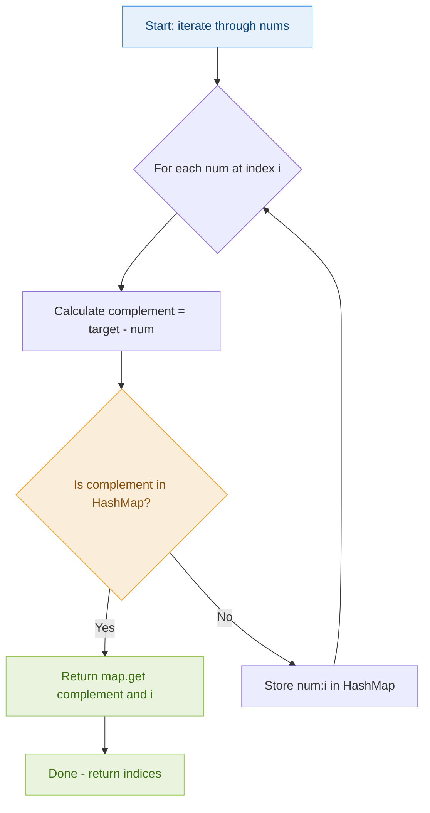
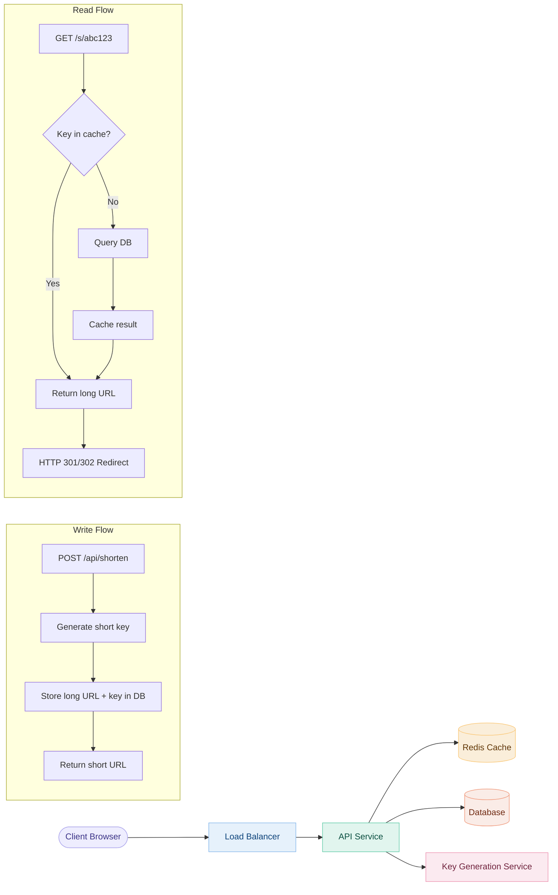
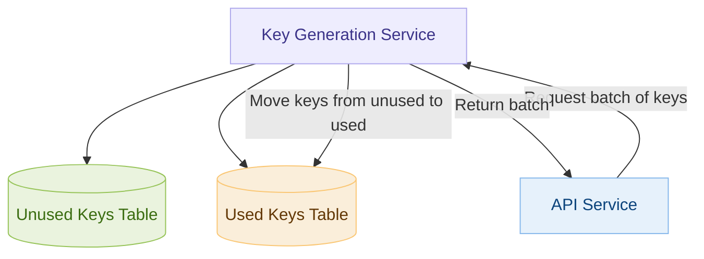
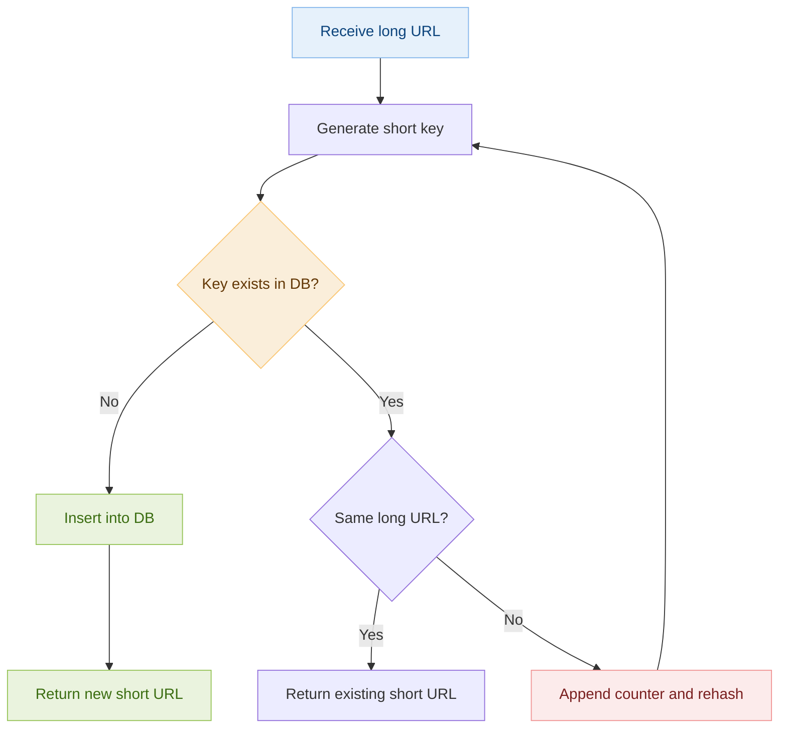

# Day 1 — Two Sum & Design URL Shortener

> **30-Day Interview Prep Tracker** | Shobhit Kumar  
> **Date:** ___________  
> **Status:** ⬜ DSA Done | ⬜ System Design Done  
> **Difficulty:** Easy | **Topic:** Arrays / HashMap

---

## Part 1: DSA Problem — Two Sum (LeetCode #1)

### Problem Statement

Given an array of integers `nums` and an integer `target`, return the **indices** of the two numbers such that they add up to `target`.

- Each input has **exactly one solution**
- You may **not** use the same element twice
- Return the answer in **any order**

### Examples

```
Input:  nums = [2, 7, 11, 15], target = 9
Output: [0, 1]
Explanation: nums[0] + nums[1] = 2 + 7 = 9

Input:  nums = [3, 2, 4], target = 6
Output: [1, 2]
Explanation: nums[1] + nums[2] = 2 + 4 = 6

Input:  nums = [3, 3], target = 6
Output: [0, 1]
```

---

### Approach 1: Brute Force (not recommended)

Check every pair of numbers. Simple but slow.

```
For each element i:
    For each element j > i:
        If nums[i] + nums[j] == target:
            return [i, j]
```

| Metric | Value |
|--------|-------|
| Time Complexity | O(n²) |
| Space Complexity | O(1) |

---

### Approach 2: HashMap (Optimal)

**Key Insight:** For each number `num`, we need `target - num` (the complement). If we store numbers we've already seen in a HashMap, we can check for the complement in O(1).

#### Algorithm Walkthrough

```
nums = [2, 7, 11, 15], target = 9

Step 1: num=2, complement=9-2=7, map={} → 7 not in map → store {2: 0}
Step 2: num=7, complement=9-7=2, map={2:0} → 2 IS in map at index 0 → return [0, 1] ✓
```

#### Flow Diagram



#### HashMap State Visualization

```
target = 9
nums = [2, 7, 11, 15]

Index │ num │ complement │ HashMap State      │ Found?
──────┼─────┼────────────┼────────────────────┼───────
  0   │  2  │  9 - 2 = 7 │ {}                 │ No  → add {2:0}
  1   │  7  │  9 - 7 = 2 │ {2:0}              │ Yes → return [0, 1]
```

---

### Solution — Java

```java
import java.util.HashMap;
import java.util.Map;

class Solution {
    public int[] twoSum(int[] nums, int target) {
        // HashMap to store: value -> index
        Map<Integer, Integer> seen = new HashMap<>();
        
        for (int i = 0; i < nums.length; i++) {
            int complement = target - nums[i];
            
            // Check if complement was already seen
            if (seen.containsKey(complement)) {
                return new int[] { seen.get(complement), i };
            }
            
            // Store current number with its index
            seen.put(nums[i], i);
        }
        
        // No solution found (problem guarantees one exists)
        throw new IllegalArgumentException("No two sum solution");
    }
}
```

### Solution — Python

```python
from typing import List

class Solution:
    def twoSum(self, nums: List[int], target: int) -> List[int]:
        # Dictionary to store: value -> index
        seen = {}
        
        for i, num in enumerate(nums):
            complement = target - num
            
            # Check if complement was already seen
            if complement in seen:
                return [seen[complement], i]
            
            # Store current number with its index
            seen[num] = i
        
        return []  # Problem guarantees a solution exists
```

### Complexity Analysis

| Metric | Brute Force | HashMap (Optimal) |
|--------|-------------|-------------------|
| **Time** | O(n²) — nested loops | **O(n)** — single pass |
| **Space** | O(1) — no extra storage | **O(n)** — HashMap storage |

### Edge Cases to Consider

1. **Duplicate values:** `nums = [3, 3], target = 6` → works because we check before inserting
2. **Negative numbers:** `nums = [-1, -2, -3, -4, -5], target = -8` → complement logic still holds
3. **Single pair:** array of length 2 → one iteration
4. **Large arrays:** HashMap approach handles 10⁴+ elements efficiently

### Common Mistakes

- Using the same element twice (checking `i != j`)
- Forgetting to handle duplicate values
- Inserting into HashMap before checking complement (would allow same-index match)

---

## Part 2: System Design — Design URL Shortener (like bit.ly)

### Requirements Clarification

#### Functional Requirements
- Given a long URL, generate a short, unique URL
- When users access the short URL, redirect to the original long URL
- Users can optionally choose a custom short link
- Links expire after a configurable time (default: 5 years)

#### Non-Functional Requirements
- High availability (the system should always be up)
- Low latency redirection (< 50ms)
- Short URLs should not be predictable

#### Scale Estimation
- 100M new URLs per month (write)
- 10:1 read-to-write ratio → 1B redirections per month (read)
- ~40 URLs/sec write, ~400 URLs/sec read
- Storage: 100M × 12 months × 5 years × 500 bytes ≈ 3 TB over 5 years

---

### High-Level Architecture



---

### Database Schema

```sql
-- URL Mappings Table
CREATE TABLE urls (
    id          BIGINT PRIMARY KEY AUTO_INCREMENT,
    short_key   VARCHAR(7) UNIQUE NOT NULL,
    long_url    TEXT NOT NULL,
    user_id     BIGINT,
    created_at  TIMESTAMP DEFAULT CURRENT_TIMESTAMP,
    expires_at  TIMESTAMP,
    click_count BIGINT DEFAULT 0,
    
    INDEX idx_short_key (short_key),
    INDEX idx_expires (expires_at)
);

-- Analytics Table (optional)
CREATE TABLE click_events (
    id          BIGINT PRIMARY KEY AUTO_INCREMENT,
    short_key   VARCHAR(7) NOT NULL,
    clicked_at  TIMESTAMP DEFAULT CURRENT_TIMESTAMP,
    ip_address  VARCHAR(45),
    user_agent  TEXT,
    referrer    TEXT,
    country     VARCHAR(2),
    
    INDEX idx_short_key_time (short_key, clicked_at)
);
```

---

### Key Generation: Base62 Encoding

We use Base62 (a-z, A-Z, 0-9 = 62 characters) to generate short keys.

**Why 7 characters?** → 62⁷ = 3.5 trillion possible URLs — more than enough.

```
Base62 characters: abcdefghijklmnopqrstuvwxyzABCDEFGHIJKLMNOPQRSTUVWXYZ0123456789
```

#### Option A: Hash + Truncate

```
Long URL → MD5/SHA256 hash → Take first 43 bits → Base62 encode → 7-char key

Example:
  "https://example.com/very/long/path"
  → MD5: "e4d909c290d0fb1ca068ffaddf22cbd0"
  → First 43 bits → Base62 → "aB3x7Kp"
```

#### Option B: Pre-generated Key Service (KGS) — Recommended



**How KGS works:**
1. Pre-generate millions of unique 7-character Base62 keys offline
2. Store in two tables: `unused_keys` and `used_keys`
3. API servers request batches of keys (e.g., 1000 at a time) — kept in memory
4. When a key is assigned, move it from unused → used
5. No collision checking needed — each key is guaranteed unique

#### Java Implementation — Base62 Encoding

```java
public class Base62Encoder {
    private static final String CHARS = 
        "abcdefghijklmnopqrstuvwxyzABCDEFGHIJKLMNOPQRSTUVWXYZ0123456789";
    private static final int BASE = 62;
    private static final int KEY_LENGTH = 7;
    
    /**
     * Convert a numeric ID to a Base62 short key.
     * Example: 125 → "cb"
     */
    public static String encode(long id) {
        StringBuilder sb = new StringBuilder();
        while (id > 0) {
            sb.append(CHARS.charAt((int)(id % BASE)));
            id /= BASE;
        }
        // Pad to minimum length
        while (sb.length() < KEY_LENGTH) {
            sb.append('a');
        }
        return sb.reverse().toString();
    }
    
    /**
     * Convert a Base62 short key back to numeric ID.
     */
    public static long decode(String shortKey) {
        long id = 0;
        for (char c : shortKey.toCharArray()) {
            id = id * BASE + CHARS.indexOf(c);
        }
        return id;
    }
}
```

#### Python Implementation — Base62 Encoding

```python
import hashlib

CHARS = "abcdefghijklmnopqrstuvwxyzABCDEFGHIJKLMNOPQRSTUVWXYZ0123456789"
BASE = 62
KEY_LENGTH = 7

def encode(num: int) -> str:
    """Convert numeric ID to Base62 short key."""
    if num == 0:
        return CHARS[0] * KEY_LENGTH
    
    result = []
    while num > 0:
        result.append(CHARS[num % BASE])
        num //= BASE
    
    # Pad and reverse
    while len(result) < KEY_LENGTH:
        result.append('a')
    
    return ''.join(reversed(result))

def decode(short_key: str) -> int:
    """Convert Base62 short key back to numeric ID."""
    num = 0
    for char in short_key:
        num = num * BASE + CHARS.index(char)
    return num

def generate_from_url(long_url: str) -> str:
    """Generate short key from URL using MD5 hash."""
    hash_hex = hashlib.md5(long_url.encode()).hexdigest()
    hash_int = int(hash_hex[:11], 16)  # Take first 43 bits
    return encode(hash_int)
```

---

### Handling Collisions



---

### Caching Strategy

**Why cache?** Read-heavy system (10:1 ratio). Most popular URLs get accessed repeatedly.

```
┌──────────┐     ┌──────────────┐     ┌──────────────┐
│  Client   │────▶│  Redis Cache  │────▶│   Database   │
│           │◀────│  (LRU, 20%)  │◀────│  (Source of  │
│           │     │              │     │   Truth)     │
└──────────┘     └──────────────┘     └──────────────┘

Cache Policy:
  - LRU eviction (Least Recently Used)
  - Cache ~20% of daily traffic (Pareto: 80/20 rule)
  - TTL: 24 hours for hot URLs
  - Write-through: update cache on new URL creation
```

**Cache sizing:**
- Daily reads: ~33M (1B / 30 days)
- Cache 20%: ~6.6M entries
- Per entry: ~500 bytes
- Total cache: 6.6M × 500B ≈ **3.3 GB** — fits easily in Redis

---

### Scaling & Deep Dive

#### 301 vs 302 Redirect

| Redirect | Browser Behavior | When to Use |
|----------|-----------------|-------------|
| **301** (Permanent) | Browser caches, won't hit server again | When analytics are NOT needed |
| **302** (Temporary) | Browser always hits server | **When analytics ARE needed** (recommended) |

#### Database Partitioning

```
Strategy: Range-based on first character of short_key

  Partition 1: keys starting with a-j  (Shard 1)
  Partition 2: keys starting with k-t  (Shard 2)  
  Partition 3: keys starting with u-z  (Shard 3)
  Partition 4: keys starting with A-Z, 0-9 (Shard 4)

Alternative: Consistent hashing on short_key for even distribution
```

#### Rate Limiting
- Limit URL creation: 100 URLs / user / hour
- Use token bucket algorithm (ties into Day 2!)
- Prevent abuse and spam link generation

---

### System Design Summary

```
┌─────────────────────────────────────────────────────────────┐
│                    URL Shortener Architecture                │
├─────────────────────────────────────────────────────────────┤
│                                                             │
│   Client ──▶ Load Balancer ──▶ API Servers (stateless)     │
│                                    │                        │
│                              ┌─────┴─────┐                 │
│                              │           │                  │
│                         Redis Cache   Database              │
│                         (hot URLs)   (all URLs)             │
│                                         │                   │
│                                   ┌─────┴─────┐            │
│                                   │           │             │
│                              Shard 1     Shard 2  ...      │
│                                                             │
│   Key Generation Service (KGS)                              │
│   ├── Pre-generates unique keys offline                     │
│   ├── API servers request batches                           │
│   └── Zero collision guarantee                              │
│                                                             │
│   Analytics Service (async)                                 │
│   ├── Click tracking via message queue                      │
│   ├── Geographic, device, referrer data                     │
│   └── Dashboard for URL owners                              │
│                                                             │
├─────────────────────────────────────────────────────────────┤
│  Key Trade-offs:                                            │
│  • KGS vs hash-based: KGS = no collisions, hash = simpler  │
│  • 301 vs 302: caching vs analytics                         │
│  • SQL vs NoSQL: SQL for ACID, NoSQL for scale              │
│  • Cache size: 20% hot data covers 80% of requests          │
└─────────────────────────────────────────────────────────────┘
```

---

### Interview Discussion Points

1. **How do you handle hash collisions?** → KGS eliminates them; hash approach needs collision resolution loop
2. **How would you handle a suddenly viral short link?** → Cache warming, CDN, read replicas
3. **What if KGS goes down?** → Standby KGS with separate key range, or fall back to hash-based
4. **How do you handle link expiration?** → Background cleanup job + TTL check on read
5. **SQL vs NoSQL?** → NoSQL (DynamoDB/Cassandra) for scale; SQL (PostgreSQL) for ACID if analytics matter

---

## Daily Checklist

- [ ] Solved Two Sum in under 10 minutes
- [ ] Can explain HashMap approach without looking at code
- [ ] Wrote the solution in both Java and Python
- [ ] Drew the URL Shortener architecture from memory
- [ ] Can discuss at least 3 trade-offs in the system design
- [ ] Reviewed Big-O notation fundamentals
- [ ] Recorded a mock explanation (optional)

---

## My Notes

_Write your observations, mistakes, and learnings here:_

```
Time taken for DSA: _____ minutes
Time taken for System Design: _____ minutes

What went well:


What to improve:


Key insight I want to remember:


```

---

## Resources

- [LeetCode #1 — Two Sum](https://leetcode.com/problems/two-sum/)
- [System Design Primer — URL Shortener](https://github.com/donnemartin/system-design-primer)
- [Base62 Encoding Explained](https://en.wikipedia.org/wiki/Base62)

---

> **Tip of the Day:** Start strong — warm up with fundamentals. Review Big-O notation today. Tomorrow we tackle Best Time to Buy and Sell Stock + Rate Limiter design.

**Next:** [Day 2 → Best Time to Buy and Sell Stock + Design Rate Limiter](../DAY-02/day-02-stock-profit-rate-limiter.md)
