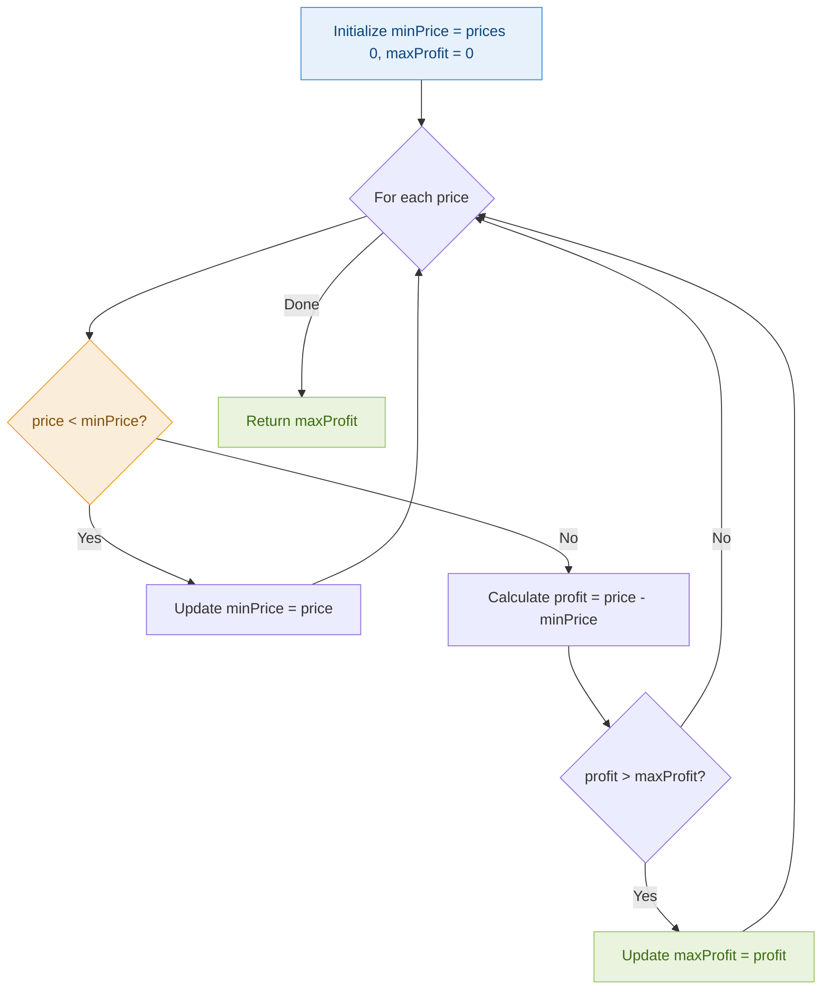
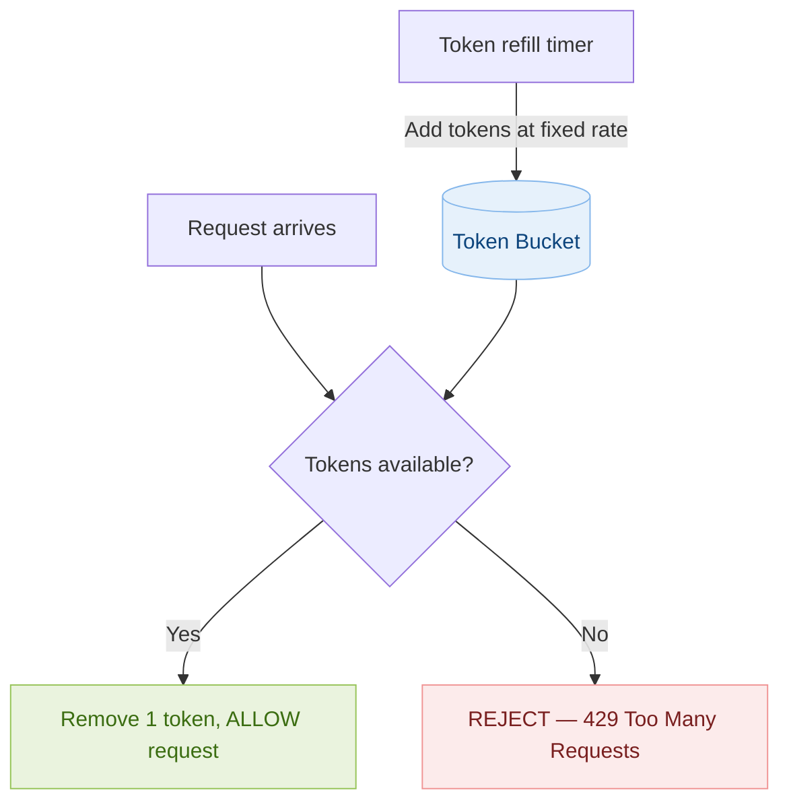
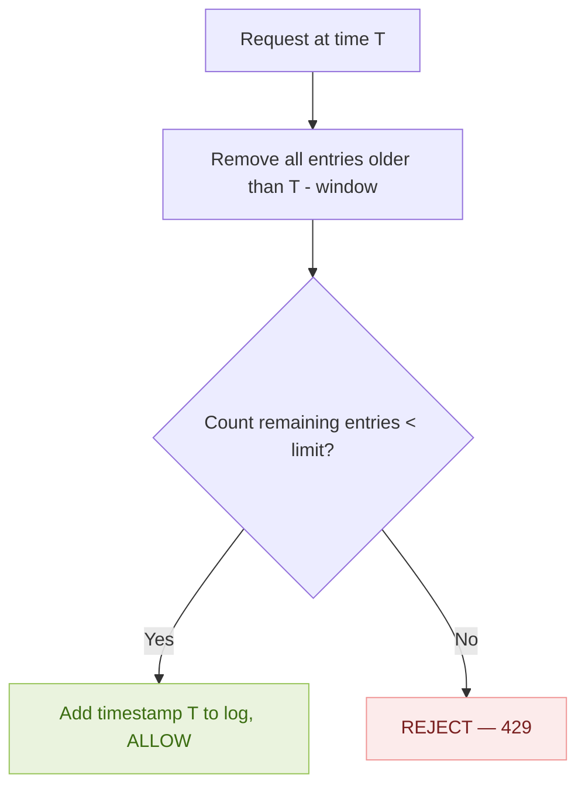
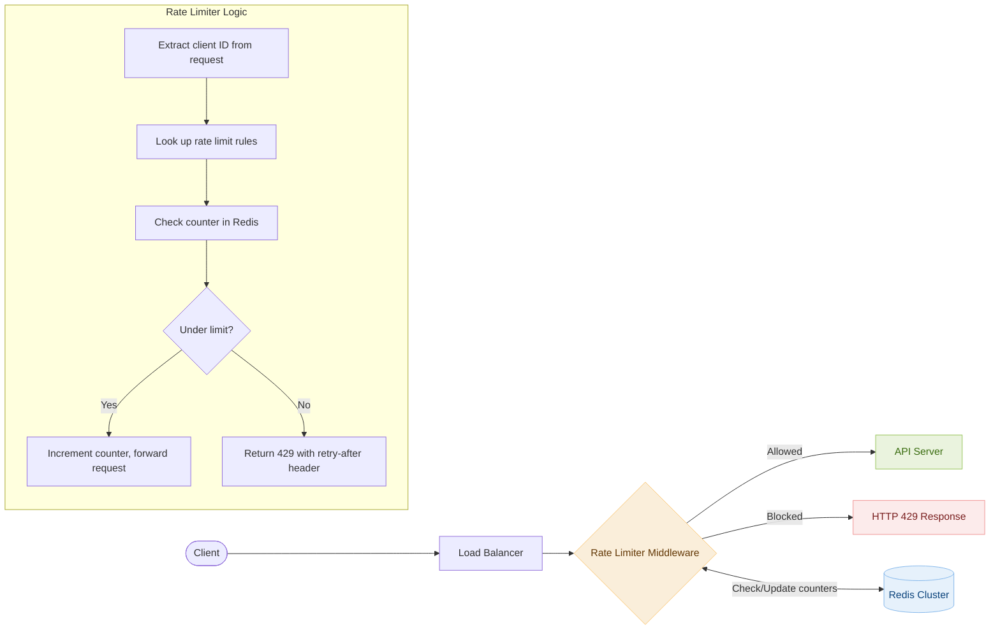
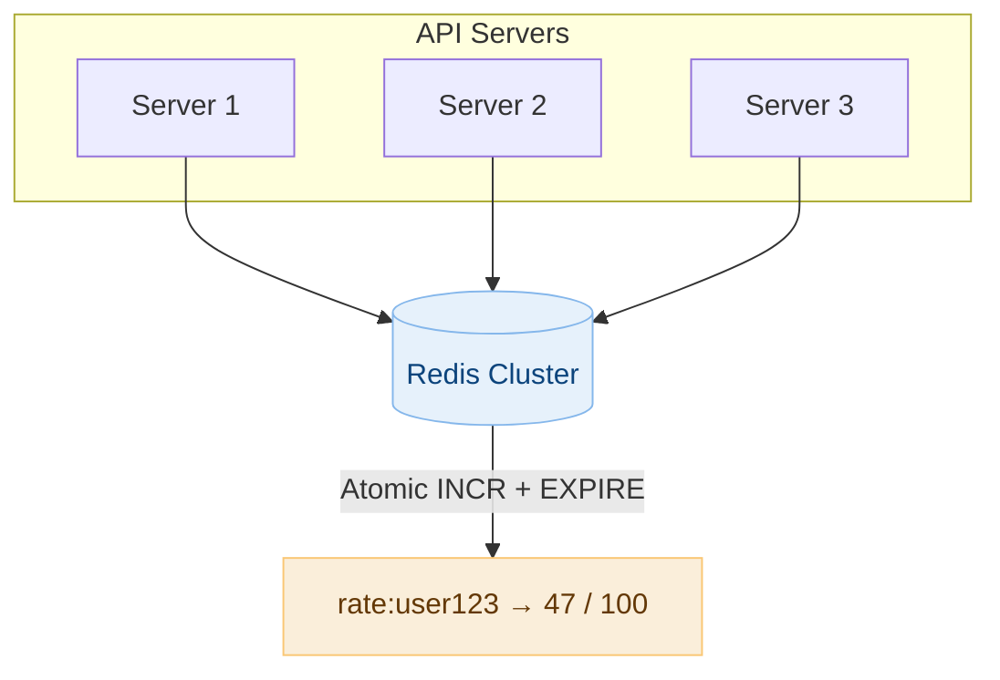
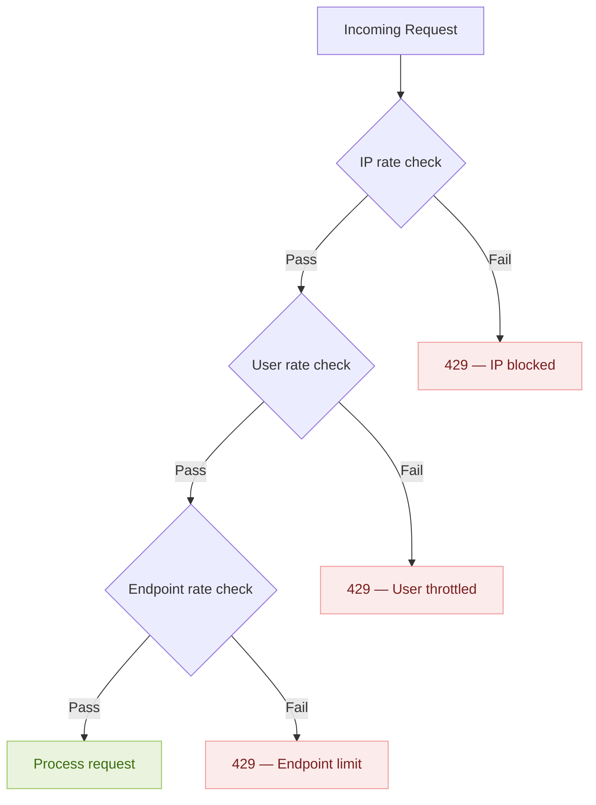

# Day 2 — Best Time to Buy and Sell Stock & Design Rate Limiter

> **30-Day Interview Prep Tracker** | Shobhit Kumar  
> **Date:** ___________  
> **Status:** ⬜ DSA Done | ⬜ System Design Done  
> **Difficulty:** Easy | **Topic:** Arrays / Greedy

---

## Part 1: DSA — Best Time to Buy and Sell Stock (LeetCode #121)

### Problem Statement

You are given an array `prices` where `prices[i]` is the price of a stock on the `iᵗʰ` day. You want to maximize your profit by choosing a **single day** to buy and a **different day in the future** to sell. Return the maximum profit. If no profit is possible, return `0`.

### Examples

```
Input:  prices = [7, 1, 5, 3, 6, 4]
Output: 5
Explanation: Buy on day 2 (price=1), sell on day 5 (price=6) → profit = 6 - 1 = 5

Input:  prices = [7, 6, 4, 3, 1]
Output: 0
Explanation: Prices only decrease → no profitable transaction possible

Input:  prices = [2, 4, 1]
Output: 2
Explanation: Buy day 1 (price=2), sell day 2 (price=4) → profit = 2
```

---

### Approach 1: Brute Force (not recommended)

Check every buy-sell pair where sell date > buy date.

```
For each day i (buy):
    For each day j > i (sell):
        profit = prices[j] - prices[i]
        maxProfit = max(maxProfit, profit)
```

| Metric | Value |
|--------|-------|
| Time | O(n²) |
| Space | O(1) |

---

### Approach 2: Single Pass / Greedy (Optimal)

**Key Insight:** As we scan left to right, track the **minimum price seen so far**. At each day, the best profit we can get is `currentPrice - minPriceSoFar`. Keep a running max of that profit.

#### Algorithm Walkthrough

```
prices = [7, 1, 5, 3, 6, 4]

Day 0: price=7  minPrice=7  profit=7-7=0   maxProfit=0
Day 1: price=1  minPrice=1  profit=1-1=0   maxProfit=0
Day 2: price=5  minPrice=1  profit=5-1=4   maxProfit=4
Day 3: price=3  minPrice=1  profit=3-1=2   maxProfit=4
Day 4: price=6  minPrice=1  profit=6-1=5   maxProfit=5  ← answer
Day 5: price=4  minPrice=1  profit=4-1=3   maxProfit=5
```

#### Visual Walkthrough

```
Price
  7 │ ●
  6 │                     ●          ← SELL here (day 4)
  5 │          ●
  4 │                          ●
  3 │               ●
  2 │
  1 │     ●                          ← BUY here (day 1)
    └──────────────────────────────
      0    1    2    3    4    5      Day

    Profit = 6 - 1 = 5
```

#### Flow Diagram



#### State Table

```
Index │ Price │ minPrice │ Profit │ maxProfit │ Action
──────┼───────┼──────────┼────────┼───────────┼─────────────────
  0   │   7   │    7     │   0    │     0     │ Initialize
  1   │   1   │    1     │   0    │     0     │ New min found
  2   │   5   │    1     │   4    │     4     │ New max profit
  3   │   3   │    1     │   2    │     4     │ No update
  4   │   6   │    1     │   5    │     5     │ ★ Best profit
  5   │   4   │    1     │   3    │     5     │ No update
```

---

### Solution — Java

```java
class Solution {
    public int maxProfit(int[] prices) {
        if (prices == null || prices.length < 2) return 0;

        int minPrice = prices[0];
        int maxProfit = 0;

        for (int i = 1; i < prices.length; i++) {
            // Option 1: Today is a new minimum buy price
            if (prices[i] < minPrice) {
                minPrice = prices[i];
            }
            // Option 2: Selling today gives a better profit
            else {
                int profit = prices[i] - minPrice;
                maxProfit = Math.max(maxProfit, profit);
            }
        }

        return maxProfit;
    }
}
```

### Solution — Python

```python
class Solution:
    def maxProfit(self, prices: list[int]) -> int:
        if not prices or len(prices) < 2:
            return 0

        min_price = prices[0]
        max_profit = 0

        for price in prices[1:]:
            if price < min_price:
                min_price = price          # Found a cheaper buy day
            else:
                profit = price - min_price
                max_profit = max(max_profit, profit)  # Check if selling today is best

        return max_profit
```

### One-liner Python (Pythonic)

```python
from itertools import accumulate

class Solution:
    def maxProfit(self, prices: list[int]) -> int:
        min_prices = accumulate(prices, min)
        return max(p - m for p, m in zip(prices, min_prices))
```

---

### Complexity Analysis

| Metric | Brute Force | Greedy (Optimal) |
|--------|-------------|------------------|
| **Time** | O(n²) — check all pairs | **O(n)** — single pass |
| **Space** | O(1) | **O(1)** |

### Edge Cases

| Case | Input | Output | Why |
|------|-------|--------|-----|
| Decreasing prices | `[5,4,3,2,1]` | `0` | No profitable transaction |
| All same prices | `[3,3,3,3]` | `0` | No price difference |
| Two elements profit | `[1,5]` | `4` | Single buy-sell |
| Two elements loss | `[5,1]` | `0` | Can't profit |
| Minimum at end | `[5,3,6,1]` | `3` | Buy at 3, sell at 6 (not at 1) |
| Single element | `[5]` | `0` | Can't buy and sell |

### Common Mistakes

1. **Selling before buying** — forgetting the constraint that sell date > buy date
2. **Resetting maxProfit when minPrice changes** — NO! A previous higher profit is still valid
3. **Returning negative profit** — should return 0 if all transactions are losses
4. **Confusing with "multiple transactions" variant** (that's LeetCode #122, different approach)

### Related Problems

| Problem | LeetCode | Key Difference |
|---------|----------|----------------|
| Buy/Sell Stock II | #122 | Multiple transactions allowed |
| Buy/Sell Stock III | #123 | At most 2 transactions |
| Buy/Sell Stock IV | #188 | At most k transactions |
| Buy/Sell with Cooldown | #309 | Cooldown after selling |
| Buy/Sell with Fee | #714 | Transaction fee |

---

## Part 2: System Design — Rate Limiter

### Why Rate Limiting?

- **Prevent abuse**: Stop DDoS attacks and brute-force login attempts
- **Control cost**: Limit expensive API calls to protect resources
- **Ensure fairness**: Prevent any single user from monopolizing the service
- **Compliance**: Meet SLA and contractual rate agreements

> **Cisco context**: Rate limiting is critical in pricing APIs like L2N — thousands of pricing queries per second need throttling to protect backend services.

---

### Requirements

#### Functional Requirements
- Limit the number of requests a client can make within a time window
- Return appropriate error (HTTP 429) when limit is exceeded
- Support different rate limits for different API endpoints / user tiers
- Provide headers showing remaining quota

#### Non-Functional Requirements
- **Low latency**: Rate check must add < 1ms overhead per request
- **Distributed**: Work across multiple API server instances
- **Accurate**: Minimal race conditions in counting
- **Fault tolerant**: If rate limiter fails, requests should pass through (fail-open)

#### Scale
- 10M+ active users
- 100K+ requests per second across all users
- Rate limits: e.g., 100 requests / user / minute

---

### Rate Limiting Algorithms

#### 1. Token Bucket



**How it works:**
- Bucket holds up to `maxTokens` tokens (e.g., 100)
- Tokens are added at a fixed rate (e.g., 10 tokens/second)
- Each request consumes 1 token
- If bucket is empty → reject request
- Allows short bursts (up to maxTokens at once)

```
Example: maxTokens=10, refillRate=2/sec

Time 0s:   Bucket = [●●●●●●●●●●] (10 tokens)
           5 requests arrive → consume 5 tokens
           Bucket = [●●●●●○○○○○] (5 tokens)

Time 1s:   +2 tokens refilled
           Bucket = [●●●●●●●○○○] (7 tokens)

Time 2s:   +2 tokens refilled
           Bucket = [●●●●●●●●●○] (9 tokens)

Time 2.5s: Burst of 15 requests
           9 allowed, 6 rejected (429)
           Bucket = [○○○○○○○○○○] (0 tokens)
```

**Pros:** Smooth rate control, allows bursts, memory efficient  
**Cons:** Tuning two parameters (bucket size + refill rate)

---

#### 2. Sliding Window Log



**How it works:**
- Store timestamp of each request in a sorted set
- For each new request, remove all timestamps outside the current window
- Count remaining entries — if under limit, allow

```
Window = 60 seconds, Limit = 5 requests

Timestamps in log: [10:00:01, 10:00:15, 10:00:30, 10:00:45, 10:00:50]

New request at 10:01:05:
  → Remove entries before 10:00:05
  → Removes 10:00:01
  → Remaining: 4 entries → Under limit → ALLOW
```

**Pros:** Very accurate, no boundary issues  
**Cons:** High memory (stores every timestamp), expensive cleanup

---

#### 3. Sliding Window Counter (Hybrid — Recommended)

Combines fixed window counter with weighted overlap.

```
Window = 60 seconds, Limit = 100 requests

Previous window (10:00 - 10:01): 84 requests
Current window  (10:01 - 10:02): 36 requests

Request arrives at 10:01:15 (25% into current window)
  Weighted count = 84 × (1 - 0.25) + 36 = 84 × 0.75 + 36 = 63 + 36 = 99
  99 < 100 → ALLOW
```

**Pros:** Memory efficient, smooth, reasonably accurate  
**Cons:** Approximate (not exact), slightly complex logic

---

#### 4. Fixed Window Counter

```
Window = 60 seconds, Limit = 100

 10:00:00          10:01:00          10:02:00
    |--- Window 1 ---|--- Window 2 ---|
    |  count: 87     |  count: 0      |
    |  (under 100)   |  (reset)       |
```

**Pros:** Simple, low memory  
**Cons:** Boundary burst problem — 200 requests at window edge

---

### Algorithm Comparison

| Algorithm | Accuracy | Memory | Burst Handling | Complexity |
|-----------|----------|--------|----------------|------------|
| **Token Bucket** | Good | Low (2 values) | Allows controlled bursts | Simple |
| **Sliding Window Log** | Exact | High (all timestamps) | No bursts | Medium |
| **Sliding Window Counter** | Approximate | Low (2 counters) | Smooth | Medium |
| **Fixed Window** | Approximate | Lowest (1 counter) | Boundary burst issue | Simplest |

---

### High-Level Architecture



---

### Implementation — Token Bucket in Java

```java
import java.util.concurrent.ConcurrentHashMap;

public class TokenBucketRateLimiter {

    private final int maxTokens;        // Bucket capacity
    private final double refillRate;    // Tokens per second
    private final ConcurrentHashMap<String, Bucket> buckets = new ConcurrentHashMap<>();

    public TokenBucketRateLimiter(int maxTokens, double refillRate) {
        this.maxTokens = maxTokens;
        this.refillRate = refillRate;
    }

    public boolean allowRequest(String clientId) {
        Bucket bucket = buckets.computeIfAbsent(clientId,
            k -> new Bucket(maxTokens, refillRate));
        return bucket.tryConsume();
    }

    private static class Bucket {
        private double tokens;
        private final int maxTokens;
        private final double refillRate;
        private long lastRefillTime;

        Bucket(int maxTokens, double refillRate) {
            this.tokens = maxTokens;
            this.maxTokens = maxTokens;
            this.refillRate = refillRate;
            this.lastRefillTime = System.nanoTime();
        }

        synchronized boolean tryConsume() {
            refill();
            if (tokens >= 1.0) {
                tokens -= 1.0;
                return true;    // ALLOWED
            }
            return false;       // REJECTED
        }

        private void refill() {
            long now = System.nanoTime();
            double elapsed = (now - lastRefillTime) / 1_000_000_000.0;
            tokens = Math.min(maxTokens, tokens + elapsed * refillRate);
            lastRefillTime = now;
        }
    }
}
```

### Implementation — Token Bucket in Python

```python
import time
from threading import Lock
from collections import defaultdict

class TokenBucket:
    def __init__(self, max_tokens: int, refill_rate: float):
        self.max_tokens = max_tokens
        self.refill_rate = refill_rate  # tokens per second
        self.tokens = max_tokens
        self.last_refill = time.monotonic()
        self.lock = Lock()

    def allow_request(self) -> bool:
        with self.lock:
            self._refill()
            if self.tokens >= 1:
                self.tokens -= 1
                return True     # ALLOWED
            return False        # REJECTED

    def _refill(self):
        now = time.monotonic()
        elapsed = now - self.last_refill
        self.tokens = min(
            self.max_tokens,
            self.tokens + elapsed * self.refill_rate
        )
        self.last_refill = now


class RateLimiter:
    def __init__(self, max_tokens: int = 100, refill_rate: float = 10):
        self.max_tokens = max_tokens
        self.refill_rate = refill_rate
        self.buckets: dict[str, TokenBucket] = defaultdict(
            lambda: TokenBucket(max_tokens, refill_rate)
        )

    def is_allowed(self, client_id: str) -> bool:
        return self.buckets[client_id].allow_request()


# Usage
limiter = RateLimiter(max_tokens=10, refill_rate=2)

for i in range(15):
    result = limiter.is_allowed("user_123")
    print(f"Request {i+1}: {'ALLOWED' if result else 'REJECTED'}")
```

### Implementation — Sliding Window Counter with Redis

```python
import time
import redis

class SlidingWindowRateLimiter:
    """
    Sliding window counter using Redis sorted sets.
    Production-grade for distributed systems.
    """
    def __init__(self, redis_client: redis.Redis, limit: int, window_seconds: int):
        self.redis = redis_client
        self.limit = limit
        self.window = window_seconds

    def is_allowed(self, client_id: str) -> bool:
        key = f"rate_limit:{client_id}"
        now = time.time()
        window_start = now - self.window

        pipe = self.redis.pipeline()
        pipe.zremrangebyscore(key, 0, window_start)  # Remove expired entries
        pipe.zcard(key)                               # Count current entries
        pipe.zadd(key, {str(now): now})               # Add current request
        pipe.expire(key, self.window)                 # Set TTL for cleanup
        results = pipe.execute()

        current_count = results[1]
        return current_count < self.limit


# Usage
r = redis.Redis(host='localhost', port=6379)
limiter = SlidingWindowRateLimiter(r, limit=100, window_seconds=60)

if limiter.is_allowed("user_123"):
    print("Request allowed")
else:
    print("Rate limited — 429")
```

---

### Distributed Rate Limiting

When running multiple API servers, each server can't track counts independently. Solution: **centralized counter store (Redis)**.



**Race condition prevention:**
- Use Redis `INCR` (atomic increment)
- Lua scripts for multi-step atomic operations
- `MULTI/EXEC` transactions for sorted set operations

```lua
-- Redis Lua script for atomic rate check + increment
local key = KEYS[1]
local limit = tonumber(ARGV[1])
local window = tonumber(ARGV[2])
local now = tonumber(ARGV[3])

-- Remove expired entries
redis.call('ZREMRANGEBYSCORE', key, 0, now - window)

-- Check count
local count = redis.call('ZCARD', key)

if count < limit then
    -- Under limit: add request and allow
    redis.call('ZADD', key, now, now .. math.random())
    redis.call('EXPIRE', key, window)
    return 1  -- ALLOWED
else
    return 0  -- REJECTED
end
```

---

### HTTP Response Headers

When rate limiting, return informative headers so clients can self-throttle:

```http
HTTP/1.1 200 OK
X-RateLimit-Limit: 100
X-RateLimit-Remaining: 57
X-RateLimit-Reset: 1672531260

---

HTTP/1.1 429 Too Many Requests
X-RateLimit-Limit: 100
X-RateLimit-Remaining: 0
X-RateLimit-Reset: 1672531260
Retry-After: 30
Content-Type: application/json

{
    "error": "rate_limit_exceeded",
    "message": "Rate limit of 100 requests per minute exceeded",
    "retry_after": 30
}
```

---

### Multi-tier Rate Limiting

| Tier | Rate Limit | Window | Use Case |
|------|-----------|--------|----------|
| Per IP | 1000 req/hour | 1 hour | DDoS protection |
| Per User | 100 req/min | 1 minute | Normal usage |
| Per API Key | 500 req/min | 1 minute | Paid tier |
| Per Endpoint | 20 req/min | 1 minute | Expensive operations |
| Global | 10K req/sec | 1 second | System protection |



---

### Failure Handling

| Scenario | Strategy |
|----------|----------|
| Redis down | **Fail-open** — allow all requests (availability > rate limiting) |
| Network partition | Fall back to local in-memory rate limiter per server |
| Clock skew | Use Redis server time (`TIME` command) not local time |
| Memory pressure | Set TTL on all keys, evict oldest windows first |

---

### Interview Discussion Points

1. **Where should the rate limiter sit?** → API Gateway (centralized) or middleware per service (flexible)
2. **Token bucket vs sliding window?** → Token bucket for allowing bursts; sliding window for strict compliance
3. **How to handle distributed counting?** → Redis with Lua scripts for atomicity
4. **What if Redis goes down?** → Fail-open to avoid blocking all traffic; degrade gracefully
5. **How does this relate to your Cisco work?** → Pricing APIs like L2N need rate limiting to protect MongoDB and Elasticsearch backends during peak load

---

## Daily Checklist

- [ ] Solved Best Time to Buy/Sell Stock in under 8 minutes
- [ ] Can explain the greedy approach clearly without notes
- [ ] Wrote solution in both Java and Python
- [ ] Can draw token bucket and sliding window diagrams from memory
- [ ] Can explain trade-offs between all 4 rate limiting algorithms
- [ ] Implemented at least one algorithm (token bucket recommended)
- [ ] Practiced explaining thought process out loud

---

## My Notes

```
Time taken for DSA: _____ minutes
Time taken for System Design: _____ minutes

What went well:


What to improve:


Key insight I want to remember:


```

---

## Resources

- [LeetCode #121 — Best Time to Buy and Sell Stock](https://leetcode.com/problems/best-time-to-buy-and-sell-stock/)
- [Rate Limiting — System Design Primer](https://github.com/donnemartin/system-design-primer)
- [Redis Rate Limiting](https://redis.io/commands/incr#pattern-rate-limiter)
- [Stripe Rate Limiter Blog](https://stripe.com/blog/rate-limiters)
- [Token Bucket Wikipedia](https://en.wikipedia.org/wiki/Token_bucket)

---

> **Tip of the Day:** Practice explaining your thought process out loud as you code. Interviewers care as much about communication as correctness. Talk through: "I'm choosing this approach because..." and "The trade-off here is..."

**Previous:** [Day 1 — Two Sum + URL Shortener](../DAY-01/day-01-two-sum-url-shortener.md)  
**Next:** [Day 3 — Valid Parentheses + Key-Value Store](../DAY-03/day-03-valid-parentheses-kv-store.md)
