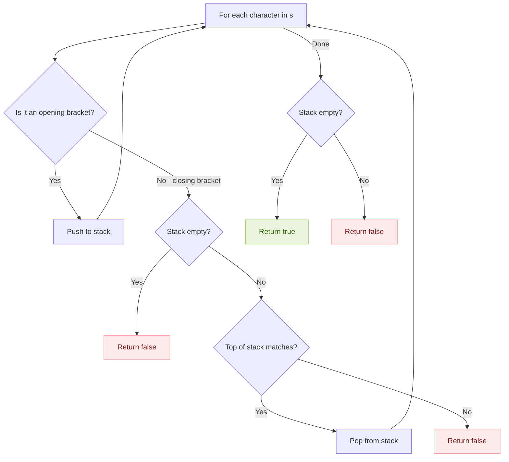
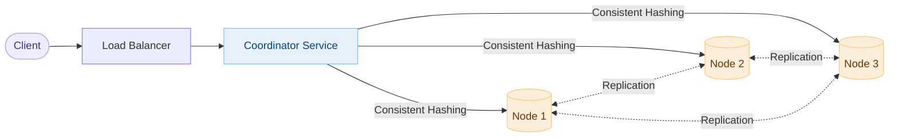
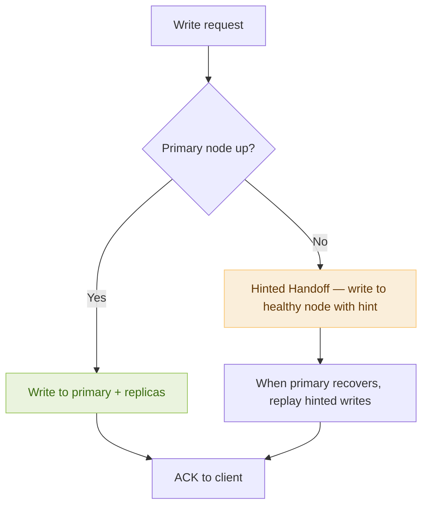

# Day 3 — Valid Parentheses & Design Key-Value Store

> **30-Day Interview Prep Tracker** | Shobhit Kumar  
> **Date:** ___________  
> **Status:** ⬜ DSA Done | ⬜ System Design Done  
> **Difficulty:** Easy | **Topic:** Stack

---

## Part 1: DSA — Valid Parentheses (LeetCode #20)

### Problem Statement

Given a string `s` containing only `(`, `)`, `{`, `}`, `[`, `]`, determine if the input string is valid.

A string is valid if:
- Open brackets are closed by the **same type** of brackets
- Open brackets are closed in the **correct order**
- Every close bracket has a corresponding open bracket

### Examples

```
Input:  s = "()"
Output: true

Input:  s = "()[]{}"
Output: true

Input:  s = "(]"
Output: false

Input:  s = "([)]"
Output: false

Input:  s = "{[]}"
Output: true
```

---

### Approach: Stack (Optimal)

**Key Insight:** Use a stack. Push every opening bracket. When a closing bracket appears, check if the top of the stack is its matching opener. If yes, pop. If no (or stack is empty), invalid.

#### Algorithm Walkthrough

```
s = "{[]}"

Char '{' → opening → push → stack: ['{']
Char '[' → opening → push → stack: ['{', '[']
Char ']' → closing → top is '[' → match → pop → stack: ['{']
Char '}' → closing → top is '{' → match → pop → stack: []

Stack empty → return true ✓
```

#### Flow Diagram



---

### Solution — Java

```java
import java.util.Stack;

class Solution {
    public boolean isValid(String s) {
        Stack<Character> stack = new Stack<>();
        
        for (char c : s.toCharArray()) {
            if (c == '(' || c == '{' || c == '[') {
                stack.push(c);
            } else {
                if (stack.isEmpty()) return false;
                char top = stack.pop();
                if (c == ')' && top != '(') return false;
                if (c == '}' && top != '{') return false;
                if (c == ']' && top != '[') return false;
            }
        }
        
        return stack.isEmpty();
    }
}
```

### Solution — Python

```python
class Solution:
    def isValid(self, s: str) -> bool:
        stack = []
        matching = {')': '(', '}': '{', ']': '['}
        
        for char in s:
            if char in '({[':
                stack.append(char)
            else:
                if not stack or stack[-1] != matching[char]:
                    return False
                stack.pop()
        
        return len(stack) == 0
```

---

### Complexity Analysis

| Metric | Value |
|--------|-------|
| **Time** | O(n) — single pass |
| **Space** | O(n) — stack stores up to n/2 brackets |

### Edge Cases

| Input | Output | Reason |
|-------|--------|--------|
| `""` | `true` | Empty string is valid |
| `"("` | `false` | Unmatched open bracket |
| `")("` | `false` | Wrong order |
| `"((("` | `false` | Stack not empty at end |
| `"{[]}"` | `true` | Nested correctly |

### Common Mistakes

1. Forgetting to check if stack is empty before popping
2. Not checking `stack.isEmpty()` at the end
3. Using a queue instead of a stack (order matters!)

---

## Part 2: System Design — Key-Value Store (like Redis / DynamoDB)

### Requirements Clarification

#### Functional Requirements
- `put(key, value)` — store a key-value pair
- `get(key)` — retrieve value by key
- `delete(key)` — remove a key
- Keys and values are strings (up to 10KB)
- Support TTL (time-to-live) on keys

#### Non-Functional Requirements
- High availability (99.99% uptime)
- Low latency: < 10ms for reads and writes
- Horizontally scalable
- Durable: data survives server restarts

#### Scale Estimation
- 1M writes/day, 10M reads/day
- Average key size: 32 bytes, value size: 1KB
- 1M × 1KB = 1GB new data per day
- Store 3 years: ~1TB total

---

### High-Level Architecture



---

### Core Components

#### 1. Storage Engine

```
In-Memory Layer (fast):      Disk Layer (durable):
┌─────────────────┐          ┌──────────────────────┐
│  Hash Table     │   flush  │  SSTable (sorted      │
│  (hot data)     │ ──────▶  │  string table files)  │
│  Memtable       │          │  + WAL (Write-Ahead   │
│                 │          │  Log) for recovery    │
└─────────────────┘          └──────────────────────┘
```

- **Memtable:** In-memory hash map for recent writes (fast)
- **WAL (Write-Ahead Log):** Append-only log for crash recovery
- **SSTable:** Immutable sorted files on disk for persistence
- **Compaction:** Background process merging SSTables

#### 2. Consistent Hashing for Sharding

```mermaid
flowchart TD
    KEY[Key: "user:123"] --> HASH[Hash Function]
    HASH --> RING[Hash Ring 0..2^32]
    RING --> N1[Node A: 0..85M]
    RING --> N2[Node B: 85M..170M]
    RING --> N3[Node C: 170M..255M]

    style KEY fill:#E6F1FB,stroke:#85B7EB,color:#0C447C
    style RING fill:#FAEEDA,stroke:#FAC775,color:#633806
```

**Why consistent hashing?**
- Adding/removing nodes only remaps ~K/n keys (K = total keys, n = node count)
- Traditional hashing remaps ALL keys when node count changes

---

### Data Model & API

```
GET /v1/{key}
    → 200 OK  { "key": "user:1", "value": "...", "ttl": 3600 }
    → 404 Not Found

PUT /v1/{key}
    Body: { "value": "...", "ttl": 3600 }
    → 200 OK

DELETE /v1/{key}
    → 200 OK
```

---

### Replication Strategy

```
Write Quorum (W) = 2, Read Quorum (R) = 2, Replicas (N) = 3

         W + R > N  →  strong consistency

Write: Client → Coordinator → writes to W=2 nodes → ACK
Read:  Client → Coordinator → reads from R=2 nodes → compare → return latest
```

| Configuration | Consistency | Availability |
|--------------|-------------|--------------|
| W=1, R=1 | Weak | High |
| W=2, R=2 | Strong | Medium |
| W=3, R=1 | Strong writes | Fast reads |

---

### Failure Handling



- **Hinted Handoff:** Temporarily store data on another node when target is down
- **Merkle Trees:** Efficiently detect and sync inconsistent data between replicas
- **Anti-Entropy:** Background gossip protocol to reconcile diverged state

---

### TTL Implementation

```python
import time
from dataclasses import dataclass
from typing import Optional

@dataclass
class Entry:
    value: str
    expires_at: Optional[float]  # Unix timestamp or None

class KVStore:
    def __init__(self):
        self._store: dict[str, Entry] = {}

    def put(self, key: str, value: str, ttl: Optional[int] = None):
        expires = time.time() + ttl if ttl else None
        self._store[key] = Entry(value, expires)

    def get(self, key: str) -> Optional[str]:
        entry = self._store.get(key)
        if not entry:
            return None
        if entry.expires_at and time.time() > entry.expires_at:
            del self._store[key]  # Lazy deletion
            return None
        return entry.value

    def delete(self, key: str):
        self._store.pop(key, None)
```

---

### Interview Discussion Points

1. **How do you handle hot keys?** → Consistent hashing with virtual nodes; cache popular keys locally
2. **CAP theorem tradeoff?** → KV stores choose CP (Redis Cluster, Zookeeper) or AP (Cassandra, DynamoDB)
3. **How is persistence guaranteed?** → WAL ensures writes survive crashes before ACK
4. **How does TTL cleanup work?** → Lazy deletion on access + background sweeper for expired keys
5. **How does compaction work?** → LSM tree merges SSTables, removes tombstoned keys

---

## Daily Checklist

- [ ] Solved Valid Parentheses in under 8 minutes
- [ ] Can explain the stack approach without notes
- [ ] Wrote solution in both Java and Python
- [ ] Drew KV store architecture from memory
- [ ] Can explain consistent hashing vs modulo hashing
- [ ] Understand W + R > N quorum logic
- [ ] Practiced explaining out loud

---

## My Notes

```
Time taken for DSA: _____ minutes
Time taken for System Design: _____ minutes

What went well:


What to improve:


Key insight I want to remember:


```

---

## Resources

- [LeetCode #20 — Valid Parentheses](https://leetcode.com/problems/valid-parentheses/)
- [Designing a Key-Value Store — System Design Primer](https://github.com/donnemartin/system-design-primer)
- [LSM Trees Explained](https://en.wikipedia.org/wiki/Log-structured_merge-tree)

---

> **Tip of the Day:** The stack is one of the most versatile data structures. Bracket matching, function call simulation, expression evaluation — whenever you see "matching pairs" or "undo history," think stack first.

**Previous:** [Day 2 — Stock Profit + Rate Limiter](../DAY-02/day-02-stock-profit-rate-limiter.md)  
**Next:** [Day 4 — Merge Two Sorted Lists + Notification System](../DAY-04/day-04-merge-sorted-lists-notification.md)
