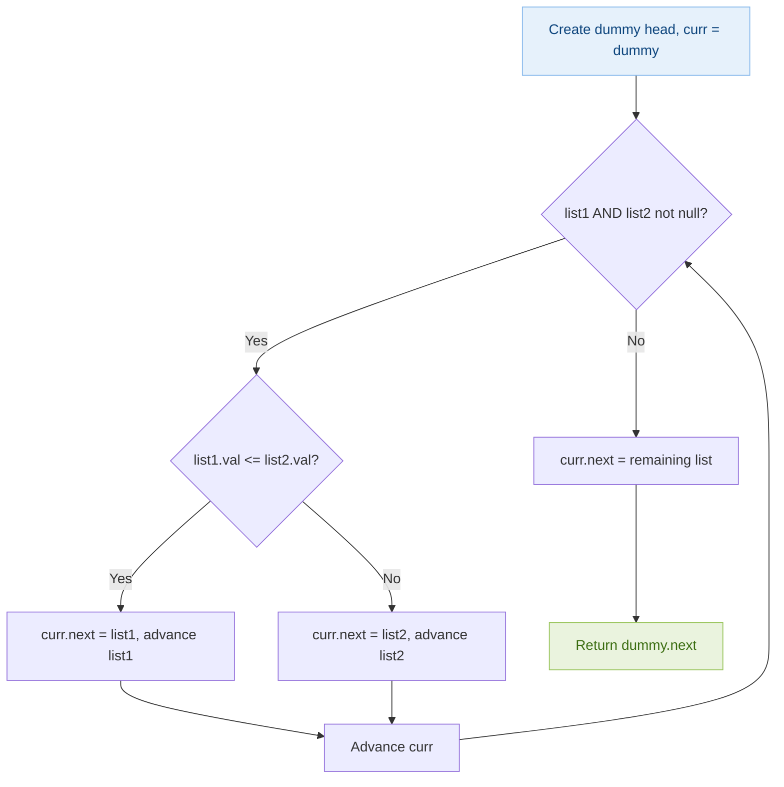
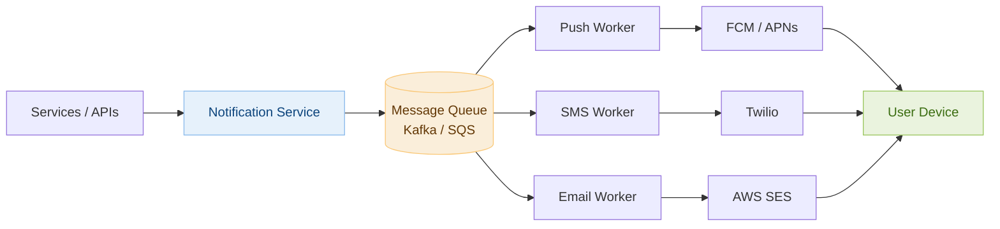
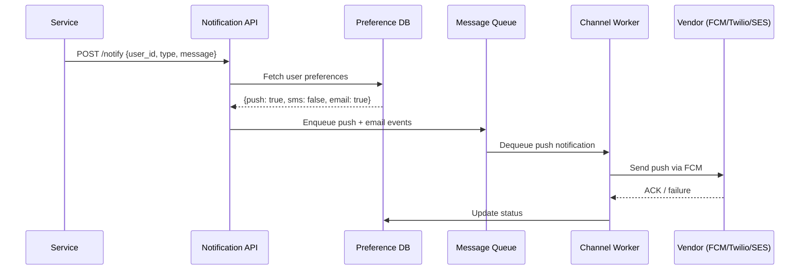

# Day 4 — Merge Two Sorted Lists & Design Notification System

> **30-Day Interview Prep Tracker** | Shobhit Kumar  
> **Date:** ___________  
> **Status:** ⬜ DSA Done | ⬜ System Design Done  
> **Difficulty:** Easy | **Topic:** Linked List

---

## Part 1: DSA — Merge Two Sorted Lists (LeetCode #21)

### Problem Statement

You are given the heads of two sorted linked lists `list1` and `list2`. Merge the two lists into one **sorted** list. The list should be made by splicing together the nodes of the first two lists. Return the head of the merged linked list.

### Examples

```
Input:  list1 = [1,2,4], list2 = [1,3,4]
Output: [1,1,2,3,4,4]

Input:  list1 = [], list2 = []
Output: []

Input:  list1 = [], list2 = [0]
Output: [0]
```

---

### Approach 1: Iterative with Dummy Head (Optimal)

**Key Insight:** Use a dummy head node to simplify edge cases. Maintain a pointer to the tail of the merged list. Compare heads and attach the smaller one.

#### Algorithm Walkthrough

```
list1: 1 → 2 → 4
list2: 1 → 3 → 4

dummy → ?   curr = dummy

Step 1: 1 == 1  →  attach list1(1), advance list1
        dummy → 1,  list1: 2→4, list2: 1→3→4

Step 2: 2 > 1  →  attach list2(1), advance list2
        dummy → 1 → 1,  list1: 2→4, list2: 3→4

Step 3: 2 < 3  →  attach list1(2), advance list1
        dummy → 1 → 1 → 2,  list1: 4, list2: 3→4

Step 4: 4 > 3  →  attach list2(3), advance list2
        dummy → 1 → 1 → 2 → 3,  list1: 4, list2: 4

Step 5: 4 == 4  →  attach list1(4), advance list1
        dummy → 1 → 1 → 2 → 3 → 4,  list1: null, list2: 4

Step 6: list1 null  →  append remaining list2(4)
        Result: 1 → 1 → 2 → 3 → 4 → 4
```

#### Flow Diagram



---

### Solution — Java (Iterative)

```java
class Solution {
    public ListNode mergeTwoLists(ListNode list1, ListNode list2) {
        ListNode dummy = new ListNode(0);
        ListNode curr = dummy;
        
        while (list1 != null && list2 != null) {
            if (list1.val <= list2.val) {
                curr.next = list1;
                list1 = list1.next;
            } else {
                curr.next = list2;
                list2 = list2.next;
            }
            curr = curr.next;
        }
        
        curr.next = (list1 != null) ? list1 : list2;
        
        return dummy.next;
    }
}
```

### Solution — Java (Recursive)

```java
class Solution {
    public ListNode mergeTwoLists(ListNode list1, ListNode list2) {
        if (list1 == null) return list2;
        if (list2 == null) return list1;
        
        if (list1.val <= list2.val) {
            list1.next = mergeTwoLists(list1.next, list2);
            return list1;
        } else {
            list2.next = mergeTwoLists(list1, list2.next);
            return list2;
        }
    }
}
```

### Solution — Python

```python
class Solution:
    def mergeTwoLists(self, list1, list2):
        dummy = ListNode(0)
        curr = dummy
        
        while list1 and list2:
            if list1.val <= list2.val:
                curr.next = list1
                list1 = list1.next
            else:
                curr.next = list2
                list2 = list2.next
            curr = curr.next
        
        curr.next = list1 or list2
        
        return dummy.next
```

---

### Complexity Analysis

| Metric | Iterative | Recursive |
|--------|-----------|-----------|
| **Time** | O(m + n) | O(m + n) |
| **Space** | O(1) | O(m + n) stack frames |

### Edge Cases

| Case | Input | Output |
|------|-------|--------|
| Both empty | `[], []` | `[]` |
| One empty | `[], [1]` | `[1]` |
| Same values | `[1,1], [1,1]` | `[1,1,1,1]` |
| One much longer | `[1], [2,3,4,5]` | `[1,2,3,4,5]` |

---

## Part 2: System Design — Notification System

### Requirements Clarification

#### Functional Requirements
- Send notifications via multiple channels: push (iOS/Android), SMS, email
- Support single-user and bulk notifications
- Notify users of events: payments, alerts, promotions
- Users can opt-out per channel

#### Non-Functional Requirements
- High throughput: 10M notifications/day
- Low latency: push within 1-2 seconds, email within 5 minutes
- Reliable delivery: at-least-once guarantee
- Deduplication to prevent duplicate notifications

#### Scale Estimation
- 10M notifications/day ≈ 115/second average, up to 1000/second burst
- 3 channels × 10M = 30M delivery attempts/day
- Storage for notification logs: ~1KB × 30M = 30GB/day

---

### High-Level Architecture



---

### Database Schema

```sql
-- User notification preferences
CREATE TABLE user_preferences (
    user_id     BIGINT PRIMARY KEY,
    push_enabled  BOOLEAN DEFAULT true,
    sms_enabled   BOOLEAN DEFAULT true,
    email_enabled BOOLEAN DEFAULT true,
    phone         VARCHAR(20),
    email         VARCHAR(255),
    device_token  VARCHAR(512)
);

-- Notification log
CREATE TABLE notifications (
    id          BIGINT PRIMARY KEY AUTO_INCREMENT,
    user_id     BIGINT NOT NULL,
    channel     ENUM('push', 'sms', 'email') NOT NULL,
    type        VARCHAR(50),
    message     TEXT,
    status      ENUM('pending', 'sent', 'failed', 'delivered'),
    created_at  TIMESTAMP DEFAULT CURRENT_TIMESTAMP,
    sent_at     TIMESTAMP,
    
    INDEX idx_user_status (user_id, status),
    INDEX idx_created (created_at)
);
```

---

### Notification Flow



---

### Deduplication Strategy

```
Problem: Worker may process same message twice (at-least-once delivery)

Solution: Idempotency key
  - Each notification gets a unique ID: SHA256(user_id + type + timestamp_window)
  - Check Redis before sending: SET notification:{id} NX EX 3600
  - If key already exists → skip (duplicate)
  - If new → proceed and set key

Redis check (atomic):
  SET rate:notif:{dedup_key} 1 NX EX 3600
  → Returns OK (first time) or nil (duplicate)
```

---

### Retry with Exponential Backoff

```python
import time
import random

def send_with_retry(send_fn, max_retries=3):
    for attempt in range(max_retries):
        try:
            return send_fn()
        except TransientError as e:
            if attempt == max_retries - 1:
                raise
            # Exponential backoff with jitter
            delay = (2 ** attempt) + random.uniform(0, 1)
            time.sleep(delay)
```

---

### Interview Discussion Points

1. **Why use a message queue?** → Decouples producers from consumers, absorbs traffic spikes, enables retry
2. **How to handle vendor failures?** → Retry with backoff, dead-letter queue for failed messages after N retries
3. **How to prevent notification spam?** → Rate limiting per user per channel, daily digest option
4. **How do you handle user preference updates?** → Cache preferences, invalidate on update with short TTL
5. **Push vs SMS vs email priority?** → Push first (free, instant), fallback to SMS if push token invalid, email for non-urgent

---

## Daily Checklist

- [ ] Solved Merge Two Sorted Lists in under 10 minutes
- [ ] Can explain the dummy head technique
- [ ] Implemented both iterative and recursive approaches
- [ ] Drew notification system architecture from memory
- [ ] Understand message queue role in decoupling
- [ ] Can explain deduplication strategy

---

## My Notes

```
Time taken for DSA: _____ minutes
Time taken for System Design: _____ minutes

What went well:


What to improve:


Key insight I want to remember:


```

---

## Resources

- [LeetCode #21 — Merge Two Sorted Lists](https://leetcode.com/problems/merge-two-sorted-lists/)
- [Designing a Notification System — System Design Interview](https://bytebytego.com/courses/system-design-interview/design-a-notification-system)
- [FCM Documentation](https://firebase.google.com/docs/cloud-messaging)

---

> **Tip of the Day:** The dummy head node pattern is incredibly powerful for linked list problems — it eliminates special cases for empty lists and makes the code uniform. Use it whenever you're building a new list.

**Previous:** [Day 3 — Valid Parentheses + KV Store](../DAY-03/day-03-valid-parentheses-kv-store.md)  
**Next:** [Day 5 — Maximum Subarray + Distributed Cache](../DAY-05/day-05-max-subarray-distributed-cache.md)
