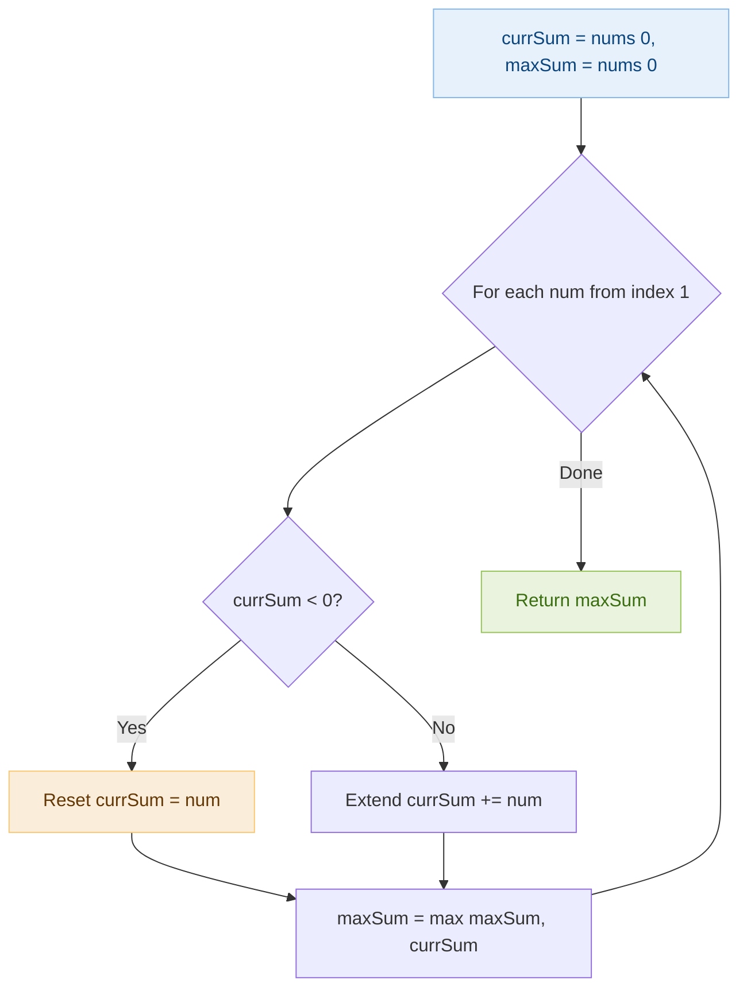
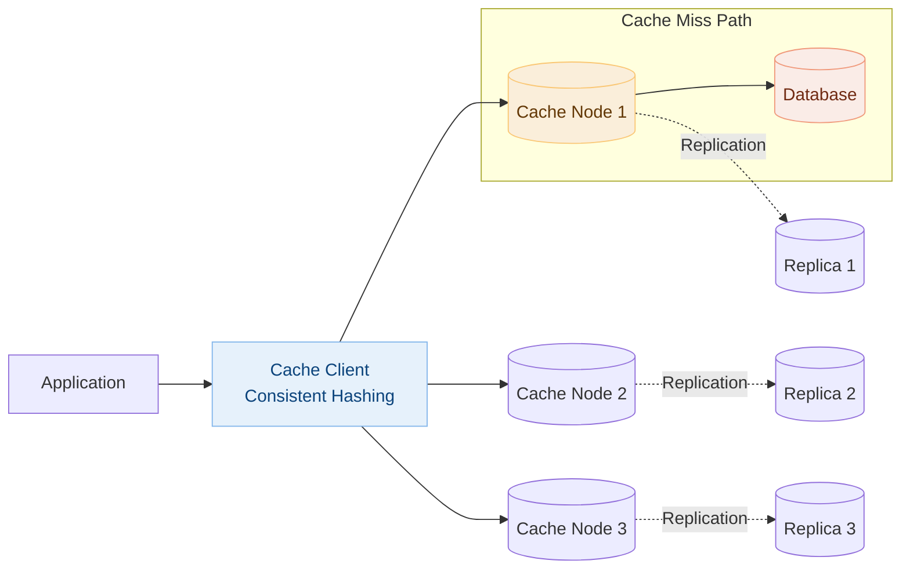
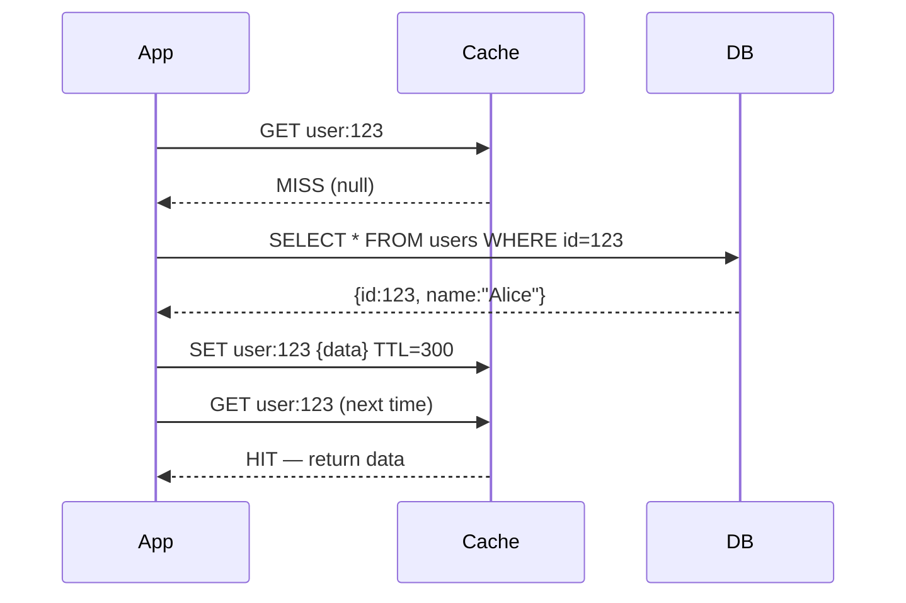

# Day 5 — Maximum Subarray (Kadane's) & Design Distributed Cache

> **30-Day Interview Prep Tracker** | Shobhit Kumar  
> **Date:** ___________  
> **Status:** ⬜ DSA Done | ⬜ System Design Done  
> **Difficulty:** Medium | **Topic:** Arrays / Dynamic Programming

---

## Part 1: DSA — Maximum Subarray (LeetCode #53)

### Problem Statement

Given an integer array `nums`, find the subarray with the largest sum, and return its sum.

### Examples

```
Input:  nums = [-2,1,-3,4,-1,2,1,-5,4]
Output: 6
Explanation: Subarray [4,-1,2,1] has the largest sum 6

Input:  nums = [1]
Output: 1

Input:  nums = [5,4,-1,7,8]
Output: 23
```

---

### Approach: Kadane's Algorithm (Optimal)

**Key Insight:** At each position, decide: "Is it better to extend the existing subarray, or start a new one here?" If the current running sum becomes negative, reset it — a negative prefix only drags down future sums.

#### Algorithm Walkthrough

```
nums = [-2, 1, -3, 4, -1, 2, 1, -5, 4]

idx | num | currSum | maxSum | Decision
 0  |  -2 |   -2    |   -2   | Start at -2
 1  |   1 |    1    |    1   | Reset: max(-2+1, 1) = 1
 2  |  -3 |   -2    |    1   | Extend: 1+(-3) = -2
 3  |   4 |    4    |    4   | Reset: max(-2+4, 4) = 4
 4  |  -1 |    3    |    4   | Extend: 4+(-1) = 3
 5  |   2 |    5    |    5   | Extend: 3+2 = 5
 6  |   1 |    6    |    6   | ★ Extend: 5+1 = 6
 7  |  -5 |    1    |    6   | Extend: 6+(-5) = 1
 8  |   4 |    5    |    6   | Extend: 1+4 = 5

Answer: 6
```

#### Flow Diagram



---

### Solution — Java

```java
class Solution {
    public int maxSubArray(int[] nums) {
        int currSum = nums[0];
        int maxSum = nums[0];
        
        for (int i = 1; i < nums.length; i++) {
            currSum = Math.max(nums[i], currSum + nums[i]);
            maxSum = Math.max(maxSum, currSum);
        }
        
        return maxSum;
    }
}
```

### Solution — Python

```python
class Solution:
    def maxSubArray(self, nums: list[int]) -> int:
        curr_sum = nums[0]
        max_sum = nums[0]
        
        for num in nums[1:]:
            curr_sum = max(num, curr_sum + num)
            max_sum = max(max_sum, curr_sum)
        
        return max_sum
```

### Complexity Analysis

| Metric | Brute Force | Kadane's |
|--------|-------------|----------|
| **Time** | O(n²) or O(n³) | **O(n)** |
| **Space** | O(1) | **O(1)** |

### Edge Cases

| Input | Output | Reason |
|-------|--------|--------|
| `[-1]` | `-1` | Single negative element |
| `[-2,-1]` | `-1` | All negative — return least negative |
| `[1,2,3]` | `6` | Entire array is best |

---

## Part 2: System Design — Distributed Cache (like Redis Cluster / Memcached)

### Requirements Clarification

#### Functional Requirements
- `set(key, value, ttl)` — store key with optional expiry
- `get(key)` — retrieve value in < 1ms
- `delete(key)` — invalidate a key
- Support horizontal scaling to handle millions of requests/second

#### Non-Functional Requirements
- Ultra-low latency: < 1ms p99 for reads
- High availability: cache miss rate < 1% after warm-up
- Scale to handle 1M+ requests/second
- Eviction when memory is full

#### Scale Estimation
- 10M QPS, 50% reads, 50% writes
- 100GB total cached data
- Single node: 50K–100K QPS → need ~100 nodes
- Each node: ~1GB RAM dedicated to cache

---

### High-Level Architecture



---

### Cache Patterns

#### 1. Cache-Aside (Lazy Loading) — Most Common



#### 2. Write-Through — Consistency First

```
On write:
  1. Write to cache
  2. Write to database (synchronously)
  
Pros: Cache always has fresh data
Cons: Write latency = cache + DB latency
```

#### 3. Write-Behind (Write-Back) — Performance First

```
On write:
  1. Write to cache immediately (return to client)
  2. Async batch write to database

Pros: Very fast writes
Cons: Data loss if cache fails before flush
```

---

### Eviction Policies

| Policy | Description | Use Case |
|--------|-------------|----------|
| **LRU** | Remove least recently used | General purpose — most common |
| **LFU** | Remove least frequently used | Content with popularity patterns |
| **FIFO** | Remove oldest entries | Simple use cases |
| **TTL** | Remove expired entries | Session data, rate limits |
| **Random** | Random eviction | Simple, low overhead |

---

### LRU Cache Implementation

```java
import java.util.*;

public class LRUCache {
    private final int capacity;
    private final LinkedHashMap<Integer, Integer> cache;
    
    public LRUCache(int capacity) {
        this.capacity = capacity;
        this.cache = new LinkedHashMap<>(capacity, 0.75f, true) {
            @Override
            protected boolean removeEldestEntry(Map.Entry<Integer, Integer> eldest) {
                return size() > capacity;
            }
        };
    }
    
    public int get(int key) {
        return cache.getOrDefault(key, -1);
    }
    
    public void put(int key, int value) {
        cache.put(key, value);
    }
}
```

```python
from collections import OrderedDict

class LRUCache:
    def __init__(self, capacity: int):
        self.capacity = capacity
        self.cache = OrderedDict()
    
    def get(self, key: int) -> int:
        if key not in self.cache:
            return -1
        self.cache.move_to_end(key)  # Mark as recently used
        return self.cache[key]
    
    def put(self, key: int, value: int):
        if key in self.cache:
            self.cache.move_to_end(key)
        self.cache[key] = value
        if len(self.cache) > self.capacity:
            self.cache.popitem(last=False)  # Remove LRU item
```

---

### Cache Invalidation Strategies

```
1. TTL-based: Keys expire automatically after N seconds
   → Simple but may serve stale data near expiry

2. Event-driven invalidation:
   DB change → message queue → cache delete
   → More complex but near real-time consistency

3. Cache versioning:
   key = "user:{id}:v{version}"
   Update DB + increment version → old key naturally expires
   → Zero stale reads, slight memory overhead
```

---

### Interview Discussion Points

1. **How do you handle cache stampede?** → Mutex lock on first miss (only one request populates), probabilistic early expiration
2. **How to handle hot keys?** → Local replica cache on application server, key splitting with suffix
3. **Cache vs DB consistency?** → Choose one: TTL+tolerate staleness, or event invalidation for freshness
4. **How does consistent hashing help?** → Node add/remove only remaps ~1/N keys, not all keys
5. **What's the hit ratio and how do you improve it?** → Monitor with metrics, tune TTL, increase cache size, analyze miss patterns

---

## Daily Checklist

- [ ] Solved Maximum Subarray in under 8 minutes
- [ ] Can explain why resetting when currSum < 0 is correct
- [ ] Wrote Kadane's in both Java and Python
- [ ] Drew distributed cache architecture from memory
- [ ] Can explain 3 cache write strategies and their tradeoffs
- [ ] Implemented LRU cache

---

## My Notes

```
Time taken for DSA: _____ minutes
Time taken for System Design: _____ minutes

What went well:


What to improve:


Key insight I want to remember:


```

---

## Resources

- [LeetCode #53 — Maximum Subarray](https://leetcode.com/problems/maximum-subarray/)
- [Kadane's Algorithm — Wikipedia](https://en.wikipedia.org/wiki/Maximum_subarray_problem)
- [Redis Architecture](https://redis.io/topics/cluster-tutorial)

---

> **Tip of the Day:** Kadane's Algorithm is a form of dynamic programming where the state is "best subarray ending at position i." Many DP problems can be thought of as: "What's the best I can do if this element is the last one in my solution?"

**Previous:** [Day 4 — Merge Sorted Lists + Notification System](../DAY-04/day-04-merge-sorted-lists-notification.md)  
**Next:** [Day 6 — Invert Binary Tree + Twitter News Feed](../DAY-06/day-06-invert-binary-tree-twitter-feed.md)
