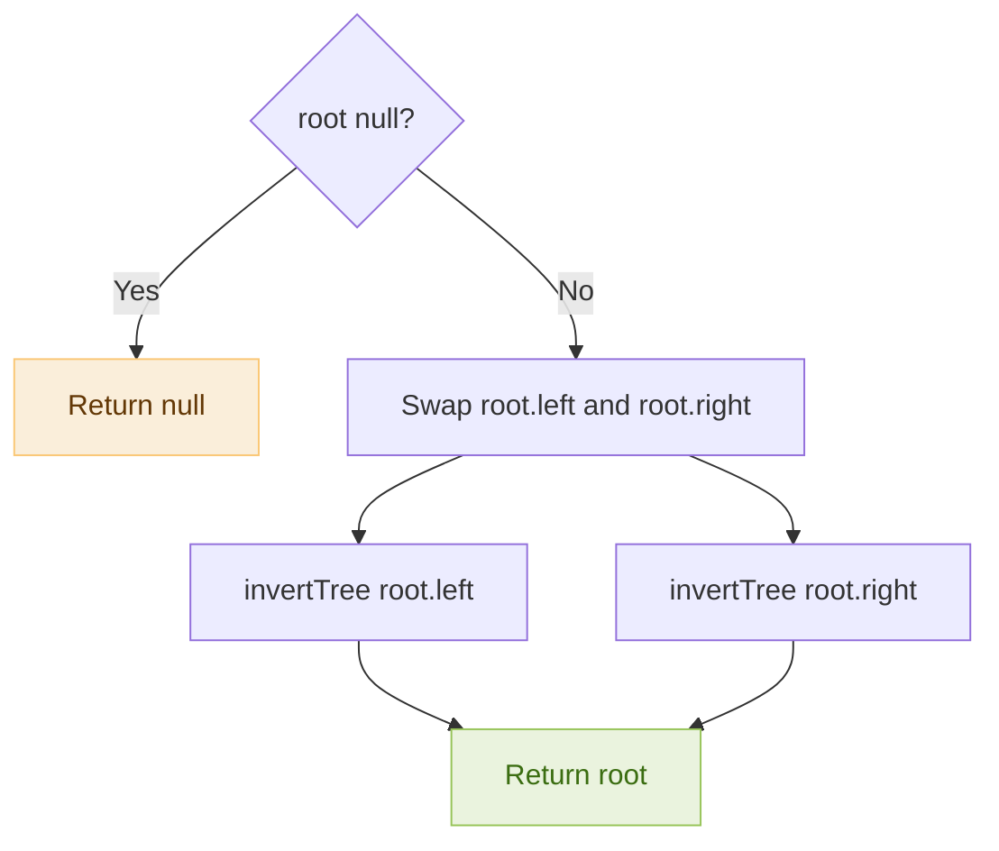
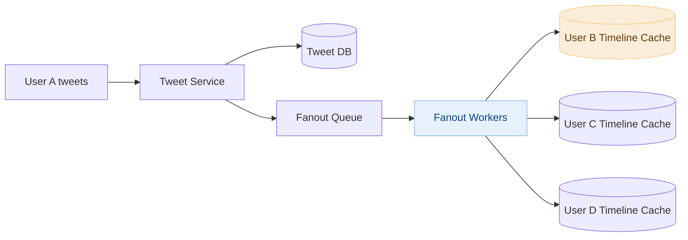
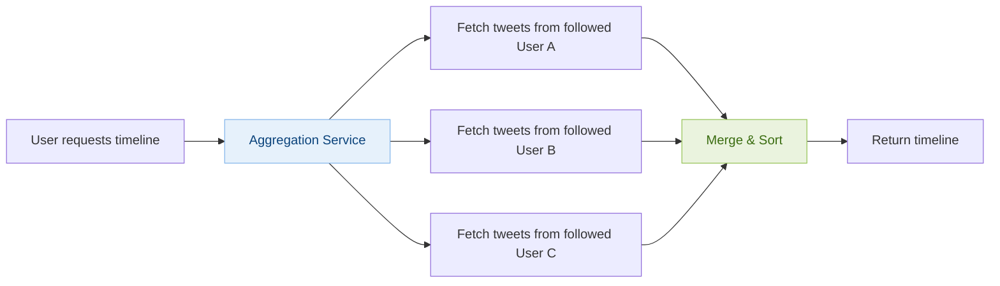
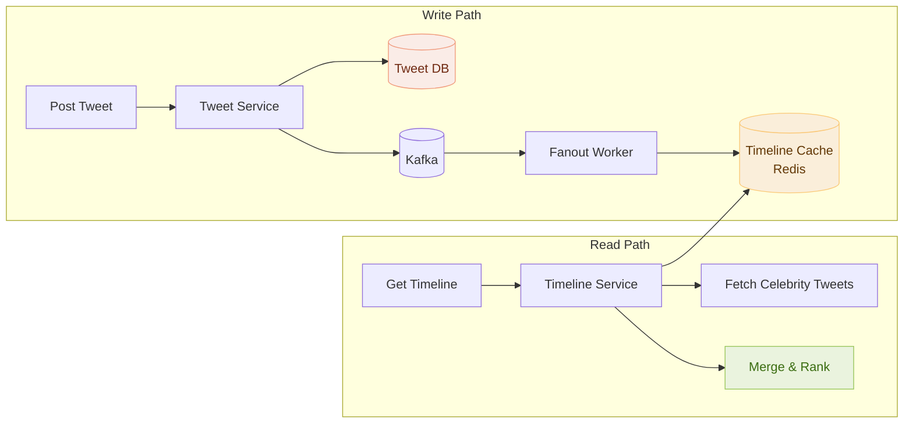

# Day 6 — Invert Binary Tree & Design Twitter News Feed

> **30-Day Interview Prep Tracker** | Shobhit Kumar  
> **Date:** ___________  
> **Status:** ⬜ DSA Done | ⬜ System Design Done  
> **Difficulty:** Easy | **Topic:** Trees / DFS

---

## Part 1: DSA — Invert Binary Tree (LeetCode #226)

### Problem Statement

Given the root of a binary tree, invert the tree, and return its root.

### Examples

```
Input:
        4
       / \
      2   7
     / \ / \
    1  3 6  9

Output:
        4
       / \
      7   2
     / \ / \
    9  6 3  1
```

---

### Approach 1: Recursive DFS

**Key Insight:** To invert a tree, swap the left and right child of each node, then recursively invert both subtrees.

```
invertTree(root):
  if root is null: return null
  swap(root.left, root.right)
  invertTree(root.left)
  invertTree(root.right)
  return root
```

#### Flow Diagram



### Solution — Java (Recursive)

```java
class Solution {
    public TreeNode invertTree(TreeNode root) {
        if (root == null) return null;
        
        TreeNode temp = root.left;
        root.left = root.right;
        root.right = temp;
        
        invertTree(root.left);
        invertTree(root.right);
        
        return root;
    }
}
```

### Approach 2: Iterative BFS

```java
import java.util.LinkedList;
import java.util.Queue;

class Solution {
    public TreeNode invertTree(TreeNode root) {
        if (root == null) return null;
        
        Queue<TreeNode> queue = new LinkedList<>();
        queue.offer(root);
        
        while (!queue.isEmpty()) {
            TreeNode node = queue.poll();
            
            TreeNode temp = node.left;
            node.left = node.right;
            node.right = temp;
            
            if (node.left != null) queue.offer(node.left);
            if (node.right != null) queue.offer(node.right);
        }
        
        return root;
    }
}
```

### Solution — Python

```python
class Solution:
    def invertTree(self, root):
        if not root:
            return None
        
        root.left, root.right = root.right, root.left
        
        self.invertTree(root.left)
        self.invertTree(root.right)
        
        return root
```

### Complexity Analysis

| Metric | Recursive | Iterative BFS |
|--------|-----------|---------------|
| **Time** | O(n) | O(n) |
| **Space** | O(h) — recursion stack | O(w) — queue width |

Where h = tree height, w = max tree width.

---

## Part 2: System Design — Twitter News Feed (Timeline)

### Requirements Clarification

#### Functional Requirements
- Users can post tweets
- Users can follow other users
- Users see a home timeline: merged feed from all followed users, sorted by recency

#### Non-Functional Requirements
- 300M DAU, 100M tweets/day
- Read-heavy: timeline views >> tweets posted (1000:1 ratio)
- Timeline load < 200ms
- Tweets appear within a few seconds of posting

#### Scale Estimation
- 100M tweets/day ≈ 1150 tweets/second
- 300M users × 10 reads/day = 3B timeline reads/day ≈ 35K reads/second
- Average user follows 200 others; average tweet fanout: 75 followers

---

### The Core Challenge: Fan-out

When a user posts a tweet, their followers' timelines must be updated. Two approaches:

#### Approach 1: Fan-out on Write (Push Model)



- Pre-compute timelines in cache at write time
- Read is just a cache lookup — very fast
- **Problem:** Celebrity with 100M followers → 100M cache writes per tweet

#### Approach 2: Fan-out on Read (Pull Model)



- Fetch at read time by querying each followed user's tweets
- **Problem:** If following 500 people, 500 DB queries per timeline load

#### Hybrid Approach (Twitter's Actual Solution)

```
Regular users (< 1M followers): Fan-out on write → pre-populate timeline cache
Celebrity users (> 1M followers): Fan-out on read → merged at read time

Timeline Load:
  1. Load pre-computed timeline from cache
  2. Fetch recent tweets from any followed celebrities
  3. Merge and return
```

---

### Full Architecture



---

### Database Schema

```sql
-- Tweets
CREATE TABLE tweets (
    id         BIGINT PRIMARY KEY,  -- Snowflake ID (timestamp-based)
    user_id    BIGINT NOT NULL,
    content    VARCHAR(280),
    created_at TIMESTAMP DEFAULT CURRENT_TIMESTAMP,
    
    INDEX idx_user_created (user_id, created_at DESC)
);

-- Social graph (follows)
CREATE TABLE follows (
    follower_id  BIGINT,
    followee_id  BIGINT,
    created_at   TIMESTAMP DEFAULT CURRENT_TIMESTAMP,
    PRIMARY KEY (follower_id, followee_id),
    INDEX idx_followee (followee_id)  -- "who follows me?"
);
```

---

### Tweet ID: Snowflake

```
Twitter Snowflake ID (64-bit integer):
┌──────────────────┬────────────┬──────────────┬──────────────┐
│  Timestamp (41b) │ DC ID (5b) │ Machine (5b) │ Sequence(12b)│
└──────────────────┴────────────┴──────────────┴──────────────┘

- Globally unique
- Sortable by time (great for feeds!)
- Generated without coordination
- 41 bits of ms → ~69 years before overflow
```

---

### Interview Discussion Points

1. **Why not use SQL ORDER BY for timelines?** → At scale, JOINs across millions of follows + tweets are too slow
2. **How to handle celebrities?** → Hybrid push/pull model; cache celebrity tweets separately
3. **How to rank the feed?** → Chronological (simpler) or relevance-based ML model (more complex)
4. **How to paginate timelines?** → Cursor-based pagination using tweet ID as cursor, not offset
5. **What about trending topics?** → Separate counters in Redis, aggregated by time window

---

## Daily Checklist

- [ ] Solved Invert Binary Tree in under 5 minutes
- [ ] Can implement both recursive and iterative approaches
- [ ] Wrote solution in both Java and Python
- [ ] Drew Twitter feed architecture from memory
- [ ] Can explain fan-out-on-write vs fan-out-on-read tradeoffs
- [ ] Understand Snowflake ID structure

---

## My Notes

```
Time taken for DSA: _____ minutes
Time taken for System Design: _____ minutes

What went well:


What to improve:


Key insight I want to remember:


```

---

## Resources

- [LeetCode #226 — Invert Binary Tree](https://leetcode.com/problems/invert-binary-tree/)
- [Designing Twitter — System Design Interview](https://bytebytego.com/courses/system-design-interview/design-a-news-feed-system)
- [Twitter Snowflake](https://github.com/twitter-archive/snowflake)

---

> **Tip of the Day:** For binary tree problems, always ask: "Can I solve this recursively, treating it as: solve left subtree, solve right subtree, combine?" Most tree problems follow this pattern.

**Previous:** [Day 5 — Maximum Subarray + Distributed Cache](../DAY-05/day-05-max-subarray-distributed-cache.md)  
**Next:** [Day 7 — Validate BST + Web Crawler](../DAY-07/day-07-validate-bst-web-crawler.md)
