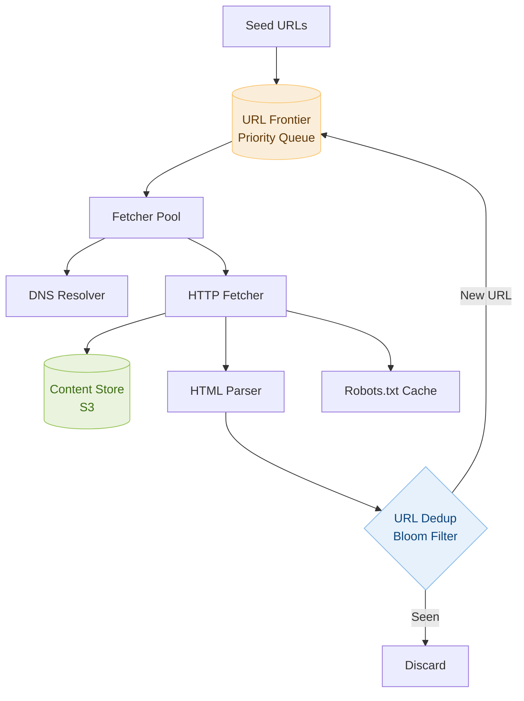

# Day 7 — Validate BST & Design Web Crawler

> **30-Day Interview Prep Tracker** | Shobhit Kumar  
> **Date:** ___________  
> **Status:** ⬜ DSA Done | ⬜ System Design Done  
> **Difficulty:** Medium | **Topic:** Trees / DFS

---

## Part 1: DSA — Validate Binary Search Tree (LeetCode #98)

### Problem Statement

Given the root of a binary tree, determine if it is a valid binary search tree (BST).

A valid BST:
- Left subtree contains only nodes with keys **less than** the node's key
- Right subtree contains only nodes with keys **greater than** the node's key
- Both left and right subtrees must also be valid BSTs

### Examples

```
    2
   / \
  1   3
Valid BST → true

    5
   / \
  1   4
     / \
    3   6
Invalid BST → false (4 is in right subtree of 5, but 4 < 5)
```

---

### Approach: Min/Max Bounds

**Key Insight:** Each node must satisfy a range constraint. Root: (-∞, +∞). Left child inherits (min, root.val). Right child inherits (root.val, max).

The common mistake is only comparing a node with its direct parent — this misses the case like node 3 being in the right subtree of 5 through node 4.

#### Algorithm Walkthrough

```
validate(node=5, min=-∞, max=+∞)
  5 is in (-∞, +∞) ✓
  validate(node=1, min=-∞, max=5)     ← left of 5
    1 is in (-∞, 5) ✓ → valid
  validate(node=4, min=5, max=+∞)     ← right of 5
    4 is NOT in (5, +∞) ✗ → INVALID
```

### Solution — Java

```java
class Solution {
    public boolean isValidBST(TreeNode root) {
        return validate(root, Long.MIN_VALUE, Long.MAX_VALUE);
    }
    
    private boolean validate(TreeNode node, long min, long max) {
        if (node == null) return true;
        if (node.val <= min || node.val >= max) return false;
        
        return validate(node.left, min, node.val) &&
               validate(node.right, node.val, max);
    }
}
```

### Solution — Python

```python
class Solution:
    def isValidBST(self, root) -> bool:
        def validate(node, min_val, max_val):
            if not node:
                return True
            if not (min_val < node.val < max_val):
                return False
            return (validate(node.left, min_val, node.val) and
                    validate(node.right, node.val, max_val))
        
        return validate(root, float('-inf'), float('inf'))
```

### Complexity Analysis

| Metric | Value |
|--------|-------|
| **Time** | O(n) — visit every node once |
| **Space** | O(h) — recursion stack depth |

### Common Mistake

```
WRONG approach: only compare with direct parent
  Node 3 under node 4 in right subtree of 5
  3 < 4 (looks valid)
  BUT 3 < 5 (violates BST property for root 5)

CORRECT approach: pass min/max bounds down the recursion
```

---

## Part 2: System Design — Web Crawler

### Requirements Clarification

#### Functional Requirements
- Start from seed URLs, crawl the web by following links
- Store crawled page content
- Avoid re-crawling the same URL
- Support crawl depth or page count limit

#### Non-Functional Requirements
- Crawl 1B pages in one month
- Distributed: single machine too slow
- Politeness: respect robots.txt, rate limit per domain
- Fault tolerant: resume after crashes

#### Scale Estimation
- 1B pages / 30 days = ~400 pages/second
- Average page size: 100KB → 100TB storage total
- DNS lookups: ~400/second
- Multiple machines needed (~50 crawlers)

---

### High-Level Architecture



---

### URL Frontier (Priority Queue)

```
Two-tier priority system:
  1. Priority queue (front):  Assign importance by PageRank, freshness
  2. Politeness queue (back): One queue per domain, rate-limited

Example:
  Front Queues:       Back Queues (per domain):
  [High: 100 URLs]    [google.com: delay 1s]
  [Med:   50 URLs]    [reddit.com: delay 2s]
  [Low:   20 URLs]    [news.com:   delay 3s]

  Selector picks from front queues by priority,
  then routes to domain back queue for rate limiting
```

---

### Deduplication with Bloom Filter

```
Problem: 1B URLs — can't store all in memory for dedup check

Solution: Bloom Filter
  - Fixed-size bit array (e.g., 1GB for 1B items)
  - Multiple hash functions map URL to positions
  - Check: all bits set? → probably seen
  - Insert: set all hash positions

  False positive rate: ~1% (acceptable — we just skip some new URLs)
  False negative rate: 0% (never misses a seen URL)
  Space: 1GB vs ~100GB for a hash set
```

---

### Politeness: Respecting robots.txt

```python
import urllib.robotparser
from urllib.parse import urlparse

class RobotsCache:
    def __init__(self):
        self._cache = {}
    
    def can_fetch(self, url: str, user_agent: str = "*") -> bool:
        parsed = urlparse(url)
        domain = f"{parsed.scheme}://{parsed.netloc}"
        
        if domain not in self._cache:
            rp = urllib.robotparser.RobotFileParser()
            rp.set_url(f"{domain}/robots.txt")
            rp.read()
            self._cache[domain] = rp
        
        return self._cache[domain].can_fetch(user_agent, url)
```

---

### Content Deduplication with Hashing

```
Problem: Multiple URLs may serve same content (mirrors, duplicates)

Solution: Simhash or MD5 fingerprint of page content
  1. Hash page content → 64-bit fingerprint
  2. Store fingerprints in distributed set
  3. If new page has same fingerprint → skip storage
```

---

### Fault Tolerance

```
Component         Failure Handling
─────────────────────────────────────────────────────
URL Frontier      Persist to disk (Kafka / Redis sorted set)
Fetcher           Retry with backoff, dead-letter queue
Content Store     S3 — built-in redundancy
State             Checkpoint progress to recover after crash
Fetcher node down Re-assign URLs from dead nodes to healthy ones
```

---

### Interview Discussion Points

1. **How do you prioritize which URLs to crawl first?** → PageRank, freshness score, topic relevance
2. **How do you handle crawler traps (infinite URL generation)?** → URL normalization, depth limit, cycle detection
3. **How to scale fetchers?** → Partition URL space by domain hash, each worker owns a domain range
4. **How to handle JavaScript-rendered pages?** → Headless browser (Puppeteer) for JS-heavy pages
5. **How to respect rate limits per domain?** → Per-domain queues with configurable delay, robots.txt crawl-delay

---

## Daily Checklist

- [ ] Solved Validate BST in under 10 minutes
- [ ] Understand why you need min/max bounds (not just parent comparison)
- [ ] Wrote solution in both Java and Python
- [ ] Drew web crawler architecture from memory
- [ ] Can explain Bloom filter tradeoffs
- [ ] Understand the URL frontier two-tier queue

---

## My Notes

```
Time taken for DSA: _____ minutes
Time taken for System Design: _____ minutes

What went well:


What to improve:


Key insight I want to remember:


```

---

## Resources

- [LeetCode #98 — Validate BST](https://leetcode.com/problems/validate-binary-search-tree/)
- [Designing a Web Crawler — System Design Interview](https://bytebytego.com/courses/system-design-interview/design-a-web-crawler)
- [Bloom Filters Explained](https://en.wikipedia.org/wiki/Bloom_filter)

---

> **Tip of the Day:** When validating a BST, think globally, not locally. Every node in a left subtree must be less than ALL ancestors on the path where you went right. Pass bounds down recursion rather than just comparing with parent.

**Previous:** [Day 6 — Invert Binary Tree + Twitter Feed](../DAY-06/day-06-invert-binary-tree-twitter-feed.md)  
**Next:** [Day 8 — Number of Islands + YouTube](../DAY-08/day-08-number-of-islands-youtube.md)
