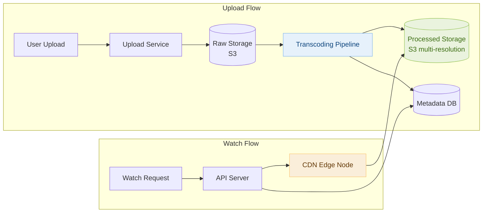
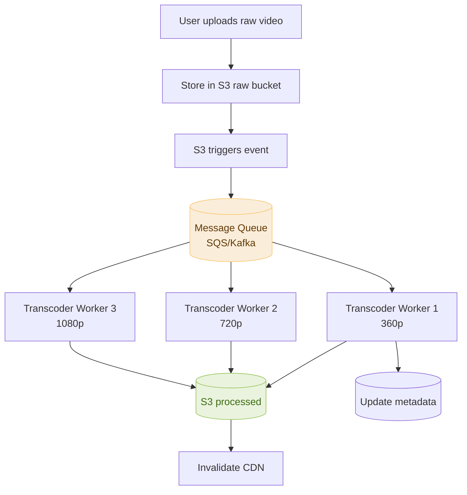

# Day 8 — Number of Islands & Design YouTube / Video Streaming

> **30-Day Interview Prep Tracker** | Shobhit Kumar  
> **Date:** ___________  
> **Status:** ⬜ DSA Done | ⬜ System Design Done  
> **Difficulty:** Medium | **Topic:** Graphs / BFS / DFS

---

## Part 1: DSA — Number of Islands (LeetCode #200)

### Problem Statement

Given an `m x n` 2D binary grid where `'1'` is land and `'0'` is water, return the number of islands. An island is surrounded by water and is formed by connecting adjacent lands horizontally or vertically.

### Examples

```
Input:
11110
11010
11000
00000
Output: 1

Input:
11000
11000
00100
00011
Output: 3
```

---

### Approach: DFS Flood Fill

**Key Insight:** For each unvisited '1' cell, perform DFS to mark all connected land cells as visited (flood fill). Each DFS call from an unvisited '1' represents one island.

#### Algorithm Walkthrough

```
Grid (4×5):
11110
11010
11000
00000

Step 1: (0,0)='1' → start DFS → mark entire island → count=1
  DFS marks: (0,0),(0,1),(0,2),(0,3),(1,0),(1,1),(1,3),(2,0),(2,1)
  
Step 2: Scan remaining unvisited cells → all '0' or already visited

Result: 1 island
```

### Solution — Java (DFS)

```java
class Solution {
    public int numIslands(char[][] grid) {
        if (grid == null || grid.length == 0) return 0;
        
        int count = 0;
        for (int i = 0; i < grid.length; i++) {
            for (int j = 0; j < grid[0].length; j++) {
                if (grid[i][j] == '1') {
                    dfs(grid, i, j);
                    count++;
                }
            }
        }
        return count;
    }
    
    private void dfs(char[][] grid, int i, int j) {
        if (i < 0 || i >= grid.length || j < 0 || j >= grid[0].length
                || grid[i][j] != '1') return;
        
        grid[i][j] = '0';  // Mark as visited
        dfs(grid, i + 1, j);
        dfs(grid, i - 1, j);
        dfs(grid, i, j + 1);
        dfs(grid, i, j - 1);
    }
}
```

### Solution — Python

```python
class Solution:
    def numIslands(self, grid: list[list[str]]) -> int:
        if not grid:
            return 0
        
        rows, cols = len(grid), len(grid[0])
        count = 0
        
        def dfs(r, c):
            if r < 0 or r >= rows or c < 0 or c >= cols or grid[r][c] != '1':
                return
            grid[r][c] = '0'
            dfs(r + 1, c)
            dfs(r - 1, c)
            dfs(r, c + 1)
            dfs(r, c - 1)
        
        for r in range(rows):
            for c in range(cols):
                if grid[r][c] == '1':
                    dfs(r, c)
                    count += 1
        
        return count
```

### Complexity Analysis

| Metric | Value |
|--------|-------|
| **Time** | O(m × n) — each cell visited at most once |
| **Space** | O(m × n) — recursion stack in worst case |

---

## Part 2: System Design — YouTube / Video Streaming

### Requirements Clarification

#### Functional Requirements
- Users can upload videos
- Users can stream/watch videos
- Support various resolutions: 360p, 720p, 1080p, 4K
- Search videos by title/tags

#### Non-Functional Requirements
- 5B video views/day (high read throughput)
- 500 hours of video uploaded/minute
- Smooth streaming with minimal buffering
- 99.9% availability

#### Scale Estimation
- Upload: 500 hrs/min × 60 min × 24 hrs = 720,000 hrs/day
- Avg video: 30 min → ~24M videos/day uploaded
- Storage: 1GB per hour of 1080p → 720,000 GB = 720 TB/day just for uploads
- With multiple resolutions: ~3 PB/day

---

### High-Level Architecture



---

### Video Upload & Transcoding Pipeline



---

### Adaptive Bitrate Streaming (ABR)

```
Protocol: HLS (HTTP Live Streaming) or MPEG-DASH

Video is split into small segments (2-10 seconds each):
  video.m3u8 (master playlist)
    → 360p/segment_001.ts
    → 360p/segment_002.ts
    → 720p/segment_001.ts
    → 720p/segment_002.ts
    → 1080p/segment_001.ts
    ...

Player monitors bandwidth:
  - Good bandwidth → request higher resolution segments
  - Poor bandwidth → drop to lower resolution
  - Seamless transition between quality levels
```

---

### CDN Strategy

```
Video content:  Served from CDN edge nodes close to users
  → Cached at 100+ PoPs globally
  → ~80% of traffic served from edge, not origin

Metadata:       API servers (not CDN) — dynamic, user-specific
Video stream:   CDN with signed URLs for access control

Cache strategy:
  Popular videos: cached at all edge nodes (80/20 rule)
  Long-tail videos: cached on-demand, evicted by LRU
```

---

### Database Schema

```sql
-- Videos metadata
CREATE TABLE videos (
    id          VARCHAR(11) PRIMARY KEY,  -- YouTube-style ID
    title       VARCHAR(500),
    description TEXT,
    user_id     BIGINT NOT NULL,
    status      ENUM('uploading', 'processing', 'published', 'deleted'),
    duration    INT,  -- seconds
    view_count  BIGINT DEFAULT 0,
    created_at  TIMESTAMP DEFAULT CURRENT_TIMESTAMP,
    
    INDEX idx_user (user_id),
    FULLTEXT INDEX idx_search (title, description)
);

-- Video formats (one row per resolution per video)
CREATE TABLE video_formats (
    video_id    VARCHAR(11),
    resolution  ENUM('360p', '720p', '1080p', '4k'),
    url         TEXT,
    file_size   BIGINT,
    PRIMARY KEY (video_id, resolution)
);
```

---

### Interview Discussion Points

1. **How do you handle very large video uploads?** → Chunked upload with resumable protocol (TUS), reassemble on server
2. **How to reduce storage costs?** → De-duplicate identical videos (perceptual hashing), compress with H.265
3. **How to handle 5B daily views?** → CDN absorbs 80%+ of traffic; only cache misses hit origin
4. **How do you handle transcoding failures?** → Dead-letter queue, retry with backoff, notify user
5. **How to implement video search?** → Elasticsearch for full-text on title/tags; thumbnail + ML for content search

---

## Daily Checklist

- [ ] Solved Number of Islands in under 12 minutes
- [ ] Can explain DFS flood fill approach
- [ ] Wrote solution in both Java and Python
- [ ] Drew YouTube architecture from memory
- [ ] Understand adaptive bitrate streaming (HLS/DASH)
- [ ] Can explain CDN role in video delivery

---

## My Notes

```
Time taken for DSA: _____ minutes
Time taken for System Design: _____ minutes

What went well:


What to improve:


Key insight I want to remember:


```

---

## Resources

- [LeetCode #200 — Number of Islands](https://leetcode.com/problems/number-of-islands/)
- [Designing YouTube — System Design Interview](https://bytebytego.com/courses/system-design-interview/design-youtube)
- [How HLS Works](https://developer.apple.com/streaming/)

---

> **Tip of the Day:** Grid DFS/BFS problems are fundamentally graph problems in disguise. Each cell is a node, and edges exist between adjacent cells. Practice translating between grid coordinates and graph abstractions.

**Previous:** [Day 7 — Validate BST + Web Crawler](../DAY-07/day-07-validate-bst-web-crawler.md)  
**Next:** [Day 9 — LRU Cache + Uber](../DAY-09/day-09-lru-cache-uber.md)
