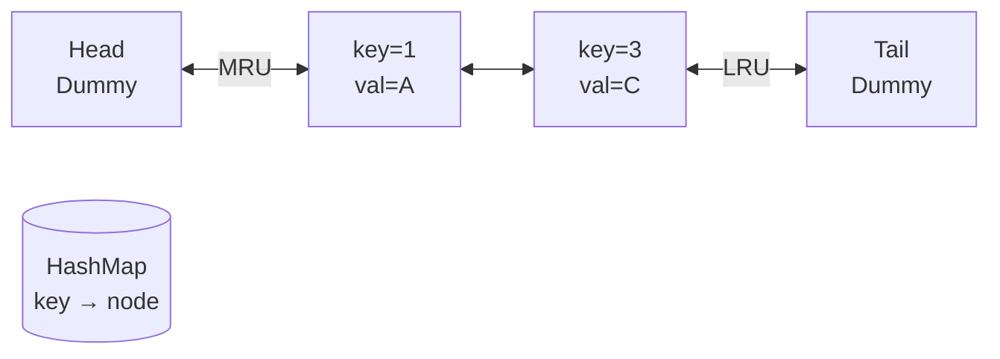
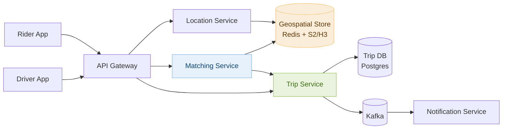
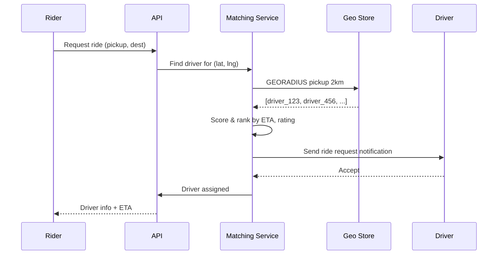

# Day 9 — LRU Cache & Design Uber / Ride Sharing

> **30-Day Interview Prep Tracker** | Shobhit Kumar  
> **Date:** ___________  
> **Status:** ⬜ DSA Done | ⬜ System Design Done  
> **Difficulty:** Medium | **Topic:** Design / HashMap + LinkedList

---

## Part 1: DSA — LRU Cache (LeetCode #146)

### Problem Statement

Design a data structure that follows the constraints of a **Least Recently Used (LRU) cache**.

Implement the `LRUCache` class:
- `LRUCache(int capacity)` — initialize with positive capacity
- `int get(int key)` — return value if key exists, else -1
- `void put(int key, int value)` — update value if key exists, else add. If capacity exceeded, evict LRU key

Both operations must run in **O(1)** average time.

### Examples

```
LRUCache cache = new LRUCache(2);
cache.put(1, 1);   // cache: {1=1}
cache.put(2, 2);   // cache: {1=1, 2=2}
cache.get(1);      // returns 1, cache: {2=2, 1=1} (1 is now MRU)
cache.put(3, 3);   // evicts key 2, cache: {1=1, 3=3}
cache.get(2);      // returns -1 (not found)
cache.put(4, 4);   // evicts key 1, cache: {3=3, 4=4}
cache.get(1);      // returns -1
cache.get(3);      // returns 3
cache.get(4);      // returns 4
```

---

### Approach: HashMap + Doubly Linked List

**Key Insight:**
- HashMap gives O(1) access by key
- Doubly Linked List maintains order (MRU at head, LRU at tail) with O(1) insert/remove
- On `get`: move node to head
- On `put`: insert at head; if over capacity, remove from tail



### Solution — Java

```java
import java.util.HashMap;

class LRUCache {
    private final int capacity;
    private final HashMap<Integer, Node> map;
    private final Node head, tail;
    
    public LRUCache(int capacity) {
        this.capacity = capacity;
        this.map = new HashMap<>();
        head = new Node(0, 0);
        tail = new Node(0, 0);
        head.next = tail;
        tail.prev = head;
    }
    
    public int get(int key) {
        if (!map.containsKey(key)) return -1;
        Node node = map.get(key);
        remove(node);
        addToFront(node);
        return node.val;
    }
    
    public void put(int key, int value) {
        if (map.containsKey(key)) {
            remove(map.get(key));
        }
        Node node = new Node(key, value);
        addToFront(node);
        map.put(key, node);
        
        if (map.size() > capacity) {
            Node lru = tail.prev;
            remove(lru);
            map.remove(lru.key);
        }
    }
    
    private void remove(Node node) {
        node.prev.next = node.next;
        node.next.prev = node.prev;
    }
    
    private void addToFront(Node node) {
        node.next = head.next;
        node.prev = head;
        head.next.prev = node;
        head.next = node;
    }
    
    static class Node {
        int key, val;
        Node prev, next;
        Node(int key, int val) { this.key = key; this.val = val; }
    }
}
```

### Solution — Python

```python
from collections import OrderedDict

class LRUCache:
    def __init__(self, capacity: int):
        self.capacity = capacity
        self.cache = OrderedDict()
    
    def get(self, key: int) -> int:
        if key not in self.cache:
            return -1
        self.cache.move_to_end(key)
        return self.cache[key]
    
    def put(self, key: int, value: int) -> None:
        if key in self.cache:
            self.cache.move_to_end(key)
        self.cache[key] = value
        if len(self.cache) > self.capacity:
            self.cache.popitem(last=False)
```

### Complexity Analysis

| Operation | Time | Space |
|-----------|------|-------|
| `get` | O(1) | — |
| `put` | O(1) | O(capacity) |

---

## Part 2: System Design — Uber / Ride Sharing

### Requirements Clarification

#### Functional Requirements
- Rider requests a ride from location A to B
- System matches rider to nearby available driver
- Real-time location tracking of driver
- Price estimation before booking
- Trip history

#### Non-Functional Requirements
- Low latency matching: < 1 second
- Real-time location updates: GPS every 4 seconds
- Scale: 1M drivers, 5M riders globally
- High availability (failure during a trip is critical)

#### Scale Estimation
- Active drivers: 500K at peak
- Location updates: 500K × (1/4) = 125K updates/second
- Ride requests: ~10K/minute = ~167/second
- Geospatial queries: nearby driver search within 2km radius

---

### High-Level Architecture



---

### Geospatial Indexing: S2 / H3 Grid

```
Problem: "Find all drivers within 2km of rider at (lat, lng)"
Standard DB query: full table scan → too slow

Solution: Geohash / Google S2 / Uber H3 cells
  - Divide Earth into hexagonal cells at different resolutions
  - Each cell has a string ID (e.g., H3 at resolution 9 ≈ 0.1 km²)
  - Encode driver location → cell ID
  - Query: get driver IDs in rider's cell + 6 neighbors

Redis GEOADD:
  GEOADD drivers:active 37.7749 -122.4194 "driver:123"
  GEORADIUS drivers:active -122.4194 37.7749 2 km ASC COUNT 10
```

---

### Driver Matching Flow



---

### Real-time Location Tracking

```
Driver sends GPS update every 4 seconds:
  PUT /location { driver_id, lat, lng, timestamp }

Location Service:
  1. Update Redis GEOADD (for nearby queries)
  2. Publish to Kafka topic "location-updates"
  3. Active trip service subscribes → streams to rider app via WebSocket

WebSocket connection lifecycle:
  - Open when trip starts
  - Driver location pushed every 4 seconds
  - Close when trip ends
```

---

### Surge Pricing

```python
def calculate_surge_multiplier(area_id: str) -> float:
    supply = redis.get(f"drivers:{area_id}:count")
    demand = redis.get(f"requests:{area_id}:count")
    
    ratio = demand / max(supply, 1)
    
    if ratio < 1.5: return 1.0
    if ratio < 2.0: return 1.5
    if ratio < 3.0: return 2.0
    return min(ratio * 0.8, 3.0)  # Cap at 3x
```

---

### Interview Discussion Points

1. **How do you handle driver location at scale?** → Redis with geospatial commands, partition by city
2. **What if matching service fails during a trip?** → Trip state persisted in DB; driver and rider reconnect to existing trip
3. **How do you minimize idle time for drivers?** → Predictive positioning based on demand hotspots
4. **How to handle the ETA calculation?** → Google Maps API or internal map service with real-time traffic
5. **How to prevent fake GPS spoofing?** → Cross-check with accelerometer data, anomaly detection

---

## Daily Checklist

- [ ] Solved LRU Cache in under 15 minutes
- [ ] Understand why HashMap + Doubly Linked List gives O(1)
- [ ] Wrote solution in both Java and Python
- [ ] Drew Uber architecture from memory
- [ ] Can explain geospatial indexing (geohash / H3)
- [ ] Understand real-time WebSocket location streaming

---

## My Notes

```
Time taken for DSA: _____ minutes
Time taken for System Design: _____ minutes

What went well:


What to improve:


Key insight I want to remember:


```

---

## Resources

- [LeetCode #146 — LRU Cache](https://leetcode.com/problems/lru-cache/)
- [Designing Uber — System Design Interview](https://bytebytego.com/courses/system-design-interview/proximity-service)
- [Uber H3 Geospatial Indexing](https://h3geo.org/)

---

> **Tip of the Day:** The LRU Cache is a classic "design a data structure" problem. Practice drawing the doubly linked list with dummy head/tail nodes — it eliminates null checks and makes the code cleaner.

**Previous:** [Day 8 — Number of Islands + YouTube](../DAY-08/day-08-number-of-islands-youtube.md)  
**Next:** [Day 10 — Course Schedule + Microservices](../DAY-10/day-10-course-schedule-microservices.md)
