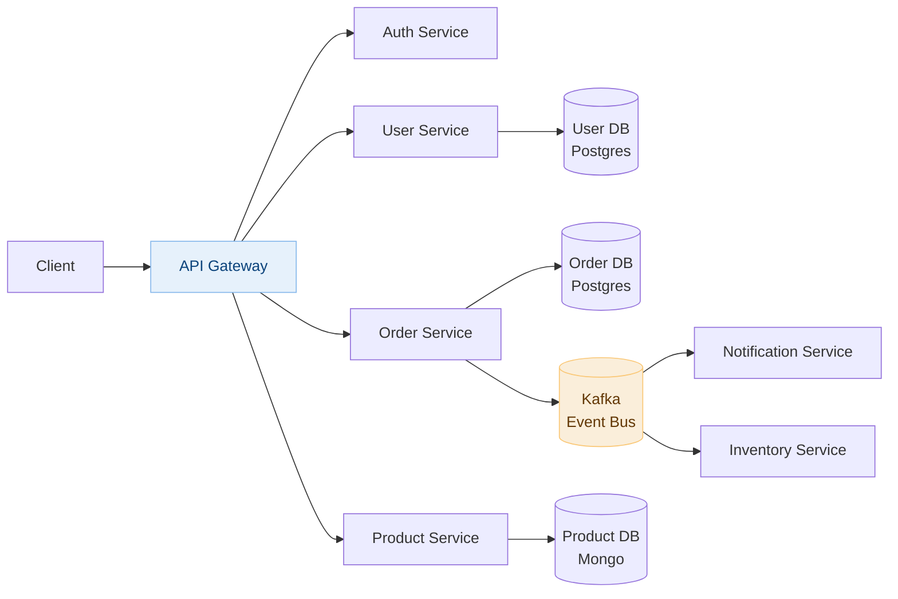
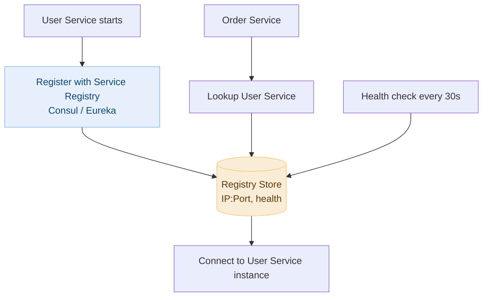

# Day 10 — Course Schedule & Microservices Architecture

> **30-Day Interview Prep Tracker** | Shobhit Kumar  
> **Date:** ___________  
> **Status:** ⬜ DSA Done | ⬜ System Design Done  
> **Difficulty:** Medium | **Topic:** Graphs / Topological Sort

---

## Part 1: DSA — Course Schedule (LeetCode #207)

### Problem Statement

There are `numCourses` courses labeled `0` to `numCourses - 1`. You are given an array `prerequisites` where `prerequisites[i] = [ai, bi]` means you must take course `bi` before course `ai`. Return `true` if you can finish all courses, else `false`.

This is essentially: **can you topologically sort a directed graph? (i.e., is it a DAG — no cycles?)**

### Examples

```
numCourses = 2, prerequisites = [[1,0]]
→ Take 0 first, then 1 → true

numCourses = 2, prerequisites = [[1,0],[0,1]]
→ 0 requires 1, 1 requires 0 → cycle → false
```

---

### Approach 1: DFS Cycle Detection

**States:** `0 = unvisited`, `1 = visiting (in current path)`, `2 = visited (safe)`

```java
class Solution {
    public boolean canFinish(int numCourses, int[][] prerequisites) {
        List<List<Integer>> graph = new ArrayList<>();
        for (int i = 0; i < numCourses; i++) graph.add(new ArrayList<>());
        for (int[] pre : prerequisites) graph.get(pre[1]).add(pre[0]);
        
        int[] state = new int[numCourses];  // 0=unvisited, 1=visiting, 2=done
        
        for (int i = 0; i < numCourses; i++) {
            if (hasCycle(graph, state, i)) return false;
        }
        return true;
    }
    
    private boolean hasCycle(List<List<Integer>> graph, int[] state, int node) {
        if (state[node] == 1) return true;   // Cycle detected
        if (state[node] == 2) return false;  // Already processed
        
        state[node] = 1;  // Mark as visiting
        for (int neighbor : graph.get(node)) {
            if (hasCycle(graph, state, neighbor)) return true;
        }
        state[node] = 2;  // Mark as done
        return false;
    }
}
```

### Approach 2: BFS (Kahn's Algorithm — Topological Sort)

**Key Insight:** Use in-degree counting. Start with nodes having in-degree 0. Process them, reduce neighbors' in-degrees. If all nodes are processed → no cycle.

```java
class Solution {
    public boolean canFinish(int numCourses, int[][] prerequisites) {
        int[] inDegree = new int[numCourses];
        List<List<Integer>> graph = new ArrayList<>();
        for (int i = 0; i < numCourses; i++) graph.add(new ArrayList<>());
        
        for (int[] pre : prerequisites) {
            graph.get(pre[1]).add(pre[0]);
            inDegree[pre[0]]++;
        }
        
        Queue<Integer> queue = new LinkedList<>();
        for (int i = 0; i < numCourses; i++) {
            if (inDegree[i] == 0) queue.offer(i);
        }
        
        int processed = 0;
        while (!queue.isEmpty()) {
            int course = queue.poll();
            processed++;
            for (int next : graph.get(course)) {
                if (--inDegree[next] == 0) queue.offer(next);
            }
        }
        
        return processed == numCourses;
    }
}
```

### Python Solution

```python
from collections import deque

class Solution:
    def canFinish(self, numCourses: int, prerequisites: list[list[int]]) -> bool:
        graph = [[] for _ in range(numCourses)]
        in_degree = [0] * numCourses
        
        for course, prereq in prerequisites:
            graph[prereq].append(course)
            in_degree[course] += 1
        
        queue = deque(i for i in range(numCourses) if in_degree[i] == 0)
        processed = 0
        
        while queue:
            node = queue.popleft()
            processed += 1
            for neighbor in graph[node]:
                in_degree[neighbor] -= 1
                if in_degree[neighbor] == 0:
                    queue.append(neighbor)
        
        return processed == numCourses
```

### Complexity Analysis

| Metric | Value |
|--------|-------|
| **Time** | O(V + E) — vertices + edges |
| **Space** | O(V + E) — adjacency list + state array |

---

## Part 2: System Design — Microservices Architecture

### Monolith vs Microservices

```
Monolith:                    Microservices:
┌─────────────────────┐      ┌────────┐ ┌────────┐ ┌────────┐
│   Single Codebase   │      │  User  │ │ Order  │ │Product │
│  ┌───┐ ┌───┐ ┌───┐  │      │Service │ │Service │ │Service │
│  │UI │ │BL │ │DB │  │      └────────┘ └────────┘ └────────┘
│  └───┘ └───┘ └───┘  │         │            │          │
└─────────────────────┘      ┌──┴────────────┴──────────┴──┐
                             │     Message Bus / API GW     │
                             └─────────────────────────────┘
```

| Factor | Monolith | Microservices |
|--------|----------|---------------|
| Deployment | Single deploy | Independent deployments |
| Scaling | Scale entire app | Scale individual services |
| Team ownership | Shared codebase | Team owns their service |
| Latency | Low (in-process) | Higher (network calls) |
| Complexity | Lower initially | Higher (distributed systems) |

---

### Core Architecture



---

### Service Communication Patterns

#### Synchronous (REST / gRPC)

```
Best for: Request-response interactions where caller needs immediate answer
Examples: User authentication, product lookup, price check

REST:
  GET /products/123  → { id: 123, price: 99.99 }

gRPC (binary, typed, faster):
  ProductService.GetProduct(id: 123) → Product { id: 123, price: 99.99 }
```

#### Asynchronous (Event-Driven)

```
Best for: Fire-and-forget, long processes, cross-service notifications

OrderPlaced event → Kafka topic
  → InventoryService: reserve stock
  → NotificationService: email receipt
  → AnalyticsService: record sale

Producer code:
  kafka.produce("orders", { event: "OrderPlaced", orderId: "456", userId: "789" })

Consumer code (Notification):
  kafka.consume("orders", handler=send_order_email)
```

---

### Service Discovery



---

### Distributed Tracing

```
Problem: Request spans 5 services — where is the bottleneck?

Solution: Trace ID propagated through all service calls

Request → API GW (traceId: abc123)
  → User Service (traceId: abc123, spanId: 001)
  → Order Service (traceId: abc123, spanId: 002)
    → Inventory Service (traceId: abc123, spanId: 003)

Tool: Jaeger / Zipkin / AWS X-Ray
  Visualizes the full call chain with latency per span
```

---

### Circuit Breaker Pattern

```python
class CircuitBreaker:
    CLOSED = "closed"     # Normal, allow requests
    OPEN = "open"         # Failing, reject requests fast
    HALF_OPEN = "half_open"  # Testing recovery

    def __init__(self, failure_threshold=5, recovery_timeout=30):
        self.state = self.CLOSED
        self.failure_count = 0
        self.failure_threshold = failure_threshold
        self.last_failure_time = None
        self.recovery_timeout = recovery_timeout

    def call(self, func, *args):
        if self.state == self.OPEN:
            if time.time() - self.last_failure_time > self.recovery_timeout:
                self.state = self.HALF_OPEN
            else:
                raise Exception("Circuit open — fast fail")
        
        try:
            result = func(*args)
            self._on_success()
            return result
        except Exception:
            self._on_failure()
            raise

    def _on_success(self):
        self.failure_count = 0
        self.state = self.CLOSED

    def _on_failure(self):
        self.failure_count += 1
        self.last_failure_time = time.time()
        if self.failure_count >= self.failure_threshold:
            self.state = self.OPEN
```

---

### Interview Discussion Points

1. **How do you handle distributed transactions?** → Saga pattern (compensating transactions) or 2-phase commit
2. **How to ensure idempotency across services?** → Idempotency keys, deduplication in message consumers
3. **How to manage versioning as services evolve?** → Semantic versioning, backward-compatible changes, consumer-driven contracts
4. **How to debug a slow request across 10 services?** → Distributed tracing with Jaeger/Zipkin, structured logging with trace ID
5. **When NOT to use microservices?** → Small teams, early startups, simple domains — monolith first, extract services when pain is real

---

## Daily Checklist

- [ ] Solved Course Schedule in under 12 minutes
- [ ] Can implement both DFS and Kahn's BFS approaches
- [ ] Wrote solution in both Java and Python
- [ ] Drew microservices architecture from memory
- [ ] Can explain circuit breaker pattern
- [ ] Understand sync vs async communication tradeoffs

---

## My Notes

```
Time taken for DSA: _____ minutes
Time taken for System Design: _____ minutes

What went well:


What to improve:


Key insight I want to remember:


```

---

## Resources

- [LeetCode #207 — Course Schedule](https://leetcode.com/problems/course-schedule/)
- [Microservices Patterns — Martin Fowler](https://microservices.io/)
- [Circuit Breaker Pattern](https://martinfowler.com/bliki/CircuitBreaker.html)

---

> **Tip of the Day:** Topological sort (Kahn's algorithm) is the go-to for "can we complete all tasks given dependencies?" problems. In-degree counting is clean and intuitive — a node with in-degree 0 has no remaining prerequisites.

**Previous:** [Day 9 — LRU Cache + Uber](../DAY-09/day-09-lru-cache-uber.md)  
**Next:** [Day 11 — 3Sum + Elasticsearch](../DAY-11/day-11-3sum-elasticsearch.md)
