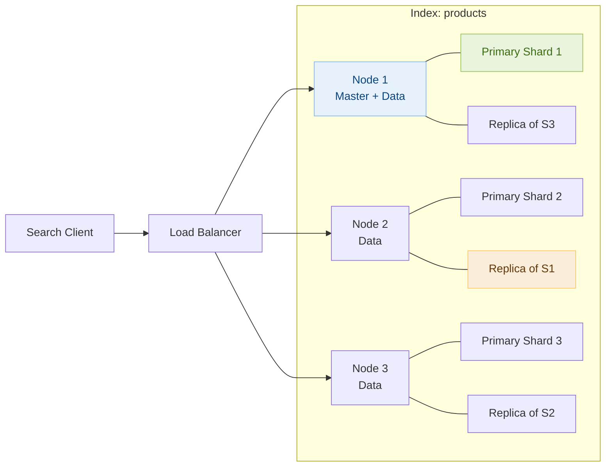
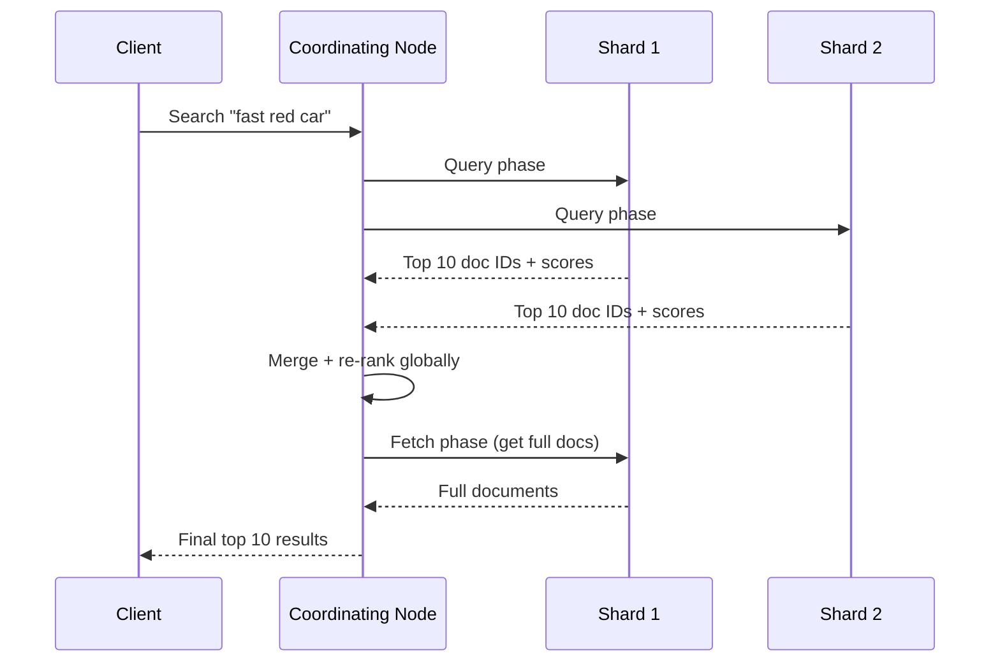

# Day 11 — 3Sum & Design Elasticsearch Cluster

> **30-Day Interview Prep Tracker** | Shobhit Kumar  
> **Date:** ___________  
> **Status:** ⬜ DSA Done | ⬜ System Design Done  
> **Difficulty:** Medium | **Topic:** Arrays / Two Pointers

---

## Part 1: DSA — 3Sum (LeetCode #15)

### Problem Statement

Given an integer array `nums`, return all the triplets `[nums[i], nums[j], nums[k]]` such that `i != j`, `i != k`, `j != k`, and `nums[i] + nums[j] + nums[k] == 0`. The solution set must not contain duplicate triplets.

### Examples

```
Input:  nums = [-1,0,1,2,-1,-4]
Output: [[-1,-1,2],[-1,0,1]]

Input:  nums = [0,1,1]
Output: []

Input:  nums = [0,0,0]
Output: [[0,0,0]]
```

---

### Approach: Sort + Two Pointers

**Key Insight:** Sort first. For each element `nums[i]`, use two pointers `left` and `right` to find pairs summing to `-nums[i]`. Skip duplicates to avoid duplicate triplets.

#### Algorithm Walkthrough

```
nums = [-4,-1,-1,0,1,2]  (sorted)

i=0: nums[i]=-4, need sum=4
  left=1(-1), right=5(2): -1+2=1 < 4 → left++
  left=2(-1), right=5(2): -1+2=1 < 4 → left++
  ... no pair found

i=1: nums[i]=-1, need sum=1
  left=2(-1), right=5(2): -1+2=1 == 1 ✓ → add [-1,-1,2], left++, right--
  left=3(0), right=4(1):  0+1=1 == 1 ✓ → add [-1,0,1], left++, right--
  left=right → stop

i=2: nums[i]=-1 (same as i=1) → skip (duplicate)
...
Result: [[-1,-1,2], [-1,0,1]]
```

### Solution — Java

```java
import java.util.*;

class Solution {
    public List<List<Integer>> threeSum(int[] nums) {
        Arrays.sort(nums);
        List<List<Integer>> result = new ArrayList<>();
        
        for (int i = 0; i < nums.length - 2; i++) {
            if (i > 0 && nums[i] == nums[i - 1]) continue;  // Skip duplicate i
            
            int left = i + 1, right = nums.length - 1;
            
            while (left < right) {
                int sum = nums[i] + nums[left] + nums[right];
                
                if (sum == 0) {
                    result.add(Arrays.asList(nums[i], nums[left], nums[right]));
                    while (left < right && nums[left] == nums[left + 1]) left++;   // Skip dup
                    while (left < right && nums[right] == nums[right - 1]) right--; // Skip dup
                    left++;
                    right--;
                } else if (sum < 0) {
                    left++;
                } else {
                    right--;
                }
            }
        }
        
        return result;
    }
}
```

### Solution — Python

```python
class Solution:
    def threeSum(self, nums: list[int]) -> list[list[int]]:
        nums.sort()
        result = []
        
        for i in range(len(nums) - 2):
            if i > 0 and nums[i] == nums[i - 1]:
                continue  # Skip duplicate i
            
            left, right = i + 1, len(nums) - 1
            
            while left < right:
                total = nums[i] + nums[left] + nums[right]
                
                if total == 0:
                    result.append([nums[i], nums[left], nums[right]])
                    while left < right and nums[left] == nums[left + 1]:
                        left += 1
                    while left < right and nums[right] == nums[right - 1]:
                        right -= 1
                    left += 1
                    right -= 1
                elif total < 0:
                    left += 1
                else:
                    right -= 1
        
        return result
```

### Complexity Analysis

| Metric | Value |
|--------|-------|
| **Time** | O(n²) — O(n log n) sort + O(n²) two-pointer pass |
| **Space** | O(1) extra (output not counted) |

---

## Part 2: System Design — Elasticsearch Cluster

### What is Elasticsearch?

Elasticsearch is a distributed, RESTful search and analytics engine built on Apache Lucene. Used for full-text search, log analytics (ELK stack), e-commerce product search.

### Requirements Clarification

#### Functional Requirements
- Index documents (JSON) with arbitrary fields
- Full-text search with relevance ranking
- Aggregations (e.g., count by category, average price)
- Near real-time: indexed documents searchable within 1 second

#### Scale Estimation
- 1B documents, avg 1KB each = 1TB raw data
- 100K search queries/second
- 10K indexing operations/second
- 3x replication → 3TB stored

---

### Core Concepts

```
Index  → like a database table
Shard  → a Lucene index instance (horizontal partition of an index)
Replica → copy of a primary shard for HA and read scaling
Node   → a single Elasticsearch server

Example: Index with 5 primary shards, 1 replica each = 10 shards total
```

### Cluster Architecture



---

### Inverted Index (Core Data Structure)

```
Documents:
  Doc 1: "fast red car"
  Doc 2: "fast blue bike"
  Doc 3: "slow red truck"

Inverted Index:
  Term    │ Documents
  ────────┼──────────────
  fast    │ [1, 2]
  red     │ [1, 3]
  car     │ [1]
  blue    │ [2]
  bike    │ [2]
  slow    │ [3]
  truck   │ [3]

Query "fast red":
  fast → {1,2}, red → {1,3}
  Intersection + scoring → Doc 1 (contains both) ranked highest
```

---

### Search Flow



---

### Relevance Scoring: BM25

```
BM25 Score = IDF × TF-normalization

IDF (Inverse Document Frequency):
  Rare terms get higher weight
  "the" appears in all docs → low IDF
  "elasticsearch" appears in few → high IDF

TF (Term Frequency) with normalization:
  More occurrences = higher score, but with diminishing returns
  Long documents normalized down (vs short docs with same term count)
```

---

### Cisco Context

```
Pricing Engine (L2N) uses Elasticsearch for:
  - Product catalog search: "find all switches with port count > 48"
  - Aggregations: "average price by product family"
  - Filter + sort: "in-stock items, sorted by price asc"
  
Scaling considerations:
  - Pre-warm cluster before pricing batch runs
  - Alias-based index swapping for zero-downtime reindexing
  - Circuit breaker settings for query memory limits
```

---

### Interview Discussion Points

1. **How to handle reindexing without downtime?** → Create new index, reindex in background, use alias to swap
2. **How to scale for 100K QPS?** → Add replicas (read scaling), add nodes, use query caching
3. **Elasticsearch vs traditional DB for search?** → ES: full-text, relevance scoring, aggregations. DB: ACID, joins, updates
4. **How to handle stale data?** → Refresh interval (default 1s), optimize for search vs real-time accuracy
5. **What causes performance issues?** → Too many shards, deep pagination (use search_after), large aggregations

---

## Daily Checklist

- [ ] Solved 3Sum in under 15 minutes
- [ ] Understand why sorting enables two-pointer approach
- [ ] Handle duplicate skipping correctly
- [ ] Wrote solution in both Java and Python
- [ ] Drew Elasticsearch cluster from memory
- [ ] Can explain inverted index and BM25 scoring

---

## My Notes

```
Time taken for DSA: _____ minutes
Time taken for System Design: _____ minutes

What went well:


What to improve:


Key insight I want to remember:


```

---

## Resources

- [LeetCode #15 — 3Sum](https://leetcode.com/problems/3sum/)
- [Elasticsearch Architecture](https://www.elastic.co/guide/en/elasticsearch/reference/current/scalability.html)
- [BM25 Scoring](https://www.elastic.co/blog/practical-bm25-part-2-the-bm25-algorithm-and-its-variables)

---

> **Tip of the Day:** 3Sum is Two Sum + sorting + deduplication. When you need to find k elements summing to a target in a sorted array, sort first and use k-2 nested loops with two pointers for the innermost pair.

**Previous:** [Day 10 — Course Schedule + Microservices](../DAY-10/day-10-course-schedule-microservices.md)  
**Next:** [Day 12 — Word Search + Chat System](../DAY-12/day-12-word-search-chat-system.md)
