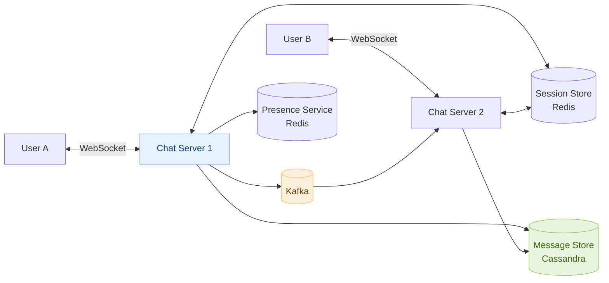
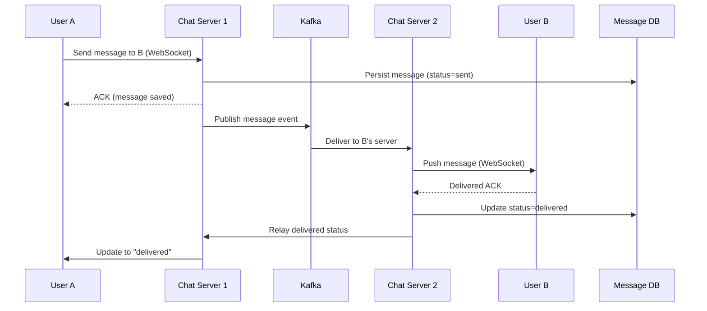

# Day 12 — Word Search & Design Chat System (WhatsApp)

> **30-Day Interview Prep Tracker** | Shobhit Kumar  
> **Date:** ___________  
> **Status:** ⬜ DSA Done | ⬜ System Design Done  
> **Difficulty:** Medium | **Topic:** Backtracking / DFS

---

## Part 1: DSA — Word Search (LeetCode #79)

### Problem Statement

Given an `m x n` grid of characters `board` and a string `word`, return `true` if `word` exists in the grid. The word can be constructed from letters of sequentially adjacent cells (horizontally or vertically). The same cell may not be used more than once.

### Examples

```
Board:
A B C E
S F C S
A D E E

Word = "ABCCED" → true
Word = "SEE"    → true
Word = "ABCB"   → false (can't reuse B)
```

---

### Approach: Backtracking DFS

```java
class Solution {
    public boolean exist(char[][] board, String word) {
        int rows = board.length, cols = board[0].length;
        
        for (int r = 0; r < rows; r++) {
            for (int c = 0; c < cols; c++) {
                if (dfs(board, word, r, c, 0)) return true;
            }
        }
        return false;
    }
    
    private boolean dfs(char[][] board, String word, int r, int c, int idx) {
        if (idx == word.length()) return true;
        if (r < 0 || r >= board.length || c < 0 || c >= board[0].length) return false;
        if (board[r][c] != word.charAt(idx)) return false;
        
        char temp = board[r][c];
        board[r][c] = '#';  // Mark visited
        
        boolean found = dfs(board, word, r+1, c, idx+1) ||
                        dfs(board, word, r-1, c, idx+1) ||
                        dfs(board, word, r, c+1, idx+1) ||
                        dfs(board, word, r, c-1, idx+1);
        
        board[r][c] = temp;  // Restore (backtrack)
        return found;
    }
}
```

### Python Solution

```python
class Solution:
    def exist(self, board: list[list[str]], word: str) -> bool:
        rows, cols = len(board), len(board[0])
        
        def dfs(r, c, idx):
            if idx == len(word): return True
            if r < 0 or r >= rows or c < 0 or c >= cols: return False
            if board[r][c] != word[idx]: return False
            
            temp, board[r][c] = board[r][c], '#'
            found = (dfs(r+1,c,idx+1) or dfs(r-1,c,idx+1) or
                     dfs(r,c+1,idx+1) or dfs(r,c-1,idx+1))
            board[r][c] = temp
            return found
        
        for r in range(rows):
            for c in range(cols):
                if dfs(r, c, 0): return True
        return False
```

### Complexity Analysis

| Metric | Value |
|--------|-------|
| **Time** | O(m × n × 4^L) — L = word length |
| **Space** | O(L) — recursion depth |

---

## Part 2: System Design — Chat System (WhatsApp)

### Requirements Clarification

#### Functional Requirements
- 1:1 messaging
- Group messaging (max 500 members)
- Message status: sent, delivered, read receipts
- Online/offline presence
- Media sharing (images, video)

#### Non-Functional Requirements
- 50M DAU, 100B messages/day
- < 100ms message delivery latency
- Messages stored permanently
- End-to-end encryption

#### Scale Estimation
- 100B messages/day = ~1.15M messages/second
- Average message: 100 bytes → 10TB/day
- Media: additional 100TB/day (larger files)

---

### High-Level Architecture



---

### Message Delivery Flow



---

### Message Storage: Cassandra

```sql
-- Messages table (wide row design — one partition per conversation)
CREATE TABLE messages (
    conversation_id UUID,
    message_id      TIMEUUID,      -- Time-based UUID for ordering
    sender_id       BIGINT,
    content         TEXT,
    media_url       TEXT,
    status          TEXT,
    PRIMARY KEY (conversation_id, message_id)
) WITH CLUSTERING ORDER BY (message_id DESC);

-- One-to-one: conversation_id = hash(min(uid1, uid2), max(uid1, uid2))
-- Group: conversation_id = group UUID
```

**Why Cassandra?**
- Write-optimized (LSM tree)
- Scales linearly with nodes
- Time-series data (messages in order) fits Cassandra's partition + clustering key model

---

### Online Presence

```
When user connects:
  1. WebSocket established with Chat Server
  2. Chat Server registers: Redis SET presence:{userId} = {serverId, timestamp} EX 60

When user disconnects:
  1. Chat Server removes key: Redis DEL presence:{userId}

Heartbeat: Client sends ping every 30s → reset TTL

Checking presence:
  GET presence:{userId}
  → Exists → Online
  → Null → Offline

For group chats: batch check all member presence
```

---

### Push Notifications (Offline Users)

```
If receiver is offline (not connected to any Chat Server):
  1. Chat Server detects no WebSocket connection
  2. Publish to "offline-notifications" Kafka topic
  3. Push Notification Service consumes topic
  4. Sends FCM (Android) or APNs (iOS) push notification
  5. When user opens app → fetches missed messages from DB
```

---

### End-to-End Encryption

```
Signal Protocol (used by WhatsApp):
  - Each client generates public/private key pair
  - Public keys stored on server
  - Message encrypted with recipient's public key client-side
  - Server stores only ciphertext — cannot read messages
  - Perfect Forward Secrecy: new session keys per conversation
```

---

### Interview Discussion Points

1. **How does User A know which Chat Server User B is on?** → Session store (Redis): `userId → chatServerId` mapping
2. **How to handle offline messages?** → Store in DB, deliver when user reconnects; push notification to wake app
3. **How to guarantee message ordering?** → Per-conversation sequence numbers or TIMEUUID monotonic ordering
4. **How does group messaging scale?** → Fan-out: publish once to Kafka, consumers fan out to group members
5. **How to handle media at scale?** → Upload directly to S3 via presigned URL, send URL in message

---

## Daily Checklist

- [ ] Solved Word Search in under 15 minutes
- [ ] Understand backtracking: mark visited, recurse, unmark
- [ ] Wrote solution in both Java and Python
- [ ] Drew chat system architecture from memory
- [ ] Can explain WebSocket vs HTTP for real-time messaging
- [ ] Understand message delivery flow with status updates

---

## My Notes

```
Time taken for DSA: _____ minutes
Time taken for System Design: _____ minutes

What went well:


What to improve:


Key insight I want to remember:


```

---

## Resources

- [LeetCode #79 — Word Search](https://leetcode.com/problems/word-search/)
- [Designing WhatsApp — System Design Interview](https://bytebytego.com/courses/system-design-interview/design-a-chat-system)
- [Signal Protocol](https://signal.org/docs/)

---

> **Tip of the Day:** Backtracking = DFS + undo. The key pattern: modify state → recurse → restore state. This "undo" step is what makes backtracking different from regular DFS.

**Previous:** [Day 11 — 3Sum + Elasticsearch](../DAY-11/day-11-3sum-elasticsearch.md)  
**Next:** [Day 13 — Merge Intervals + API Gateway](../DAY-13/day-13-merge-intervals-api-gateway.md)
