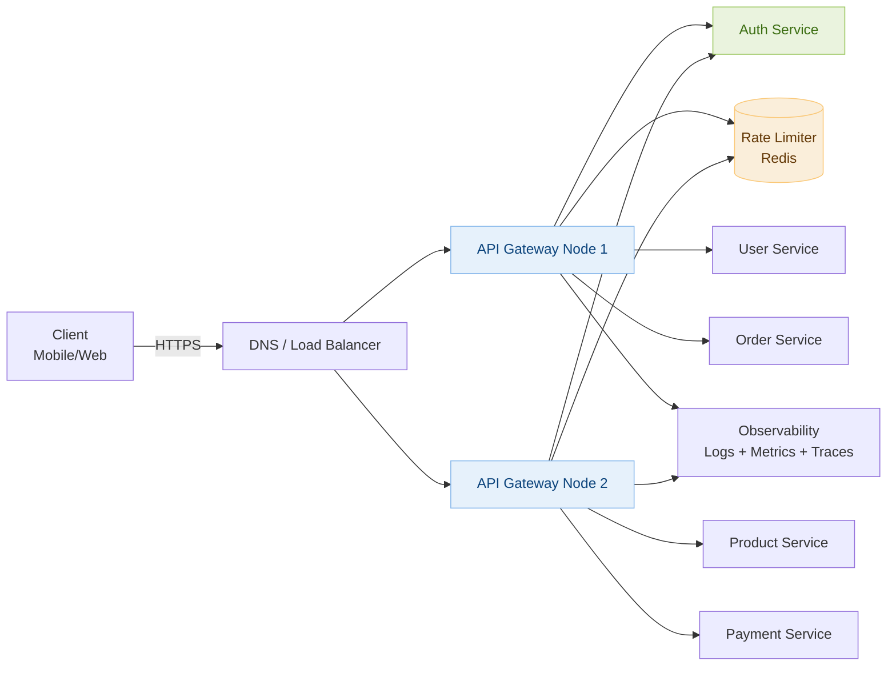
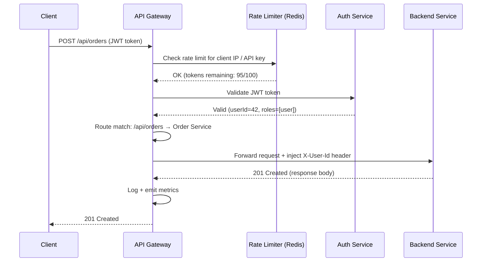

# Day 13 — Merge Intervals & Design an API Gateway

> **30-Day Interview Prep Tracker** | Shobhit Kumar  
> **Date:** ___________  
> **Status:** ⬜ DSA Done | ⬜ System Design Done  
> **Difficulty:** Medium | **Topic:** Sorting / Greedy

---

## Part 1: DSA — Merge Intervals (LeetCode #56)

### Problem Statement

Given an array of `intervals` where `intervals[i] = [start_i, end_i]`, merge all overlapping intervals and return an array of the non-overlapping intervals that cover all the intervals in the input.

### Examples

```
Input:  [[1,3],[2,6],[8,10],[15,18]]
Output: [[1,6],[8,10],[15,18]]
Explanation: [1,3] and [2,6] overlap → merged to [1,6]

Input:  [[1,4],[4,5]]
Output: [[1,5]]
Explanation: Intervals share endpoint 4 — they touch, so merge
```

---

### Approach: Sort + Linear Scan

**Key Insight:** After sorting by start time, two intervals overlap if and only if `current.start <= last_merged.end`. If they overlap, extend the merged interval's end to `max(last.end, current.end)`. Otherwise, push a new interval.

```java
class Solution {
    public int[][] merge(int[][] intervals) {
        Arrays.sort(intervals, (a, b) -> a[0] - b[0]);
        
        List<int[]> merged = new ArrayList<>();
        merged.add(intervals[0]);
        
        for (int i = 1; i < intervals.length; i++) {
            int[] last = merged.get(merged.size() - 1);
            int[] curr = intervals[i];
            
            if (curr[0] <= last[1]) {
                // Overlapping — extend end
                last[1] = Math.max(last[1], curr[1]);
            } else {
                // Non-overlapping — add new interval
                merged.add(curr);
            }
        }
        
        return merged.toArray(new int[merged.size()][]);
    }
}
```

### Python Solution

```python
class Solution:
    def merge(self, intervals: list[list[int]]) -> list[list[int]]:
        intervals.sort(key=lambda x: x[0])
        merged = [intervals[0]]
        
        for start, end in intervals[1:]:
            if start <= merged[-1][1]:
                merged[-1][1] = max(merged[-1][1], end)
            else:
                merged.append([start, end])
        
        return merged
```

### Complexity Analysis

| Metric | Value |
|--------|-------|
| **Time** | O(n log n) — dominated by sort |
| **Space** | O(n) — output list |

### Follow-up: Insert Interval (LeetCode #57)

```python
def insert(self, intervals, newInterval):
    result = []
    i = 0
    
    # Add all intervals that end before newInterval starts
    while i < len(intervals) and intervals[i][1] < newInterval[0]:
        result.append(intervals[i])
        i += 1
    
    # Merge overlapping intervals with newInterval
    while i < len(intervals) and intervals[i][0] <= newInterval[1]:
        newInterval[0] = min(newInterval[0], intervals[i][0])
        newInterval[1] = max(newInterval[1], intervals[i][1])
        i += 1
    result.append(newInterval)
    
    # Add remaining intervals
    result.extend(intervals[i:])
    return result
```

---

## Part 2: System Design — API Gateway

### Requirements Clarification

#### Functional Requirements
- Route incoming API requests to appropriate backend microservices
- Authentication & Authorization (JWT / OAuth 2.0)
- Rate limiting per client / API key
- Request/Response transformation
- SSL termination
- Load balancing

#### Non-Functional Requirements
- Handle 1M+ requests/second
- < 10ms added latency
- 99.99% availability
- Horizontally scalable
- Observability: logging, metrics, tracing

---

### High-Level Architecture



---

### Request Processing Pipeline



---

### Rate Limiting: Token Bucket Algorithm

```
Token Bucket per API key:
  - Bucket capacity: 100 tokens
  - Refill rate: 100 tokens/second

On each request:
  1. SCRIPT in Redis (atomic):
     tokens = GET rate:{apiKey}
     if tokens == null: tokens = CAPACITY
     if tokens < 1: return 429 Too Many Requests
     SET rate:{apiKey} = tokens - 1  EX refill_window
     return ALLOWED

Distributed rate limiting across gateway nodes:
  - All nodes share same Redis cluster
  - Lua script for atomicity (no race conditions)
```

**Alternative algorithms:**

| Algorithm | Pros | Cons |
|-----------|------|------|
| Token Bucket | Allows bursts up to capacity | State to maintain |
| Fixed Window Counter | Simple | Burst at window boundary |
| Sliding Window Log | Accurate | High memory usage |
| Sliding Window Counter | Memory efficient + accurate | Slightly approximate |

---

### Routing & Service Discovery

```
Route Table (stored in config / etcd):

  /api/users/*    → User Service      (round-robin, 3 instances)
  /api/orders/*   → Order Service     (round-robin, 5 instances)
  /api/products/* → Product Service   (round-robin, 4 instances)
  /api/payments/* → Payment Service   (least-connections, 2 instances)

Service Discovery:
  - Services register themselves in Consul / etcd on startup
  - API Gateway polls or subscribes to changes
  - Health checks: remove unhealthy instances automatically
```

---

### Authentication Flow

```
JWT Validation (stateless — preferred for scale):
  1. Client sends: Authorization: Bearer <JWT>
  2. Gateway decodes JWT header → extracts kid (key ID)
  3. Fetches public key from JWKS endpoint (cached in-memory / Redis)
  4. Verifies signature + expiry
  5. Injects claims into downstream headers:
       X-User-Id: 42
       X-User-Roles: user,premium

OAuth 2.0 with opaque tokens:
  1. Gateway calls Auth Service to introspect token
  2. Auth Service checks token store (Redis)
  3. Returns user info
  → Stateful: adds latency (~5ms), but supports instant revocation
```

---

### SSL Termination & Performance

```
SSL Termination at Gateway:
  - Decrypts TLS at the edge
  - Internal traffic is HTTP (or mTLS for zero-trust)
  - Offloads CPU-heavy crypto from backend services

Connection Pooling:
  - Gateway maintains persistent HTTP/2 connections to backend services
  - Avoids TCP handshake overhead per request
  - Multiplexes many requests over one connection

Caching (optional at gateway layer):
  - Cache GET responses with Cache-Control headers
  - Use Redis: key = method + path + query params
  - Drastically reduces backend load for read-heavy APIs
```

---

### Observability

```
Every request generates:

Structured Log:
{
  "timestamp": "2026-04-29T10:23:01Z",
  "request_id": "abc-123",
  "method": "POST",
  "path": "/api/orders",
  "client_ip": "1.2.3.4",
  "user_id": 42,
  "service": "order-service",
  "upstream_latency_ms": 42,
  "gateway_latency_ms": 3,
  "status": 201
}

Metrics (Prometheus):
  - gateway_requests_total (counter, by route/status)
  - gateway_request_duration_seconds (histogram)
  - gateway_rate_limited_total (counter, by api_key)

Distributed Tracing (OpenTelemetry):
  - Inject trace-id into all downstream requests
  - Visualize full request journey in Jaeger / Zipkin
```

---

### Interview Discussion Points

1. **How do you scale the API Gateway itself?** → Stateless nodes behind a load balancer; share state (rate limits, sessions) in Redis
2. **What if Auth Service goes down?** → Circuit breaker: fail open (allow) or fail closed (deny) based on security policy; JWT validation can be done locally without calling Auth Service
3. **How do you handle versioning (v1 vs v2)?** → Path prefix routing (`/v1/` → old service, `/v2/` → new service), or header-based routing
4. **Difference between API Gateway and Load Balancer?** → Load balancer routes by IP/TCP; API Gateway operates at L7 with auth, rate limiting, routing by path/method, transformation
5. **How to prevent a bad deploy from taking down all traffic?** → Canary routing: send 5% of traffic to new version, monitor error rate, gradually increase

---

## Daily Checklist

- [ ] Solved Merge Intervals in under 15 minutes
- [ ] Understand why sorting by start time is the key step
- [ ] Solved Insert Interval follow-up
- [ ] Drew API Gateway architecture from memory
- [ ] Can explain Token Bucket rate limiting with Redis
- [ ] Know the difference between API Gateway and Load Balancer

---

## My Notes

```
Time taken for DSA: _____ minutes
Time taken for System Design: _____ minutes

What went well:


What to improve:


Key insight I want to remember:


```

---

## Resources

- [LeetCode #56 — Merge Intervals](https://leetcode.com/problems/merge-intervals/)
- [LeetCode #57 — Insert Interval](https://leetcode.com/problems/insert-interval/)
- [System Design: API Gateway — ByteByteGo](https://bytebytego.com)
- [Rate Limiting Algorithms Explained](https://konghq.com/blog/how-to-design-a-scalable-rate-limiting-algorithm)

---

> **Tip of the Day:** After sorting, interval problems become a single linear scan. Whenever you see "overlapping ranges," immediately think: sort by start → linear merge.

**Previous:** [Day 12 — Word Search + Chat System](../DAY-12/day-12-word-search-chat-system.md)  
**Next:** [Day 14 — Coin Change + Rate Limiter](../DAY-14/day-14-coin-change-rate-limiter.md)
