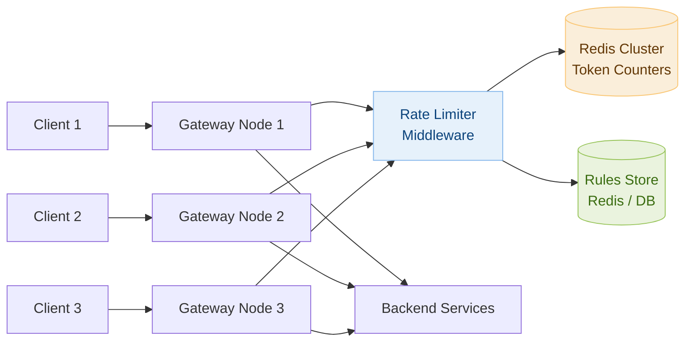
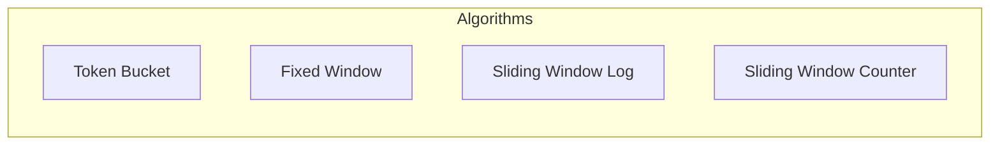

# Day 14 — Coin Change & Design a Rate Limiter

> **30-Day Interview Prep Tracker** | Shobhit Kumar  
> **Date:** ___________  
> **Status:** ⬜ DSA Done | ⬜ System Design Done  
> **Difficulty:** Medium | **Topic:** Dynamic Programming

---

## Part 1: DSA — Coin Change (LeetCode #322)

### Problem Statement

You are given an integer array `coins` representing coin denominations and an integer `amount`. Return the **fewest number of coins** needed to make up that amount. If it cannot be made up by any combination of coins, return `-1`. You may use each coin an unlimited number of times.

### Examples

```
coins = [1, 5, 10, 25], amount = 36
→ 3 coins: 25 + 10 + 1

coins = [1, 5, 6, 9], amount = 11
→ 2 coins: 5 + 6   (greedy would give 3: 9+1+1 — wrong!)

coins = [2], amount = 3
→ -1 (impossible)
```

> The greedy approach (always pick largest coin) **fails** — this needs DP.

---

### Approach: Bottom-Up Dynamic Programming

**Recurrence:** `dp[i] = min(dp[i], dp[i - coin] + 1)` for each coin ≤ i

```
dp[0] = 0        (0 coins needed to make amount 0)
dp[1..amount] = ∞ initially

For amount = 11, coins = [1, 5, 6, 9]:
  dp[0]  = 0
  dp[1]  = dp[0] + 1 = 1
  dp[5]  = dp[0] + 1 = 1
  dp[6]  = min(dp[5]+1, dp[0]+1) = 1
  dp[10] = min(dp[9]+1, dp[5]+1, dp[4]+1) = 2
  dp[11] = min(dp[10]+1, dp[6]+1, dp[5]+1, dp[2]+1) = 2  (dp[5]+1 → 5+6)
```

```java
class Solution {
    public int coinChange(int[] coins, int amount) {
        int[] dp = new int[amount + 1];
        Arrays.fill(dp, amount + 1);   // Infinity sentinel
        dp[0] = 0;
        
        for (int i = 1; i <= amount; i++) {
            for (int coin : coins) {
                if (coin <= i) {
                    dp[i] = Math.min(dp[i], dp[i - coin] + 1);
                }
            }
        }
        
        return dp[amount] > amount ? -1 : dp[amount];
    }
}
```

### Python Solution

```python
class Solution:
    def coinChange(self, coins: list[int], amount: int) -> int:
        dp = [float('inf')] * (amount + 1)
        dp[0] = 0
        
        for i in range(1, amount + 1):
            for coin in coins:
                if coin <= i:
                    dp[i] = min(dp[i], dp[i - coin] + 1)
        
        return dp[amount] if dp[amount] != float('inf') else -1
```

### Complexity Analysis

| Metric | Value |
|--------|-------|
| **Time** | O(amount × len(coins)) |
| **Space** | O(amount) |

### Follow-up: Coin Change II — Count Combinations (LeetCode #518)

```python
# Count distinct combinations (order doesn't matter)
def change(self, amount: int, coins: list[int]) -> int:
    dp = [0] * (amount + 1)
    dp[0] = 1   # one way to make 0: use no coins
    
    for coin in coins:           # outer loop on coins prevents permutations
        for i in range(coin, amount + 1):
            dp[i] += dp[i - coin]
    
    return dp[amount]
```

**Key distinction:** Coin Change I → fewest coins (min). Coin Change II → count of combinations. Outer loop on `coins` vs outer loop on `amount` changes whether you count permutations or combinations.

---

## Part 2: System Design — Distributed Rate Limiter

### Requirements Clarification

#### Functional Requirements
- Limit number of requests per user / API key / IP
- Support multiple rate limit rules (e.g., 100 req/min per user, 1000 req/min per service)
- Return `429 Too Many Requests` with `Retry-After` header when limit exceeded
- Rules configurable without deploying code

#### Non-Functional Requirements
- Works across multiple API Gateway nodes (distributed)
- < 5ms overhead per request
- 99.99% availability — rate limiter failure should not block all traffic
- Eventually consistent is acceptable (slight over-limit is OK)

---

### High-Level Architecture



---

### Algorithm Deep Dive: Sliding Window Counter

**Most practical algorithm for distributed systems — low memory, accurate.**

```
Sliding Window Counter hybrid:
  - Divide time into fixed windows (e.g., 1-minute buckets)
  - Store count for current window + previous window in Redis
  - Estimate current count using weighted overlap

  current_requests = prev_window_count × (1 - elapsed_fraction)
                   + current_window_count

  Example (limit = 100 req/min):
    Previous window: 84 requests
    Current window:  36 requests (so far)
    Elapsed into current window: 25% (15 seconds into 60s window)

    Estimated = 84 × (1 - 0.25) + 36 = 63 + 36 = 99 → ALLOW
    If next request: estimated = 100 → DENY (429)
```

```
Redis Key Design:
  rate:{userId}:{window_start_unix}   → integer counter, TTL = 2 × window_size

  Pipeline (atomic Lua script):
    1. INCR rate:{userId}:{current_window}
    2. EXPIRE rate:{userId}:{current_window} 120
    3. GET rate:{userId}:{prev_window}
    4. Compute sliding estimate
    5. Return ALLOW or DENY
```

---

### Algorithm Comparison



| Algorithm | Memory | Burst Handling | Accuracy | Complexity |
|-----------|--------|----------------|----------|------------|
| Token Bucket | Low | Allows bursts up to capacity | Exact | Medium |
| Fixed Window | Very Low | Burst at boundary (2× limit possible) | Approximate | Simple |
| Sliding Window Log | High (log every request) | Exact throttle | Exact | Complex |
| Sliding Window Counter | Low | Smooth | ~99% accurate | Medium |

> **Production choice:** Sliding Window Counter for general APIs; Token Bucket when bursting is acceptable.

---

### Redis Implementation (Token Bucket)

```lua
-- Lua script for atomic token bucket check (runs as single Redis command)
local key = KEYS[1]
local capacity = tonumber(ARGV[1])
local refill_rate = tonumber(ARGV[2])   -- tokens per second
local now = tonumber(ARGV[3])           -- current timestamp (ms)
local requested = tonumber(ARGV[4])

local bucket = redis.call('HMGET', key, 'tokens', 'last_refill')
local tokens = tonumber(bucket[1]) or capacity
local last_refill = tonumber(bucket[2]) or now

-- Refill tokens based on elapsed time
local elapsed = (now - last_refill) / 1000.0
local new_tokens = math.min(capacity, tokens + elapsed * refill_rate)

if new_tokens >= requested then
    -- Allow request
    redis.call('HMSET', key,
        'tokens', new_tokens - requested,
        'last_refill', now)
    redis.call('EXPIRE', key, math.ceil(capacity / refill_rate) + 1)
    return 1   -- ALLOWED
else
    -- Reject request
    redis.call('HMSET', key, 'tokens', new_tokens, 'last_refill', now)
    redis.call('EXPIRE', key, math.ceil(capacity / refill_rate) + 1)
    return 0   -- DENIED
end
```

---

### Multi-Tier Rate Limiting

```
Tier 1 — IP-level (DDoS protection, fast check):
  Key: rate:ip:{ip}:{window}
  Limit: 1000 req/min per IP

Tier 2 — User-level (authenticated users):
  Key: rate:user:{userId}:{window}
  Limit: 200 req/min per user

Tier 3 — API-key-level (partner integrations):
  Key: rate:key:{apiKey}:{window}
  Limit: configured per key in Rules Store

All tiers checked sequentially — first limit hit returns 429.
```

---

### Rules Store & Dynamic Configuration

```
Rules stored in Redis (fast reads) backed by DB (source of truth):

Rule format:
{
  "id": "user-standard",
  "type": "user",
  "algorithm": "sliding_window_counter",
  "limit": 200,
  "window_seconds": 60,
  "scope": ["POST /api/orders", "PUT /api/orders/*"]
}

Hot reload: Config service publishes to Redis Pub/Sub channel
→ All gateway nodes subscribe and update in-memory rule cache
→ No restart required, rule change propagates in < 1 second
```

---

### Response Headers

```
On every request (whether allowed or denied):
  X-RateLimit-Limit: 100
  X-RateLimit-Remaining: 37
  X-RateLimit-Reset: 1745000000   (Unix timestamp when window resets)

On 429 response:
  HTTP/1.1 429 Too Many Requests
  Retry-After: 23                  (seconds until request allowed)
  X-RateLimit-Limit: 100
  X-RateLimit-Remaining: 0
  Content-Type: application/json

  {"error": "rate_limit_exceeded", "message": "Too many requests. Retry after 23 seconds."}
```

---

### Fault Tolerance

```
What if Redis goes down?

Option A — Fail Open (allow all requests):
  → Traffic continues; brief exposure to abuse
  → Best for user-facing APIs where availability > strict limiting

Option B — Fail Closed (deny all requests):
  → Safe from abuse but user-impacting outage
  → Best for payment/financial APIs

Option C — Local fallback counter (in-memory per node):
  → Each node rate-limits independently with in-process counter
  → Effective limit = node_limit × num_nodes (less accurate)
  → Best balance: maintains service, limits gross abuse

Production approach: Fail open for most APIs + alert on Redis failure.
```

---

### Interview Discussion Points

1. **How do you prevent the "thundering herd" after a rate limit reset?** → Add jitter to the window boundary; use token bucket which refills gradually instead of resetting all at once
2. **How would you rate limit across microservices (not just at gateway)?** → Shared Redis counter; or use a sidecar proxy (Envoy + Redis) at each service
3. **How do you handle distributed counters at extreme scale?** → Redis Cluster with consistent hashing; or accept small inaccuracies with local counters + periodic sync (CRDTs)
4. **How to rate limit streaming / WebSocket connections?** → Limit connection count per user; limit message rate via token bucket checked per message event
5. **How would you exempt certain users (e.g., internal services)?** → Skip rate limit middleware if `X-Internal-Service` header present + verified by mTLS cert

---

## Daily Checklist

- [ ] Solved Coin Change in under 15 minutes
- [ ] Understand why greedy fails — traced through `[1,5,6,9], amount=11` by hand
- [ ] Can explain the DP recurrence from scratch
- [ ] Solved Coin Change II (combinations count)
- [ ] Drew Rate Limiter architecture from memory
- [ ] Can implement Token Bucket in Redis Lua script (at high level)
- [ ] Know the tradeoffs between all 4 rate limiting algorithms

---

## My Notes

```
Time taken for DSA: _____ minutes
Time taken for System Design: _____ minutes

What went well:


What to improve:


Key insight I want to remember:


```

---

## Resources

- [LeetCode #322 — Coin Change](https://leetcode.com/problems/coin-change/)
- [LeetCode #518 — Coin Change II](https://leetcode.com/problems/coin-change-ii/)
- [System Design: Rate Limiter — ByteByteGo](https://bytebytego.com/courses/system-design-interview/design-a-rate-limiter)
- [Stripe Rate Limiting Blog Post](https://stripe.com/blog/rate-limiters)

---

> **Tip of the Day:** In DP, if you want **combinations** (order doesn't matter), iterate coins in the outer loop. If you want **permutations** (order matters), iterate amounts in the outer loop. This single swap changes the entire meaning.

**Previous:** [Day 13 — Merge Intervals + API Gateway](../DAY-13/day-13-merge-intervals-api-gateway.md)  
**Next:** [Day 15 — Top K Frequent Elements + Search Autocomplete](../DAY-15/day-15-top-k-frequent-search-autocomplete.md)
