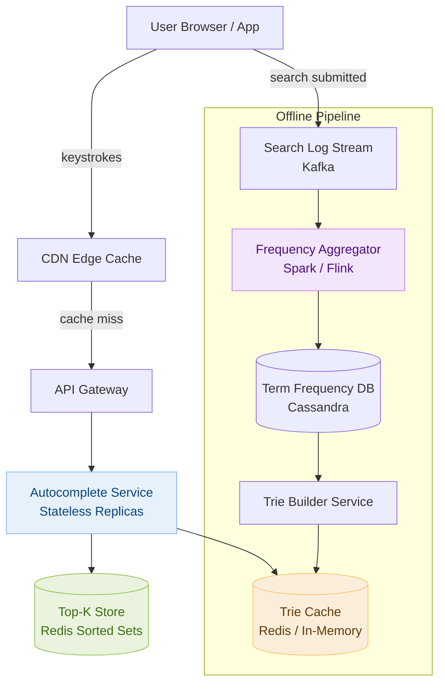

# Day 15 — Top K Frequent Elements & Design a Search Autocomplete System

> **30-Day Interview Prep Tracker** | Shobhit Kumar  
> **Date:** ___________  
> **Status:** ⬜ DSA Done | ⬜ System Design Done  
> **Difficulty:** Medium | **Topic:** Heap / Bucket Sort

---

## Part 1: DSA — Top K Frequent Elements (LeetCode #347)

### Problem Statement

Given an integer array `nums` and an integer `k`, return the `k` most frequent elements. You may return the answer in **any order**.

### Examples

```
nums = [1, 1, 1, 2, 2, 3], k = 2
→ [1, 2]

nums = [1], k = 1
→ [1]

nums = [4, 1, -1, 2, -1, 2, 3], k = 2
→ [-1, 2]  (both appear twice, 4/1/3 appear once)
```

---

### Approach 1: Min-Heap (O(n log k))

**Idea:** Count frequencies, then maintain a min-heap of size k — this keeps the k largest frequencies.

```
Step 1: Count frequencies with a hash map
  {1:3, 2:2, 3:1}

Step 2: Push (freq, num) into a min-heap of size k
  Push (3,1): heap = [(3,1)]
  Push (2,2): heap = [(2,2),(3,1)]
  Push (1,3): heap size = 3 > k=2 → pop min (1,3)
              heap = [(2,2),(3,1)]

Step 3: Extract elements from heap → [2, 1] → [1, 2]
```

```java
class Solution {
    public int[] topKFrequent(int[] nums, int k) {
        Map<Integer, Integer> freq = new HashMap<>();
        for (int n : nums) freq.merge(n, 1, Integer::sum);

        // Min-heap ordered by frequency
        PriorityQueue<int[]> heap = new PriorityQueue<>((a, b) -> a[0] - b[0]);

        for (Map.Entry<Integer, Integer> e : freq.entrySet()) {
            heap.offer(new int[]{e.getValue(), e.getKey()});
            if (heap.size() > k) heap.poll();
        }

        int[] result = new int[k];
        for (int i = k - 1; i >= 0; i--) result[i] = heap.poll()[1];
        return result;
    }
}
```

### Python Solution

```python
import heapq
from collections import Counter

class Solution:
    def topKFrequent(self, nums: list[int], k: int) -> list[int]:
        freq = Counter(nums)
        # heapq.nlargest is O(n log k) — exactly what we want
        return heapq.nlargest(k, freq.keys(), key=freq.get)
```

---

### Approach 2: Bucket Sort (O(n)) — Optimal

**Key insight:** Frequency can be at most `n` (if all elements are the same). Create `n+1` buckets indexed by frequency.

```
nums = [1,1,1,2,2,3], k = 2
freq = {1:3, 2:2, 3:1}

Buckets (index = frequency):
  bucket[1] = [3]
  bucket[2] = [2]
  bucket[3] = [1]

Scan from high → low, collect k elements:
  bucket[3] → take [1]   (1 element, need 1 more)
  bucket[2] → take [2]   (done)
  Result: [1, 2]
```

```java
class Solution {
    public int[] topKFrequent(int[] nums, int k) {
        Map<Integer, Integer> freq = new HashMap<>();
        for (int n : nums) freq.merge(n, 1, Integer::sum);

        List<Integer>[] bucket = new List[nums.length + 1];
        for (Map.Entry<Integer, Integer> e : freq.entrySet()) {
            int f = e.getValue();
            if (bucket[f] == null) bucket[f] = new ArrayList<>();
            bucket[f].add(e.getKey());
        }

        List<Integer> result = new ArrayList<>();
        for (int f = bucket.length - 1; f >= 0 && result.size() < k; f--) {
            if (bucket[f] != null) result.addAll(bucket[f]);
        }
        return result.stream().mapToInt(i -> i).toArray();
    }
}
```

```python
class Solution:
    def topKFrequent(self, nums: list[int], k: int) -> list[int]:
        freq = {}
        for n in nums:
            freq[n] = freq.get(n, 0) + 1

        bucket = [[] for _ in range(len(nums) + 1)]
        for num, count in freq.items():
            bucket[count].append(num)

        result = []
        for f in range(len(bucket) - 1, 0, -1):
            result.extend(bucket[f])
            if len(result) >= k:
                return result[:k]
        return result
```

### Complexity Analysis

| Approach | Time | Space |
|----------|------|-------|
| Min-Heap | O(n log k) | O(n + k) |
| Bucket Sort | O(n) | O(n) |

### Related Problems

- **LeetCode #692** — Top K Frequent Words (same idea, string keys + lexicographic tiebreaker)
- **LeetCode #973** — K Closest Points to Origin (heap on distance)
- **LeetCode #215** — Kth Largest Element (quickselect)

> **Pattern:** Whenever you see "top K" + frequency/score, reach for a min-heap of size k or bucket sort if the score is bounded.

---

## Part 2: System Design — Search Autocomplete System

### Requirements Clarification

#### Functional Requirements
- As a user types, show top 5 search suggestions in real time
- Suggestions ranked by historical search frequency
- Support for prefix-based matching (type "app" → "apple", "application", "appstore")
- Results update as user types each character

#### Non-Functional Requirements
- Latency: < 100ms end-to-end (ideally < 50ms)
- Scale: 10M DAU, ~10 queries/user/day = 100M searches/day ≈ 1200 QPS (peak ~5000 QPS)
- Availability: 99.9% uptime
- Freshness: trending terms reflected within minutes

---

### High-Level Architecture



---

### Core Data Structure: Trie with Cached Top-K

**Naive trie** — store all matching words at each node. **Problem:** DFS on every prefix is too slow for < 50ms.

**Optimized trie** — store the top-K (k=5) suggestions at every node, precomputed.

```
Trie node for prefix "ap":
  children: {'p': node_app, 'e': node_ape, ...}
  top5: ["apple:9823", "app:8741", "application:7200",
          "appstore:6100", "apex:4300"]

When user types "ap" → instantly return node["ap"].top5
No traversal needed — O(L) where L = prefix length
```

```python
class TrieNode:
    def __init__(self):
        self.children = {}
        self.top5 = []   # list of (frequency, term), max 5

class Trie:
    def __init__(self):
        self.root = TrieNode()

    def insert(self, term: str, freq: int):
        node = self.root
        for ch in term:
            if ch not in node.children:
                node.children[ch] = TrieNode()
            node = node.children[ch]
            self._update_top5(node, (freq, term))

    def _update_top5(self, node: TrieNode, entry: tuple):
        node.top5.append(entry)
        node.top5.sort(reverse=True)
        node.top5 = node.top5[:5]

    def search(self, prefix: str) -> list[str]:
        node = self.root
        for ch in prefix:
            if ch not in node.children:
                return []
            node = node.children[ch]
        return [term for freq, term in node.top5]
```

---

### Redis Sorted Set — Real-Time Trending

For trending terms that change faster than the offline trie rebuild cycle:

```
Key: autocomplete:{prefix}
Type: Redis Sorted Set (score = frequency)

ZADD autocomplete:ap 9823 "apple"
ZADD autocomplete:ap 8741 "app"
ZADD autocomplete:ap 7200 "application"

Query:
  ZREVRANGE autocomplete:ap 0 4 WITHSCORES
  → ["apple", "9823", "app", "8741", ...]

Increment on search:
  ZINCRBY autocomplete:ap 1 "apple"
  Also update all prefixes: "a", "ap", "app", "appl", "apple"
  → O(L) writes per search, L = term length
```

**Problem:** `ZINCRBY` on every search at 5000 QPS is too expensive.  
**Solution:** Aggregate locally in memory (count by prefix), flush to Redis every 30s.

---

### Data Flow

```
Query Path (hot path, must be < 50ms):
  1. User types "app"
  2. Browser → CDN (cache hit for common prefixes: ~70% hit rate)
  3. CDN miss → API Gateway → Autocomplete Service
  4. Service looks up Redis Sorted Set for "app"
  5. Returns top-5 JSON: ["apple","app","application","appstore","applet"]
  Total: ~15-30ms

Update Path (offline, async):
  1. User submits search "appstore"
  2. Logged to Kafka topic "search-events"
  3. Spark Streaming aggregates counts every 10 minutes
  4. Writes updated frequencies to Cassandra
  5. Trie Builder Service reads Cassandra diff, rebuilds trie shards
  6. New trie deployed to Autocomplete Service nodes (blue/green swap)
  7. Lag: ~10-20 minutes for trending terms to appear
```

---

### Partitioning the Trie

A single trie won't fit or scale — partition by first-letter prefix:

```
Shard 0: a–f  →  Autocomplete Node Group 0
Shard 1: g–m  →  Autocomplete Node Group 1
Shard 2: n–s  →  Autocomplete Node Group 2
Shard 3: t–z  →  Autocomplete Node Group 3

API Gateway routes by first character of prefix:
  "app" → Shard 0
  "netflix" → Shard 1
  "react" → Shard 2

Each shard held in memory per node (~4GB for English dictionary with top-K)
```

---

### Handling Special Cases

```
1. New / trending terms (not yet in trie):
   → Real-time Redis sorted sets bridge the gap until trie rebuild

2. Typo tolerance / fuzzy matching:
   → Keep exact prefix trie for speed; add Elasticsearch for fuzzy
   → Show trie results first, async fetch fuzzy results separately

3. Personalization:
   → Global trie gives generic top-5
   → Re-rank using user history stored in user profile service
   → Blend: score = 0.7 × global_freq + 0.3 × user_affinity

4. Regional / language support:
   → Separate trie per region/language
   → Route by Accept-Language header

5. Banned / sensitive terms:
   → Blocklist filter applied after trie lookup (fast set membership check)
```

---

### CDN Caching Strategy

```
Cache key: GET /autocomplete?q={prefix}

Cache rules:
  - Short prefixes (1-3 chars): TTL = 5 minutes   (high traffic, changes slowly)
  - Longer prefixes (4+ chars): TTL = 60 seconds   (lower traffic, more dynamic)
  - Cache-Control: public, max-age=60, stale-while-revalidate=30

Why this works: ~70% of autocomplete queries are for the same
short prefixes (power law distribution over search terms)
→ CDN absorbs most load before hitting origin
```

---

### Interview Discussion Points

1. **How do you keep suggestions fresh for trending topics?** → Real-time Redis sorted sets updated every 30s; offline trie rebuilt every 10–15 min via Spark
2. **What if a user types very fast — how do you avoid too many API calls?** → Debounce on the client (only fire request if no keystroke for 100ms); cancel in-flight requests when a new keystroke arrives
3. **How would you add personalized suggestions?** → Re-rank global results with user history vector; keep personalization logic server-side to protect privacy
4. **How do you handle the "banana problem" (prefix "b" matches billions of terms)?** → Depth limit: only store top-K at each node — bounded regardless of matches; K=5 means only 5 results ever returned
5. **How would you support multiple languages?** → Unicode-normalized trie per locale; route at API Gateway by detected locale

---

## Daily Checklist

- [ ] Solved Top K Frequent Elements using both heap and bucket sort
- [ ] Can explain why bucket sort is O(n) and when to prefer it over heap
- [ ] Know when to use min-heap vs max-heap for "top K" problems
- [ ] Drew the Autocomplete architecture from memory
- [ ] Can explain why top-K is cached at every trie node (not computed on query)
- [ ] Understand the offline vs real-time pipeline tradeoff
- [ ] Solved LeetCode #692 (Top K Frequent Words) as a follow-up

---

## My Notes

```
Time taken for DSA: _____ minutes
Time taken for System Design: _____ minutes

What went well:


What to improve:


Key insight I want to remember:


```

---

## Resources

- [LeetCode #347 — Top K Frequent Elements](https://leetcode.com/problems/top-k-frequent-elements/)
- [LeetCode #692 — Top K Frequent Words](https://leetcode.com/problems/top-k-frequent-words/)
- [System Design: Typeahead — ByteByteGo](https://bytebytego.com/courses/system-design-interview/design-a-search-autocomplete-system)
- [Tries Explained — NeetCode](https://www.youtube.com/watch?v=oobqoCJlHA0)

---

> **Tip of the Day:** For "top K" problems, a min-heap of size k is almost always the right tool. If the score range is bounded (e.g., frequency ≤ n), bucket sort beats it with O(n). The heap wins when the score is unbounded (distances, timestamps, arbitrary weights).

**Previous:** [Day 14 — Coin Change + Rate Limiter](../DAY-14/day-14-coin-change-rate-limiter.md)  
**Next:** [Day 16 — Binary Search + Design a URL Shortener](../DAY-16/day-16-binary-search-url-shortener.md)
