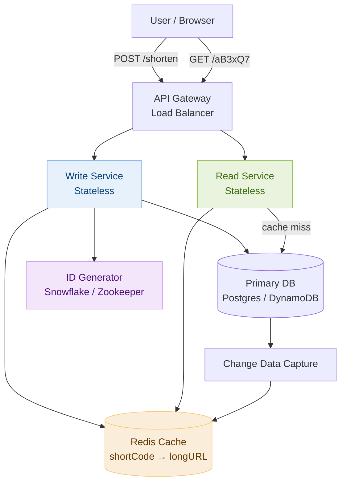

# Day 16 — Binary Search & Design a URL Shortener

> **30-Day Interview Prep Tracker** | Shobhit Kumar  
> **Date:** ___________  
> **Status:** ⬜ DSA Done | ⬜ System Design Done  
> **Difficulty:** Medium | **Topic:** Binary Search

---

## Part 1: DSA — Binary Search Variants (LeetCode #704, #33, #153)

### Core Template

Binary search is not just for sorted arrays — it applies whenever you can answer "is my answer ≥ X?" in O(1) or O(n), turning an O(n²) brute force into O(n log n).

```
Invariant:  answer is always in [lo, hi]
Loop exit:  lo == hi  (or lo > hi for the standard find-or-fail form)
```

```java
// Standard template — find exact target
int binarySearch(int[] nums, int target) {
    int lo = 0, hi = nums.length - 1;
    while (lo <= hi) {
        int mid = lo + (hi - lo) / 2;   // avoids integer overflow
        if (nums[mid] == target) return mid;
        else if (nums[mid] < target) lo = mid + 1;
        else hi = mid - 1;
    }
    return -1;
}
```

> **Why `lo + (hi - lo) / 2` instead of `(lo + hi) / 2`?**  
> `lo + hi` can overflow a 32-bit integer when both are near `Integer.MAX_VALUE`. Always use the safe form.

---

### Variant 1: Find First / Last Position (LeetCode #34)

```
nums = [5, 7, 7, 8, 8, 10], target = 8
→ [3, 4]

Find first occurrence: bias search LEFT (hi = mid - 1 when found)
Find last  occurrence: bias search RIGHT (lo = mid + 1 when found)
```

```java
int[] searchRange(int[] nums, int target) {
    return new int[]{findFirst(nums, target), findLast(nums, target)};
}

int findFirst(int[] nums, int target) {
    int lo = 0, hi = nums.length - 1, result = -1;
    while (lo <= hi) {
        int mid = lo + (hi - lo) / 2;
        if (nums[mid] == target) { result = mid; hi = mid - 1; }  // keep searching left
        else if (nums[mid] < target) lo = mid + 1;
        else hi = mid - 1;
    }
    return result;
}

int findLast(int[] nums, int target) {
    int lo = 0, hi = nums.length - 1, result = -1;
    while (lo <= hi) {
        int mid = lo + (hi - lo) / 2;
        if (nums[mid] == target) { result = mid; lo = mid + 1; }  // keep searching right
        else if (nums[mid] < target) lo = mid + 1;
        else hi = mid - 1;
    }
    return result;
}
```

---

### Variant 2: Search in Rotated Sorted Array (LeetCode #33)

```
Original:  [0, 1, 2, 4, 5, 6, 7]
Rotated:   [4, 5, 6, 7, 0, 1, 2]  ← pivot at index 4

Key insight: one half of a rotated array is always sorted.
Determine which half is sorted, then decide which half to search.
```

```java
int search(int[] nums, int target) {
    int lo = 0, hi = nums.length - 1;
    while (lo <= hi) {
        int mid = lo + (hi - lo) / 2;
        if (nums[mid] == target) return mid;

        if (nums[lo] <= nums[mid]) {       // left half is sorted
            if (nums[lo] <= target && target < nums[mid])
                hi = mid - 1;              // target in sorted left half
            else
                lo = mid + 1;
        } else {                           // right half is sorted
            if (nums[mid] < target && target <= nums[hi])
                lo = mid + 1;              // target in sorted right half
            else
                hi = mid - 1;
        }
    }
    return -1;
}
```

```python
def search(nums: list[int], target: int) -> int:
    lo, hi = 0, len(nums) - 1
    while lo <= hi:
        mid = (lo + hi) // 2
        if nums[mid] == target:
            return mid
        if nums[lo] <= nums[mid]:          # left half sorted
            if nums[lo] <= target < nums[mid]:
                hi = mid - 1
            else:
                lo = mid + 1
        else:                              # right half sorted
            if nums[mid] < target <= nums[hi]:
                lo = mid + 1
            else:
                hi = mid - 1
    return -1
```

---

### Variant 3: Find Minimum in Rotated Array (LeetCode #153)

```
nums = [3, 4, 5, 1, 2]
→ minimum = 1

The minimum is always on the "boundary" — where the sorted order breaks.
If nums[mid] > nums[hi], the minimum is in the right half.
Otherwise, minimum is in the left half (including mid).
```

```java
int findMin(int[] nums) {
    int lo = 0, hi = nums.length - 1;
    while (lo < hi) {
        int mid = lo + (hi - lo) / 2;
        if (nums[mid] > nums[hi]) lo = mid + 1;  // min in right half
        else hi = mid;                            // min in left half (including mid)
    }
    return nums[lo];
}
```

---

### Variant 4: Binary Search on Answer (LeetCode #875 — Koko Eating Bananas)

**The most powerful pattern: binary search over a monotonic decision function.**

```
Problem: n piles of bananas, h hours. Find minimum eating speed k such that
  Koko can finish all bananas in ≤ h hours.

Decision function: canFinish(k) → true if sum(ceil(pile/k) for each pile) ≤ h
  This is monotone: if k works, k+1 also works.

Search space: k ∈ [1, max(piles)]
→ Binary search over k, check canFinish each time.
```

```python
import math

def minEatingSpeed(piles: list[int], h: int) -> int:
    lo, hi = 1, max(piles)

    while lo < hi:
        mid = (lo + hi) // 2
        hours = sum(math.ceil(p / mid) for p in piles)
        if hours <= h:
            hi = mid      # mid works, try smaller
        else:
            lo = mid + 1  # mid too slow, need faster

    return lo
```

> **Template for binary search on answer:**
> 1. Define the monotone predicate (true/false boundary)
> 2. Set search space `[lo, hi]`
> 3. When predicate is true, go left (`hi = mid`); when false, go right (`lo = mid + 1`)
> 4. Loop until `lo == hi`; answer is `lo`

### Complexity Analysis

| Problem | Time | Space |
|---------|------|-------|
| Standard Binary Search | O(log n) | O(1) |
| First / Last Position | O(log n) | O(1) |
| Rotated Array Search | O(log n) | O(1) |
| Binary Search on Answer | O(n log W) — W = answer range | O(1) |

---

## Part 2: System Design — URL Shortener (TinyURL / bit.ly)

### Requirements Clarification

#### Functional Requirements
- Given a long URL, generate a short URL (e.g., `short.ly/aB3xQ7`)
- Redirect short URL to the original long URL
- Short URLs should be unique; same long URL may get different short codes
- Optional: custom aliases (`short.ly/my-blog`)
- Optional: expiration support

#### Non-Functional Requirements
- Scale: 100M URLs created/day write, 10B redirects/day read → read:write = 100:1
- Latency: redirect < 10ms (user experience critical)
- Availability: 99.99% — a broken redirect is user-visible
- Short code length: 7 characters from [a-z A-Z 0-9] = 62^7 ≈ 3.5 trillion codes (enough)

---

### High-Level Architecture



---

### Short Code Generation: Base62 Encoding

**Approach: Auto-increment ID → Base62 encode**

```
Global ID generator produces unique 64-bit integer: 12345678

Base62 encode (digits + lower + upper):
  12345678 in base 62:
  12345678 ÷ 62 = 199123 remainder 12 → 'C'
  199123   ÷ 62 = 3211   remainder 41 → 'p'
  3211     ÷ 62 = 51      remainder 49 → 'x'
  51       ÷ 62 = 0       remainder 51 → 'z'
  Result (reversed): "zxpC" — pad to 7 chars → "000zxpC"

Why base62? 62^7 ≈ 3.5 trillion — enough for ~10M URLs/day for ~1000 years
```

```python
BASE62 = "0123456789abcdefghijklmnopqrstuvwxyzABCDEFGHIJKLMNOPQRSTUVWXYZ"

def encode(num: int) -> str:
    if num == 0:
        return BASE62[0]
    chars = []
    while num:
        chars.append(BASE62[num % 62])
        num //= 62
    return ''.join(reversed(chars)).zfill(7)

def decode(short: str) -> int:
    result = 0
    for ch in short:
        result = result * 62 + BASE62.index(ch)
    return result
```

---

### ID Generator: Snowflake

To avoid a single DB auto-increment becoming a bottleneck at 100M writes/day:

```
Snowflake ID (64-bit):
  [ 1 bit sign | 41 bits timestamp ms | 10 bits machine ID | 12 bits sequence ]

  41-bit timestamp: ~69 years from epoch before rollover
  10-bit machine ID: up to 1024 ID generator nodes
  12-bit sequence: 4096 IDs per millisecond per node
  Total: 4096 × 1024 = 4M IDs/ms = 4B IDs/second — far beyond our need

Benefits:
  - No coordination needed between generator nodes
  - IDs are roughly time-ordered (good for DB range scans)
  - No single point of failure
```

---

### Database Schema

```sql
CREATE TABLE urls (
    id          BIGINT PRIMARY KEY,        -- Snowflake ID
    short_code  VARCHAR(7)  NOT NULL UNIQUE,
    long_url    TEXT        NOT NULL,
    user_id     BIGINT,
    created_at  TIMESTAMP   DEFAULT NOW(),
    expires_at  TIMESTAMP,
    click_count BIGINT      DEFAULT 0      -- updated async via Kafka
);

CREATE INDEX idx_short_code ON urls(short_code);
CREATE INDEX idx_user_id    ON urls(user_id);
```

---

### Read Path: Redirect Flow

```
GET /aB3xQ7

1. API Gateway routes to Read Service (stateless, 10s of replicas)
2. Read Service checks Redis cache: GET shortCode:aB3xQ7
   Cache HIT  → return HTTP 301/302 with Location header (< 5ms)
   Cache MISS → query Postgres: SELECT long_url FROM urls WHERE short_code = 'aB3xQ7'
              → set Redis: SET shortCode:aB3xQ7 {longURL} EX 86400
              → return redirect

HTTP 301 Permanent vs HTTP 302 Temporary:
  301: browser caches redirect locally — fewer hits to our servers but we lose analytics
  302: browser always asks us — we log every click, accurate analytics
  Production: 302 (analytics wins), with CDN caching at edge for hot links
```

---

### Write Path: URL Shortening

```
POST /shorten
Body: { "url": "https://example.com/very/long/path?q=..." }

1. Validate URL (scheme check, domain blocklist, malware scan)
2. Check if long_url already shortened for this user (optional dedup):
   SELECT short_code FROM urls WHERE long_url = ? AND user_id = ?
3. Generate Snowflake ID → Base62 encode → short_code
4. INSERT INTO urls (id, short_code, long_url, user_id, created_at)
5. Write to Redis cache (warm it immediately)
6. Return: { "short_url": "https://short.ly/aB3xQ7" }
```

---

### Cache Design

```
Cache tier: Redis Cluster (read-heavy, 100:1 read:write ratio)

Key: shortCode:{code}   Value: {longURL}
TTL: 24 hours for cold codes, no expiry for hot codes (refresh on access)

Eviction: LRU — popular codes stay warm, stale ones evict

Cache size estimate:
  Hot codes (top 20% drive 80% of traffic):
  10B redirects/day × 20% = 2B unique short codes visited
  Each entry: 7 bytes (key) + ~200 bytes (URL) ≈ 207 bytes
  Cache top 10M codes: 10M × 207B ≈ 2GB  ← fits on a single Redis node

Warm-up: on service restart, pre-load top 10K codes from DB.
```

---

### Analytics: Click Tracking

```
Do NOT write to DB on every redirect (100K writes/sec at peak).

Async approach:
  1. Read Service publishes click event to Kafka:
     { short_code: "aB3xQ7", timestamp: ..., ip: ..., referrer: ... }
  2. Kafka consumer (Flink / Spark Streaming) aggregates counts
  3. Writes aggregated counts to Cassandra (time-series optimized)
  4. Dashboard reads from Cassandra (not hot DB path)

Result: zero write amplification on the redirect hot path.
```

---

### Handling Edge Cases

```
1. Duplicate long URLs:
   → By default, generate a new short code each time (simpler, no lookup)
   → If deduplication needed: hash long URL, lookup by hash before inserting

2. Custom aliases ("short.ly/my-blog"):
   → User provides desired code; check uniqueness in DB
   → If taken, return 409 Conflict with suggestion

3. Expired URLs:
   → Background job scans for expires_at < NOW() and deletes (soft-delete first)
   → On redirect: check expires_at in cache; if expired return 410 Gone

4. Malicious URLs:
   → Blocklist checked at write time (safe browsing API)
   → Flag for re-scan if reported; redirect to warning page instead of direct redirect

5. Hotlink abuse (one short URL hit by bots at 100K rps):
   → Rate limit per short_code at API Gateway
   → CDN absorbs most traffic for static redirects (301-cached)
```

---

### Interview Discussion Points

1. **Why not just use MD5 of the long URL as the short code?** → MD5 is 128 bits, base62-encoded = 22 chars (too long). Collisions exist but rare; you'd need collision resolution. Auto-increment + Base62 is cleaner and guarantees uniqueness.
2. **How would you scale writes to 100M/day?** → Snowflake ID generation (no coordination), sharded DB, async writes with Kafka buffer
3. **How do you prevent short code enumeration (guessing valid codes)?** → 62^7 = 3.5T codes; only a fraction are used. For sensitive links, add a random salt or use 9-char codes (62^9 ≈ 13 quadrillion)
4. **What happens if the ID generator node crashes?** → Each Snowflake node has a stable machine ID (from Zookeeper). On restart it resumes from the next millisecond. At worst, 12-bit sequence counter resets — safe as long as clock doesn't go backwards
5. **How would you support QR code generation for each short URL?** → Generate QR at write time, store in S3; return S3 URL alongside short URL. Lazy-generate on first request and cache in S3.

---

## Daily Checklist

- [ ] Solved LeetCode #704 (standard binary search) in < 5 minutes
- [ ] Solved LeetCode #33 (rotated array search) — traced through both halves manually
- [ ] Solved LeetCode #153 (find minimum in rotated array)
- [ ] Solved LeetCode #875 (Koko bananas) using binary search on answer
- [ ] Drew URL shortener architecture from memory
- [ ] Can implement Base62 encode/decode without looking it up
- [ ] Know the difference between 301 and 302 redirects and when to use each
- [ ] Understand why Snowflake IDs avoid coordination overhead

---

## My Notes

```
Time taken for DSA: _____ minutes
Time taken for System Design: _____ minutes

What went well:


What to improve:


Key insight I want to remember:


```

---

## Resources

- [LeetCode #704 — Binary Search](https://leetcode.com/problems/binary-search/)
- [LeetCode #33 — Search in Rotated Sorted Array](https://leetcode.com/problems/search-in-rotated-sorted-array/)
- [LeetCode #153 — Find Minimum in Rotated Sorted Array](https://leetcode.com/problems/find-minimum-in-rotated-sorted-array/)
- [LeetCode #875 — Koko Eating Bananas](https://leetcode.com/problems/koko-eating-bananas/)
- [System Design: URL Shortener — ByteByteGo](https://bytebytego.com/courses/system-design-interview/design-a-url-shortener)
- [Snowflake ID — Twitter Engineering Blog](https://blog.twitter.com/engineering/en_us/a/2010/announcing-snowflake)

---

> **Tip of the Day:** Binary search isn't just for sorted arrays — it works on any **monotone function**. If you can define a predicate `f(x)` that is false for all x < answer and true for all x ≥ answer (or vice versa), binary search finds the boundary in O(log W) where W is the search space size.

**Previous:** [Day 15 — Top K Frequent Elements + Search Autocomplete](../DAY-15/day-15-top-k-frequent-search-autocomplete.md)  
**Next:** [Day 17 — Linked List Cycle + Design a Notification System](../DAY-17/day-17-linked-list-cycle-notification-system.md)
