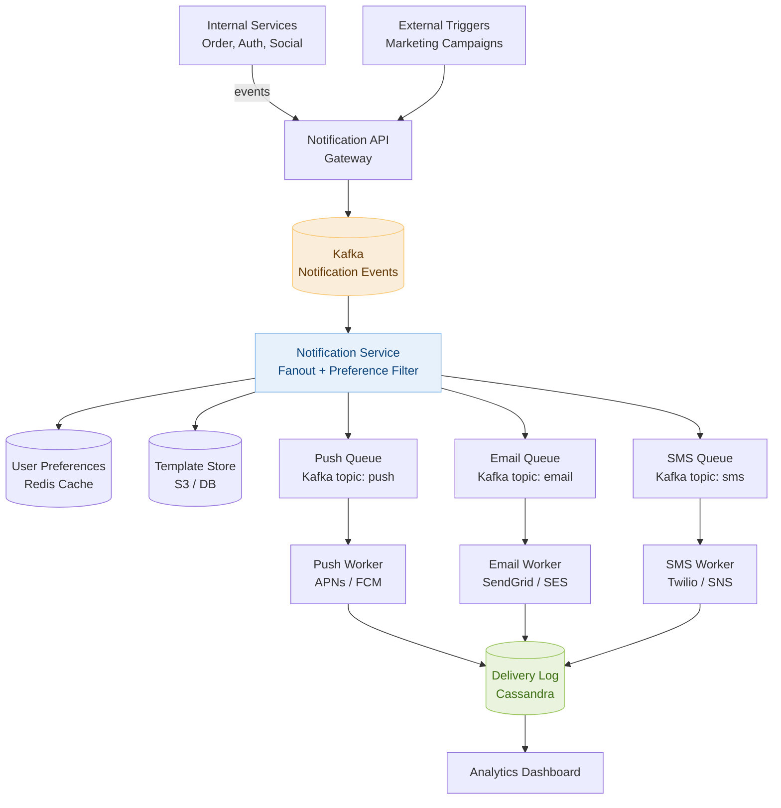

# Day 17 — Linked List Cycle & Design a Notification System

> **30-Day Interview Prep Tracker** | Shobhit Kumar  
> **Date:** ___________  
> **Status:** ⬜ DSA Done | ⬜ System Design Done  
> **Difficulty:** Medium | **Topic:** Two Pointers / Linked List

---

## Part 1: DSA — Linked List Cycle (LeetCode #141, #142)

### Problem Statement

**Part I (#141):** Given the head of a linked list, determine if the list contains a cycle. Return `true` if there is a cycle, `false` otherwise.

**Part II (#142):** If a cycle exists, return the **node where the cycle begins**. Return `null` if no cycle.

### Examples

```
List: 3 → 1 → 0 → -4 ─┐
               ↑_________|   (tail connects back to node at index 1)

#141 → true
#142 → node with value 1 (index 1)

List: 1 → 2 → null
#141 → false
#142 → null
```

---

### Approach: Floyd's Cycle Detection (Tortoise & Hare)

**Core idea:** Use two pointers — `slow` moves 1 step, `fast` moves 2 steps.
- If there is a cycle, fast eventually laps slow and they meet inside the cycle.
- If no cycle, fast reaches `null`.

```
Phase 1 — Detect cycle:
  slow = head, fast = head
  Each step: slow = slow.next, fast = fast.next.next
  If slow == fast → cycle exists (they meet somewhere inside the cycle)

Phase 2 — Find cycle entry (LeetCode #142):
  After meeting point, reset one pointer to head.
  Move BOTH pointers one step at a time.
  They meet again exactly at the cycle start node.

Why? (Math proof):
  Let F = distance from head to cycle start
  Let C = cycle length
  Let a = distance from cycle start to meeting point

  When they meet: slow traveled F + a
                  fast traveled F + a + n×C  (fast did n extra laps)
  fast = 2 × slow → F + a + n×C = 2(F + a)
                  → F = n×C - a
                  → F = distance from meeting point back to cycle start

  So moving one pointer from head and one from meeting point,
  both one step at a time, they meet exactly at the cycle entry.
```

```
Example trace: 0 → 1 → 2 → 3 → 4 ─┐
                        ↑___________|   (cycle start at index 2)

Step 0: slow=0, fast=0
Step 1: slow=1, fast=2
Step 2: slow=2, fast=4
Step 3: slow=3, fast=3  ← MEET (inside cycle at node 3)

Phase 2:
  ptr1 = head (node 0), ptr2 = node 3
  Step 1: ptr1=1, ptr2=4
  Step 2: ptr1=2, ptr2=2  ← MEET = cycle start ✓
```

```java
public class Solution {
    // #141 — Detect cycle
    public boolean hasCycle(ListNode head) {
        ListNode slow = head, fast = head;
        while (fast != null && fast.next != null) {
            slow = slow.next;
            fast = fast.next.next;
            if (slow == fast) return true;
        }
        return false;
    }

    // #142 — Find cycle start
    public ListNode detectCycle(ListNode head) {
        ListNode slow = head, fast = head;

        // Phase 1: find meeting point
        while (fast != null && fast.next != null) {
            slow = slow.next;
            fast = fast.next.next;
            if (slow == fast) break;
        }
        if (fast == null || fast.next == null) return null;  // no cycle

        // Phase 2: find cycle entry
        ListNode ptr = head;
        while (ptr != slow) {
            ptr = ptr.next;
            slow = slow.next;
        }
        return ptr;
    }
}
```

```python
class Solution:
    def hasCycle(self, head) -> bool:
        slow = fast = head
        while fast and fast.next:
            slow = slow.next
            fast = fast.next.next
            if slow is fast:
                return True
        return False

    def detectCycle(self, head):
        slow = fast = head
        while fast and fast.next:
            slow = slow.next
            fast = fast.next.next
            if slow is fast:
                break
        else:
            return None   # no cycle

        ptr = head
        while ptr is not slow:
            ptr = ptr.next
            slow = slow.next
        return ptr
```

### Complexity Analysis

| Metric | Value |
|--------|-------|
| **Time** | O(n) — at most 2 passes |
| **Space** | O(1) — no extra data structures |

---

### Related Problems

- **LeetCode #876** — Middle of the Linked List (slow/fast pointer; slow lands at middle when fast hits end)
- **LeetCode #234** — Palindrome Linked List (find middle, reverse second half, compare)
- **LeetCode #287** — Find the Duplicate Number (array as implicit linked list; same Floyd's algorithm)

> **Pattern:** Any time you need to detect a period/cycle or find a midpoint in a sequence without extra memory, reach for the slow/fast pointer (tortoise & hare) technique.

---

### Variant: Find Duplicate Number (LeetCode #287)

```
nums = [1, 3, 4, 2, 2]
Treat array as a linked list: index → nums[index]
  0→1, 1→3, 3→2, 2→4, 4→2 ← cycle starts at 2 (the duplicate)

Apply Floyd's on this implicit linked list:
  slow = nums[slow], fast = nums[nums[fast]]
  Find meeting point → reset one to 0 → advance both by 1 → entry = duplicate
```

```python
def findDuplicate(nums: list[int]) -> int:
    slow = fast = 0
    while True:
        slow = nums[slow]
        fast = nums[nums[fast]]
        if slow == fast:
            break

    slow = 0
    while slow != fast:
        slow = nums[slow]
        fast = nums[fast]
    return slow
```

---

## Part 2: System Design — Notification System

### Requirements Clarification

#### Functional Requirements
- Send notifications via multiple channels: push (iOS/Android), email, SMS
- Support notification types: marketing, transactional (OTP, order update), social (like, follow)
- Users can configure preferences per channel and notification type
- Notification delivery with at-least-once guarantee

#### Non-Functional Requirements
- Scale: 10M notifications/day → ~115/sec average, peak ~1000/sec
- Latency: transactional (OTP) delivered in < 5 seconds; marketing can be minutes
- High availability: 99.9% — missed OTP is user-impacting
- Idempotency: duplicate sends must be detected and suppressed

---

### High-Level Architecture



---

### Notification Flow: Step by Step

```
1. Trigger: Order service emits event:
   { type: "ORDER_SHIPPED", userId: 42, orderId: "ord-999",
     data: { trackingNumber: "1Z999..." } }

2. Notification API validates, enriches, publishes to Kafka topic "notification-events"

3. Notification Service consumes from Kafka:
   a. Look up user preferences from Redis:
      userId:42:prefs → { push: true, email: true, sms: false, marketing: false }
   b. Filter channels based on prefs and notification type
   c. Fetch template for "ORDER_SHIPPED" from template store
   d. Render template with data: "Your order #ord-999 shipped! Track: 1Z999..."
   e. Publish one message per enabled channel:
      → Kafka topic "push":  { userId:42, title: "Order Shipped", body: "..." }
      → Kafka topic "email": { to: "user@ex.com", subject: "...", html: "..." }

4. Push Worker: reads from "push" topic → calls FCM/APNs API
5. Email Worker: reads from "email" topic → calls SendGrid API
6. Both workers write delivery status to Cassandra:
   { notifId, userId, channel, status, timestamp }
```

---

### User Preferences Store

```
Schema (Redis Hash per user):
  Key: prefs:{userId}
  Fields:
    push_enabled:       true
    email_enabled:      true
    sms_enabled:        false
    marketing_enabled:  false
    quiet_hours_start:  22    (10 PM local time)
    quiet_hours_end:    8     (8 AM local time)
    timezone:           "America/New_York"

Read: HGETALL prefs:42         → O(1) per user lookup
Write: user updates in settings → HSET + write-through to Postgres
TTL: no expiry (user preferences are long-lived)

Quiet Hours enforcement:
  Notification Service checks current time in user's timezone.
  Marketing notifications → enqueue for delivery after quiet hours end.
  Transactional (OTP, order) → always deliver immediately.
```

---

### Push Notification Worker: APNs & FCM

```
Device Token Registry:
  Table: device_tokens
  Columns: userId, platform (ios/android), token, created_at, is_active

APNs (Apple Push Notification Service):
  - HTTP/2 persistent connection per worker
  - Send up to 1000 requests in parallel per connection
  - Token expires → APNs returns 410 Gone → mark token inactive

FCM (Firebase Cloud Messaging):
  - Batch API: send up to 500 messages per batch request
  - Token invalid → FCM returns UNREGISTERED → mark inactive

Push Worker flow:
  1. Read push message from Kafka
  2. Look up device tokens for userId (from Redis or DB)
  3. Route by platform: iOS → APNs, Android → FCM
  4. Send; handle response:
     - Success → log delivered
     - Token invalid → mark inactive, skip retry
     - Rate limited → exponential backoff + re-queue
     - Server error → retry with backoff (max 3 attempts)
```

---

### Idempotency & Deduplication

```
Problem: Kafka consumer restarts mid-batch → same notification sent twice.

Solution: Idempotency key per notification:
  Key = hash(userId + notificationType + triggerId + channel)
  Store in Redis with TTL = 24 hours:
    SET idem:{key} 1 NX EX 86400

  Worker checks before sending:
    If key exists → skip (already sent)
    If key missing → send → SET key (atomic with Lua or SETNX)

  NX (set if not exists) ensures only one worker wins the race.

Edge case: what if we set the key but the send fails?
  → Delete the key on failure → allows retry on next poll
  → On success → keep key → blocks duplicates
```

---

### Priority Queues & SLA Tiers

```
Not all notifications are equal:

Tier 1 — Critical (OTP, payment alert):
  Kafka topic: notifications-critical
  Consumer group: workers-critical (dedicated, higher instance count)
  SLA: < 5 seconds end-to-end
  Retry: up to 5 times with short backoff (1s, 2s, 4s...)

Tier 2 — Transactional (order update, shipping):
  Kafka topic: notifications-transactional
  SLA: < 2 minutes
  Retry: up to 3 times

Tier 3 — Marketing (promotions, newsletters):
  Kafka topic: notifications-marketing
  SLA: < 30 minutes (batching allowed)
  Retry: 1 time; if failed, log and move on
  Rate limiting: send at max 10K/min to avoid being flagged as spam

Separate Kafka topics → separate consumer groups → independent scaling.
Critical SLA is never impacted by a marketing burst.
```

---

### Rate Limiting & Throttling

```
Problem: Sending 10M marketing emails at once → flagged as spam, IP blocked.

Solution: Token bucket per channel per sender domain:
  Email: max 500/sec → SES sending quota
  SMS:   max 100/sec → Twilio rate limit
  Push:  max 5000/sec → FCM batch API limit

Implementation: Redis token bucket (same as rate limiter from Day 14)

Per-user throttle (anti-spam):
  Max 10 push notifications per user per day (configurable per type)
  Check Redis counter before enqueuing:
    INCR notif:count:{userId}:{date}
    If count > limit → drop notification + log suppression
```

---

### Delivery Tracking Schema (Cassandra)

```sql
-- Cassandra table (wide-row for time-series reads)
CREATE TABLE notification_events (
    notification_id UUID,
    user_id         BIGINT,
    channel         TEXT,          -- push | email | sms
    status          TEXT,          -- queued | sent | delivered | failed
    error_code      TEXT,
    sent_at         TIMESTAMP,
    PRIMARY KEY ((user_id), sent_at, notification_id)
) WITH CLUSTERING ORDER BY (sent_at DESC);

-- Query all notifications for a user (dashboard):
SELECT * FROM notification_events WHERE user_id = 42 LIMIT 50;

-- Why Cassandra?
--   Write-heavy (one row per delivery attempt), time-series access pattern,
--   high write throughput, no complex joins needed.
```

---

### Interview Discussion Points

1. **How would you handle a 10× traffic spike (e.g., flash sale)?** → Kafka absorbs the burst; workers auto-scale via Kubernetes HPA on consumer lag metric; marketing topic rate-limited to protect downstream providers
2. **How do you ensure OTP is never delayed by a marketing batch?** → Separate Kafka topics with dedicated consumer groups; critical workers have reserved CPU/memory; Kafka consumer lag alert pages on-call if critical lag > 5s
3. **What if FCM/APNs is down?** → Retry with exponential backoff; dead-letter queue for messages that exceed retry budget; alert on-call; fall back to in-app notification on next app open
4. **How do you support notification scheduling (send at 9 AM user's local time)?** → Store scheduled time in DB; a scheduler service polls for due notifications every minute and publishes to Kafka; for large scheduled batches (marketing) use a cron job with sharded user scan
5. **How would you add in-app notifications (bell icon)?** → Write to a notifications table in Postgres; client polls or maintains WebSocket connection for real-time delivery; mark as read updates a status column

---

## Daily Checklist

- [ ] Solved Linked List Cycle I (#141) in < 5 minutes
- [ ] Solved Linked List Cycle II (#142) — traced Phase 2 math by hand
- [ ] Solved Find Duplicate Number (#287) using Floyd's on array-as-linked-list
- [ ] Solved Middle of Linked List (#876) using slow/fast pointer
- [ ] Drew Notification System architecture from memory
- [ ] Can explain the three Kafka topic tiers and why they're separate
- [ ] Know the idempotency key pattern and where Redis fits
- [ ] Understand quiet hours enforcement and why OTP bypasses it

---

## My Notes

```
Time taken for DSA: _____ minutes
Time taken for System Design: _____ minutes

What went well:


What to improve:


Key insight I want to remember:


```

---

## Resources

- [LeetCode #141 — Linked List Cycle](https://leetcode.com/problems/linked-list-cycle/)
- [LeetCode #142 — Linked List Cycle II](https://leetcode.com/problems/linked-list-cycle-ii/)
- [LeetCode #287 — Find the Duplicate Number](https://leetcode.com/problems/find-the-duplicate-number/)
- [Floyd's Cycle Detection — Visual Explanation](https://cs.stackexchange.com/questions/10360/floyds-cycle-detection-algorithm-determining-the-starting-point-of-cycle)
- [System Design: Notification System — ByteByteGo](https://bytebytego.com/courses/system-design-interview/design-a-notification-system)

---

> **Tip of the Day:** Floyd's algorithm works because of modular arithmetic — the distance math guarantees the two pointers converge at the cycle entry. Memorize the two-phase pattern: Phase 1 finds any meeting point inside the cycle; Phase 2 resets one pointer to head and walks both at speed 1 to find the entry.

**Previous:** [Day 16 — Binary Search + URL Shortener](../DAY-16/day-16-binary-search-url-shortener.md)  
**Next:** [Day 18 — Longest Common Subsequence + Design a Distributed Cache](../DAY-18/day-18-lcs-distributed-cache.md)
