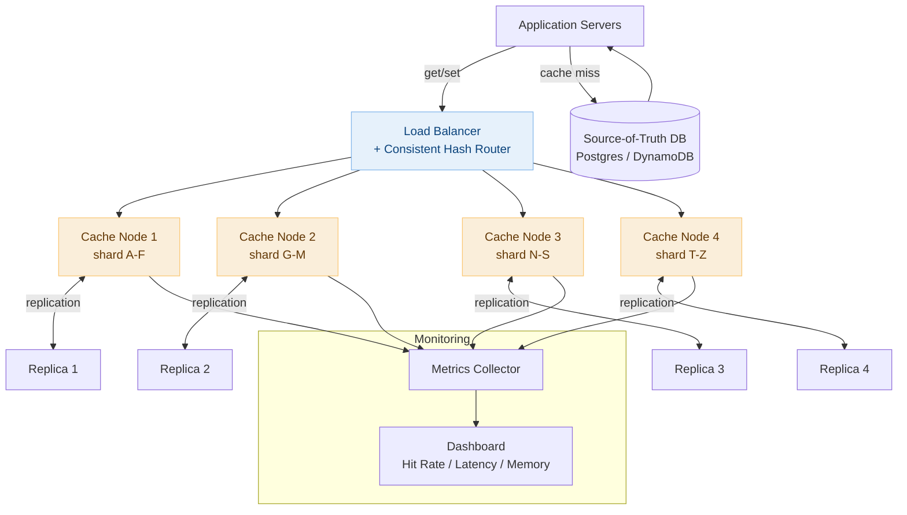

# Day 18 — Longest Common Subsequence & Design a Distributed Cache

> **30-Day Interview Prep Tracker** | Shobhit Kumar  
> **Date:** ___________  
> **Status:** ⬜ DSA Done | ⬜ System Design Done  
> **Difficulty:** Medium | **Topic:** Dynamic Programming (2D)

---

## Part 1: DSA — Longest Common Subsequence (LeetCode #1143)

### Problem Statement

Given two strings `text1` and `text2`, return the length of their **longest common subsequence (LCS)**. A subsequence is a sequence derived from a string by deleting some (or no) characters without changing their relative order.

### Examples

```
text1 = "abcde", text2 = "ace"
→ 3  ("ace" is common to both)

text1 = "abc", text2 = "abc"
→ 3  (entire string)

text1 = "abc", text2 = "def"
→ 0  (no common characters)

text1 = "AGGTAB", text2 = "GXTXAYB"
→ 4  ("GTAB")
```

> Note: **subsequence** ≠ **substring**. Subsequence characters don't need to be contiguous.

---

### Approach: 2D Dynamic Programming

**State:** `dp[i][j]` = LCS length of `text1[0..i-1]` and `text2[0..j-1]`

**Recurrence:**
```
If text1[i-1] == text2[j-1]:
    dp[i][j] = dp[i-1][j-1] + 1        ← characters match, extend LCS

Else:
    dp[i][j] = max(dp[i-1][j], dp[i][j-1])  ← skip one character from either string
```

```
text1 = "abcde", text2 = "ace"

     ""  a   c   e
""  [ 0,  0,  0,  0 ]
a   [ 0,  1,  1,  1 ]
b   [ 0,  1,  1,  1 ]
c   [ 0,  1,  2,  2 ]
d   [ 0,  1,  2,  2 ]
e   [ 0,  1,  2,  3 ]  ← answer is dp[5][3] = 3
```

```java
class Solution {
    public int longestCommonSubsequence(String text1, String text2) {
        int m = text1.length(), n = text2.length();
        int[][] dp = new int[m + 1][n + 1];

        for (int i = 1; i <= m; i++) {
            for (int j = 1; j <= n; j++) {
                if (text1.charAt(i - 1) == text2.charAt(j - 1))
                    dp[i][j] = dp[i - 1][j - 1] + 1;
                else
                    dp[i][j] = Math.max(dp[i - 1][j], dp[i][j - 1]);
            }
        }
        return dp[m][n];
    }
}
```

```python
class Solution:
    def longestCommonSubsequence(self, text1: str, text2: str) -> int:
        m, n = len(text1), len(text2)
        dp = [[0] * (n + 1) for _ in range(m + 1)]

        for i in range(1, m + 1):
            for j in range(1, n + 1):
                if text1[i - 1] == text2[j - 1]:
                    dp[i][j] = dp[i - 1][j - 1] + 1
                else:
                    dp[i][j] = max(dp[i - 1][j], dp[i][j - 1])

        return dp[m][n]
```

### Space Optimization: O(n)

Since each row only depends on the previous row, we can use two 1D arrays:

```python
def longestCommonSubsequence(self, text1: str, text2: str) -> int:
    n = len(text2)
    prev = [0] * (n + 1)

    for ch1 in text1:
        curr = [0] * (n + 1)
        for j, ch2 in enumerate(text2, 1):
            if ch1 == ch2:
                curr[j] = prev[j - 1] + 1
            else:
                curr[j] = max(prev[j], curr[j - 1])
        prev = curr

    return prev[n]
```

### Complexity Analysis

| Metric | 2D DP | Space-Optimized |
|--------|-------|-----------------|
| **Time** | O(m × n) | O(m × n) |
| **Space** | O(m × n) | O(n) |

---

### Reconstructing the Actual LCS

```python
def reconstruct_lcs(text1: str, text2: str, dp: list[list[int]]) -> str:
    i, j = len(text1), len(text2)
    result = []
    while i > 0 and j > 0:
        if text1[i - 1] == text2[j - 1]:
            result.append(text1[i - 1])
            i -= 1; j -= 1
        elif dp[i - 1][j] > dp[i][j - 1]:
            i -= 1
        else:
            j -= 1
    return ''.join(reversed(result))
```

---

### Related Problems

- **LeetCode #72** — Edit Distance (Levenshtein): `dp[i][j]` = min operations to convert `word1[0..i]` to `word2[0..j]`
- **LeetCode #1092** — Shortest Common Supersequence: length = `m + n - LCS(m,n)`
- **LeetCode #516** — Longest Palindromic Subsequence: `LPS(s) = LCS(s, reverse(s))`
- **LeetCode #300** — Longest Increasing Subsequence (1D, patience sorting for O(n log n))

> **2D DP pattern:** When a problem asks for the best result considering two sequences simultaneously, build a 2D table where `dp[i][j]` captures the answer for prefixes of length `i` and `j`. The recurrence always branches on whether the current characters match.

---

## Part 2: System Design — Distributed Cache (Redis-like)

### Requirements Clarification

#### Functional Requirements
- `set(key, value, ttl?)` — store a key-value pair with optional expiration
- `get(key)` → value or null
- `delete(key)`
- `eviction` when memory is full (LRU policy)
- Support for cache-aside pattern (application manages cache + DB)

#### Non-Functional Requirements
- Scale: 1TB total cache data, 500K reads/sec, 50K writes/sec
- Latency: < 1ms for get/set (in-memory)
- Availability: 99.99% — no single point of failure
- Consistency: eventual is acceptable (cache is not source of truth)

---

### High-Level Architecture



---

### Sharding: Consistent Hashing

**Problem with naive modulo sharding:** Adding/removing a node remaps ~all keys → cache storm.

**Consistent hashing:** Place nodes on a virtual ring of 2^32 positions. Each key hashes to the ring and is served by the nearest clockwise node. Adding/removing a node remaps only ~1/N of keys.

```
Virtual ring (0 to 2^32 - 1):

         Node A (hash("nodeA") = 100)
        /
Ring ──────────────────────────────────────────
        \
         Node B (hash("nodeB") = 200)    Node C (hash("nodeC") = 300)

Key "user:42" hashes to 150 → goes to Node B (next clockwise node)
Key "session:99" hashes to 250 → goes to Node C

Adding Node D at position 180:
  Keys between 150–180 that were on Node B → now on Node D
  All other keys unaffected ← only 1/N keys remapped
```

**Virtual nodes (vnodes):** Each physical node owns multiple positions on the ring (e.g., 150 vnodes per node). This ensures even load distribution even with heterogeneous nodes.

```python
import hashlib
from bisect import bisect, insort

class ConsistentHashRing:
    def __init__(self, nodes: list[str], vnodes: int = 150):
        self.vnodes = vnodes
        self.ring = []         # sorted list of hash positions
        self.node_map = {}     # hash position → node name

        for node in nodes:
            self.add_node(node)

    def _hash(self, key: str) -> int:
        return int(hashlib.md5(key.encode()).hexdigest(), 16)

    def add_node(self, node: str):
        for i in range(self.vnodes):
            h = self._hash(f"{node}:{i}")
            insort(self.ring, h)
            self.node_map[h] = node

    def remove_node(self, node: str):
        for i in range(self.vnodes):
            h = self._hash(f"{node}:{i}")
            self.ring.remove(h)
            del self.node_map[h]

    def get_node(self, key: str) -> str:
        h = self._hash(key)
        idx = bisect(self.ring, h) % len(self.ring)
        return self.node_map[self.ring[idx]]
```

---

### Eviction: LRU Implementation

Each cache node maintains an in-memory LRU. When memory is full, the least recently used key is evicted.

```
LRU data structure: HashMap + Doubly Linked List
  HashMap: key → ListNode (O(1) lookup)
  Doubly Linked List: ordered by recency (head = MRU, tail = LRU)

get(key):
  1. HashMap lookup → O(1)
  2. Move node to head (most recently used) → O(1)
  3. Return value

set(key, value):
  1. If key exists: update value, move to head
  2. If memory full: remove tail node (LRU), delete from HashMap
  3. Insert new node at head, add to HashMap
```

```python
from collections import OrderedDict

class LRUCache:
    def __init__(self, capacity: int):
        self.cap = capacity
        self.cache = OrderedDict()   # maintains insertion/access order

    def get(self, key: str):
        if key not in self.cache:
            return None
        self.cache.move_to_end(key)  # mark as recently used
        return self.cache[key]

    def set(self, key: str, value, ttl: int | None = None):
        if key in self.cache:
            self.cache.move_to_end(key)
        self.cache[key] = (value, ttl)
        if len(self.cache) > self.cap:
            self.cache.popitem(last=False)  # evict LRU (front)

    def delete(self, key: str):
        self.cache.pop(key, None)
```

---

### TTL (Time-To-Live) Expiration

Two strategies for expiring keys:

```
Strategy 1 — Lazy Expiration (used by Redis):
  Don't actively scan for expired keys.
  On every get(): check if TTL has elapsed → if yes, treat as miss, delete.
  Pros: zero CPU overhead from background scanning.
  Cons: stale keys consume memory until accessed.

Strategy 2 — Active Expiration (background sweep):
  Periodically sample N random keys and delete expired ones.
  Redis runs this every 100ms, sampling 20 keys per cycle.
  Pros: reclaims memory proactively.
  Cons: small CPU overhead.

Production: Use BOTH (lazy + active sampling). Pure lazy leads to unbounded
memory growth if keys are never re-accessed after creation.
```

```python
import time

class TTLCache:
    def __init__(self, capacity: int):
        self.cap = capacity
        self.cache = {}      # key → (value, expire_at or None)

    def get(self, key: str):
        if key not in self.cache:
            return None
        value, expire_at = self.cache[key]
        if expire_at and time.time() > expire_at:  # lazy expiry
            del self.cache[key]
            return None
        return value

    def set(self, key: str, value, ttl: int | None = None):
        expire_at = time.time() + ttl if ttl else None
        self.cache[key] = (value, expire_at)
```

---

### Replication: Primary-Replica

```
Each shard has 1 primary + 2 replicas.

Write path: client → primary → async replication to replicas
Read path:  client → primary (strong consistency)
            OR → replica (eventual consistency, higher read throughput)

Failure scenarios:
  Primary fails:
    1. Replica detects missed heartbeat (3 consecutive misses in 1.5s)
    2. Replicas hold leader election (Raft / Sentinel)
    3. New primary elected in < 30 seconds
    4. Clients redirect to new primary (cluster config updated)
    5. Old primary rejoins as replica when recovered

  Replica fails:
    → Traffic rerouted to remaining replica; primary unchanged
    → Alerts triggered; new replica provisioned from primary snapshot
```

---

### Cache Patterns

```
1. Cache-Aside (Lazy Loading) — most common:
   Read:  check cache → hit: return | miss: read DB → write to cache → return
   Write: write to DB → invalidate (or update) cache entry
   Risk:  stale data between DB write and cache invalidate

2. Write-Through:
   Write: write to cache AND DB synchronously
   Read:  always check cache first
   Risk:  write latency doubles; cache may hold rarely-read data

3. Write-Behind (Write-Back):
   Write: write to cache immediately, async batch write to DB
   Read:  cache first
   Risk:  data loss if cache node fails before DB flush
   Use:   high write throughput workloads (gaming leaderboards)

4. Read-Through:
   Cache sits in front of DB; cache manages its own population
   Miss: cache fetches from DB itself, not the application
   Use:  simplifies application code; cache and DB are tightly coupled
```

---

### Cache Stampede / Thundering Herd

```
Problem: Popular key expires → 10,000 concurrent requests all miss cache
→ all hit DB simultaneously → DB overloaded → cascading failure

Solution 1 — Mutex / Lock:
  First request to miss acquires a Redis distributed lock (SET NX EX 5)
  Other requests wait or return stale value
  Lock holder queries DB, repopulates cache, releases lock

Solution 2 — Probabilistic Early Expiration (PER):
  Before TTL expires, randomly decide to refresh early:
    if random() < exp((remaining_ttl - threshold) / beta):
        refresh now
  Spreads cache refresh over time → no simultaneous expiry storm

Solution 3 — Stale-While-Revalidate:
  Serve stale value immediately; async background refresh
  Safe when slightly stale data is acceptable (e.g., product catalog)
```

---

### Monitoring & Key Metrics

```
Hit Rate = cache_hits / (cache_hits + cache_misses)
  Target: > 90% for production caches
  Below 80% → investigate: keys evicted too early, TTL too short, bad key design

Eviction Rate = keys evicted / total ops
  High eviction → memory pressure → increase node memory or add shards

Memory Usage per Node
  Alert at 80% → begin provisioning new nodes

Latency p99 (microseconds, not milliseconds)
  > 1ms p99 → investigate network, serialization, or hot keys

Hot Keys (single key receiving > 1% of all traffic)
  Solution: replicate hot key to all nodes with a random suffix:
    key = "product:trending:" + str(random.randint(0, 9))
    → spread reads across 10 copies
```

---

### Interview Discussion Points

1. **Why not just use a single large Redis instance?** → Single point of failure; bounded by one machine's memory (typically 256GB max); no horizontal scaling; consistent hashing lets us scale to petabytes
2. **How do you handle cache invalidation across microservices?** → Publish invalidation events to Kafka; each service's cache consumer deletes the key; eventual consistency window is acceptable for most reads
3. **How would you implement a distributed lock using the cache?** → `SET key unique_token NX EX 30` (atomic); unlock with Lua script that checks token before deleting (prevents releasing another owner's lock)
4. **What's the difference between Redis and Memcached?** → Redis supports rich data types (lists, sets, sorted sets, hashes), persistence (AOF/RDB), replication, Lua scripting. Memcached is simpler, multi-threaded, pure caching only. Redis is almost always the right choice today.
5. **How would you cache database query results that span multiple rows?** → Hash the query (SQL + params) as the cache key; invalidate on any write to the involved tables. Works for read-heavy, low-churn queries; avoid for frequently-updated tables.

---

## Daily Checklist

- [ ] Solved Longest Common Subsequence (#1143) — filled in the DP table by hand
- [ ] Solved Edit Distance (#72) using the same 2D DP pattern
- [ ] Can identify the LPS shortcut: `LPS(s) = LCS(s, reverse(s))`
- [ ] Drew Distributed Cache architecture from memory (sharding + replication)
- [ ] Can implement consistent hashing ring and explain why vnodes help
- [ ] Know the 4 cache patterns (cache-aside, write-through, write-behind, read-through)
- [ ] Can explain the cache stampede problem and at least 2 solutions

---

## My Notes

```
Time taken for DSA: _____ minutes
Time taken for System Design: _____ minutes

What went well:


What to improve:


Key insight I want to remember:


```

---

## Resources

- [LeetCode #1143 — Longest Common Subsequence](https://leetcode.com/problems/longest-common-subsequence/)
- [LeetCode #72 — Edit Distance](https://leetcode.com/problems/edit-distance/)
- [LeetCode #300 — Longest Increasing Subsequence](https://leetcode.com/problems/longest-increasing-subsequence/)
- [2D DP Patterns — NeetCode](https://www.youtube.com/watch?v=Ua0GhsJSlWM)
- [System Design: Distributed Cache — ByteByteGo](https://bytebytego.com/courses/system-design-interview/design-a-cache-system)
- [Consistent Hashing — Tom White's Blog](https://tom-e-white.com/2007/11/consistent-hashing.html)

---

> **Tip of the Day:** The 2D DP pattern appears in LCS, Edit Distance, Shortest Common Supersequence, and Interleaving String — all use the same table structure. When characters match, look diagonal (`dp[i-1][j-1]`). When they don't, look at adjacent cells and take the better subproblem. Master the table-fill direction and you can solve the entire family.

**Previous:** [Day 17 — Linked List Cycle + Notification System](../DAY-17/day-17-linked-list-cycle-notification-system.md)  
**Next:** [Day 19 — Sliding Window Maximum + Design a Leaderboard](../DAY-19/day-19-sliding-window-max-leaderboard.md)
