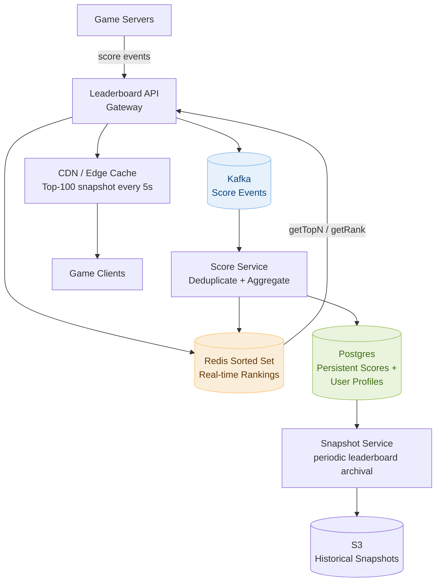

# Day 19 — Sliding Window Maximum & Design a Leaderboard System

> **30-Day Interview Prep Tracker** | Shobhit Kumar  
> **Date:** ___________  
> **Status:** ⬜ DSA Done | ⬜ System Design Done  
> **Difficulty:** Hard | **Topic:** Sliding Window / Monotonic Deque

---

## Part 1: DSA — Sliding Window Maximum (LeetCode #239)

### Problem Statement

Given an integer array `nums` and a sliding window of size `k`, return the **maximum value in each window** as the window moves from left to right across the array.

### Examples

```
nums = [1, 3, -1, -3, 5, 3, 6, 7], k = 3

Window [1, 3, -1]   → max = 3
Window [3, -1, -3]  → max = 3
Window [-1, -3, 5]  → max = 5
Window [-3, 5, 3]   → max = 5
Window [5, 3, 6]    → max = 6
Window [3, 6, 7]    → max = 7

Output: [3, 3, 5, 5, 6, 7]

nums = [1], k = 1 → [1]
```

---

### Approach 1: Brute Force — O(n × k)

For each window position, scan all `k` elements and find the max. Too slow for large inputs.

```python
def maxSlidingWindow_brute(nums, k):
    return [max(nums[i:i+k]) for i in range(len(nums) - k + 1)]
```

---

### Approach 2: Monotonic Deque — O(n)

**Core idea:** Maintain a deque of **indices** such that the values at those indices are always in **decreasing order**. The front of the deque is always the index of the maximum element in the current window.

```
Rules:
  1. Remove from FRONT if the index is outside the current window (i - deque[0] >= k)
  2. Remove from BACK while nums[back] <= nums[i]  (smaller elements can never be max)
  3. Append index i to back
  4. After window is full (i >= k-1), record deque[front] as the current max
```

```
Trace: nums = [1, 3, -1, -3, 5, 3, 6, 7], k = 3

i=0, val=1:  deque=[0]
i=1, val=3:  3 > 1, pop 0. deque=[1]
i=2, val=-1: -1 < 3, keep. deque=[1,2]  → window full → result=[nums[1]]=[ 3 ]
i=3, val=-3: -3 < -1, keep. deque=[1,2,3] → result=[3, nums[1]]=[ 3, 3 ]
i=4, val=5:  index 1 is out of window (4-1=3 >= k=3), pop front → deque=[2,3]
             5 > -3, pop 3. 5 > -1, pop 2. deque=[4] → result=[3,3,5]
i=5, val=3:  3 < 5, keep. deque=[4,5] → result=[3,3,5,5]
i=6, val=6:  6 > 3, pop 5. 6 > 5, pop 4. deque=[6] → result=[3,3,5,5,6]
i=7, val=7:  7 > 6, pop 6. deque=[7] → result=[3,3,5,5,6,7] ✓
```

```java
import java.util.ArrayDeque;

class Solution {
    public int[] maxSlidingWindow(int[] nums, int k) {
        int n = nums.length;
        int[] result = new int[n - k + 1];
        ArrayDeque<Integer> dq = new ArrayDeque<>(); // stores indices

        for (int i = 0; i < n; i++) {
            // Remove indices outside the window
            while (!dq.isEmpty() && dq.peekFirst() <= i - k)
                dq.pollFirst();

            // Remove smaller elements from the back
            while (!dq.isEmpty() && nums[dq.peekLast()] <= nums[i])
                dq.pollLast();

            dq.offerLast(i);

            // Window is full, record max
            if (i >= k - 1)
                result[i - k + 1] = nums[dq.peekFirst()];
        }
        return result;
    }
}
```

```python
from collections import deque

class Solution:
    def maxSlidingWindow(self, nums: list[int], k: int) -> list[int]:
        dq = deque()   # stores indices
        result = []

        for i, val in enumerate(nums):
            # Remove out-of-window indices from front
            if dq and dq[0] <= i - k:
                dq.popleft()

            # Maintain decreasing order: pop smaller values from back
            while dq and nums[dq[-1]] <= val:
                dq.pop()

            dq.append(i)

            # Start recording once first window is complete
            if i >= k - 1:
                result.append(nums[dq[0]])

        return result
```

### Complexity Analysis

| Metric | Brute Force | Monotonic Deque |
|--------|-------------|-----------------|
| **Time** | O(n × k) | O(n) — each index pushed/popped at most once |
| **Space** | O(1) | O(k) — deque holds at most k indices |

---

### Why the Deque is Monotonically Decreasing

```
When we see a new element nums[i]:
  Any element in the deque that is ≤ nums[i] will NEVER be the maximum
  of any future window, because:
    1. They are to the LEFT of i (older)
    2. nums[i] is ≥ them (larger or equal)
    3. They will fall out of the window BEFORE nums[i] does

  So they are useless — remove them now to keep O(n) total operations.
```

---

### Related Problems

- **LeetCode #1438** — Longest Subarray with Abs Diff ≤ Limit (use both min and max deques)
- **LeetCode #862** — Shortest Subarray with Sum at Least K (monotonic deque on prefix sums)
- **LeetCode #84** — Largest Rectangle in Histogram (monotonic stack, similar pattern)
- **LeetCode #480** — Sliding Window Median (two heaps instead of deque)

> **Pattern:** Monotonic deque = sliding window + O(1) range max/min. Whenever you need to maintain the extremum over a sliding window, consider a deque that enforces monotonicity.

---

### Variant: Sliding Window Minimum

Simply flip the comparison: remove from back when `nums[dq[-1]] >= val` (maintain increasing deque).

```python
def minSlidingWindow(nums: list[int], k: int) -> list[int]:
    dq, result = deque(), []
    for i, val in enumerate(nums):
        if dq and dq[0] <= i - k:
            dq.popleft()
        while dq and nums[dq[-1]] >= val:  # ← flipped comparison
            dq.pop()
        dq.append(i)
        if i >= k - 1:
            result.append(nums[dq[0]])
    return result
```

---

## Part 2: System Design — Leaderboard System

### Requirements Clarification

#### Functional Requirements
- `addScore(userId, score)` — add/update a user's score
- `getTopN(n)` — return the top N users with their scores in real time
- `getRank(userId)` — return a specific user's current rank
- Support for multiple leaderboards (global, regional, per-game)
- Score changes reflected in rankings within seconds

#### Non-Functional Requirements
- Scale: 50M active users, 100K score updates/sec during peak (live gaming event)
- Latency: `getTopN(100)` in < 10ms; score updates in < 50ms
- Availability: 99.99% — leaderboard downtime during a tournament is unacceptable
- Consistency: eventual is acceptable; rank can lag by up to 1 second

---

### High-Level Architecture



---

### Core Data Structure: Redis Sorted Set

The entire leaderboard is modeled as a **Redis Sorted Set** (ZSET). This is the exact right tool for the job.

```
Redis Sorted Set internals:
  - Backed by a skip list + hash map
  - Each member has a floating-point score
  - Members are always kept sorted by score automatically
  - All rank/score operations are O(log N)

Key operations:
  ZADD  leaderboard:global userId score   → add/update score  O(log N)
  ZREVRANK leaderboard:global userId      → rank (0-indexed)  O(log N)
  ZREVRANGE leaderboard:global 0 99 WITHSCORES → top 100     O(log N + 100)
  ZSCORE leaderboard:global userId        → get score         O(1)
  ZCARD  leaderboard:global               → total players     O(1)

Practical:
  ZADD leaderboard:global 4250 "user:42"     → user 42 has score 4250
  ZREVRANK leaderboard:global "user:42"      → returns 0 if #1, 1 if #2, etc.
  ZREVRANGE leaderboard:global 0 9 WITHSCORES
    → [user:99, 9800, user:7, 9500, user:42, 8200, ...]
```

---

### Score Update Flow

```
1. Player completes a match → Game Server emits:
   { userId: 42, delta: +150, leaderboardId: "global", matchId: "m-999" }

2. Leaderboard API receives the event:
   a. Publish to Kafka topic "score-events" for durability
   b. Return 202 Accepted immediately (async processing)

3. Score Service consumes from Kafka:
   a. Deduplicate by matchId (SET idem:{matchId}:42 NX EX 3600 in Redis)
   b. Fetch current score: ZSCORE leaderboard:global user:42 → 4100
   c. New score = 4100 + 150 = 4250
   d. Atomic update: ZADD leaderboard:global 4250 user:42
   e. Write to Postgres for durability: UPDATE scores SET score=4250 ...

4. getTopN(100):
   ZREVRANGE leaderboard:global 0 99 WITHSCORES → O(log N + 100) ≈ 0.5ms

5. getRank(userId):
   ZREVRANK leaderboard:global user:42 → rank 0-indexed, add 1 for display
```

---

### Sharding Strategy for 50M Users

A single Redis sorted set can handle 50M users — Redis processes millions of ZADD/ZRANK per second. For 100K updates/sec we need sharding:

```
Strategy 1 — Shard by leaderboard:
  Each leaderboard (global, regional, per-game) lives on its own Redis node.
  Simple, no cross-shard operations needed.
  Works well if leaderboards are naturally partitioned.

Strategy 2 — Shard global leaderboard by score range:
  Node A: scores 0       – 1,000,000
  Node B: scores 1,000,001 – 2,000,000
  Node C: scores 2,000,001 – ∞

  getTopN → query Node C first (highest scores), then B if needed.
  Rank = count in higher shards + rank within shard.
  Score update moves a user between shards if they cross a boundary.

Strategy 3 — Approximate Top-N with sampling (for very large scale):
  Maintain exact top-10K in Redis.
  Users outside top-10K → rank approximated from Postgres histogram.
  Most users only care about their rank, not exact position outside top-10K.

For 50M users: Strategy 1 + Strategy 2 are sufficient.
Each Redis node handles ~12.5M users (4 shards at 100GB each).
```

---

### Handling Score Ties

```
Problem: Two users with the same score — who ranks higher?

Redis ZADD with equal scores: sorted alphabetically by member name.
This is usually not what we want.

Solutions:

Option A — Composite score (lexicographic trick):
  Score = (actualScore × 10^6) + (MAX_TIME - timestamp)
  Higher score wins; among equals, earlier achievement wins.
  Fits in a float64 (up to ~9 × 10^12).

Option B — Secondary sort at query time:
  Store scores normally in ZSET.
  When ties exist in top-N, fetch extra records and sort by
  timestamp (stored in a separate Redis hash or Postgres) in application.

Option C — Store timestamp separately:
  ZADD lb user:42 score
  HSET lb:tiebreak user:42 timestamp
  At query time, among tied users, sort by HGET lb:tiebreak.

Recommended: Option A for simplicity; Option B/C when score precision matters.
```

---

### CDN Caching for Top-N

```
Problem: 10M users all hit getTopN(100) every time they open the game.
10M × 1 req/min = 166K reads/sec on Redis.

Solution: Cache the top-100 snapshot at the CDN edge:
  - Snapshot Service writes top-100 to Redis key:
      SET leaderboard:global:top100:snapshot <JSON> EX 5
  - CDN fetches this snapshot every 5 seconds and serves it.
  - 10M reads/sec → served entirely from CDN edge.
  - Staleness: at most 5 seconds (acceptable for leaderboard display).

For user's own rank: not cacheable (personalized) → fetch directly from Redis.
  getRank(userId): 1 Redis call, < 1ms.
```

---

### Real-Time vs. Batch Leaderboards

```
Real-Time (tournament leaderboard, < 1s staleness):
  Redis Sorted Set with synchronous writes
  WebSocket push to clients when rank changes significantly (±5 positions)
  Suitable for: esports tournaments, live games

Near-Real-Time (daily/weekly leaderboard, 1-60s staleness):
  Redis as write buffer; sync to Postgres every minute
  Top-N served from Redis; full leaderboard from Postgres with pagination
  Suitable for: mobile games, social apps

Batch (monthly/all-time leaderboard, hours of staleness):
  Scheduled job reads from Postgres, builds snapshot, writes to S3
  API reads from S3 (pre-computed, no DB load)
  Suitable for: historical rankings, end-of-season rewards

Match which approach to the SLA — real-time Redis for tournaments,
batch snapshots for historical views.
```

---

### Geo-Partitioned Leaderboards

```
Schema:
  leaderboard:global         → all 50M users
  leaderboard:region:us-east → ~10M users in US East
  leaderboard:region:eu-west → ~8M users in EU West
  leaderboard:game:chess      → users who played Chess

On score update: ZADD to all relevant keys atomically:
  MULTI
    ZADD leaderboard:global 4250 user:42
    ZADD leaderboard:region:us-east 4250 user:42
    ZADD leaderboard:game:chess 4250 user:42
  EXEC

Trade-off: more storage, more write fan-out; simpler reads.

For 50M × 3 leaderboards: ~150M ZSET members.
Redis: ~64 bytes per member × 150M = ~9.6GB — fits in one node.
```

---

### Interview Discussion Points

1. **Why Redis Sorted Set instead of a database ORDER BY query?** → ORDER BY on 50M rows requires a full index scan → O(N log N) per query; Redis ZREVRANK/ZREVRANGE are O(log N) on a skip list optimized for this exact operation. At 100K updates/sec, Postgres would be the bottleneck.
2. **How do you handle a score rollback (player dispute)?** → Maintain an audit log in Kafka. Score Service processes rollback events with negative delta; idempotency key prevents double-rollback. Redis score corrected atomically with ZADD.
3. **How do you paginate the leaderboard (page 5 of rank 401–500)?** → `ZREVRANGE leaderboard:global 400 499 WITHSCORES` — O(log N + 100), always fast regardless of page depth.
4. **What happens if the Redis node fails?** → Sentinel/Cluster promotes a replica in < 30s. Score updates buffered in Kafka during outage. Score Service replays the lag after recovery. Postgres is always the source of truth for cold recovery.
5. **How would you add a friend leaderboard?** → Maintain a ZSET per user keyed by their friend list: `leaderboard:user:42:friends`. On friend add/remove, update this ZSET. Query is the same ZREVRANGE pattern.

---

## Daily Checklist

- [ ] Solved Sliding Window Maximum (#239) using monotonic deque without looking at notes
- [ ] Traced the deque state step-by-step for the example array
- [ ] Solved Longest Subarray with Abs Diff ≤ Limit (#1438) using two deques
- [ ] Drew the Leaderboard architecture from memory
- [ ] Can explain Redis Sorted Set operations and their time complexities
- [ ] Know the three sharding strategies and when to use each
- [ ] Can describe the CDN caching strategy for top-N reads
- [ ] Understand how to handle ties and geo-partitioned leaderboards

---

## My Notes

```
Time taken for DSA: _____ minutes
Time taken for System Design: _____ minutes

What went well:


What to improve:


Key insight I want to remember:


```

---

## Resources

- [LeetCode #239 — Sliding Window Maximum](https://leetcode.com/problems/sliding-window-maximum/)
- [LeetCode #1438 — Longest Subarray with Abs Diff ≤ Limit](https://leetcode.com/problems/longest-continuous-subarray-with-absolute-diff-less-than-or-equal-to-limit/)
- [Monotonic Deque — NeetCode](https://www.youtube.com/watch?v=DfljaUwZsOk)
- [Redis Sorted Sets — Official Docs](https://redis.io/docs/data-types/sorted-sets/)
- [System Design: Leaderboard — ByteByteGo](https://bytebytego.com/courses/system-design-interview/design-a-leaderboard)

---

> **Tip of the Day:** The monotonic deque trick generalizes to any "range extremum" query over a sliding window. Key mental model: you're maintaining a sorted view of the window where elements that can never be the answer are eagerly pruned. This achieves amortized O(1) per element because each element is pushed and popped at most once total.

**Previous:** [Day 18 — Longest Common Subsequence + Distributed Cache](../DAY-18/day-18-lcs-distributed-cache.md)  
**Next:** [Day 20 — Minimum Window Substring + Design a Search Autocomplete System](../DAY-20/day-20-min-window-substring-autocomplete.md)
