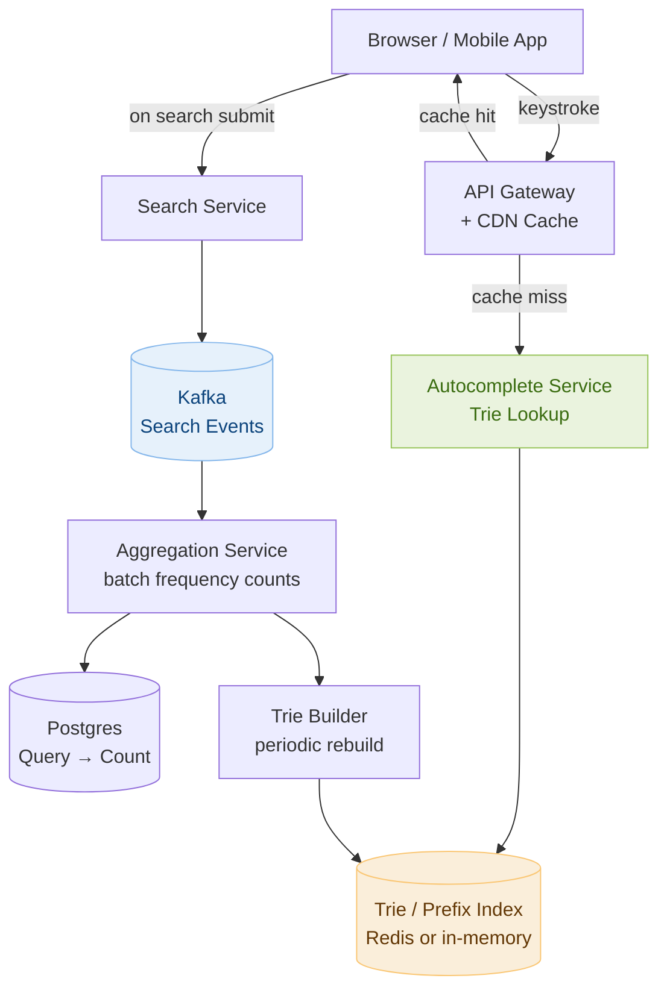

# Day 20 — Minimum Window Substring & Design a Search Autocomplete System

> **30-Day Interview Prep Tracker** | Shobhit Kumar  
> **Date:** ___________  
> **Status:** ⬜ DSA Done | ⬜ System Design Done  
> **Difficulty:** Hard | **Topic:** Sliding Window / Two Pointers

---

## Part 1: DSA — Minimum Window Substring (LeetCode #76)

### Problem Statement

Given two strings `s` and `t`, return the **minimum window substring** of `s` such that every character in `t` (including duplicates) is included in the window. If no such window exists, return `""`.

### Examples

```
s = "ADOBECODEBANC", t = "ABC"
→ "BANC"  (smallest window containing A, B, and C)

s = "a", t = "a"
→ "a"

s = "a", t = "aa"
→ ""  (only one 'a' in s, need two)

s = "ADOBECODEBANC", t = "ABC"
Windows containing ABC:
  "ADOBEC" (len 6)
  "DOBECODEBA" (len 10)
  "BECODEBA" (len 8)
  "BANC" (len 4)  ← minimum
```

---

### Approach: Sliding Window with Frequency Maps — O(n)

**Core idea:** Expand the right pointer until the window contains all characters of `t`. Then contract the left pointer to find the minimum valid window. Record the minimum each time a valid window is found.

```
State tracking:
  need[c]  = frequency of character c required (from t)
  have[c]  = frequency of character c currently in window
  formed   = count of DISTINCT characters in t whose frequency in window
             meets the required frequency
  required = number of distinct characters in t

Window is valid when: formed == required

Algorithm:
  left = 0, right = 0
  while right < len(s):
    Add s[right] to window (have[s[right]]++)
    If have[s[right]] == need[s[right]]: formed++
    
    while formed == required:
      Update minimum window if current is smaller
      Remove s[left] from window
      If have[s[left]] < need[s[left]]: formed--
      left++
    
    right++
```

```
Trace: s = "ADOBECODEBANC", t = "ABC"
need = {A:1, B:1, C:1}, required = 3

right=0: add A → have={A:1}, A satisfied → formed=1
right=1: add D → have={A:1,D:1}, formed=1
right=2: add O → formed=1
right=3: add B → have={B:1}, formed=2
right=4: add E → formed=2
right=5: add C → have={C:1}, formed=3 ✓ (window "ADOBEC", len=6)
  → contract: remove A (left=0→1), have={A:0}, formed=2
right=6: add O → formed=2
right=7: add D → formed=2
right=8: add E → formed=2
right=9: add B → have={B:2}, formed=2
right=10: add A → have={A:1}, formed=3 ✓ (window "DOBECODEBA", len=10)
  → contract: remove D(formed=3), remove O(formed=3), remove B(have={B:1},formed=3)
              window "ECODEBA" (len=7) still valid
  → contract: remove E → formed=3, window "CODEBA" (len=6)
  → contract: remove C → have={C:0}, formed=2
right=11: add N → formed=2
right=12: add C → have={C:1}, formed=3 ✓ (window "BANC", len=4) ← new min
  → contract: remove O... → all contractions invalidate → done

Result: "BANC"
```

```java
import java.util.HashMap;
import java.util.Map;

class Solution {
    public String minWindow(String s, String t) {
        if (s.isEmpty() || t.isEmpty()) return "";

        Map<Character, Integer> need = new HashMap<>();
        for (char c : t.toCharArray())
            need.merge(c, 1, Integer::sum);

        Map<Character, Integer> have = new HashMap<>();
        int formed = 0, required = need.size();
        int left = 0, minLen = Integer.MAX_VALUE, minLeft = 0;

        for (int right = 0; right < s.length(); right++) {
            char c = s.charAt(right);
            have.merge(c, 1, Integer::sum);
            if (need.containsKey(c) && have.get(c).equals(need.get(c)))
                formed++;

            while (formed == required) {
                if (right - left + 1 < minLen) {
                    minLen = right - left + 1;
                    minLeft = left;
                }
                char lc = s.charAt(left++);
                have.merge(lc, -1, Integer::sum);
                if (need.containsKey(lc) && have.get(lc) < need.get(lc))
                    formed--;
            }
        }
        return minLen == Integer.MAX_VALUE ? "" : s.substring(minLeft, minLeft + minLen);
    }
}
```

```python
from collections import Counter

class Solution:
    def minWindow(self, s: str, t: str) -> str:
        if not s or not t:
            return ""

        need = Counter(t)
        have = {}
        formed = 0
        required = len(need)

        left = 0
        min_len, min_left = float('inf'), 0

        for right, c in enumerate(s):
            have[c] = have.get(c, 0) + 1
            if c in need and have[c] == need[c]:
                formed += 1

            while formed == required:
                if right - left + 1 < min_len:
                    min_len = right - left + 1
                    min_left = left

                lc = s[left]
                have[lc] -= 1
                if lc in need and have[lc] < need[lc]:
                    formed -= 1
                left += 1

        return "" if min_len == float('inf') else s[min_left:min_left + min_len]
```

### Complexity Analysis

| Metric | Value |
|--------|-------|
| **Time** | O(∣s∣ + ∣t∣) — each character in s is visited at most twice (once by right, once by left) |
| **Space** | O(∣Σ∣) — at most 52 entries in the frequency maps (26 upper + 26 lower) |

---

### Why `formed` instead of checking the entire map each time

```
Naive check: after every right expansion, count how many characters
in need are satisfied → O(|t|) per step → O(n × |t|) total.

Optimization: track `formed` (a running count of satisfied characters).
When have[c] first reaches need[c], increment formed (a character just became satisfied).
When have[c] drops below need[c], decrement formed.
This makes the satisfaction check O(1) per step.
```

---

### Related Problems

- **LeetCode #3** — Longest Substring Without Repeating Characters (sliding window, simpler form)
- **LeetCode #438** — Find All Anagrams in a String (fixed-size sliding window + frequency map)
- **LeetCode #567** — Permutation in String (same as #438, return true/false)
- **LeetCode #424** — Longest Repeating Character Replacement (sliding window with a twist)

> **Pattern:** Variable-size sliding window with frequency constraint: expand right until valid, shrink left until invalid, track the best valid window seen. The `formed/required` counter pattern reduces per-step validity checks from O(k) to O(1).

---

### Variant: Minimum Window Subsequence (LeetCode #727)

```
Find minimum window in s where t appears as a subsequence (order matters, not just frequency).

Key difference: characters of t must appear in ORDER in the window.

Approach: two-pointer without a frequency map
  1. Find the first window: right-scan s matching t characters left-to-right.
  2. Once found, left-scan backward to tighten the window.
  3. Move right forward by 1 and repeat.
  O(n × m) time.
```

---

## Part 2: System Design — Search Autocomplete System

### Requirements Clarification

#### Functional Requirements
- As a user types a query, return the **top 5 completions** in real time
- Completions ranked by **historical search frequency**
- Support for prefix-based completions (type "sea" → suggest "search", "seattle", "seasons"...)
- New search queries update the suggestion model (near-real-time, not instant)

#### Non-Functional Requirements
- Scale: 100M DAU, each triggers ~10 autocomplete calls per search → 1B calls/day ≈ 12K calls/sec average, 60K/sec peak
- Latency: suggestion response in < 100ms (ideally < 50ms)
- Availability: 99.9% — degraded autocomplete is acceptable; no suggestions is fine
- Storage: top-5 suggestions for every prefix up to length 20 → manageable with trie + caching

---

### High-Level Architecture



---

### Core Data Structure: Trie with Top-K at Each Node

A standard trie stores characters; we augment each node with the **top 5 queries** for that prefix.

```
Standard trie for ["search", "sea", "seal", "seattle"]:

root
 └─ s
     └─ e
         └─ a  ← top5: ["search"(1M), "seattle"(900K), "sea"(800K), "seal"(200K)]
             ├─ r
             │   └─ c
             │       └─ h  (end) ← "search" freq=1,000,000
             ├─ t
             │   └─ t
             │       └─ l
             │           └─ e  (end) ← "seattle" freq=900,000
             ├─ (end) ← "sea" freq=800,000
             └─ l
                 └─ (end) ← "seal" freq=200,000

Query "sea" → O(3) to reach the node → return node.top5 → O(1)
No need to traverse the subtree on every request.
```

```python
import heapq
from collections import defaultdict

class TrieNode:
    def __init__(self):
        self.children = {}
        self.top5 = []   # list of (freq, query), max-heap semantics

class AutocompleteSystem:
    def __init__(self, sentences: list[str], times: list[int]):
        self.root = TrieNode()
        self.prefix = ""
        for sentence, freq in zip(sentences, times):
            self._insert(sentence, freq)

    def _insert(self, sentence: str, freq: int):
        node = self.root
        for ch in sentence:
            if ch not in node.children:
                node.children[ch] = TrieNode()
            node = node.children[ch]
            self._update_top5(node, sentence, freq)

    def _update_top5(self, node: TrieNode, sentence: str, freq: int):
        # Remove existing entry for this sentence if present
        node.top5 = [(f, s) for f, s in node.top5 if s != sentence]
        node.top5.append((freq, sentence))
        # Keep only top 5 by frequency (negate for max-heap behavior)
        node.top5 = heapq.nlargest(5, node.top5)

    def input(self, c: str) -> list[str]:
        if c == '#':
            self._insert(self.prefix, 1)   # record new search
            self.prefix = ""
            return []

        self.prefix += c
        node = self.root
        for ch in self.prefix:
            if ch not in node.children:
                return []
            node = node.children[ch]
        return [sentence for _, sentence in node.top5]
```

### Complexity Analysis

| Operation | Time | Space |
|-----------|------|-------|
| Insert sentence of length L | O(L × 5) = O(L) | O(L) per sentence |
| Query prefix of length P | O(P) | O(1) lookup |
| Build trie for N queries avg length L | O(N × L) | O(N × L) |

---

### Scaling the Trie: Offline Build + Read-Only Serving

At 100M DAU, building the trie in real time for every search would overwhelm a single server. Use a two-phase approach:

```
Phase 1 — Data Collection (real-time):
  Every search → Kafka "search-events" topic
  { userId, query, timestamp, region }
  
  Aggregation Service (Flink or Spark Streaming):
    Count occurrences per query in 1-hour windows
    Write to Postgres: UPDATE query_counts SET count = count + delta

Phase 2 — Trie Build (scheduled):
  Every 1 hour: Trie Builder reads top-1M queries from Postgres
  Builds a fresh trie in memory
  Serializes trie to a binary blob → uploads to S3

Phase 3 — Trie Load (on service startup or refresh):
  Autocomplete Service fetches trie blob from S3 on startup
  Hot-swap: keep serving old trie while new one loads
  Signal: replace the pointer atomically after load

Trade-off:
  Suggestions lag search trends by ~1 hour — acceptable.
  New viral queries ("breaking news topic") appear in suggestions within 1 hour.
```

---

### Caching Layer

```
Two-level cache:

Level 1 — CDN Edge Cache (for common prefixes):
  Every prefix of 1–3 characters is queried millions of times/hour.
  CDN caches the top-5 result for "s", "se", "sea", etc.
  TTL: 10 minutes — refreshed when trie is rebuilt.
  Coverage: ~99% of requests for 1-2 char prefixes come from CDN.

Level 2 — Redis (for longer prefixes):
  Longer prefixes (4+ chars) are less common but still repeated.
  Cache key: "autocomplete:{prefix}"
  Value: JSON array of top-5 suggestions
  TTL: 5 minutes
  On cache miss: query trie server → cache result.

Cache hit rate target: > 95%.
At 95% hit rate, only 600/sec reach the trie service → easily handled.
```

---

### Trie Partitioning for Horizontal Scale

```
Shard by first character:
  Shard 1: a–f
  Shard 2: g–m
  Shard 3: n–s
  Shard 4: t–z

Client sends prefix to the correct shard based on prefix[0].
Each shard handles 1/4 of queries → 15K/sec per shard.
Easy to scale: add more shards, remap characters.

Alternative: shard by consistent hash of prefix.
  More even distribution but requires hash routing at API gateway.
  Harder to predict which shard serves "popular" prefixes.

Recommendation: shard by first character for simplicity,
add replication (primary + 2 replicas) per shard for HA.
```

---

### Personalized Autocomplete

```
In addition to global frequency, boost queries based on:
  1. User's own search history
  2. User's location (trending locally)
  3. User's language / locale

Implementation:
  Global trie: top-5 by global frequency (described above)
  Personal boost: Redis hash per user:
    Key: autocomplete:personal:{userId}
    Field: query → count (user's frequency for this query)
    TTL: 30 days of inactivity

  Merge at query time:
    Fetch top-10 from global trie (O(P))
    Fetch user's personal history for the prefix (O(1) Redis HSCAN)
    Re-rank: score = globalFreq × 0.7 + personalFreq × 0.3
    Return top-5 of merged list

  Cost: 1 Redis call per keystroke per logged-in user.
  Can skip personalization for anonymous users.
```

---

### Handling Special Cases

```
1. Profanity / banned queries:
   Maintain a blocklist in Redis (SET banned_queries).
   Filter out blocklisted queries from suggestions before returning.

2. Query normalization:
   Lowercase everything: "NEW YORK" → "new york"
   Strip leading/trailing whitespace
   Collapse multiple spaces: "new  york" → "new york"
   Apply before insertion AND before lookup.

3. Unicode / multilingual support:
   Trie node children map can store multi-byte characters.
   Index and serve per language/locale (separate tries or prefix namespacing).
   CDN cache key includes locale: "autocomplete:en-US:sea"

4. Cold start (new deployment):
   Load trie from S3 snapshot on startup.
   Start serving immediately — stale by at most 1 hour.
   Old pod continues serving until new pod is healthy.
```

---

### Interview Discussion Points

1. **Why a trie with precomputed top-5 instead of a database prefix query?** → `SELECT query FROM searches WHERE query LIKE 'sea%' ORDER BY count DESC LIMIT 5` requires an index scan that is O(log N + k) at best, plus DB connection overhead. At 60K/sec this would overwhelm any DB. Trie lookup is O(prefix_length) ≈ O(20) with no I/O.
2. **How do you handle trending queries that aren't in the trie yet?** → Stream processing (Flink) counts queries in real-time 1-minute windows. Queries trending faster than expected (3σ above baseline) are hot-injected into the trie's in-memory representation without waiting for the hourly rebuild.
3. **What if the trie consumes too much RAM?** → Prune the trie to top-1M queries (covers 99% of search volume per Zipf's law). Store long-tail queries only in Postgres, not in trie. Alternatively, serialize trie as a compact array-based structure (no pointers) to save 4× memory vs. node-per-character.
4. **How do you handle "delete my search history" (GDPR)?** → Remove the user's query from the personal history Redis hash. For global trie, individual queries are aggregated — not attributed to a single user — so no PII in the trie itself.
5. **How would you add query spell correction?** → Separate spell-correction service using BK-tree or edit-distance index; suggest corrected prefix before autocomplete lookup. Or pre-index common misspellings → canonical form mapping.

---

## Daily Checklist

- [ ] Solved Minimum Window Substring (#76) using the `formed/required` optimization
- [ ] Solved Find All Anagrams (#438) and Permutation in String (#567) using fixed-size sliding window
- [ ] Solved Longest Substring Without Repeating Characters (#3)
- [ ] Drew the Autocomplete architecture from memory
- [ ] Can explain the two-phase trie build (offline aggregation + hourly rebuild)
- [ ] Know how to shard the trie and why first-character partitioning works
- [ ] Understand personalization merge strategy and its cost
- [ ] Can explain the CDN + Redis two-level cache strategy

---

## My Notes

```
Time taken for DSA: _____ minutes
Time taken for System Design: _____ minutes

What went well:


What to improve:


Key insight I want to remember:


```

---

## Resources

- [LeetCode #76 — Minimum Window Substring](https://leetcode.com/problems/minimum-window-substring/)
- [LeetCode #438 — Find All Anagrams](https://leetcode.com/problems/find-all-anagrams-in-a-string/)
- [LeetCode #3 — Longest Substring Without Repeating Characters](https://leetcode.com/problems/longest-substring-without-repeating-characters/)
- [Sliding Window Template — NeetCode](https://www.youtube.com/watch?v=jSto0O4AJbM)
- [System Design: Autocomplete — ByteByteGo](https://bytebytego.com/courses/system-design-interview/design-a-search-autocomplete-system)
- [Trie Data Structure — Visualized](https://www.cs.usfca.edu/~galles/visualization/Trie.html)

---

> **Tip of the Day:** The sliding window `formed/required` counter pattern appears in Minimum Window Substring, Find All Anagrams, and Permutation in String. In all three, you maintain a frequency map of what you need and a count of how many distinct characters are currently "satisfied." This reduces the per-step check from O(|charset|) to O(1), turning a slow solution into a fast one.

**Previous:** [Day 19 — Sliding Window Maximum + Leaderboard System](../DAY-19/day-19-sliding-window-max-leaderboard.md)  
**Next:** [Day 21 — Binary Search Variants + Design a Content Delivery Network](../DAY-21/day-21-binary-search-variants-cdn.md)
