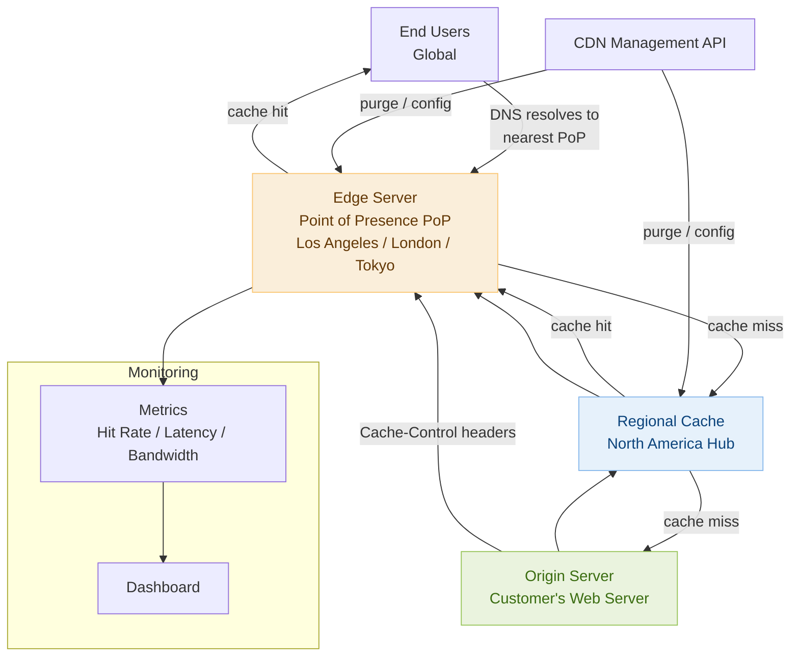

# Day 21 — Binary Search Variants & Design a Content Delivery Network

> **30-Day Interview Prep Tracker** | Shobhit Kumar  
> **Date:** ___________  
> **Status:** ⬜ DSA Done | ⬜ System Design Done  
> **Difficulty:** Medium–Hard | **Topic:** Binary Search

---

## Part 1: DSA — Binary Search Variants

### Problem Set

Three closely related problems that trip up candidates who only know the textbook binary search:

| # | Problem | Key twist |
|---|---------|-----------|
| **#33** | Search in Rotated Sorted Array | One half is always sorted |
| **#153** | Find Minimum in Rotated Sorted Array | No target, just find the break point |
| **#34** | Find First and Last Position of Element | Two binary searches: leftmost + rightmost |

---

### Problem 1: Search in Rotated Sorted Array (LeetCode #33)

**Statement:** An integer array `nums` was sorted in ascending order and then rotated at an unknown pivot. Given a target, return its index or `-1`.

```
nums = [4, 5, 6, 7, 0, 1, 2], target = 0 → 4
nums = [4, 5, 6, 7, 0, 1, 2], target = 3 → -1
nums = [1], target = 0                   → -1
```

**Core insight:** Even after rotation, one of the two halves `[lo..mid]` or `[mid..hi]` is always sorted. Check which half is sorted, then determine which half the target must lie in.

```
Decide which side is sorted:
  if nums[lo] <= nums[mid]:
    Left half [lo..mid] is sorted
    if nums[lo] <= target < nums[mid]:  target is in left half → hi = mid - 1
    else:                               target is in right half → lo = mid + 1
  else:
    Right half [mid..hi] is sorted
    if nums[mid] < target <= nums[hi]:  target is in right half → lo = mid + 1
    else:                               target is in left half  → hi = mid - 1
```

```
Trace: nums = [4, 5, 6, 7, 0, 1, 2], target = 0
lo=0, hi=6, mid=3 → nums[3]=7
  Left [4,5,6,7] is sorted (nums[0]=4 <= nums[3]=7)
  Is 0 in [4..7)? No → right half: lo=4

lo=4, hi=6, mid=5 → nums[5]=1
  Left [0,1] is sorted (nums[4]=0 <= nums[5]=1)
  Is 0 in [0..1)? Yes (0 <= 0 < 1) → hi=4

lo=4, hi=4, mid=4 → nums[4]=0 == target → return 4 ✓
```

```java
class Solution {
    public int search(int[] nums, int target) {
        int lo = 0, hi = nums.length - 1;
        while (lo <= hi) {
            int mid = lo + (hi - lo) / 2;
            if (nums[mid] == target) return mid;

            if (nums[lo] <= nums[mid]) {          // left half is sorted
                if (nums[lo] <= target && target < nums[mid])
                    hi = mid - 1;
                else
                    lo = mid + 1;
            } else {                              // right half is sorted
                if (nums[mid] < target && target <= nums[hi])
                    lo = mid + 1;
                else
                    hi = mid - 1;
            }
        }
        return -1;
    }
}
```

```python
class Solution:
    def search(self, nums: list[int], target: int) -> int:
        lo, hi = 0, len(nums) - 1
        while lo <= hi:
            mid = (lo + hi) // 2
            if nums[mid] == target:
                return mid

            if nums[lo] <= nums[mid]:          # left half sorted
                if nums[lo] <= target < nums[mid]:
                    hi = mid - 1
                else:
                    lo = mid + 1
            else:                              # right half sorted
                if nums[mid] < target <= nums[hi]:
                    lo = mid + 1
                else:
                    hi = mid - 1
        return -1
```

---

### Problem 2: Find Minimum in Rotated Sorted Array (LeetCode #153)

**Statement:** Find the minimum element in a rotated sorted array. Assume no duplicates.

```
nums = [3, 4, 5, 1, 2]   → 1
nums = [4, 5, 6, 7, 0, 1, 2] → 0
nums = [11, 13, 15, 17]  → 11 (no rotation)
```

**Core insight:** The minimum is always in the unsorted half. Compare `nums[mid]` with `nums[hi]`:
- If `nums[mid] > nums[hi]`: minimum is in right half (the sorted portion is on the left)
- If `nums[mid] <= nums[hi]`: minimum is in left half including mid

```
Trace: nums = [4, 5, 6, 7, 0, 1, 2]
lo=0, hi=6, mid=3 → nums[3]=7 > nums[6]=2 → min in right: lo=4
lo=4, hi=6, mid=5 → nums[5]=1 <= nums[6]=2 → min in left incl mid: hi=5
lo=4, hi=5, mid=4 → nums[4]=0 <= nums[5]=1 → hi=4
lo=4, hi=4 → loop ends → return nums[4] = 0 ✓
```

```java
class Solution {
    public int findMin(int[] nums) {
        int lo = 0, hi = nums.length - 1;
        while (lo < hi) {
            int mid = lo + (hi - lo) / 2;
            if (nums[mid] > nums[hi])
                lo = mid + 1;      // min is in right half
            else
                hi = mid;          // mid could be the min, don't exclude it
        }
        return nums[lo];
    }
}
```

```python
class Solution:
    def findMin(self, nums: list[int]) -> int:
        lo, hi = 0, len(nums) - 1
        while lo < hi:
            mid = (lo + hi) // 2
            if nums[mid] > nums[hi]:
                lo = mid + 1
            else:
                hi = mid
        return nums[lo]
```

---

### Problem 3: Find First and Last Position (LeetCode #34)

**Statement:** Given a sorted array and a target, return `[first, last]` index of target. Return `[-1, -1]` if not found. Must be O(log n).

```
nums = [5,7,7,8,8,10], target = 8  → [3, 4]
nums = [5,7,7,8,8,10], target = 6  → [-1, -1]
nums = [], target = 0              → [-1, -1]
```

**Core insight:** Run binary search twice — once biased left (keep going left when found), once biased right.

```
Find leftmost: when nums[mid] == target, don't stop — set hi = mid (keep narrowing left)
Find rightmost: when nums[mid] == target, don't stop — set lo = mid (keep narrowing right)
```

```java
class Solution {
    public int[] searchRange(int[] nums, int target) {
        return new int[]{findBound(nums, target, true), findBound(nums, target, false)};
    }

    private int findBound(int[] nums, int target, boolean isLeft) {
        int lo = 0, hi = nums.length - 1, bound = -1;
        while (lo <= hi) {
            int mid = lo + (hi - lo) / 2;
            if (nums[mid] == target) {
                bound = mid;
                if (isLeft) hi = mid - 1;   // keep searching left
                else        lo = mid + 1;   // keep searching right
            } else if (nums[mid] < target) {
                lo = mid + 1;
            } else {
                hi = mid - 1;
            }
        }
        return bound;
    }
}
```

```python
class Solution:
    def searchRange(self, nums: list[int], target: int) -> list[int]:
        def find_bound(is_left: bool) -> int:
            lo, hi, bound = 0, len(nums) - 1, -1
            while lo <= hi:
                mid = (lo + hi) // 2
                if nums[mid] == target:
                    bound = mid
                    if is_left: hi = mid - 1
                    else:       lo = mid + 1
                elif nums[mid] < target:
                    lo = mid + 1
                else:
                    hi = mid - 1
            return bound

        return [find_bound(True), find_bound(False)]
```

### Complexity Analysis

| Problem | Time | Space |
|---------|------|-------|
| #33 Search in Rotated Array | O(log n) | O(1) |
| #153 Find Minimum | O(log n) | O(1) |
| #34 First and Last Position | O(log n) | O(1) |

---

### The Universal Binary Search Template

```
Most binary search problems reduce to: find the leftmost index where condition(x) is True.

  lo, hi = 0, n - 1
  while lo <= hi:           # use lo < hi when hi = mid (no - 1)
      mid = (lo + hi) // 2
      if condition(mid):
          hi = mid - 1      # search left (leftmost True)
          # OR: result = mid; hi = mid - 1
      else:
          lo = mid + 1

Ask yourself:
  1. What am I searching for? (target value, minimum, boundary)
  2. Which half definitely does NOT contain the answer?
  3. Can mid be the answer? (affects whether to use hi=mid or hi=mid-1)
```

---

### Related Problems

- **LeetCode #81** — Search in Rotated Sorted Array II (with duplicates — worst case O(n))
- **LeetCode #154** — Find Minimum in Rotated Sorted Array II (with duplicates)
- **LeetCode #162** — Find Peak Element (binary search on unsorted — compare mid vs mid+1)
- **LeetCode #875** — Koko Eating Bananas (binary search on answer space, not array index)

> **Pattern:** When the input is partially ordered or the answer lies in a monotonic search space, think binary search. In rotated arrays, the invariant is that one half is always cleanly sorted — use that to eliminate half the search space in O(1).

---

## Part 2: System Design — Content Delivery Network (CDN)

### Requirements Clarification

#### Functional Requirements
- Serve static assets (images, videos, JS, CSS) from geographically distributed edge servers
- Cache content close to users to reduce latency
- Support cache invalidation when content changes at the origin
- Handle both cacheable (images) and dynamic (personalized API responses) content

#### Non-Functional Requirements
- Scale: 1B requests/day ≈ 12K req/sec average, 100K req/sec peak (viral video)
- Latency: p99 < 50ms for cached content; origin fallback < 500ms
- Availability: 99.999% — CDN is the front door for major websites
- Cache hit ratio: > 90% for static assets

---

### High-Level Architecture



---

### How a CDN Request Works

```
1. User types example.com in browser.

2. DNS resolution:
   Browser → DNS resolver: "What is the IP for static.example.com?"
   CDN's DNS (Anycast) → returns IP of the NEAREST edge PoP based on:
     a. User's IP geolocation
     b. Current PoP health and load
     c. Network latency (BGP route proximity)

3. Request hits the Edge PoP:
   GET /images/hero.jpg   Host: static.example.com

4. Edge cache lookup:
   Hit  → return cached file, set Age header, done. (< 10ms)
   Miss → forward request to Regional Cache.

5. Regional cache lookup:
   Hit  → return to edge; edge caches it.
   Miss → forward request to Origin server.

6. Origin response:
   Origin returns file with Cache-Control headers:
     Cache-Control: public, max-age=86400, s-maxage=3600
   Regional cache stores it. Edge caches it. User receives it.

7. Next 1000 users requesting the same file from same PoP:
   All served from edge in-memory cache — origin sees 0 traffic.
```

---

### DNS-Based Routing: Anycast vs. GeoDNS

```
Anycast:
  Same IP advertised from multiple PoPs via BGP.
  Network routes packet to topologically nearest PoP automatically.
  Pros: no DNS TTL delay, sub-millisecond routing decisions.
  Cons: BGP convergence can briefly send traffic to wrong PoP.
  Used by: Cloudflare, major CDNs for their core traffic.

GeoDNS:
  DNS server returns different IPs based on client IP geolocation.
  User in Tokyo → returns Tokyo PoP IP.
  User in London → returns London PoP IP.
  Pros: explicit control, easy to implement.
  Cons: stale if user travels; TTL must be short (30-60s) for fast failover.
  Used by: AWS CloudFront, many traditional CDNs.

Modern CDNs use BOTH:
  GeoDNS for initial routing to a region.
  Anycast within the region for sub-PoP routing.
```

---

### Cache Key Design

```
Cache key = unique identifier for a cached response.
Default: URL + HTTP method

Example: GET https://cdn.example.com/images/hero.jpg
  Cache key: "GET:cdn.example.com/images/hero.jpg"

Vary header (cache per header value):
  Response: Vary: Accept-Encoding
  → Cache stores separate copies for gzip vs. br vs. identity encoding
  → Cache key: "GET:.../hero.jpg:gzip"

Cache key normalization (important for hit rate):
  /images/hero.jpg?size=large&color=blue
  /images/hero.jpg?color=blue&size=large
  → Same resource! Normalize query params alphabetically before keying.
  Without normalization: 2 cache entries, each 50% hit rate → 0% effective savings.

Strip irrelevant params:
  /page.html?utm_source=google&utm_campaign=spring → strip tracking params
  Cache key becomes: /page.html
  Hit rate improves dramatically.
```

---

### Cache Invalidation

```
Problem: CDN caches /images/logo.jpg. Company rebrands, uploads new logo.
Without invalidation, CDN serves stale logo for up to max-age seconds.

Strategy 1 — Cache Busting (preferred for immutable assets):
  Embed content hash in the URL: /images/logo.abc123.jpg
  When file changes → new hash → new URL → cache miss → fresh fetch.
  Old URL naturally expires from cache.
  Pros: zero invalidation API calls; origin can set max-age=1year.
  Cons: requires build pipeline to rename assets.

Strategy 2 — Purge API:
  POST /cdn/purge  { "urls": ["https://cdn.example.com/images/logo.jpg"] }
  CDN marks cached entry as stale at ALL PoPs simultaneously.
  Pros: instant for known URLs.
  Cons: purge must propagate to 100s of PoPs → eventual consistency (1-5s).
  Cost: purge APIs are rate-limited and may be charged per purge call.

Strategy 3 — Surrogate Keys / Cache Tags:
  Origin attaches a tag to responses:
    Surrogate-Key: product-42 category-shoes
  Purge by tag: DELETE /cdn/tags/product-42
  → Invalidates ALL URLs tagged "product-42" in one API call.
  Used by: Fastly, Varnish. Powerful for product catalog invalidation.

Strategy 4 — Short TTL + Stale-While-Revalidate:
  Cache-Control: max-age=60, stale-while-revalidate=30
  After 60s: serve stale, async revalidate in background.
  After 90s: must revalidate before serving.
  Pros: no invalidation API needed; always reasonably fresh.
  Cons: up to 90s of stale content.
```

---

### Edge PoP Storage Hierarchy

```
Memory  (L1 cache): 64GB per edge server, ~1M hot objects
  Access: < 1ms. Holds the most recently/frequently accessed objects.
  Eviction: LRU or LFU.

SSD     (L2 cache): 2TB per edge server, ~20M objects
  Access: 2–5ms. Overflow from memory. Persists across process restarts.
  Eviction: LRU by last access time.

Regional hub: 100TB, ~1B objects
  Access: 10–20ms (RTT to hub + disk). Absorbs misses from all local PoPs.

Origin: unlimited, authoritative.
  Access: 50–500ms (cross-ocean RTT + DB queries).
  Goal: touch origin for < 5% of requests.

Cache hit decision tree:
  Check memory → check SSD → check regional hub → fetch from origin.
  Each level fills lower levels on miss (fill-on-miss / read-through).
```

---

### Video Streaming: Range Requests and Chunking

```
Problem: Caching a 4GB video file as one object is impractical.
  Cache fills with one video; evicts many smaller files.
  Byte-range requests for the same video produce different cache entries.

Solution: Chunk the video at origin into 2MB segments.
  /video/movie.mp4/chunk/0    (bytes 0–2MB)
  /video/movie.mp4/chunk/1    (bytes 2–4MB)
  ...
  /video/movie.mp4/chunk/2047 (bytes 4094–4096MB)

Benefits:
  Each chunk is a separate cache entry — hot chunks (beginning of video) stay cached.
  Viewer skips to minute 45 → only chunk 1350+ needs to be fetched.
  CDN can cache only the popular early segments.
  Bitrate adaptation: /video/movie_1080p/chunk/0 vs /video/movie_480p/chunk/0.

Client manifest file (HLS/DASH):
  /video/movie.m3u8 → lists chunks + bitrate variants
  Video player fetches manifest (tiny, cacheable), then streams chunks.
```

---

### PoP Selection and Failover

```
Load balancing within a PoP:
  Multiple servers behind a virtual IP.
  Consistent hashing routes same URL to same server → better cache locality.
  If a server fails, its URLs rehash to another server (cold cache, misses to origin).

PoP failover:
  Health check: each PoP pings a health endpoint every 5s.
  If PoP fails health check: DNS TTL expires (30s) → GeoDNS redirects
  to next-nearest PoP → users see slightly higher latency.

Origin shield (origin protection):
  Without shield: 200 PoPs × cache miss → 200 concurrent requests to origin.
  With shield: designate one Regional Cache as "origin shield."
  All PoP misses collapse at the shield; only 1 request goes to origin.
  Dramatically reduces origin load during cache misses.

  PoP miss → Shield Cache
    Shield hit  → return to PoP
    Shield miss → ONE request to Origin → fill shield → fill PoP
```

---

### Interview Discussion Points

1. **How does a CDN achieve < 10ms p99 for cached content?** → Content served from in-memory cache on the edge server — no disk I/O, no network hops, pure memory read + TCP send. Measured RTT from a server 10ms away is physically unavoidable; in-PoP latency is < 1ms.
2. **What happens during a CDN PoP failure?** → GeoDNS short TTL (30–60s) allows fast failover to next-nearest PoP. Anycast re-routes BGP instantly. Origin shield prevents a stampede of misses from overwhelming the origin during the failover window.
3. **How would you handle a viral video that suddenly gets 1M req/sec?** → Origin shield collapses all cold misses to a single origin request. The edge rapidly fills its cache from the shield. After the first miss, all subsequent requests are served from edge memory. Horizontal scaling of edge servers handles the raw connection count.
4. **How do you cache responses that vary by user (auth token, cookies)?** → Strip sensitive headers from cache key (never cache with Authorization in key). Personalized responses should NOT be cached at the CDN edge — only serve from origin. Use split-page architecture: cache the static shell, fetch personalized content via an XHR that bypasses CDN.
5. **How would you design the billing/metering system for a CDN?** → Each edge server emits byte-transfer logs to Kafka every 60s. A stream processing job (Flink) aggregates by customer ID → write to billing DB every hour. Invoice at end of billing cycle. Rate = $0.008/GB egress, varies by region.

---

## Daily Checklist

- [ ] Solved Search in Rotated Sorted Array (#33) — traced the "which half is sorted" logic by hand
- [ ] Solved Find Minimum in Rotated Array (#153) — explained why `hi = mid` not `hi = mid - 1`
- [ ] Solved First and Last Position (#34) with two separate binary searches
- [ ] Solved Find Peak Element (#162) without looking at notes
- [ ] Drew CDN architecture from memory (edge → regional → origin)
- [ ] Can explain Anycast vs GeoDNS and when each is used
- [ ] Know the 4 cache invalidation strategies and their trade-offs
- [ ] Understand origin shield and why it matters during cache misses

---

## My Notes

```
Time taken for DSA: _____ minutes
Time taken for System Design: _____ minutes

What went well:


What to improve:


Key insight I want to remember:


```

---

## Resources

- [LeetCode #33 — Search in Rotated Sorted Array](https://leetcode.com/problems/search-in-rotated-sorted-array/)
- [LeetCode #153 — Find Minimum in Rotated Sorted Array](https://leetcode.com/problems/find-minimum-in-rotated-sorted-array/)
- [LeetCode #34 — Find First and Last Position](https://leetcode.com/problems/find-first-and-last-position-of-element-in-sorted-array/)
- [Binary Search Patterns — NeetCode](https://www.youtube.com/watch?v=s4DPM8ct1pI)
- [How CDNs Work — Cloudflare Learning](https://www.cloudflare.com/learning/cdn/what-is-a-cdn/)
- [System Design: CDN — ByteByteGo](https://bytebytego.com/courses/system-design-interview/design-a-cdn)

---

> **Tip of the Day:** In rotated array problems, the two-condition check (`nums[lo] <= nums[mid]`) is the key. Equality matters: `<=` handles the case where `lo == mid` (two-element array). Get this wrong and you'll have an off-by-one bug on the edge case. Draw it out with `[3, 1]` to verify your logic.

**Previous:** [Day 20 — Minimum Window Substring + Search Autocomplete](../DAY-20/day-20-min-window-substring-autocomplete.md)  
**Next:** [Day 22 — Graph BFS/DFS + Design a Social Media Feed](../DAY-22/day-22-graph-bfs-dfs-social-feed.md)
