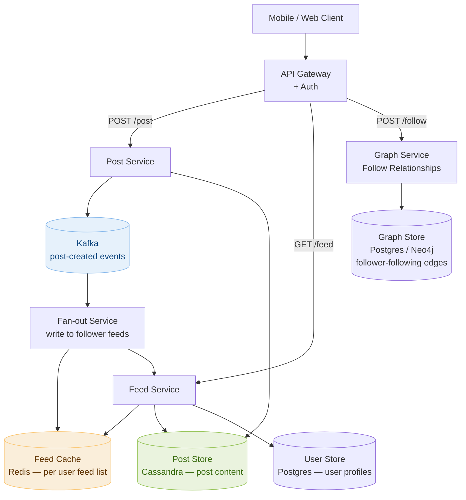

# Day 22 — Graph BFS/DFS & Design a Social Media News Feed

> **30-Day Interview Prep Tracker** | Shobhit Kumar  
> **Date:** ___________  
> **Status:** ⬜ DSA Done | ⬜ System Design Done  
> **Difficulty:** Medium | **Topic:** Graphs — BFS & DFS

---

## Part 1: DSA — Graph BFS / DFS

### Problem Set

Three problems that build the essential graph traversal toolkit:

| # | Problem | Traversal | Key pattern |
|---|---------|-----------|-------------|
| **#200** | Number of Islands | DFS/BFS | Connected components in a grid |
| **#133** | Clone Graph | BFS/DFS | Deep copy with a visited map |
| **#994** | Rotting Oranges | Multi-source BFS | Simultaneous wave expansion |

---

### Problem 1: Number of Islands (LeetCode #200)

**Statement:** Given a 2D grid of `'1'` (land) and `'0'` (water), return the number of islands. An island is a group of connected land cells (4-directional).

```
Grid:
11110
11010
11000
00000
→ 1 island

Grid:
11000
11000
00100
00011
→ 3 islands
```

**Approach:** DFS flood-fill. For each unvisited `'1'`, start a DFS that marks all connected `'1'` cells as visited (mark as `'0'` or use a `visited` set). Each DFS call = one new island.

```
For each cell (r, c):
  if grid[r][c] == '1':
    islands++
    DFS(r, c)  ← flood-fill: mark all connected land as visited
```

```java
class Solution {
    public int numIslands(char[][] grid) {
        int islands = 0;
        for (int r = 0; r < grid.length; r++) {
            for (int c = 0; c < grid[0].length; c++) {
                if (grid[r][c] == '1') {
                    islands++;
                    dfs(grid, r, c);
                }
            }
        }
        return islands;
    }

    private void dfs(char[][] grid, int r, int c) {
        if (r < 0 || r >= grid.length || c < 0 || c >= grid[0].length || grid[r][c] != '1')
            return;
        grid[r][c] = '0';   // mark visited by sinking the land
        dfs(grid, r + 1, c);
        dfs(grid, r - 1, c);
        dfs(grid, r, c + 1);
        dfs(grid, r, c - 1);
    }
}
```

```python
class Solution:
    def numIslands(self, grid: list[list[str]]) -> int:
        rows, cols = len(grid), len(grid[0])

        def dfs(r, c):
            if r < 0 or r >= rows or c < 0 or c >= cols or grid[r][c] != '1':
                return
            grid[r][c] = '0'
            for dr, dc in [(1,0),(-1,0),(0,1),(0,-1)]:
                dfs(r + dr, c + dc)

        islands = 0
        for r in range(rows):
            for c in range(cols):
                if grid[r][c] == '1':
                    islands += 1
                    dfs(r, c)
        return islands
```

**Complexity:** O(m × n) time (each cell visited once), O(m × n) space (recursion stack in worst case — all land).

---

### Problem 2: Clone Graph (LeetCode #133)

**Statement:** Given a reference to a node in a connected undirected graph, return a **deep copy** (clone) of the graph.

```
Node: val=1, neighbors=[node2, node4]
Input graph: 1 — 2
             |   |
             4 — 3
Output: exact clone with new node objects, same structure.
```

**Approach:** BFS (or DFS) with a `visited` map: `original node → cloned node`. This map serves double duty — it tracks which nodes we've already cloned AND provides the reference needed when building neighbor lists.

```
visited = {}

def clone(node):
  if node in visited: return visited[node]   ← already cloned, return it
  
  copy = Node(node.val)
  visited[node] = copy                        ← register BEFORE recursing (avoid cycle)
  
  for neighbor in node.neighbors:
    copy.neighbors.append(clone(neighbor))   ← recursively clone neighbors
  
  return copy
```

```java
import java.util.*;

class Solution {
    private Map<Node, Node> visited = new HashMap<>();

    public Node cloneGraph(Node node) {
        if (node == null) return null;
        if (visited.containsKey(node)) return visited.get(node);

        Node copy = new Node(node.val);
        visited.put(node, copy);    // register before recursing

        for (Node neighbor : node.neighbors)
            copy.neighbors.add(cloneGraph(neighbor));

        return copy;
    }
}
```

```python
class Solution:
    def cloneGraph(self, node: 'Node') -> 'Node':
        visited = {}

        def clone(n):
            if n is None:
                return None
            if n in visited:
                return visited[n]

            copy = Node(n.val)
            visited[n] = copy       # register before recursing to handle cycles
            for neighbor in n.neighbors:
                copy.neighbors.append(clone(neighbor))
            return copy

        return clone(node)
```

**Why register before recursing:** Without pre-registration, cycles cause infinite recursion. Registering `visited[n] = copy` first means any back-edge to `n` returns the already-created copy rather than re-cloning.

**Complexity:** O(V + E) time and space — each node and edge is visited exactly once.

---

### Problem 3: Rotting Oranges (LeetCode #994)

**Statement:** A grid contains `0` (empty), `1` (fresh orange), `2` (rotten orange). Every minute, fresh oranges 4-directionally adjacent to rotten ones become rotten. Return the minimum minutes until no fresh oranges remain, or `-1` if impossible.

```
Grid:
2 1 1
1 1 0
0 1 1
→ 4 minutes

Grid:
2 1 1
0 1 1
1 0 1
→ -1 (bottom-left fresh orange is isolated)
```

**Approach:** Multi-source BFS — start BFS simultaneously from ALL initially rotten oranges. Each BFS level = 1 minute. Count fresh oranges; decrement as they rot.

```
Key insight: we want the MINIMUM time for all oranges to rot.
BFS (level by level) naturally gives us the minimum distance.
Starting from ALL rotten oranges simultaneously models parallel spreading.
```

```python
from collections import deque

class Solution:
    def orangesRotting(self, grid: list[list[int]]) -> int:
        rows, cols = len(grid), len(grid[0])
        queue = deque()
        fresh = 0

        # Seed the BFS with all initially rotten oranges
        for r in range(rows):
            for c in range(cols):
                if grid[r][c] == 2:
                    queue.append((r, c, 0))   # (row, col, minutes)
                elif grid[r][c] == 1:
                    fresh += 1

        if fresh == 0:
            return 0

        minutes = 0
        while queue:
            r, c, mins = queue.popleft()
            for dr, dc in [(1,0),(-1,0),(0,1),(0,-1)]:
                nr, nc = r + dr, c + dc
                if 0 <= nr < rows and 0 <= nc < cols and grid[nr][nc] == 1:
                    grid[nr][nc] = 2       # rot it
                    fresh -= 1
                    minutes = mins + 1
                    queue.append((nr, nc, mins + 1))

        return minutes if fresh == 0 else -1
```

**Complexity:** O(m × n) time and space — each cell enters the queue at most once.

---

### BFS vs. DFS: When to Use Which

```
BFS (Queue):
  ✓ Shortest path / minimum steps in an unweighted graph
  ✓ Level-order traversal
  ✓ "Closest" problems (nearest exit, minimum hops)
  ✓ Multi-source spreading (Rotting Oranges, 01-Matrix)
  ✗ Uses O(width) memory — can be large for wide graphs

DFS (Stack / Recursion):
  ✓ Connected components, flood fill (Number of Islands)
  ✓ Cycle detection (Course Schedule)
  ✓ Topological sort
  ✓ Path existence (does a path exist?)
  ✗ Does NOT give shortest path in general
  ✗ Recursion depth limit on very large grids (use iterative DFS)

When either works:
  Connected components — both find all nodes in a component equally well.
  Choose DFS for simplicity (fewer lines of code), BFS if you need distance.
```

---

### Related Problems

- **LeetCode #695** — Max Area of Island (DFS + return subtree size)
- **LeetCode #130** — Surrounded Regions (DFS from border, invert results)
- **LeetCode #417** — Pacific Atlantic Water Flow (multi-source DFS from both oceans)
- **LeetCode #286** — Walls and Gates (multi-source BFS from all gates simultaneously)

> **Grid Graph Pattern:** Rows × cols grid → treat each cell as a graph node; 4-directional neighbors are edges. The same BFS/DFS code applies to almost all grid problems — what changes is the stopping condition and what you track per cell.

---

## Part 2: System Design — Social Media News Feed

### Requirements Clarification

#### Functional Requirements
- Users can **post** text/image content
- Users can **follow** other users
- Users see a personalized **feed** of posts from people they follow, sorted by recency
- Feed supports infinite scroll (pagination)
- Support **likes** and **comments** (basic engagement)

#### Non-Functional Requirements
- Scale: 500M DAU, 1M posts/day, 500M feed reads/day ≈ 6K reads/sec average, 50K/sec peak
- Latency: feed load < 200ms (p99)
- Eventual consistency: feed can lag by a few seconds
- Heavy read skew: reads >> writes (500:1 read-to-write ratio)

---

### High-Level Architecture



---

### Feed Generation: Push vs. Pull vs. Hybrid

This is the central design decision for a news feed system.

```
Strategy 1 — Pull (Fan-out on Read):
  Feed request arrives → query all followees → merge + sort posts → return.
  
  Read path:
    For user A (follows 200 people):
    SELECT posts FROM posts WHERE author_id IN (followee1...200)
    ORDER BY created_at DESC LIMIT 20

  Pros: No precomputation; post always fresh.
  Cons: At 50K reads/sec × 200 queries each = 10M DB queries/sec. Not scalable.
        High latency for users who follow thousands of accounts.

Strategy 2 — Push (Fan-out on Write):
  New post created → immediately write post ID to each follower's feed list.
  
  Write path:
    User A (200K followers) posts → 200K Redis writes.
  Read path:
    LRANGE feed:{userId} 0 19  → 20 post IDs → batch fetch post content.

  Pros: Reads are instant (pre-computed, O(1) Redis lookup).
  Cons: Celebrity problem — user with 10M followers creates 10M writes per post.
        Wasted work if follower never opens the app.

Strategy 3 — Hybrid (used by Twitter/Instagram in practice):
  Regular users (< 10K followers): push fan-out on write.
  Celebrity users (> 10K followers): skip push; pull at read time.

  Feed request:
    1. LRANGE feed:{userId} 0 19  → pre-built feed (from regular followees)
    2. Fetch recent posts from followed celebrities (pull, last 20 each)
    3. Merge + deduplicate + sort → return top 20
    Celebrity list per user is small → pull is cheap.

→ Best of both worlds: fast reads AND no 10M-write storms.
```

---

### Feed Cache: Redis List per User

```
Data structure: Redis List
  Key:   feed:{userId}
  Value: ordered list of post IDs (most recent first)
  Max:   cap at 500 entries (users rarely scroll beyond page 25)

Fan-out write (on new post by author A):
  1. Fetch follower list of A from Graph Service (paginated for large followings)
  2. For each follower F:
       LPUSH feed:{F} {postId}      ← prepend (newest first)
       LTRIM feed:{F} 0 499         ← keep only latest 500
  3. Set TTL: EXPIRE feed:{F} 604800  (7 days, reset on activity)

Feed read for user U:
  1. postIds = LRANGE feed:{U} 0 19   ← first page, O(1)
  2. Batch fetch post details:
       MGET post:{id1} post:{id2} ... post:{id20}  ← Redis hash per post
  3. Enrich with author profile: MGET user:{authorId} for each post
  4. Return 20 enriched posts in < 10ms

Pagination:
  cursor = last seen postId (not page number — avoids drift as new posts arrive)
  Client sends: GET /feed?after={lastPostId}
  Server: LRANGE from index of lastPostId + 1 to +19
```

---

### Post Storage: Cassandra

```
Posts are write-heavy and accessed by time range (user's timeline).
Cassandra's wide-row model fits perfectly.

Table: posts
  PRIMARY KEY ((author_id), created_at DESC, post_id)

CREATE TABLE posts (
    author_id   BIGINT,
    created_at  TIMESTAMP,
    post_id     UUID,
    content     TEXT,
    media_url   TEXT,
    like_count  COUNTER,
    PRIMARY KEY ((author_id), created_at, post_id)
) WITH CLUSTERING ORDER BY (created_at DESC);

Queries:
  Get user's own timeline:
    SELECT * FROM posts WHERE author_id = 42 LIMIT 20;

  Get post by ID (for feed enrichment):
    SELECT * FROM posts WHERE post_id = ? (secondary index or separate table)

Why Cassandra?
  Write throughput: 1M posts/day = ~12 writes/sec peak ~100/sec (trivial).
  Read by author (timeline): O(1) partition lookup.
  Scales horizontally; no single point of failure.
  Append-only workload — exactly what Cassandra is optimized for.
```

---

### Graph Service: Follow Relationships

```
Table: follows (Postgres)
  follower_id   BIGINT   (the person who follows)
  followee_id   BIGINT   (the person being followed)
  created_at    TIMESTAMP
  PRIMARY KEY (follower_id, followee_id)
  INDEX on (followee_id)   ← for "who follows me?" and fan-out

Operations:
  Follow(A → B):   INSERT INTO follows (A, B, now)
  Unfollow(A → B): DELETE FROM follows WHERE follower_id=A AND followee_id=B
  Following(A):    SELECT followee_id FROM follows WHERE follower_id=A
  Followers(B):    SELECT follower_id FROM follows WHERE followee_id=B

Scale concern:
  Celebrity with 50M followers: SELECT is 50M rows → paginate.
  Fan-out for 50M followers on new post → batch Kafka messages, parallel workers.

Cache:
  followers:{userId} in Redis (TTL 5 min) for fan-out fan reads.
  following:{userId} in Redis for feed pull merges.
```

---

### Handling the Celebrity Problem in Detail

```
Scenario: Taylor Swift (200M followers) posts a photo.
Naive fan-out: 200M Redis LPUSH operations → ~10 minutes → unacceptable.

Solution: Two-tier fan-out

Tier 1 — Async batch fan-out for regular users (< 1M followers):
  Kafka message: { postId, authorId, followerCount: 500K }
  Fan-out workers pick up message; split into batches of 10K follower IDs.
  Each batch: 10K Redis LPUSH ops in a pipeline → ~50ms per batch.
  500K followers → 50 batches → parallel execution → done in 2-3 seconds.

Tier 2 — Skip fan-out for celebrities (> 1M followers):
  No Redis writes. The post is stored in Cassandra as usual.
  Mark author as "celebrity" in User Store.

  At feed read time (for any user U who follows celebrity C):
    Check User Store: does U follow any celebrities?
    If yes: LRANGE feed:{U} 0 24 (25 posts from regular followees)
            + SELECT * FROM posts WHERE author_id IN (celebrity_ids) LIMIT 5 per celebrity
            Merge and sort by recency.
    If no: just LRANGE feed:{U} 0 19

  Celebrity post fetch: cached per celebrity in Redis:
    Key: celebrity_posts:{celebrityId}
    Value: JSON of last 50 posts (TTL 60s)
    100M users each read the same 50 celebrity posts → served from Redis.
```

---

### Feed Ranking (Beyond Chronological)

```
Pure chronological: easy, predictable, low engagement.
Ranked feed (Instagram/Facebook): higher engagement but complex.

Simple ranking signal score:
  score = recency_score + engagement_score + relationship_score

  recency_score    = 1 / (hours_since_post + 1)^0.5
  engagement_score = log(1 + likes + 2×comments + 3×shares)
  relationship_score = 1.5 if close_friend else 1.0

Ranking pipeline:
  1. Fetch candidate post IDs from Redis feed (top 100)
  2. Fetch engagement counts from Redis counters
  3. Compute score for each post → sort → return top 20
  4. This runs in the Feed Service, adding ~20ms
  
For ML-based ranking (LinkedIn, TikTok):
  Feature extraction → model inference → re-rank
  Deployed as a separate Ranking Service
  Pre-computed scores cached per user (batch job + online update)
```

---

### Interview Discussion Points

1. **How do you serve a feed for a new user with no follows?** → Cold-start: show trending content (top posts globally by engagement in last 24h), suggested users to follow based on interest graph, or onboarding wizard. Trending feed is pre-computed every 5 minutes and served from Redis.
2. **How does pagination work without missing or duplicating posts?** → Use cursor-based pagination: client sends the ID of the last seen post. Server finds that ID in the Redis list and returns the next N. Unlike offset-based pagination, this is stable when new posts are prepended.
3. **How do you count likes at scale (10M likes/sec)?** → Don't write to Cassandra on every like — use Redis `INCR like_count:{postId}`. Batch flush to Cassandra every 30s. If Redis loses data between flushes, like counts are off by at most 30s of activity — acceptable.
4. **What if a user follows 10,000 people — how is their feed fast?** → Hybrid strategy: prebuilt Redis list for regular followees, plus celebrity pull. The Redis LRANGE is O(1) regardless of follow count. The merge of celebrity posts is bounded (capped at 20 celebrities per user).
5. **How would you add stories (24-hour expiring content)?** → Separate Stories Service with a sorted set per followee: `ZADD stories:{userId} timestamp storyId`. Reader fetches all followees' stories with score > (now - 24h) via ZRANGEBYSCORE. TTL-based cleanup job removes expired entries.

---

## Daily Checklist

- [ ] Solved Number of Islands (#200) — implemented both DFS and iterative BFS versions
- [ ] Solved Clone Graph (#133) — explained why you register the node before recursing
- [ ] Solved Rotting Oranges (#994) — traced multi-source BFS level by level
- [ ] Solved Max Area of Island (#695) using DFS that returns subtree size
- [ ] Drew Social Feed architecture from memory
- [ ] Can explain Push vs. Pull vs. Hybrid fan-out and when each applies
- [ ] Know how celebrity fan-out is handled differently from regular users
- [ ] Understand cursor-based pagination and why offset pagination fails here

---

## My Notes

```
Time taken for DSA: _____ minutes
Time taken for System Design: _____ minutes

What went well:


What to improve:


Key insight I want to remember:


```

---

## Resources

- [LeetCode #200 — Number of Islands](https://leetcode.com/problems/number-of-islands/)
- [LeetCode #133 — Clone Graph](https://leetcode.com/problems/clone-graph/)
- [LeetCode #994 — Rotting Oranges](https://leetcode.com/problems/rotting-oranges/)
- [Graph Traversal Patterns — NeetCode](https://www.youtube.com/watch?v=tWVWeAqZ0WU)
- [System Design: News Feed — ByteByteGo](https://bytebytego.com/courses/system-design-interview/design-a-news-feed-system)
- [How Instagram Scaled Its Feed — Instagram Engineering Blog](https://instagram-engineering.com/what-powers-instagram-hundreds-of-machines-dozens-of-technologies-adf2e22da2ad)

---

> **Tip of the Day:** In Clone Graph, the `visited` map does two jobs at once — it prevents infinite loops on cycles AND stores the mapping from original → clone so neighbor lists can be wired up correctly. This dual-purpose pattern (visited = memoization cache) appears in many graph problems. Always register the node BEFORE processing its neighbors.

**Previous:** [Day 21 — Binary Search Variants + CDN](../DAY-21/day-21-binary-search-variants-cdn.md)  
**Next:** [Day 23 — Dynamic Programming on Strings + Design a Payments System](../DAY-23/day-23-dp-strings-payments-system.md)
