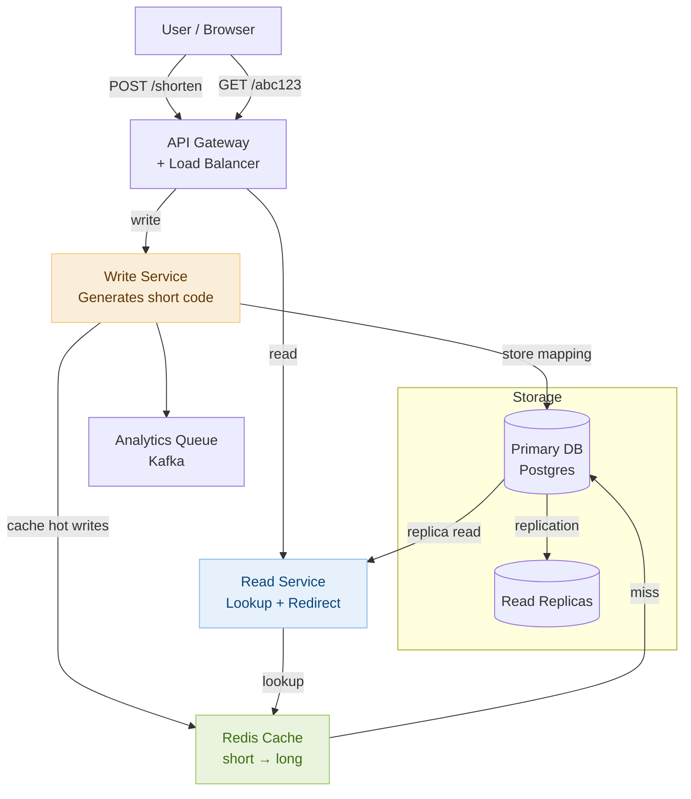

# Day 23 — Dynamic Programming Patterns & Design a URL Shortener

> **30-Day Interview Prep Tracker** | Shobhit Kumar  
> **Date:** ___________  
> **Status:** ⬜ DSA Done | ⬜ System Design Done  
> **Difficulty:** Medium–Hard | **Topic:** Dynamic Programming

---

## Part 1: DSA — Dynamic Programming Patterns

### Problem Set

Three problems that cover the most common DP archetypes:

| # | Problem | DP Type | Key pattern |
|---|---------|---------|-------------|
| **#198** | House Robber | Linear DP | Decide include/exclude at each step |
| **#55** | Jump Game | Greedy DP | Track max reachable index |
| **#300** | Longest Increasing Subsequence | Subsequence DP | `dp[i]` = LIS ending at index i |

---

### Problem 1: House Robber (LeetCode #198)

**Statement:** You are a robber planning to rob houses along a street. Each house has a certain amount of money stashed. You cannot rob two adjacent houses. Return the maximum amount you can rob.

```
nums = [1, 2, 3, 1]  → 4   (rob house 1 and house 3: 1 + 3)
nums = [2, 7, 9, 3, 1] → 12 (rob house 1, 3, 5: 2 + 9 + 1)
```

**Core insight:** At each house `i`, you have two choices:
- Skip house `i` → carry forward best from `i-1`
- Rob house `i` → add `nums[i]` to best from `i-2`

```
State: dp[i] = max money robbing from house 0 to i
Recurrence: dp[i] = max(dp[i-1], dp[i-2] + nums[i])
Base:        dp[0] = nums[0]
             dp[1] = max(nums[0], nums[1])
```

```
Trace: nums = [2, 7, 9, 3, 1]
dp[0] = 2
dp[1] = max(2, 7) = 7
dp[2] = max(7, 2+9) = 11
dp[3] = max(11, 7+3) = 11
dp[4] = max(11, 11+1) = 12  ✓
```

```java
class Solution {
    public int rob(int[] nums) {
        if (nums.length == 1) return nums[0];
        int prev2 = nums[0];
        int prev1 = Math.max(nums[0], nums[1]);
        for (int i = 2; i < nums.length; i++) {
            int curr = Math.max(prev1, prev2 + nums[i]);
            prev2 = prev1;
            prev1 = curr;
        }
        return prev1;
    }
}
```

```python
class Solution:
    def rob(self, nums: list[int]) -> int:
        if len(nums) == 1:
            return nums[0]
        prev2, prev1 = nums[0], max(nums[0], nums[1])
        for i in range(2, len(nums)):
            prev2, prev1 = prev1, max(prev1, prev2 + nums[i])
        return prev1
```

> **Space optimization:** No need to store the full dp array. Two variables (`prev1`, `prev2`) suffice — O(1) space.

---

### Problem 2: Jump Game (LeetCode #55)

**Statement:** Given an array where `nums[i]` is the max jump length from index `i`, return `true` if you can reach the last index starting from index 0.

```
nums = [2, 3, 1, 1, 4]  → true  (jump 1 from index 0, then 3 from index 1)
nums = [3, 2, 1, 0, 4]  → false (always land on index 3 which has jump 0)
```

**Core insight:** Track the maximum index reachable at each step. If at any index `i` you find `i > maxReach`, it means you can never get here — return false.

```
maxReach = 0
For each index i from 0 to n-1:
  if i > maxReach: return False   (can't reach index i)
  maxReach = max(maxReach, i + nums[i])
  if maxReach >= n-1: return True
```

```
Trace: nums = [3, 2, 1, 0, 4]
i=0: maxReach = max(0, 0+3) = 3
i=1: maxReach = max(3, 1+2) = 3
i=2: maxReach = max(3, 2+1) = 3
i=3: maxReach = max(3, 3+0) = 3
i=4: 4 > maxReach(3) → return False ✓
```

```java
class Solution {
    public boolean canJump(int[] nums) {
        int maxReach = 0;
        for (int i = 0; i < nums.length; i++) {
            if (i > maxReach) return false;
            maxReach = Math.max(maxReach, i + nums[i]);
        }
        return true;
    }
}
```

```python
class Solution:
    def canJump(self, nums: list[int]) -> bool:
        max_reach = 0
        for i, jump in enumerate(nums):
            if i > max_reach:
                return False
            max_reach = max(max_reach, i + jump)
        return True
```

---

### Problem 3: Longest Increasing Subsequence (LeetCode #300)

**Statement:** Given an integer array `nums`, return the length of the longest strictly increasing subsequence.

```
nums = [10, 9, 2, 5, 3, 7, 101, 18]  → 4  ([2, 3, 7, 101])
nums = [0, 1, 0, 3, 2, 3]            → 4  ([0, 1, 2, 3])
nums = [7, 7, 7, 7]                  → 1
```

**Core insight (O(n²) DP):** `dp[i]` = length of LIS ending at index `i`. For each `i`, look back at all `j < i` where `nums[j] < nums[i]` and take the max `dp[j] + 1`.

```
dp[i] = 1 + max(dp[j]) for all j < i where nums[j] < nums[i]
Base: dp[i] = 1 (LIS of length 1: just itself)
Answer: max(dp)
```

```
Trace: nums = [10, 9, 2, 5, 3, 7, 101, 18]
dp   = [1,  1, 1, 2, 2, 3, 4,   4]
        10  9  2  5  3  7  101  18
Answer: max(dp) = 4 ✓
```

```java
class Solution {
    public int lengthOfLIS(int[] nums) {
        int n = nums.length;
        int[] dp = new int[n];
        Arrays.fill(dp, 1);
        int ans = 1;
        for (int i = 1; i < n; i++) {
            for (int j = 0; j < i; j++) {
                if (nums[j] < nums[i])
                    dp[i] = Math.max(dp[i], dp[j] + 1);
            }
            ans = Math.max(ans, dp[i]);
        }
        return ans;
    }
}
```

```python
class Solution:
    def lengthOfLIS(self, nums: list[int]) -> int:
        dp = [1] * len(nums)
        for i in range(1, len(nums)):
            for j in range(i):
                if nums[j] < nums[i]:
                    dp[i] = max(dp[i], dp[j] + 1)
        return max(dp)
```

**O(n log n) solution using patience sorting (binary search):**

```java
class Solution {
    public int lengthOfLIS(int[] nums) {
        List<Integer> tails = new ArrayList<>();
        for (int num : nums) {
            int lo = 0, hi = tails.size();
            while (lo < hi) {
                int mid = (lo + hi) / 2;
                if (tails.get(mid) < num) lo = mid + 1;
                else hi = mid;
            }
            if (lo == tails.size()) tails.add(num);
            else tails.set(lo, num);
        }
        return tails.size();
    }
}
```

```python
import bisect

class Solution:
    def lengthOfLIS(self, nums: list[int]) -> int:
        tails = []
        for num in nums:
            pos = bisect.bisect_left(tails, num)
            if pos == len(tails):
                tails.append(num)
            else:
                tails[pos] = num
        return len(tails)
```

> **Key insight:** `tails` is not the actual LIS — it just tracks the smallest possible tail for each LIS length. Its *length* equals the LIS length.

---

### Complexity Analysis

| Problem | Time | Space |
|---------|------|-------|
| #198 House Robber | O(n) | O(1) |
| #55 Jump Game | O(n) | O(1) |
| #300 LIS (DP) | O(n²) | O(n) |
| #300 LIS (Patience Sort) | O(n log n) | O(n) |

---

### The DP Framework

```
Every DP problem has three parts:

1. State definition:  dp[i] means "_____ considering the first i elements"
2. Recurrence:        dp[i] = f(dp[i-1], dp[i-2], ...)
3. Base case:         dp[0] or dp[1] — the trivially known answer

Ask yourself:
  a. What decision am I making at each step? (include/exclude, jump/stay, extend/start new)
  b. What information do I need from sub-problems?
  c. Can I compress the state (rolling array)?

Common patterns:
  - Include/exclude: House Robber, 0/1 Knapsack
  - Greedy + DP hybrid: Jump Game, Stock Buy/Sell
  - Subsequence: LIS, Edit Distance, Longest Common Subsequence
  - Partition: Palindrome Partitioning, Matrix Chain Multiplication
```

---

### Related Problems

- **LeetCode #213** — House Robber II (circular array — run robber twice)
- **LeetCode #45** — Jump Game II (minimum jumps — greedy BFS)
- **LeetCode #1143** — Longest Common Subsequence (2D DP)
- **LeetCode #322** — Coin Change (unbounded knapsack variant)
- **LeetCode #72** — Edit Distance (classic 2D DP)

> **Pattern:** DP is about eliminating repeated computation by caching sub-problem results. If you find yourself making the same recursive call with the same arguments, you have overlapping sub-problems — memoize it. If the recurrence only looks back a fixed number of steps, compress to O(1) space with rolling variables.

---

## Part 2: System Design — URL Shortener (TinyURL)

### Requirements Clarification

#### Functional Requirements
- Given a long URL, generate a short URL (e.g., `tinyurl.com/abc123`)
- Redirect users from short URL to the original long URL
- Custom aliases: allow users to specify their own short code
- Expiration: links expire after a configurable TTL (default: 5 years)

#### Non-Functional Requirements
- Scale: 100M URLs created per day; 10B redirects per day
- Redirect latency: p99 < 10ms (reads are the hot path)
- Write latency: p99 < 100ms (link creation)
- Availability: 99.99% — broken short links are very visible
- Short codes: 7-character alphanumeric → 62^7 ≈ 3.5 trillion unique codes

---

### High-Level Architecture



---

### Short Code Generation Strategies

```
Strategy 1 — MD5/SHA-256 Hash (simple but flawed):
  hash = md5(longURL)[:7]
  Pros: deterministic, no DB needed for deduplication check.
  Cons: hash collisions (~0.006% chance with 3.5T codes in use).
        Same URL always maps to same code — can't support multiple short URLs for one long URL.
        Must check DB on every write anyway to detect collision.

Strategy 2 — Auto-increment ID + Base62 encoding (recommended):
  id = DB.nextVal('url_id_seq')   // 1, 2, 3, 4, ...
  short_code = base62(id)         // 1→"1", 62→"Z", 63→"10", ...
  Pros: guaranteed unique, no collisions, deterministic.
  Cons: sequential → codes are predictable (guessable). Use ID shuffling:
        Bijective Base62: map id through a fixed permutation before encoding.

  id=1 → base62 → "0000001"   (predictable)
  id=1 → shuffle(1) → base62 → "gH9kLmP" (opaque)

Strategy 3 — Pre-generated code pool:
  Background job pre-generates N random 7-char codes, stores in "available_codes" table.
  Write service claims one code atomically: SELECT ... FOR UPDATE.
  Pros: no collision check needed; O(1) write.
  Cons: requires pool management (refill when low).
  Used by: large-scale URL shorteners.

  Pool size guidance: keep 10M codes in pool; refill when below 1M.
```

---

### Database Schema

```sql
-- Core mapping table
CREATE TABLE url_mappings (
    short_code   CHAR(7)      PRIMARY KEY,
    long_url     TEXT         NOT NULL,
    user_id      BIGINT,
    created_at   TIMESTAMPTZ  NOT NULL DEFAULT NOW(),
    expires_at   TIMESTAMPTZ,
    click_count  BIGINT       DEFAULT 0
);

-- Index for analytics and user dashboards
CREATE INDEX idx_url_mappings_user ON url_mappings(user_id, created_at DESC);

-- Custom alias support
CREATE UNIQUE INDEX idx_url_mappings_short ON url_mappings(short_code);
```

```
Sizing:
  Row size ≈ 500 bytes (7 + 2KB avg URL + metadata)
  100M URLs/day × 365 days × 5 years = 182.5B rows
  Too large for one Postgres instance → shard by short_code prefix.

Sharding strategy:
  short_code[0] ∈ {0-9, a-z, A-Z} → 62 buckets → 62 shards (or fewer with virtual nodes)
  Consistent hashing: short_code hash % num_shards → shard ID
  Redirect service hashes the short code → routes to correct shard.
```

---

### The Read Path (Critical — 10B redirects/day)

```
10B redirects/day ÷ 86,400s ≈ 116,000 req/sec average
Peak (10×): 1.16M req/sec

Read path must be blazing fast:

1. Browser → GET tinyurl.com/abc123
2. DNS → Load Balancer → Read Service
3. Read Service checks Redis cache:
   GET short:abc123 → "https://www.example.com/very-long-path"
   Cache hit → return HTTP 301 (permanent) or 302 (temporary) redirect.
   Latency: ~1ms.

4. Cache miss → DB lookup on correct shard:
   SELECT long_url FROM url_mappings WHERE short_code = 'abc123'
   AND (expires_at IS NULL OR expires_at > NOW())
   Write result to Redis with TTL matching expiration.
   Latency: ~5ms.

5. DB miss → return HTTP 404.

301 vs 302:
  301 Moved Permanently → browser caches it; future requests skip tinyurl.com.
    Pros: reduced server load. Cons: can't update destination, analytics blind.
  302 Found (Temporary) → browser re-hits tinyurl.com each time.
    Pros: can update destination; accurate click analytics.
    Use 302 for analytics-tracked links; 301 for pure redirection.
```

---

### Caching Strategy

```
Redis layout:
  Key:   "url:abc123"
  Value: "https://original-long-url.com"
  TTL:   min(remaining link TTL, 24 hours)

Cache sizing:
  Zipf's law applies: top 20% of URLs serve 80% of traffic.
  116K req/sec × 0.8 = 92.8K req/sec served by top 20% of URLs.
  Hot set size ≈ 10M URLs × 500 bytes = 5GB → fits comfortably in one Redis node.

Cache eviction: LRU (allkeys-lru policy in Redis)
  Least-recently-used URLs evicted first — naturally keeps hot links warm.

Cache-aside pattern (read):
  1. Check Redis → hit: return, miss: proceed.
  2. Query DB.
  3. Write result to Redis.
  4. Return result.
  Never write to Redis directly on create — populate on first read.
  Exception: for very popular links, pre-warm the cache on creation.
```

---

### Custom Aliases & Collision Handling

```
Custom alias: user wants "tinyurl.com/my-product-launch"
  1. Validate: alphanumeric + hyphens, max 32 chars, not reserved (api, admin, etc.)
  2. Check if already taken: SELECT 1 FROM url_mappings WHERE short_code = 'my-product-launch'
  3. If taken → return 409 Conflict.
  4. If free → INSERT atomically (unique constraint prevents race condition).

Reserved namespace (blocklist):
  "api", "admin", "login", "logout", "help", "docs", "static", ...
  Store in a Redis Set: SISMEMBER reserved_codes "api" → check before insertion.

Collision detection for auto-generated codes:
  With pre-generated pool: no collision possible (codes claimed atomically).
  With hash-based generation: INSERT ... ON CONFLICT (short_code) DO NOTHING
    then retry with a different hash salt if INSERT affected 0 rows.
```

---

### Analytics Pipeline

```
Tracking a click without slowing down the redirect:

1. Read Service redirects immediately (< 10ms).
2. Asynchronously publishes click event to Kafka:
   { short_code: "abc123", timestamp: 1234567890, ip: "1.2.3.4",
     user_agent: "Mozilla/5.0", referer: "google.com" }

3. Kafka consumer (Flink / Spark Streaming) aggregates:
   - Click count per link per hour
   - Geographic distribution (IP → country via MaxMind)
   - Referrer breakdown

4. Results written to ClickHouse (columnar OLAP DB) for dashboard queries.
   SELECT date_trunc('hour', ts), count(*) FROM clicks WHERE short_code='abc123'
   GROUP BY 1 ORDER BY 1;

Why Kafka + async?
  Synchronous DB write on every click would add 5-10ms and create a write hotspot
  for viral links (millions of clicks/hour on one row → lock contention).
  Kafka decouples the write from the redirect, handles burst traffic as a buffer.
```

---

### Expiration & Cleanup

```
Soft delete at read time:
  Read Service checks: expires_at < NOW() → return 410 Gone (not 404).
  Expired links remain in DB/cache until TTL runs out → no active deletion needed.

Background cleanup job (runs nightly):
  DELETE FROM url_mappings WHERE expires_at < NOW() - INTERVAL '30 days'
  Returns short codes to the available pool.
  Run during off-peak hours to avoid DB lock pressure.

Cache TTL alignment:
  Redis TTL = min(remaining link TTL, 24h)
  Expired links self-evict from cache when their Redis TTL expires.
  No need to actively purge cache on expiration.
```

---

### Interview Discussion Points

1. **Why not just use a hash of the long URL as the short code?** → Hashes have collision probability, and two users shortening the same URL would always get the same code (no per-user analytics, can't delete one without affecting the other). Auto-increment IDs + Base62 are collision-free and allow multiple short codes per long URL.
2. **How do you handle 301 vs 302 redirects for analytics?** → 301 is cached by the browser, making future clicks invisible to the server. Use 302 to force every click through the server for accurate counting. For high-volume internal redirects where analytics aren't needed, 301 saves server load.
3. **What happens if the cache goes down?** → All reads fall through to the DB. At 116K req/sec, the DB (with read replicas) can handle this temporarily. Implement circuit breakers: if DB latency spikes, serve a graceful error page rather than timeout cascading.
4. **How would you prevent abuse (link spam, phishing)?** → Rate limit creation per IP/user (token bucket). Scan long URLs against Google Safe Browsing API before shortening. Flag domains that appear in more than X short URLs per hour. Allow reporting; auto-expire flagged links.
5. **How would you scale to 1 trillion stored URLs?** → Shard by short code hash across 64+ DB shards. Each shard handles 15B URLs. Separate cold storage (links not clicked in 1 year) to cheap object storage (S3). Hot read path stays on Redis + warm DB shards.

---

## Daily Checklist

- [ ] Solved House Robber (#198) — coded the O(1) space rolling variable version
- [ ] Solved Jump Game (#55) — traced the maxReach logic on the failing case `[3,2,1,0,4]`
- [ ] Solved LIS (#300) — implemented both O(n²) DP and O(n log n) patience sort
- [ ] Solved House Robber II (#213) without looking at notes (run robber twice)
- [ ] Drew URL shortener architecture from memory (write service → DB → Redis → read service)
- [ ] Can explain the three short code generation strategies and trade-offs
- [ ] Know when to use 301 vs 302 redirect and why it matters for analytics
- [ ] Understand the async analytics pipeline (Kafka → Flink → ClickHouse)

---

## My Notes

```
Time taken for DSA: _____ minutes
Time taken for System Design: _____ minutes

What went well:


What to improve:


Key insight I want to remember:


```

---

## Resources

- [LeetCode #198 — House Robber](https://leetcode.com/problems/house-robber/)
- [LeetCode #55 — Jump Game](https://leetcode.com/problems/jump-game/)
- [LeetCode #300 — Longest Increasing Subsequence](https://leetcode.com/problems/longest-increasing-subsequence/)
- [DP Patterns — NeetCode Roadmap](https://neetcode.io/roadmap)
- [System Design: TinyURL — ByteByteGo](https://bytebytego.com/courses/system-design-interview/design-a-url-shortener)
- [How TinyURL Works — High Scalability](http://highscalability.com/blog/2009/5/6/how-internet-infrastructure-works-url-shorteners.html)

---

> **Tip of the Day:** For DP, always define the state precisely before writing a single line of code. "dp[i] = max money robbing houses 0..i" is unambiguous — you immediately know the base case (dp[0] = nums[0]) and the answer (dp[n-1]). Vague states lead to wrong recurrences. Write the definition as a comment first.

**Previous:** [Day 22 — Graph BFS/DFS + Design a Social Media Feed](../DAY-22/day-22-graph-bfs-dfs-social-feed.md)  
**Next:** [Day 24 — Heaps & Priority Queues + Design a Distributed Cache](../DAY-24/day-24-heaps-priority-queues-distributed-cache.md)
