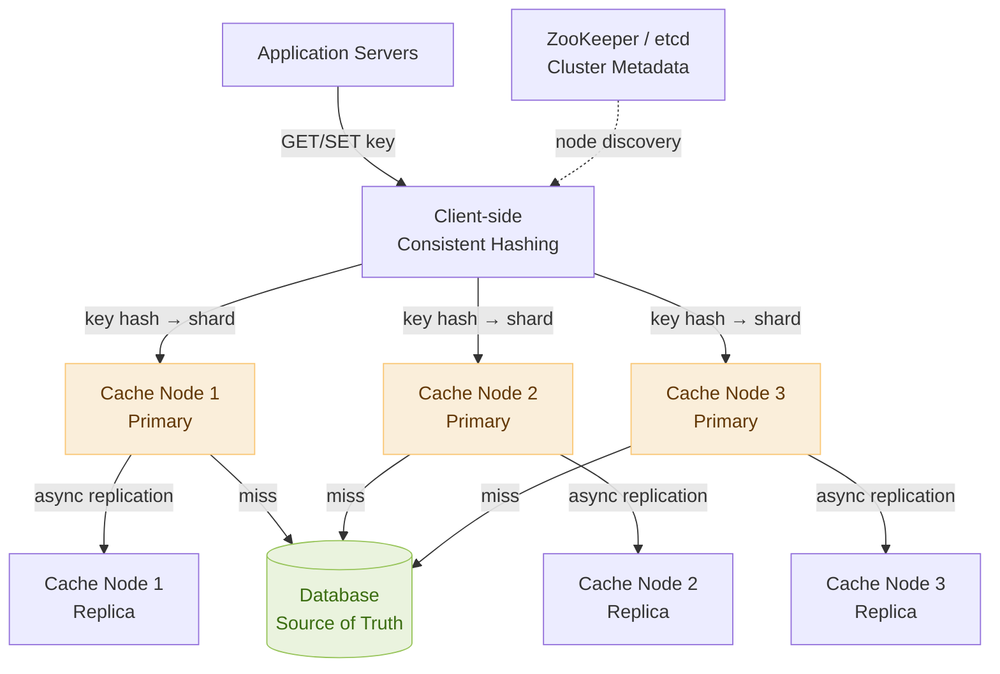

# Day 24 — Heaps & Priority Queues & Design a Distributed Cache

> **30-Day Interview Prep Tracker** | Shobhit Kumar  
> **Date:** ___________  
> **Status:** ⬜ DSA Done | ⬜ System Design Done  
> **Difficulty:** Medium–Hard | **Topic:** Heaps / Priority Queues

---

## Part 1: DSA — Heaps & Priority Queues

### Problem Set

Three problems that cover the essential heap patterns every interviewer expects:

| # | Problem | Heap type | Key pattern |
|---|---------|-----------|-------------|
| **#215** | Kth Largest Element in an Array | Min-heap of size k | Maintain k-element heap |
| **#23** | Merge K Sorted Lists | Min-heap | Multi-way merge |
| **#295** | Find Median from Data Stream | Two heaps | Max-heap + min-heap balanced |

---

### Problem 1: Kth Largest Element (LeetCode #215)

**Statement:** Given an integer array `nums` and an integer `k`, return the `k`th largest element (not the kth distinct element).

```
nums = [3, 2, 1, 5, 6, 4], k = 2  → 5
nums = [3, 2, 3, 1, 2, 4, 5, 5, 6], k = 4  → 4
```

**Core insight:** Maintain a min-heap of size `k`. The heap's minimum is always the kth largest seen so far. When a new element is larger than the heap's min, pop and push.

```
Min-heap of size k:
  For each num:
    push num onto heap
    if heap.size() > k: pop the minimum
  Heap's minimum = kth largest
```

```
Trace: nums=[3,2,1,5,6,4], k=2
Push 3: heap=[3]
Push 2: heap=[2,3]
Push 1: size=3>2, pop min(1): heap=[2,3]
Push 5: size=3>2, pop min(2): heap=[3,5]
Push 6: size=3>2, pop min(3): heap=[5,6]
Push 4: size=3>2, pop min(4): heap=[5,6]
Return heap.peek() = 5 ✓
```

```java
class Solution {
    public int findKthLargest(int[] nums, int k) {
        PriorityQueue<Integer> minHeap = new PriorityQueue<>();
        for (int num : nums) {
            minHeap.offer(num);
            if (minHeap.size() > k) minHeap.poll();
        }
        return minHeap.peek();
    }
}
```

```python
import heapq

class Solution:
    def findKthLargest(self, nums: list[int], k: int) -> int:
        heap = []
        for num in nums:
            heapq.heappush(heap, num)
            if len(heap) > k:
                heapq.heappop(heap)
        return heap[0]
```

> **Why min-heap for kth largest?** Counterintuitive but elegant: a min-heap of size k always holds the k largest elements seen so far, with the kth largest sitting at the top (minimum of those k).

---

### Problem 2: Merge K Sorted Lists (LeetCode #23)

**Statement:** Given an array of `k` linked lists, each sorted in ascending order, merge all lists into one sorted linked list.

```
lists = [[1→4→5], [1→3→4], [2→6]]  →  1→1→2→3→4→4→5→6
```

**Core insight:** Use a min-heap to efficiently find the global minimum across all list heads at each step. Push the next node from the same list when a node is popped.

```
Initialize heap with head nodes of all non-null lists.
While heap is non-empty:
  Pop minimum node → append to result.
  If popped node has a next, push next onto heap.
```

```
Trace: initial heap = [(1,list0), (1,list1), (2,list2)]
Pop (1,list0) → result: 1 → push (4,list0): heap=[(1,list1),(2,list2),(4,list0)]
Pop (1,list1) → result: 1→1 → push (3,list1): heap=[(2,list2),(3,list1),(4,list0)]
Pop (2,list2) → result: 1→1→2 → push (6,list2): heap=[(3,list1),(4,list0),(6,list2)]
...continue until heap empty
```

```java
class Solution {
    public ListNode mergeKLists(ListNode[] lists) {
        PriorityQueue<ListNode> heap = new PriorityQueue<>((a, b) -> a.val - b.val);
        for (ListNode node : lists)
            if (node != null) heap.offer(node);

        ListNode dummy = new ListNode(0), curr = dummy;
        while (!heap.isEmpty()) {
            ListNode node = heap.poll();
            curr.next = node;
            curr = curr.next;
            if (node.next != null) heap.offer(node.next);
        }
        return dummy.next;
    }
}
```

```python
import heapq

class Solution:
    def mergeKLists(self, lists: list) -> object:
        heap = []
        for i, node in enumerate(lists):
            if node:
                heapq.heappush(heap, (node.val, i, node))

        dummy = curr = ListNode(0)
        while heap:
            val, i, node = heapq.heappop(heap)
            curr.next = node
            curr = curr.next
            if node.next:
                heapq.heappush(heap, (node.next.val, i, node.next))
        return dummy.next
```

> **Time:** O(N log k) where N = total nodes, k = number of lists. The heap size stays bounded at k, so each of the N push/pop operations costs O(log k).

---

### Problem 3: Find Median from Data Stream (LeetCode #295)

**Statement:** Design a data structure that supports adding numbers and finding the median efficiently.

```
addNum(1), addNum(2) → findMedian() = 1.5
addNum(3)            → findMedian() = 2.0
```

**Core insight:** Maintain two heaps:
- **Max-heap** (lower half): the largest element is at the top
- **Min-heap** (upper half): the smallest element is at the top
- **Invariant:** max-heap size == min-heap size (even total) or max-heap size == min-heap size + 1 (odd total)
- **Median:** if sizes equal → average of both tops; else → max-heap top

```
State after adding [1, 2, 3, 4, 5]:
  lower (max-heap): [3, 2, 1]   top = 3
  upper (min-heap): [4, 5]      top = 4
  Median = 3 (odd count, max-heap has one more)

After adding 6:
  lower (max-heap): [3, 2, 1]   top = 3
  upper (min-heap): [4, 5, 6]   top = 4
  Median = (3+4)/2 = 3.5 (even count, both tops averaged)
```

```java
class MedianFinder {
    private PriorityQueue<Integer> lower = new PriorityQueue<>(Collections.reverseOrder()); // max-heap
    private PriorityQueue<Integer> upper = new PriorityQueue<>(); // min-heap

    public void addNum(int num) {
        lower.offer(num);
        upper.offer(lower.poll());           // balance: push max of lower to upper
        if (upper.size() > lower.size())
            lower.offer(upper.poll());       // keep lower >= upper in size
    }

    public double findMedian() {
        if (lower.size() > upper.size())
            return lower.peek();
        return (lower.peek() + upper.peek()) / 2.0;
    }
}
```

```python
import heapq

class MedianFinder:
    def __init__(self):
        self.lower = []   # max-heap (negate values)
        self.upper = []   # min-heap

    def addNum(self, num: int) -> None:
        heapq.heappush(self.lower, -num)
        heapq.heappush(self.upper, -heapq.heappop(self.lower))
        if len(self.upper) > len(self.lower):
            heapq.heappush(self.lower, -heapq.heappop(self.upper))

    def findMedian(self) -> float:
        if len(self.lower) > len(self.upper):
            return -self.lower[0]
        return (-self.lower[0] + self.upper[0]) / 2.0
```

---

### Complexity Analysis

| Problem | Time (per op) | Space |
|---------|--------------|-------|
| #215 Kth Largest | O(n log k) total | O(k) |
| #23 Merge K Lists | O(N log k) total | O(k) |
| #295 Add / Find Median | O(log n) / O(1) | O(n) |

---

### Heap Mental Model

```
Heap is just a priority queue under the hood.
  Min-heap: parent ≤ children → smallest is always at root.
  Max-heap: parent ≥ children → largest is always at root.

Java: PriorityQueue is a MIN-heap by default.
      For max-heap: new PriorityQueue<>(Collections.reverseOrder())
Python: heapq is a MIN-heap.
        For max-heap: negate values before pushing (push -x, pop and negate result).

When to reach for a heap:
  "Find the k smallest/largest"    → heap of size k
  "Merge multiple sorted streams"  → multi-way merge with min-heap
  "Running statistic (median, top-k)" → one or two heaps
  "Process events in priority order" → heap as event queue (Dijkstra, Prim)

Common mistake: using a full sort (O(n log n)) when a heap gives O(n log k).
  If k << n, the heap solution is dramatically faster.
```

---

### Related Problems

- **LeetCode #347** — Top K Frequent Elements (frequency-keyed min-heap)
- **LeetCode #373** — Find K Pairs with Smallest Sums (multi-dimensional heap)
- **LeetCode #378** — Kth Smallest Element in a Sorted Matrix (min-heap + BFS)
- **LeetCode #621** — Task Scheduler (greedy + max-heap on task frequencies)

> **Pattern:** Heap problems often have a "k" in them. If you need the k-th something, or the k most/least somethings, or a running window statistic — a heap almost certainly gives you the optimal solution. The key is choosing which element should be at the top of the heap (min or max) and what invariant to maintain.

---

## Part 2: System Design — Distributed Cache (Redis-like)

### Requirements Clarification

#### Functional Requirements
- Set a key-value pair with an optional TTL: `SET key value [EX seconds]`
- Get a value by key: `GET key` → value or null
- Delete a key: `DEL key`
- Support multiple data types: strings, lists, sets, hashes
- Eviction: when memory is full, evict entries per a configured policy (LRU, LFU, TTL)

#### Non-Functional Requirements
- Scale: 100K req/sec per node; 10M req/sec cluster-wide
- Latency: p99 < 1ms for GET/SET (sub-millisecond is the cache contract)
- Availability: 99.99% — cache downtime cascades to DB overload
- Consistency: eventual (cache is a performance layer, not a source of truth)
- Memory: bounded — cache evicts rather than growing unboundedly

---

### High-Level Architecture



---

### Data Partitioning: Consistent Hashing

```
Naive modulo hashing: node = hash(key) % N
Problem: when N changes (add/remove node), almost all keys remap → cache stampede.

Consistent hashing:
  Arrange nodes on a virtual ring of 2^32 positions.
  Each node occupies a position: node_position = hash(node_id)
  A key maps to: traverse ring clockwise from hash(key) → first node encountered.

  Add a node: only the keys in the new node's range remap. ~1/N of keys move.
  Remove a node: only that node's keys move to the next node. Same fraction.

Virtual nodes (vnodes):
  Each physical node owns 150 virtual positions on the ring.
  Improves load balance: without vnodes, 3 nodes might split ring 70/20/10.
  With vnodes, each node's 150 positions spread evenly → ~33% load each.

  Why this matters: add a node and it absorbs keys uniformly from all existing nodes.
```

---

### Inside a Single Cache Node

```
Data structure:
  Hash table: O(1) average GET/SET/DEL.
  Doubly linked list: maintains LRU order without extra O(n) scanning.

  Combined into a LinkedHashMap (Java) or OrderedDict (Python 3.7+):
    On GET: move accessed node to head of LRU list.
    On SET: insert at head; if over capacity, remove tail.
    On DEL: remove node, update list pointers.

Memory layout:
  Each entry: key (string) + value (arbitrary bytes) + TTL timestamp + LRU pointers.
  Typical entry overhead: ~60 bytes metadata + key length + value size.
  1GB RAM → ~10M small entries (10 bytes key + 90 bytes value).

TTL handling:
  Lazy expiration: check TTL on every GET — if expired, delete and return null.
    Pros: simple, no background thread. Cons: stale keys occupy memory until accessed.
  Periodic sweep: background thread scans a random sample of keys every 100ms,
    deletes any that are expired.
    Real Redis uses BOTH: lazy + periodic sweep for bounded memory use.
```

---

### Eviction Policies

```
LRU (Least Recently Used) — most common:
  Evict the key that was accessed least recently.
  Maintained by doubly-linked list; O(1) access order update.
  Best for: general-purpose caches where recent access predicts future access.

LFU (Least Frequently Used):
  Evict the key accessed fewest times overall.
  Harder to implement: need frequency counter per key + min-heap or frequency buckets.
  Better for: skewed workloads where some keys are perennially hot.
  Risk: recently added keys evicted before proving themselves (counter bias).
  Fix: decay counters over time (halve all counts every minute).

TTL-based (volatile-ttl):
  Among keys with a TTL set, evict the one expiring soonest.
  Useful when you have mixed volatile and permanent keys.

Random (allkeys-random):
  Evict a random key. Simple, no bookkeeping.
  Surprisingly effective when access is near-uniform.
  Bad for skewed access (throws away hot keys).

noeviction (Redis default):
  Return an error when memory is full rather than evicting.
  Forces clients to handle the error — appropriate for critical data structures.

Approximate LRU (how Redis actually does it):
  Full LRU requires a linked list touching every node on access — expensive at scale.
  Redis samples N random keys (default 5), evicts the least recently accessed.
  Approximates true LRU with 5–10% error at a fraction of the cost.
```

---

### Replication: Primary-Replica

```
Why replicate?
  Read scaling: route GET requests to replicas, freeing primary for writes.
  Fault tolerance: if primary fails, promote a replica.

Replication mechanics (async):
  1. Client writes SET to primary.
  2. Primary applies change to its in-memory store immediately.
  3. Primary returns OK to client.
  4. Primary async-replicates command to all replicas (via replication stream).
  5. Replicas apply the change.

Replication lag: typically < 1ms on LAN; up to 10ms under load.
  Implication: replica reads may be slightly stale. Acceptable for cache use cases.

Full resync (replica joins or falls behind):
  Primary forks and serializes its dataset (RDB snapshot).
  Replica downloads snapshot, loads it, then receives incremental updates.
  This is expensive — avoid unnecessary replica restarts.

Failover with Sentinel (Redis Sentinel pattern):
  Sentinel daemons monitor primaries.
  Quorum (majority of sentinels) agrees primary is down → elect a new primary.
  Clients get new primary address from sentinel.
  Failover takes 10-30 seconds — during this window: reads from replicas,
  writes return errors or buffer.
```

---

### Cache Invalidation Strategies

```
Cache-aside (lazy loading) — most common:
  Read: check cache → miss → read DB → write to cache → return.
  Write: write to DB → DELETE cache key (don't write to cache on write path).
  Why DELETE not UPDATE on write?
    If you update cache, then DB write fails → cache has stale data with no TTL.
    DELETE forces the next read to go to DB → consistent.
  Risk: thundering herd — many concurrent misses hit DB simultaneously.
  Fix: use a lock/mutex per key; first miss fetches, rest wait and read cache.

Write-through:
  Write to DB and cache simultaneously (or cache writes through to DB).
  Cache is always warm and consistent.
  Cons: writes are slower (must write both); cache fills with data that may never be read.

Write-behind (write-back):
  Write to cache; asynchronously flush to DB later.
  Pros: very fast writes. Cons: data loss if cache node crashes before flush.
  Use only when write durability is not critical.

The double-write problem (Cache-aside):
  T1: write to DB (new value)
  T2: write to DB (another new value)
  T2: DELETE cache
  T1: DELETE cache  ← T1's delete is out of order; value is stale
  Fix: use atomic transactions or optimistic locking + versioning.
```

---

### Handling Cache Failure

```
Cache stampede (thundering herd):
  Problem: cache key expires; 10,000 concurrent requests all miss → 10,000 DB queries.
  Fix 1: Probabilistic early expiration.
    Re-fetch the key slightly before it expires (when remaining TTL < threshold).
    Jitter the expiry time: TTL = base_ttl + random(0, 0.1 * base_ttl).
  Fix 2: Distributed lock (mutex).
    First miss acquires a lock; others wait. Lock holder fetches DB and fills cache.
    Losers read from cache once lock is released.
  Fix 3: Background refresh.
    Serve stale value; async thread refreshes in background (stale-while-revalidate).

Cache penetration (non-existent keys):
  Problem: requests for keys that don't exist in DB or cache bypass cache entirely.
  Attacker repeatedly queries non-existent keys → DB overload.
  Fix 1: Cache null values with a short TTL (e.g., "NOT_FOUND" with 30s TTL).
  Fix 2: Bloom filter at the cache layer.
    False positive rate ~1%: if Bloom says key doesn't exist → return null immediately.
    Never query DB for keys that provably don't exist.

Cache avalanche (mass expiry):
  Problem: many keys set with same TTL expire simultaneously → DB surge.
  Fix: jitter TTL at write time: actual_ttl = base_ttl + random(-10%, +10%).
  Fix: stagger cache warm-up: don't populate all keys at once after a restart.
```

---

### Interview Discussion Points

1. **How does consistent hashing help when adding a new cache node?** → Without it, changing from N to N+1 nodes remaps ~N/(N+1) of all keys (nearly all of them), causing a cache stampede. Consistent hashing moves only ~1/N of keys to the new node — a targeted, bounded migration.
2. **Why is LRU eviction not perfect, and how does Redis approximate it?** → True LRU requires updating a linked list on every access — expensive at millions of ops/sec. Redis samples 5 random keys and evicts the least recently used among them, achieving ~95% of true LRU's hit rate at a fraction of the cost.
3. **What's the difference between cache-aside and write-through? When would you use each?** → Cache-aside: app code manages cache; misses hit DB; writes invalidate cache. Write-through: every write goes to both cache and DB; cache always warm but writes slower. Use cache-aside when reads dominate and cache warmth on write is not critical. Use write-through when cache hit rate must be maximized and write overhead is acceptable.
4. **How do you prevent a thundering herd when a hot cache key expires?** → Three options: (a) probabilistic early refresh with TTL jitter, (b) distributed lock so only one process re-fetches while others wait, (c) background async refresh while serving stale data. In practice, combine jitter + stale-while-revalidate for most cases; use a lock for extremely hot keys.
5. **How would you handle a cache node failure with no data loss?** → Async replication means a small window of lost writes is possible. For loss-intolerant scenarios: synchronous replication (slows writes) or write-behind with a persistent replication log (WAL). For typical cache use cases, losing in-flight writes is acceptable — the source of truth is the DB.

---

## Daily Checklist

- [ ] Solved Kth Largest Element (#215) — explained why min-heap of size k gives kth largest
- [ ] Solved Merge K Sorted Lists (#23) — traced the multi-way merge step-by-step
- [ ] Solved Find Median from Data Stream (#295) — implemented two-heap with correct balancing invariant
- [ ] Solved Top K Frequent Elements (#347) without looking at notes
- [ ] Drew distributed cache architecture from memory (consistent hashing → primary/replica nodes)
- [ ] Can explain the 4 eviction policies and which workload each fits
- [ ] Know cache-aside vs write-through trade-offs
- [ ] Can explain thundering herd and at least two mitigations

---

## My Notes

```
Time taken for DSA: _____ minutes
Time taken for System Design: _____ minutes

What went well:


What to improve:


Key insight I want to remember:


```

---

## Resources

- [LeetCode #215 — Kth Largest Element in an Array](https://leetcode.com/problems/kth-largest-element-in-an-array/)
- [LeetCode #23 — Merge K Sorted Lists](https://leetcode.com/problems/merge-k-sorted-lists/)
- [LeetCode #295 — Find Median from Data Stream](https://leetcode.com/problems/find-median-from-data-stream/)
- [Heap Patterns — NeetCode](https://www.youtube.com/watch?v=YVl58kfE-Lk)
- [System Design: Distributed Cache — ByteByteGo](https://bytebytego.com/courses/system-design-interview/design-a-cache-system)
- [Redis Architecture — Redis Documentation](https://redis.io/docs/management/replication/)
- [Consistent Hashing — Tom White](https://tom-e-white.com/2007/11/consistent-hashing.html)

---

> **Tip of the Day:** In Python, `heapq` only gives you a min-heap. To simulate a max-heap, push `-x` and pop `-result`. For the two-heap median problem, this negation trick is essential — don't try to fight the library with a custom comparator. Write a tiny wrapper if you use this pattern repeatedly.

**Previous:** [Day 23 — Dynamic Programming Patterns + Design a URL Shortener](../DAY-23/day-23-dynamic-programming-url-shortener.md)  
**Next:** [Day 25 — Tries & Design a Search Autocomplete System](../DAY-25/day-25-tries-search-autocomplete.md)
