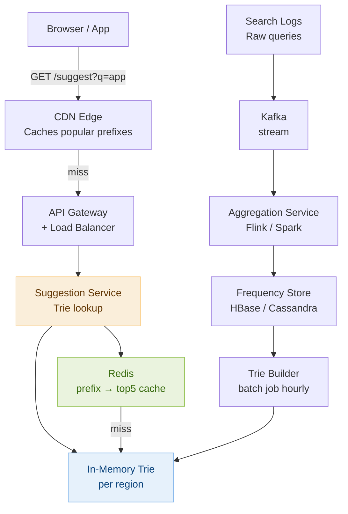

# Day 25 — Tries & Design a Search Autocomplete System

> **30-Day Interview Prep Tracker** | Shobhit Kumar  
> **Date:** ___________  
> **Status:** ⬜ DSA Done | ⬜ System Design Done  
> **Difficulty:** Medium–Hard | **Topic:** Tries (Prefix Trees)

---

## Part 1: DSA — Tries (Prefix Trees)

### Problem Set

Three problems that build from implementing the core data structure to using it in complex search scenarios:

| # | Problem | Trie usage | Key pattern |
|---|---------|-----------|-------------|
| **#208** | Implement Trie | Build the structure | Insert, search, startsWith |
| **#648** | Replace Words | Prefix lookup | Find shortest prefix in Trie |
| **#212** | Word Search II | Trie + DFS on grid | Prune DFS branches using Trie |

---

### Problem 1: Implement Trie (LeetCode #208)

**Statement:** Implement a Trie with `insert(word)`, `search(word)`, and `startsWith(prefix)`.

```
trie.insert("apple")
trie.search("apple")   → true
trie.search("app")     → false
trie.startsWith("app") → true
trie.insert("app")
trie.search("app")     → true
```

**Core insight:** A Trie node holds an array of 26 child pointers (one per letter) and a boolean flag marking end-of-word. Traversal is letter-by-letter — O(L) for a word of length L.

```
Trie structure for "apple", "app", "apt":

root
 └─ a
     └─ p
         ├─ p [END]
         │   └─ l
         │       └─ e [END]
         └─ t [END]
```

```java
class Trie {
    private boolean isEnd;
    private Trie[] children = new Trie[26];

    public void insert(String word) {
        Trie node = this;
        for (char c : word.toCharArray()) {
            int idx = c - 'a';
            if (node.children[idx] == null)
                node.children[idx] = new Trie();
            node = node.children[idx];
        }
        node.isEnd = true;
    }

    public boolean search(String word) {
        Trie node = traverse(word);
        return node != null && node.isEnd;
    }

    public boolean startsWith(String prefix) {
        return traverse(prefix) != null;
    }

    private Trie traverse(String s) {
        Trie node = this;
        for (char c : s.toCharArray()) {
            node = node.children[c - 'a'];
            if (node == null) return null;
        }
        return node;
    }
}
```

```python
class Trie:
    def __init__(self):
        self.children = {}
        self.is_end = False

    def insert(self, word: str) -> None:
        node = self
        for c in word:
            if c not in node.children:
                node.children[c] = Trie()
            node = node.children[c]
        node.is_end = True

    def search(self, word: str) -> bool:
        node = self._traverse(word)
        return node is not None and node.is_end

    def startsWith(self, prefix: str) -> bool:
        return self._traverse(prefix) is not None

    def _traverse(self, s: str):
        node = self
        for c in s:
            if c not in node.children:
                return None
            node = node.children[c]
        return node
```

---

### Problem 2: Replace Words (LeetCode #648)

**Statement:** Given a dictionary of root words and a sentence, replace each word in the sentence with its shortest root from the dictionary. If no root matches, keep the word.

```
dictionary = ["cat","bat","rat"]
sentence   = "the cattle was rattled by the battery"
→ "the cat was rat by the bat"
```

**Core insight:** Insert all roots into a Trie. For each word in the sentence, traverse the Trie character by character — the first `isEnd` node encountered is the shortest matching root.

```java
class Solution {
    public String replaceWords(List<String> dictionary, String sentence) {
        Trie trie = new Trie();
        for (String root : dictionary) trie.insert(root);

        StringBuilder sb = new StringBuilder();
        for (String word : sentence.split(" ")) {
            if (sb.length() > 0) sb.append(' ');
            sb.append(trie.findShortestRoot(word));
        }
        return sb.toString();
    }
}

class Trie {
    boolean isEnd;
    Trie[] children = new Trie[26];

    void insert(String word) {
        Trie node = this;
        for (char c : word.toCharArray()) {
            int i = c - 'a';
            if (node.children[i] == null) node.children[i] = new Trie();
            node = node.children[i];
        }
        node.isEnd = true;
    }

    String findShortestRoot(String word) {
        Trie node = this;
        for (int i = 0; i < word.length(); i++) {
            int idx = word.charAt(i) - 'a';
            if (node.children[idx] == null) break;
            node = node.children[idx];
            if (node.isEnd) return word.substring(0, i + 1);
        }
        return word;
    }
}
```

```python
class Solution:
    def replaceWords(self, dictionary: list[str], sentence: str) -> str:
        trie = {}
        for root in dictionary:
            node = trie
            for c in root:
                node = node.setdefault(c, {})
            node['#'] = True  # end-of-word marker

        result = []
        for word in sentence.split():
            node, prefix = trie, []
            for c in word:
                if c not in node or '#' in node:
                    break
                node = node[c]
                prefix.append(c)
            result.append(''.join(prefix) if '#' in node else word)
        return ' '.join(result)
```

---

### Problem 3: Word Search II (LeetCode #212)

**Statement:** Given an `m×n` board of characters and a list of words, return all words found in the board. Words can be constructed from adjacent cells (4-directional), and each cell may not be reused in the same word.

```
board = [["o","a","a","n"],
         ["e","t","a","e"],
         ["i","h","k","r"],
         ["i","f","l","v"]]
words = ["oath","pea","eat","rain"]  →  ["eat","oath"]
```

**Core insight:** Build a Trie from all words. DFS from every cell, traversing the Trie simultaneously. If the current path reaches an `isEnd` node, record the word. If the current cell's character has no Trie child from the current node, prune the DFS immediately — this is O(N × 4^L) avoided.

```java
class Solution {
    int[][] DIRS = {{0,1},{0,-1},{1,0},{-1,0}};

    public List<String> findWords(char[][] board, String[] words) {
        Trie root = new Trie();
        for (String w : words) root.insert(w);

        List<String> res = new ArrayList<>();
        int m = board.length, n = board[0].length;
        for (int r = 0; r < m; r++)
            for (int c = 0; c < n; c++)
                dfs(board, r, c, root, res);
        return res;
    }

    void dfs(char[][] board, int r, int c, Trie node, List<String> res) {
        if (r < 0 || r >= board.length || c < 0 || c >= board[0].length) return;
        char ch = board[r][c];
        if (ch == '#' || node.children[ch - 'a'] == null) return;

        node = node.children[ch - 'a'];
        if (node.word != null) { res.add(node.word); node.word = null; } // deduplicate

        board[r][c] = '#';  // mark visited
        for (int[] d : DIRS) dfs(board, r + d[0], c + d[1], node, res);
        board[r][c] = ch;   // restore
    }
}

class Trie {
    String word;
    Trie[] children = new Trie[26];
    void insert(String w) {
        Trie node = this;
        for (char c : w.toCharArray()) {
            if (node.children[c-'a'] == null) node.children[c-'a'] = new Trie();
            node = node.children[c-'a'];
        }
        node.word = w;
    }
}
```

> **Pruning optimization:** After finding a word, set `node.word = null` (deduplicate) and optionally prune leaf Trie nodes that are no longer needed. This drastically reduces backtracking on large boards.

---

### Complexity Analysis

| Problem | Time | Space |
|---------|------|-------|
| #208 Implement Trie | O(L) per op, L = word length | O(ALPHABET × N × L) |
| #648 Replace Words | O(N × L) build + O(M × L) query | O(N × L) |
| #212 Word Search II | O(m×n × 4^L) worst case | O(N × L) Trie |

---

### When to Use a Trie

```
Use a Trie when:
  - You need fast prefix lookups (autocomplete, spell-check)
  - You're checking if any of many patterns appears in a text
  - You need to group strings by common prefix
  - You want to find the longest/shortest matching prefix

Hash map comparison:
  HashSet: O(1) exact match, O(N) prefix scan across all stored words
  Trie:    O(L) exact match, O(L) prefix scan — no iteration needed

  For 100K words, HashSet prefix lookup scans all 100K words.
  Trie prefix lookup touches only L nodes (word length, typically 5-15).
  Winner: Trie for prefix operations.
```

---

### Related Problems

- **LeetCode #211** — Design Add and Search Words Data Structure (Trie + wildcard `.`)
- **LeetCode #421** — Maximum XOR of Two Numbers in an Array (Binary Trie)
- **LeetCode #820** — Short Encoding of Words (Trie for suffix sharing)
- **LeetCode #1268** — Search Suggestions System (autocomplete via Trie)

> **Pattern:** Any problem involving prefix matching, autocomplete, or word-by-word string grouping is a Trie candidate. The key mental shift: instead of storing whole strings in a hash set, distribute the characters across tree nodes and share common prefixes implicitly.

---

## Part 2: System Design — Search Autocomplete System (Typeahead)

### Requirements Clarification

#### Functional Requirements
- As a user types a query, return the top 5 suggestions matching the current prefix in < 100ms
- Suggestions ranked by search frequency (most popular completions first)
- Support incremental updates: new popular searches influence future suggestions
- Global: serve users worldwide with consistent low latency

#### Non-Functional Requirements
- Scale: 10M DAU × 20 keystrokes per search × 5 searches/day = 1B suggestion requests/day ≈ 12K req/sec avg, 100K peak
- Latency: p99 < 100ms end-to-end (network + compute)
- Freshness: top suggestions updated within 1 hour of trending shift
- Availability: 99.99% — degraded suggestions are better than no suggestions

---

### High-Level Architecture



---

### Trie Data Structure for Suggestions

```
Each Trie node stores:
  - children: map of char → child node
  - top5: sorted list of (frequency, word) — the 5 best completions rooted here

On prefix lookup "app":
  Traverse: root → 'a' → 'p' → 'p'
  Return node.top5   → ["apple: 1.2M", "application: 800K", "app store: 600K", ...]
  No subtree DFS needed — top5 are pre-computed at build time.
  Time: O(prefix_length) — typically 3-10 chars → effectively O(1).

Building top5 during Trie construction:
  Insert all (word, frequency) pairs.
  Bottom-up pass: each node's top5 = merge of children's top5 lists + own word.
  Use a min-heap of size 5 to maintain top5 efficiently during merge.
  Build time: O(N × L × 5 × log5) ≈ O(N × L).
```

---

### Prefix Caching Layer

```
Observation: users mostly type short prefixes (1-4 chars before clicking a suggestion).
26^1 + 26^2 + 26^3 + 26^4 = 475,254 possible prefixes up to length 4.

Cache ALL prefixes of length ≤ 4 in Redis at build time:
  redis.set("sug:a",    ["amazon", "apple", "airbnb", ...])
  redis.set("sug:ap",   ["apple", "application", "app store", ...])
  redis.set("sug:app",  ["apple", "application", "app store", ...])
  redis.set("sug:appl", ["apple", "application", "applebee's", ...])

475K keys × 200 bytes per entry = ~95MB — trivially fits in Redis.
Cache hit rate for ≤ 4-char prefixes: ~85% of all suggestion requests.

For longer prefixes (5+):
  Real-time Trie lookup — still O(L) and fast from in-memory Trie.
  Cache hot longer prefixes with short TTL (60s): "how to", "weather", "youtube".
```

---

### Data Pipeline: Keeping Suggestions Fresh

```
1. Search event logged:
   User submits query "autocomplete system design"
   → Log appended: { query: "autocomplete system design", ts: 1234567890, user_id: ... }
   → Published to Kafka topic: search-events

2. Stream aggregation (Flink, 10-minute windows):
   Count unique queries per 10 min → write incremental counts to HBase:
   HBase: rowKey = "autocomplete system design", col = freq → increment by 1

3. Hourly Trie rebuild (batch job):
   Read top N=500K queries by frequency from HBase.
   Build new Trie with top5 pre-computed at each node.
   Serialize Trie to binary format (Protocol Buffers).
   Upload to object storage (S3): trie_v42.pb

4. Hot-swap Trie in Suggestion Service:
   Service polls S3 for new Trie version every 5 min.
   On new version: load Trie into memory in background.
   Atomic pointer swap: new Trie becomes active, old one GC'd.
   Zero-downtime update — no restart required.

Freshness guarantee:
  Trending query → logged instantly → aggregated in 10 min → appears in Trie in < 70 min.
  "Breaking news" lag ~1 hour — acceptable for autocomplete.
  For real-time trending (Twitter-scale), add a fast path:
    Real-time top-K from Redis sorted sets (ZINCRBY) — bypasses Trie for trending queries.
```

---

### Handling Scale: Geographic Distribution

```
Global deployment strategy:
  Build one Trie per region (queries in Japan differ from queries in Brazil).
  Deploy Trie to regional cache clusters (3-5 PoPs per continent).
  Suggestion Service reads from the nearest regional Trie.

CDN for popular prefixes:
  Cache /suggest?q=a, /suggest?q=ap, /suggest?q=app ... at CDN edge.
  Cache-Control: max-age=300 (5 min) — balance freshness vs. CDN hit rate.
  For 4-char-or-shorter prefix, CDN handles 85% of global traffic without hitting Suggestion Service.

Client-side optimization:
  Debounce: wait 100ms after last keystroke before sending request.
  Cancel in-flight request when user types next character.
  Prefix cache in browser: if user types "app" and then "appl", reuse "app" results
    to show "appl" results immediately from client-side prefix match.
```

---

### Personalization

```
Global suggestions: ranked purely by global frequency (described above).

Personalized suggestions layer (additive):
  Maintain per-user recent searches in Redis:
    Key: "user_history:{user_id}", Type: Redis Sorted Set
    Score = timestamp, Member = query
    Keep top 50 recent queries.

  On suggestion request with auth token:
    1. Fetch user's recent searches from Redis.
    2. Filter those matching the current prefix.
    3. Blend with global top5: personal results rank higher.
    Result: "amazon" (global #1) + "amazon order status" (user searched yesterday).

  Privacy: never store personalized suggestions in shared cache.
    User-specific responses bypass CDN (Cache-Control: private).
```

---

### Interview Discussion Points

1. **How do you keep the Trie updated without downtime?** → Build a new Trie in the background from the updated frequency store, serialize it, and hot-swap it into the Suggestion Service via an atomic pointer swap. Requests continue being served by the old Trie until the new one is fully loaded. Rebuild happens hourly.
2. **How does the system handle a sudden trending query (breaking news)?** → The batch Trie rebuild has ~1-hour lag. Add a real-time fast path: a Redis Sorted Set tracks real-time query counts (ZINCRBY) in a 5-minute sliding window. For queries above a frequency threshold, inject them into suggestions before the Trie results. This gives sub-minute trending query support.
3. **Why store top5 at every Trie node instead of computing at query time?** → Computing top-5 from a subtree DFS at query time is O(subtree_size) — could be millions of nodes for a single-character prefix like "a". Pre-computing top5 during build makes every lookup O(prefix_length) ≈ O(1). The trade-off is more memory and longer build times.
4. **How would you handle 50 languages / non-Latin scripts?** → Use a Unicode-indexed Trie (HashMap children instead of fixed array[26]). Build separate Tries per language. Route requests to the correct Trie based on the user's browser locale. For CJK scripts, tokenize differently (pinyin for Chinese, morphemes for Japanese).
5. **How do you prevent offensive or spam queries from appearing in autocomplete?** → Blocklist filtering: maintain a set of prohibited terms. After fetching top5, filter any blocked terms. Blocklist stored in Redis (SISMEMBER check in microseconds). Additionally, run the frequency aggregation through a spam classifier — flag queries from bots or sudden frequency spikes from one IP block.

---

## Daily Checklist

- [ ] Implemented Trie from scratch (#208) without looking at notes
- [ ] Solved Replace Words (#648) — traced the shortest-root lookup through the Trie
- [ ] Solved Word Search II (#212) — understood how Trie prunes DFS branches
- [ ] Solved Design Add and Search Words (#211) with wildcard `.` support
- [ ] Drew autocomplete architecture from memory (Kafka → HBase → Trie builder → Suggestion Service)
- [ ] Can explain why top5 is pre-computed at each Trie node
- [ ] Know the CDN prefix caching strategy for ≤ 4-char prefixes
- [ ] Understand the hot-swap Trie update mechanism

---

## My Notes

```
Time taken for DSA: _____ minutes
Time taken for System Design: _____ minutes

What went well:


What to improve:


Key insight I want to remember:


```

---

## Resources

- [LeetCode #208 — Implement Trie](https://leetcode.com/problems/implement-trie-prefix-tree/)
- [LeetCode #648 — Replace Words](https://leetcode.com/problems/replace-words/)
- [LeetCode #212 — Word Search II](https://leetcode.com/problems/word-search-ii/)
- [Trie Explained — NeetCode](https://www.youtube.com/watch?v=oobqoCJlHA0)
- [System Design: Typeahead — ByteByteGo](https://bytebytego.com/courses/system-design-interview/design-a-search-autocomplete-system)

---

> **Tip of the Day:** In Word Search II, the key insight is that you're doing DFS on the board and Trie traversal simultaneously. When you move to a neighbor cell, you also move to the corresponding child in the Trie. If the child doesn't exist, you prune the DFS immediately — no need to explore that direction. This is the power of Trie over a HashSet of words.

**Previous:** [Day 24 — Heaps & Priority Queues + Design a Distributed Cache](../DAY-24/day-24-heaps-priority-queues-distributed-cache.md)  
**Next:** [Day 26 — Backtracking + Design a Notification System](../DAY-26/day-26-backtracking-notification-system.md)
