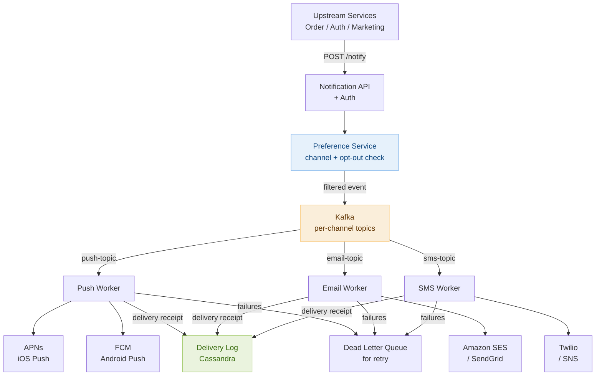

# Day 26 — Backtracking & Design a Notification System

> **30-Day Interview Prep Tracker** | Shobhit Kumar  
> **Date:** ___________  
> **Status:** ⬜ DSA Done | ⬜ System Design Done  
> **Difficulty:** Medium–Hard | **Topic:** Backtracking

---

## Part 1: DSA — Backtracking

### Problem Set

Three problems that cover the three core backtracking patterns:

| # | Problem | Pattern | Key idea |
|---|---------|---------|----------|
| **#17** | Letter Combinations of Phone Number | All combinations | Build string char-by-char |
| **#78** | Subsets | Power set | Include/exclude each element |
| **#79** | Word Search | Grid + path | DFS + visited marking |

---

### Problem 2: Letter Combinations of a Phone Number (LeetCode #17)

**Statement:** Given a string of digits 2-9, return all possible letter combinations the number could represent (T9 phone keyboard).

```
Input: "23"  →  ["ad","ae","af","bd","be","bf","cd","ce","cf"]
Input: ""    →  []
```

**Core insight:** At each digit, branch on all letters it maps to. Recurse on the remaining digits, backtrack by removing the last character.

```
Map: 2→abc, 3→def, 4→ghi, 5→jkl, 6→mno, 7→pqrs, 8→tuv, 9→wxyz

Decision tree for "23":
root
├─ a ─── ad, ae, af
├─ b ─── bd, be, bf
└─ c ─── cd, ce, cf
```

```java
class Solution {
    private static final String[] MAP = {"","","abc","def","ghi","jkl","mno","pqrs","tuv","wxyz"};

    public List<String> letterCombinations(String digits) {
        List<String> res = new ArrayList<>();
        if (digits.isEmpty()) return res;
        backtrack(digits, 0, new StringBuilder(), res);
        return res;
    }

    private void backtrack(String digits, int idx, StringBuilder curr, List<String> res) {
        if (idx == digits.length()) { res.add(curr.toString()); return; }
        for (char c : MAP[digits.charAt(idx) - '0'].toCharArray()) {
            curr.append(c);
            backtrack(digits, idx + 1, curr, res);
            curr.deleteCharAt(curr.length() - 1);  // backtrack
        }
    }
}
```

```python
class Solution:
    MAP = ["", "", "abc", "def", "ghi", "jkl", "mno", "pqrs", "tuv", "wxyz"]

    def letterCombinations(self, digits: str) -> list[str]:
        if not digits:
            return []
        res = []

        def backtrack(idx: int, curr: list[str]) -> None:
            if idx == len(digits):
                res.append(''.join(curr))
                return
            for c in self.MAP[int(digits[idx])]:
                curr.append(c)
                backtrack(idx + 1, curr)
                curr.pop()  # backtrack

        backtrack(0, [])
        return res
```

---

### Problem 2: Subsets (LeetCode #78)

**Statement:** Given an integer array `nums` with unique elements, return all possible subsets (the power set).

```
nums = [1, 2, 3]
→ [[], [1], [2], [3], [1,2], [1,3], [2,3], [1,2,3]]
```

**Core insight:** For each element, make a binary choice — include or exclude. The result has 2^n subsets. To avoid duplicates, only consider elements at index `start` and beyond.

```
Decision tree for [1,2,3]:
                []
          /         \
        [1]          []
       /   \        /   \
    [1,2]  [1]   [2]    []
    /  \   / \   / \   /  \
[1,2,3][1,2][1,3][1][2,3][2][3][]
```

```java
class Solution {
    public List<List<Integer>> subsets(int[] nums) {
        List<List<Integer>> res = new ArrayList<>();
        backtrack(nums, 0, new ArrayList<>(), res);
        return res;
    }

    private void backtrack(int[] nums, int start, List<Integer> curr, List<List<Integer>> res) {
        res.add(new ArrayList<>(curr));  // add at every node, not just leaves
        for (int i = start; i < nums.length; i++) {
            curr.add(nums[i]);
            backtrack(nums, i + 1, curr, res);
            curr.remove(curr.size() - 1);  // backtrack
        }
    }
}
```

```python
class Solution:
    def subsets(self, nums: list[int]) -> list[list[int]]:
        res = []

        def backtrack(start: int, curr: list[int]) -> None:
            res.append(curr[:])  # snapshot at every node
            for i in range(start, len(nums)):
                curr.append(nums[i])
                backtrack(i + 1, curr)
                curr.pop()  # backtrack

        backtrack(0, [])
        return res
```

> **Key:** `res.add` happens at every recursive call, not just at the leaf. This collects all intermediate subsets.

---

### Problem 3: Word Search (LeetCode #79)

**Statement:** Given an `m×n` grid of characters and a string `word`, return `true` if `word` exists in the grid. The word can be constructed from adjacent cells (4-directional), and each cell may only be used once.

```
board = [["A","B","C","E"],
         ["S","F","C","S"],
         ["A","D","E","E"]]
word = "ABCCED"  →  true
word = "SEE"     →  true
word = "ABCB"    →  false (can't reuse B)
```

**Core insight:** DFS from every cell. Mark the current cell as visited by replacing it with a sentinel (e.g., `#`). Restore on backtrack.

```java
class Solution {
    public boolean exist(char[][] board, String word) {
        int m = board.length, n = board[0].length;
        for (int r = 0; r < m; r++)
            for (int c = 0; c < n; c++)
                if (dfs(board, word, r, c, 0)) return true;
        return false;
    }

    private boolean dfs(char[][] board, String word, int r, int c, int idx) {
        if (idx == word.length()) return true;
        if (r < 0 || r >= board.length || c < 0 || c >= board[0].length) return false;
        if (board[r][c] != word.charAt(idx)) return false;

        char tmp = board[r][c];
        board[r][c] = '#';  // mark visited
        boolean found = dfs(board, word, r+1, c, idx+1) ||
                        dfs(board, word, r-1, c, idx+1) ||
                        dfs(board, word, r, c+1, idx+1) ||
                        dfs(board, word, r, c-1, idx+1);
        board[r][c] = tmp;  // restore (backtrack)
        return found;
    }
}
```

```python
class Solution:
    def exist(self, board: list[list[str]], word: str) -> bool:
        m, n = len(board), len(board[0])

        def dfs(r: int, c: int, idx: int) -> bool:
            if idx == len(word): return True
            if r < 0 or r >= m or c < 0 or c >= n: return False
            if board[r][c] != word[idx]: return False

            board[r][c] = '#'   # mark visited
            found = (dfs(r+1,c,idx+1) or dfs(r-1,c,idx+1) or
                     dfs(r,c+1,idx+1) or dfs(r,c-1,idx+1))
            board[r][c] = word[idx]  # restore
            return found

        return any(dfs(r, c, 0) for r in range(m) for c in range(n))
```

---

### Complexity Analysis

| Problem | Time | Space |
|---------|------|-------|
| #17 Letter Combinations | O(4^n × n) — at most 4 letters per digit | O(n) call stack |
| #78 Subsets | O(2^n × n) | O(n) call stack |
| #79 Word Search | O(m×n × 4^L) — L = word length | O(L) call stack |

---

### The Backtracking Template

```
All backtracking problems follow this structure:

def backtrack(start, current_state):
    if is_solution(current_state):
        result.add(copy_of(current_state))
        return   # or continue if collecting all solutions

    for choice in available_choices(start):
        if is_valid(choice):
            apply(choice, current_state)         # make the move
            backtrack(next_start, current_state)  # recurse
            undo(choice, current_state)           # backtrack

Three questions to ask:
  1. What is the "current state"? (path so far, current combination, etc.)
  2. What are the "available choices" at each step?
  3. What is the base case / success condition?

Pruning (makes backtracking fast):
  - Check validity BEFORE recursing, not after.
  - Sort input and skip duplicate elements when order doesn't matter.
  - Use bounds checks to cut branches early (e.g., remaining sum can't reach target).
```

---

### Related Problems

- **LeetCode #39** — Combination Sum (unbounded — reuse elements)
- **LeetCode #46** — Permutations (order matters, no element reuse)
- **LeetCode #51** — N-Queens (constraint satisfaction)
- **LeetCode #131** — Palindrome Partitioning (partition string into palindromes)

> **Pattern:** Backtracking = DFS on a decision tree + undo. Recognize it when the problem asks for "all possible" combinations, permutations, or paths. The undo step is what makes it backtracking — without it, it's just DFS. Always snapshot mutable state before adding to results.

---

## Part 2: System Design — Notification System

### Requirements Clarification

#### Functional Requirements
- Send notifications to users via multiple channels: push (iOS/Android), email, SMS
- Support notification types: transactional (OTP, order confirmation) and marketing (promotions)
- Users can set preferences: opt out of marketing, choose channels per notification type
- Delivery guarantees: transactional notifications must be delivered at least once
- Support scheduling: send notification at a future time

#### Non-Functional Requirements
- Scale: 10M notifications/day transactional, 100M/day marketing campaigns
- Latency: transactional p99 < 5s; marketing best-effort (minutes to hours acceptable)
- Availability: 99.99% — missed OTP is a critical failure
- Reliability: at-least-once delivery with deduplication on the receiver side

---

### High-Level Architecture



---

### Notification Request Flow

```
1. Caller (Order Service) posts to Notification API:
   POST /notify
   {
     "user_id": "u123",
     "type": "ORDER_SHIPPED",
     "data": { "order_id": "o456", "eta": "2026-05-10" },
     "idempotency_key": "order-o456-shipped"
   }

2. Notification API:
   a. Validate request (auth, schema).
   b. Check idempotency key in Redis — if seen, return 200 (already queued).
   c. Store idempotency key: SET ik:{key} "queued" EX 86400.
   d. Enrich with template: "Your order #o456 has shipped! Expected: May 10."
   e. Publish to Kafka topic: notification-requests.

3. Preference Service (Kafka consumer):
   a. Fetch user preferences: does u123 want push? email? SMS?
   b. Fetch user's registered devices (device tokens for push).
   c. Check opt-out list for marketing — skip if opted out.
   d. Fan out: publish one event per channel to channel-specific topics:
      - push-notifications (with FCM/APNs token)
      - email-notifications (with email address)
      - sms-notifications (with phone number)

4. Channel Workers consume from their topic and call the 3rd-party provider.
5. On success: write delivery receipt to Cassandra.
6. On failure: publish to Dead Letter Queue for retry.
```

---

### Idempotency & Deduplication

```
Why needed: Kafka consumer may process a message more than once (at-least-once delivery).
  Without deduplication: user receives duplicate push notifications.

Idempotency key (from caller):
  Caller generates a unique key per logical notification event:
    "order-o456-shipped" — safe to retry; system deduplicates.
  Check at API layer: Redis SET NX (set if not exists) with 24h TTL.
  If key already exists → skip enqueueing → return 200 OK.

Message ID deduplication at worker layer:
  Each Kafka message carries a UUID (message_id).
  Worker checks: SELECT 1 FROM delivery_log WHERE message_id = ?
  If found → skip sending → acknowledge Kafka offset.
  If not found → send → write delivery_log → acknowledge.

  Race condition: two workers process same message simultaneously.
  Fix: use DB unique constraint on message_id. Second INSERT fails → safe to skip.
```

---

### Retry Strategy & Dead Letter Queue

```
Transient failures (provider timeout, rate limit):
  Worker catches exception → does NOT acknowledge Kafka offset.
  Kafka re-delivers message after a backoff:
    Attempt 1: immediate
    Attempt 2: 30s
    Attempt 3: 2 min
    Attempt 4: 10 min
    Attempt 5: give up → publish to Dead Letter Queue (DLQ)

  Exponential backoff prevents hammering a degraded provider.

Dead Letter Queue (DLQ):
  Separate Kafka topic: push-dlq, email-dlq, sms-dlq.
  DLQ consumer retries hourly for up to 24h.
  After 24h: mark notification as FAILED in delivery_log.
  Alert on-call if DLQ depth > threshold.

Provider failover:
  Primary email provider: SendGrid.
  If SendGrid error rate > 5% in last 60s → route to fallback: Amazon SES.
  Circuit breaker (Hystrix pattern) per provider:
    CLOSED → OPEN (on repeated failures) → HALF-OPEN (probe) → CLOSED.
```

---

### Channel-Specific Concerns

```
Push Notifications (iOS/Android):
  APNs (Apple): HTTP/2 persistent connection; payload ≤ 4KB; token-based auth (JWT).
  FCM (Google): HTTP v1 API; payload ≤ 4KB for data, ≤ 240 bytes for notification.
  Device token management: tokens expire/rotate when app is reinstalled.
    On APNs invalid-token response: delete token from DB → stop sending to that device.
  Silent push: wake up app in background to fetch fresh data without showing a banner.

Email:
  Deliverability: authenticate with SPF, DKIM, DMARC to avoid spam folders.
  Rate limits: ISPs rate-limit sending IPs. Warm up new IPs gradually.
  Unsubscribe: include one-click unsubscribe link (RFC 8058). Required by Gmail/Yahoo.
  Templates: store in S3 + use Mustache/Handlebars for variable substitution.

SMS:
  Most expensive channel ($0.0075–$0.05/message vs. email fractions of a cent).
  Regulatory: TCPA (US) requires explicit opt-in for marketing SMS. Never send without consent.
  Character limit: 160 chars per SMS segment. Messages split into multiple segments billed separately.
  International: use Twilio or AWS SNS for global routing. Number must be registered per country.
```

---

### Scheduling & Rate Limiting

```
Scheduled notifications:
  POST /notify with "send_at": "2026-05-10T09:00:00Z"
  API stores in a scheduled_notifications table:
    (notification_id, send_at, payload, status=PENDING)
  Scheduler job (cron every minute):
    SELECT * FROM scheduled_notifications WHERE send_at <= NOW() AND status='PENDING'
    → publish to Kafka → update status=QUEUED
  For high-volume marketing campaigns, batch into hourly windows.

Rate limiting (protect providers + users):
  Per-user: max 10 push notifications/hour (prevent notification spam).
  Per-provider: respect SendGrid's 100 req/sec API rate limit.
    Implement token bucket in Redis per provider:
      INCRBY sendgrid:rps:tokens (replenish 100/sec, max 100)
      If tokens > 0 → consume → send. Else → delay.

Campaign management:
  Marketing blast to 50M users requires:
  - Segment users into batches of 10K.
  - Publish batches to Kafka over 5-hour window to avoid rate limit spikes.
  - Track delivery rate per campaign in real-time → pause if bounce rate > 5%.
```

---

### Interview Discussion Points

1. **Why use Kafka between API and channel workers instead of calling providers directly?** → Kafka decouples producers from consumers, absorbs traffic spikes (marketing campaigns of 100M messages don't overwhelm providers), enables at-least-once delivery with replay, and allows multiple consumers (e.g., analytics, delivery tracking) to tap the same stream without coupling.
2. **How do you guarantee a transactional notification (OTP) is delivered?** → At-least-once Kafka delivery + idempotency deduplication at the worker. If the provider fails, retry with exponential backoff up to 24h. Alert on failure; for OTPs specifically, allow the user to request a resend. SLA: 95% delivered within 10s; 99% within 60s.
3. **How would you handle 50M user marketing campaigns efficiently?** → Pre-segment users into shards (batch job). Publish shard events to Kafka over a 5-hour window (rate-controlled). Workers consume at the provider's rate limit. Track delivery metrics per campaign in real-time and halt if bounce rate exceeds threshold.
4. **How do you handle user preference changes mid-campaign?** → Workers re-check preferences at send time, not just at fan-out time. Store preferences in a fast read store (Redis or Cassandra). If the user opted out between campaign launch and individual message processing, skip silently.
5. **How would you design the delivery tracking / analytics?** → Each worker writes a delivery receipt event to Kafka on success or failure. A Flink job aggregates into counters: sent, delivered, failed, opened (from email tracking pixel). Results stored in ClickHouse for dashboard queries. Real-time delivery rate visible < 30s after each batch.

---

## Daily Checklist

- [ ] Solved Letter Combinations of Phone Number (#17) — traced the decision tree for "23"
- [ ] Solved Subsets (#78) — explained why `res.add` happens at every node not just leaves
- [ ] Solved Word Search (#79) — verified the backtrack (board restore) step is correct
- [ ] Solved Combination Sum (#39) without looking at notes
- [ ] Drew notification system architecture from memory (API → Kafka → workers → providers)
- [ ] Can explain idempotency key + deduplication at both API and worker layers
- [ ] Know retry strategy: exponential backoff + DLQ
- [ ] Understand the 3 channel-specific constraints (APNs token rotation, DKIM email auth, TCPA SMS consent)

---

## My Notes

```
Time taken for DSA: _____ minutes
Time taken for System Design: _____ minutes

What went well:


What to improve:


Key insight I want to remember:


```

---

## Resources

- [LeetCode #17 — Letter Combinations of Phone Number](https://leetcode.com/problems/letter-combinations-of-a-phone-number/)
- [LeetCode #78 — Subsets](https://leetcode.com/problems/subsets/)
- [LeetCode #79 — Word Search](https://leetcode.com/problems/word-search/)
- [Backtracking Template — NeetCode](https://www.youtube.com/watch?v=pfiQ_PS1g8E)
- [System Design: Notification System — ByteByteGo](https://bytebytego.com/courses/system-design-interview/design-a-notification-system)

---

> **Tip of the Day:** The most common backtracking bug is forgetting the undo step. A helpful mental model: imagine the state as a whiteboard. Before recursing, you write on the whiteboard. When the recursion returns, you erase what you wrote. If you don't erase, the next branch starts with stale state and produces wrong results.

**Previous:** [Day 25 — Tries + Design a Search Autocomplete System](../DAY-25/day-25-tries-search-autocomplete.md)  
**Next:** [Day 27 — Topological Sort + Design a Ride-sharing Service](../DAY-27/day-27-topological-sort-ride-sharing.md)
