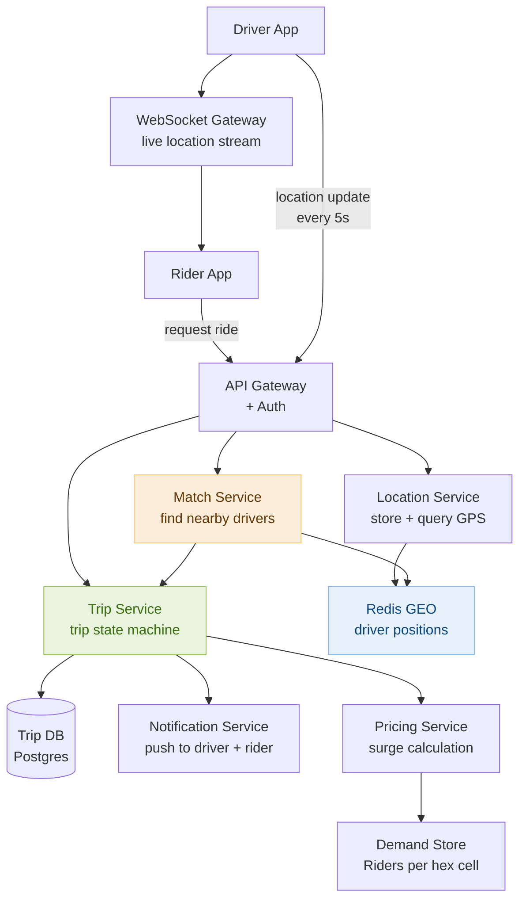

# Day 27 — Topological Sort & Design a Ride-sharing Service (Uber)

> **30-Day Interview Prep Tracker** | Shobhit Kumar  
> **Date:** ___________  
> **Status:** ⬜ DSA Done | ⬜ System Design Done  
> **Difficulty:** Hard | **Topic:** Topological Sort / Directed Graphs

---

## Part 1: DSA — Topological Sort

### Problem Set

Three problems covering cycle detection, ordering, and applying topological sort to non-obvious inputs:

| # | Problem | Pattern | Key insight |
|---|---------|---------|-------------|
| **#207** | Course Schedule | Cycle detection | Topo sort exists iff no cycle |
| **#210** | Course Schedule II | Actual ordering | Return topo-sorted order |
| **#310** | Minimum Height Trees | Reverse topo (leaf pruning) | Iteratively trim leaves |

---

### Problem 1: Course Schedule (LeetCode #207)

**Statement:** Given `numCourses` and a list of `[a, b]` prerequisites (must take `b` before `a`), determine if you can finish all courses.

```
numCourses=2, prerequisites=[[1,0]]      → true  (take 0 then 1)
numCourses=2, prerequisites=[[1,0],[0,1]] → false (cycle: 0→1→0)
```

**Core insight:** Build a directed graph. If the graph has a cycle, courses can't all be finished. Detect cycles using DFS with three states: UNVISITED (0), IN_PROGRESS (1), DONE (2). If DFS reaches an IN_PROGRESS node, a cycle exists.

```
States during DFS:
  0 (WHITE): not yet visited
  1 (GRAY):  currently in DFS stack → hitting this means cycle
  2 (BLACK): fully processed, no cycle from here
```

```java
class Solution {
    public boolean canFinish(int n, int[][] prereqs) {
        List<List<Integer>> adj = new ArrayList<>();
        for (int i = 0; i < n; i++) adj.add(new ArrayList<>());
        for (int[] p : prereqs) adj.get(p[1]).add(p[0]);

        int[] state = new int[n];
        for (int i = 0; i < n; i++)
            if (state[i] == 0 && hasCycle(adj, state, i)) return false;
        return true;
    }

    private boolean hasCycle(List<List<Integer>> adj, int[] state, int node) {
        state[node] = 1;  // gray: in progress
        for (int next : adj.get(node)) {
            if (state[next] == 1) return true;   // back edge = cycle
            if (state[next] == 0 && hasCycle(adj, state, next)) return true;
        }
        state[node] = 2;  // black: done
        return false;
    }
}
```

```python
class Solution:
    def canFinish(self, numCourses: int, prerequisites: list[list[int]]) -> bool:
        adj = [[] for _ in range(numCourses)]
        for a, b in prerequisites:
            adj[b].append(a)

        state = [0] * numCourses  # 0=unvisited, 1=in-progress, 2=done

        def has_cycle(node: int) -> bool:
            state[node] = 1
            for nxt in adj[node]:
                if state[nxt] == 1: return True
                if state[nxt] == 0 and has_cycle(nxt): return True
            state[node] = 2
            return False

        return not any(state[i] == 0 and has_cycle(i) for i in range(numCourses))
```

---

### Problem 2: Course Schedule II (LeetCode #210)

**Statement:** Return the ordering in which courses should be taken. If impossible (cycle), return `[]`.

```
numCourses=4, prerequisites=[[1,0],[2,0],[3,1],[3,2]]  →  [0,1,2,3] or [0,2,1,3]
numCourses=2, prerequisites=[[1,0],[0,1]]               →  []
```

**Method 1 — DFS post-order:** Push to result AFTER all descendants are processed. Reverse the result.

**Method 2 — BFS (Kahn's Algorithm):** Process nodes with in-degree 0 first, decrement neighbors' in-degrees.

```java
// Kahn's BFS approach
class Solution {
    public int[] findOrder(int n, int[][] prereqs) {
        int[] inDegree = new int[n];
        List<List<Integer>> adj = new ArrayList<>();
        for (int i = 0; i < n; i++) adj.add(new ArrayList<>());
        for (int[] p : prereqs) {
            adj.get(p[1]).add(p[0]);
            inDegree[p[0]]++;
        }

        Queue<Integer> queue = new LinkedList<>();
        for (int i = 0; i < n; i++)
            if (inDegree[i] == 0) queue.offer(i);

        int[] order = new int[n];
        int idx = 0;
        while (!queue.isEmpty()) {
            int node = queue.poll();
            order[idx++] = node;
            for (int next : adj.get(node)) {
                if (--inDegree[next] == 0) queue.offer(next);
            }
        }
        return idx == n ? order : new int[]{};  // cycle check: processed all?
    }
}
```

```python
from collections import deque

class Solution:
    def findOrder(self, numCourses: int, prerequisites: list[list[int]]) -> list[int]:
        adj = [[] for _ in range(numCourses)]
        in_degree = [0] * numCourses
        for a, b in prerequisites:
            adj[b].append(a)
            in_degree[a] += 1

        queue = deque(i for i in range(numCourses) if in_degree[i] == 0)
        order = []
        while queue:
            node = queue.popleft()
            order.append(node)
            for nxt in adj[node]:
                in_degree[nxt] -= 1
                if in_degree[nxt] == 0:
                    queue.append(nxt)

        return order if len(order) == numCourses else []
```

```
Kahn's trace for [[1,0],[2,0],[3,1],[3,2]]:
  in_degree: [0,1,1,2]
  queue: [0]

  Process 0 → order=[0], decrement: in_degree[1]=0, in_degree[2]=0 → queue=[1,2]
  Process 1 → order=[0,1], decrement: in_degree[3]=1 → queue=[2]
  Process 2 → order=[0,1,2], decrement: in_degree[3]=0 → queue=[3]
  Process 3 → order=[0,1,2,3] ✓
```

---

### Problem 3: Minimum Height Trees (LeetCode #310)

**Statement:** Given a tree with `n` nodes (edges given as undirected), return all nodes that could be the root of a minimum height tree (MHT). At most 2 such roots exist.

```
n=4, edges=[[1,0],[1,2],[1,3]]  →  [1]
n=6, edges=[[3,0],[3,1],[3,2],[3,4],[5,4]]  →  [3,4]
```

**Core insight:** The MHT root(s) are always the center node(s) of the longest path. Find them by iteratively removing leaf nodes (degree 1) inward — like peeling an onion — until 1 or 2 nodes remain. This is reverse topological sort.

```
Iteratively trim leaves:
  Leaves: nodes with degree == 1
  Remove leaves → their neighbors' degree drops → new leaves emerge
  Repeat until 1 or 2 nodes remain → those are the MHT roots

Round 1: remove outer leaves
Round 2: remove next-layer leaves
...until center is reached
```

```java
class Solution {
    public List<Integer> findMinHeightTrees(int n, int[][] edges) {
        if (n == 1) return List.of(0);
        int[] degree = new int[n];
        List<Set<Integer>> adj = new ArrayList<>();
        for (int i = 0; i < n; i++) adj.add(new HashSet<>());
        for (int[] e : edges) {
            adj.get(e[0]).add(e[1]);
            adj.get(e[1]).add(e[0]);
            degree[e[0]]++;
            degree[e[1]]++;
        }

        Queue<Integer> leaves = new LinkedList<>();
        for (int i = 0; i < n; i++) if (degree[i] == 1) leaves.offer(i);

        int remaining = n;
        while (remaining > 2) {
            int size = leaves.size();
            remaining -= size;
            for (int i = 0; i < size; i++) {
                int leaf = leaves.poll();
                for (int neighbor : adj.get(leaf)) {
                    if (--degree[neighbor] == 1) leaves.offer(neighbor);
                }
            }
        }
        return new ArrayList<>(leaves);
    }
}
```

```python
from collections import deque

class Solution:
    def findMinHeightTrees(self, n: int, edges: list[list[int]]) -> list[int]:
        if n == 1: return [0]
        adj = [set() for _ in range(n)]
        for u, v in edges:
            adj[u].add(v)
            adj[v].add(u)

        leaves = deque(i for i in range(n) if len(adj[i]) == 1)
        remaining = n
        while remaining > 2:
            remaining -= len(leaves)
            new_leaves = deque()
            while leaves:
                leaf = leaves.popleft()
                neighbor = adj[leaf].pop()
                adj[neighbor].discard(leaf)
                if len(adj[neighbor]) == 1:
                    new_leaves.append(neighbor)
            leaves = new_leaves
        return list(leaves)
```

---

### Complexity Analysis

| Problem | Time | Space |
|---------|------|-------|
| #207 Course Schedule | O(V + E) | O(V + E) |
| #210 Course Schedule II | O(V + E) | O(V + E) |
| #310 Minimum Height Trees | O(V + E) | O(V + E) |

---

### DFS vs BFS for Topological Sort

```
DFS (post-order):
  Recurse into all dependencies before pushing to result.
  Natural for detecting cycles (gray/black coloring).
  Result is built in reverse — need to reverse at end.
  Intuition: "finish all dependencies before finishing yourself."

BFS / Kahn's Algorithm:
  Start with nodes that have no dependencies (in-degree = 0).
  Process them, reduce neighbors' in-degree, enqueue new 0-in-degree nodes.
  Cycle detection is free: if processed count < n, cycle exists.
  Intuition: "take courses you can already take."

When to use which:
  Cycle detection only → DFS is simpler.
  Need the ordering + cycle detection → BFS (Kahn's) is cleaner.
  Processing in layers (level-by-level dependencies) → BFS.
```

---

### Related Problems

- **LeetCode #269** — Alien Dictionary (topo sort on character ordering — hard)
- **LeetCode #444** — Sequence Reconstruction (verify unique topo ordering)
- **LeetCode #1203** — Sort Items by Groups Respecting Dependencies (nested topo sort)
- **LeetCode #329** — Longest Increasing Path in a Matrix (DFS + memoization = topo order)

> **Pattern:** Topological sort applies to any DAG where you need a valid processing order. Prerequisites, build order, task scheduling — all are the same problem. The cycle detection insight — "a schedule is possible iff the dependency graph is acyclic" — is one of the most practically useful graph facts in software engineering.

---

## Part 2: System Design — Ride-sharing Service (Uber/Lyft)

### Requirements Clarification

#### Functional Requirements
- Rider requests a ride from location A to B
- System finds nearby available drivers and matches the closest one
- Real-time location tracking of driver during trip
- Trip pricing: estimate before booking, final price after trip
- Driver and rider ratings post-trip

#### Non-Functional Requirements
- Scale: 5M trips/day; 500K concurrent active sessions (peak evening rush)
- Location update frequency: drivers send GPS every 5 seconds → 500K × 0.2/sec = 100K location updates/sec
- Matching latency: rider sees a driver within 5 seconds of requesting
- Availability: 99.99% — downtime during peak hours loses significant revenue
- Consistency: eventual — slight delay in location is acceptable; wrong trip state is not

---

### High-Level Architecture



---

### Location Service: Storing & Querying Driver Positions

```
Challenge: 500K drivers updating location every 5 seconds.
  100K writes/sec × 20 bytes/update = 2MB/sec (trivial bandwidth).
  Need to answer: "Find all available drivers within 5km of (lat, lng)."

Solution: Redis GEO commands.
  GEOADD drivers:available <lng> <lat> driver_id
  On each driver update: GEOADD overwrites the driver's position (O(log N)).
  On rider request: GEORADIUS drivers:available <lng> <lat> 5 km ASC COUNT 10
    → returns 10 nearest drivers within 5km radius, sorted by distance.
  Time: O(N+log N) where N = drivers in radius → typically O(1) for small radii.

Why not a database?
  PostgreSQL PostGIS can handle geospatial queries but at 100K writes/sec it
  would need aggressive partitioning. Redis GEOADD is O(log N) per write
  and keeps everything in memory — sub-millisecond lookups.

Geohash (conceptual backing):
  Redis GEO internally uses geohash + sorted set (by geohash score).
  Geohash precision levels:
    Level 6: 1.2km × 0.6km cell → good for city-scale matching
    Level 7: 150m × 150m cell → good for pickup-point accuracy

Driver status segregation:
  Two Redis GEO structures:
    drivers:available → only available (not on a trip) drivers
    drivers:all       → all drivers (for tracking display)
  On trip start: ZREM drivers:available driver_id
  On trip end:   GEOADD drivers:available <new_lng> <new_lat> driver_id
```

---

### Matching Algorithm

```
When rider requests a ride:

1. Location Service: GEORADIUS drivers:available within 5km → top 10 candidates.

2. Match Service applies filters:
   - Driver rating ≥ 4.0 (configurable minimum)
   - Car type matches request (economy vs. premium)
   - Driver hasn't declined this rider previously (blocklist)

3. Rank candidates:
   Primary:   estimated_pickup_time (ETA to rider — accounts for traffic)
   Secondary: driver rating
   
   ETA calculation:
     Simple: Haversine distance ÷ average_speed (quick, inaccurate)
     Better: call Routing Service → road network distance (Dijkstra/A*)
     Best:   real-time traffic-aware ETA from Google Maps API / proprietary routing

4. Offer trip to top-ranked driver (push notification via WebSocket):
   Driver has 15 seconds to accept.
   If declined/timeout → offer to next candidate.
   Maximum 3 attempts before telling rider "no drivers available."

5. On accept: create Trip record in DB → notify rider with driver details + ETA.
```

---

### Trip State Machine

```
States and transitions:

  REQUESTED → DRIVER_ASSIGNED → DRIVER_ARRIVED → IN_PROGRESS → COMPLETED
                                                             → CANCELLED (rider or driver)

  REQUESTED:        Rider submitted trip request.
  DRIVER_ASSIGNED:  Driver accepted — rider sees driver on map.
  DRIVER_ARRIVED:   Driver tapped "I've arrived" — rider gets alert.
  IN_PROGRESS:      Rider tapped "Start trip" (or auto-start) — meter running.
  COMPLETED:        Driver tapped "End trip" at destination.
  CANCELLED:        Either party cancelled — partial fee may apply.

Stored in Postgres (trips table):
  trip_id, rider_id, driver_id, status, pickup_lat/lng, dropoff_lat/lng,
  requested_at, accepted_at, pickup_at, started_at, completed_at,
  estimated_fare, final_fare, distance_km, duration_secs

State transitions enforced by Trip Service:
  Only valid transitions allowed (e.g., can't go COMPLETED → IN_PROGRESS).
  Use optimistic locking: UPDATE trips SET status='IN_PROGRESS', version=version+1
    WHERE trip_id=? AND status='DRIVER_ARRIVED' AND version=?
  If 0 rows updated: reject transition (concurrent update).
```

---

### Real-time Location Streaming

```
Problem: rider needs to see driver moving on the map in real-time.
  Polling every 5s: acceptable but wastes bandwidth on unchanged positions.
  WebSocket: bidirectional, persistent connection — ideal.

Architecture:
  Driver App → WebSocket Gateway → publishes to Pub/Sub (Redis Pub/Sub or Kafka)
  Rider App   → WebSocket Gateway → subscribes to driver's location channel

  Redis Pub/Sub:
    Driver sends update → PUBLISH location:driver_id "{lat, lng, heading, speed}"
    Rider's WebSocket connection → SUBSCRIBE location:driver_id
    Gateway forwards published messages to rider's WebSocket.
    Latency: < 50ms end-to-end (driver tap → rider map update).

  Fanout: multiple subscribers per driver (rider, backend tracking, analytics).
    Redis Pub/Sub handles fanout automatically.

WebSocket Gateway scalability:
  Each gateway server handles ~50K concurrent WebSocket connections.
  At 500K active sessions: 10 gateway servers.
  Sticky sessions: rider must stay connected to the same gateway that holds their socket.
  Use consistent hashing or a session store (Redis) to route messages to the right gateway.
```

---

### Surge Pricing

```
Surge multiplier = 1.0x (normal) to 3.0x (extreme demand).
Goal: incentivize more drivers to come online; reduce demand during peak.

Calculation:
  Partition the city into H3 hexagonal cells (Uber's open-source geo library).
  Every 30 seconds:
    active_riders_in_cell = count of requests in last 5 min in cell
    active_drivers_in_cell = GEORADIUS count in cell bounds
    supply_demand_ratio = active_drivers / active_riders
    if ratio < 0.5: surge = 2.0x
    if ratio < 0.25: surge = 3.0x
    else: surge = 1.0x

  Store surge per cell in Redis (TTL 35s, refreshed every 30s).
  On fare estimate: lookup cell from pickup lat/lng → apply surge multiplier.

Displaying surge to riders:
  App shows a heatmap overlay (red = high surge).
  "Prices are 2.1x higher due to high demand. Fare: $24.60"
  Rider can wait and recheck, or accept immediately.
```

---

### Interview Discussion Points

1. **How do you efficiently find nearby drivers at 100K location updates/sec?** → Use Redis GEO (internally a geohash-based sorted set). GEOADD is O(log N) per update; GEORADIUS is O(N+log N) where N is drivers in the result radius. Keep a separate `drivers:available` set for only unoccupied drivers — this keeps the query set small.
2. **What happens if the Match Service crashes mid-matching?** → The Trip state stays in REQUESTED. The Trip Service has a background reconciler that detects trips stuck in REQUESTED for > 30s and re-triggers matching. Driver-side: driver's "offer" times out after 15s automatically (idempotent by design).
3. **How do you scale real-time location updates to 500K concurrent drivers?** → WebSocket gateways handle persistent connections (50K per server → 10 servers). Location updates publish to Redis Pub/Sub per driver channel. Subscribers (riders in active trips) receive updates with < 50ms latency. For display-only purposes (maps), batch updates every 2s instead of every 5s.
4. **How does surge pricing avoid oscillation?** → Apply smoothing: surge multiplier changes by at most 0.5x per 30-second window. This prevents rapid swings (e.g., surge hitting 3.0x then dropping to 1.0x in 60s). Drivers respond to surge signals with a 5-10 minute lag (drive time), so fast oscillation only confuses them.
5. **How would you design the ETA calculation for millions of requests?** → For fare estimates (pre-trip): cached road-network ETAs refreshed every 5 minutes per major city zone. For live driver ETA (post-match): call a routing service with real-time traffic (Mapbox, Google Maps, or in-house with Dijkstra on a live traffic graph). Cache the result per (start_zone, end_zone) with 2-minute TTL to reduce API calls.

---

## Daily Checklist

- [ ] Solved Course Schedule (#207) — implemented cycle detection with 3-color DFS
- [ ] Solved Course Schedule II (#210) — used Kahn's BFS algorithm
- [ ] Solved Minimum Height Trees (#310) — traced the leaf-pruning rounds by hand
- [ ] Solved Alien Dictionary (#269) without looking at notes
- [ ] Drew ride-sharing architecture from memory (driver app → Redis GEO → Match Service → Trip Service)
- [ ] Can explain Redis GEO internals (geohash + sorted set)
- [ ] Know the trip state machine and all valid transitions
- [ ] Understand surge pricing calculation using H3 hexagons

---

## My Notes

```
Time taken for DSA: _____ minutes
Time taken for System Design: _____ minutes

What went well:


What to improve:


Key insight I want to remember:


```

---

## Resources

- [LeetCode #207 — Course Schedule](https://leetcode.com/problems/course-schedule/)
- [LeetCode #210 — Course Schedule II](https://leetcode.com/problems/course-schedule-ii/)
- [LeetCode #310 — Minimum Height Trees](https://leetcode.com/problems/minimum-height-trees/)
- [Topological Sort — NeetCode](https://www.youtube.com/watch?v=Akt3glAwyfY)
- [System Design: Uber — ByteByteGo](https://bytebytego.com/courses/system-design-interview/design-uber)
- [H3: Uber's Hexagonal Grid System](https://eng.uber.com/h3/)
- [Redis GEO Commands](https://redis.io/docs/data-types/geospatial/)

---

> **Tip of the Day:** For topological sort, Kahn's BFS algorithm has a built-in cycle check for free — if the number of nodes processed equals the total node count, no cycle exists. With DFS, you need explicit gray/black coloring. Both are O(V+E), but Kahn's is easier to reason about in interviews because it processes nodes layer by layer, matching the mental model of "do prerequisites first."

**Previous:** [Day 26 — Backtracking + Design a Notification System](../DAY-26/day-26-backtracking-notification-system.md)  
**Next:** [Day 28 — Dijkstra's Algorithm + Design Google Drive](../DAY-28/day-28-dijkstra-google-drive.md)
