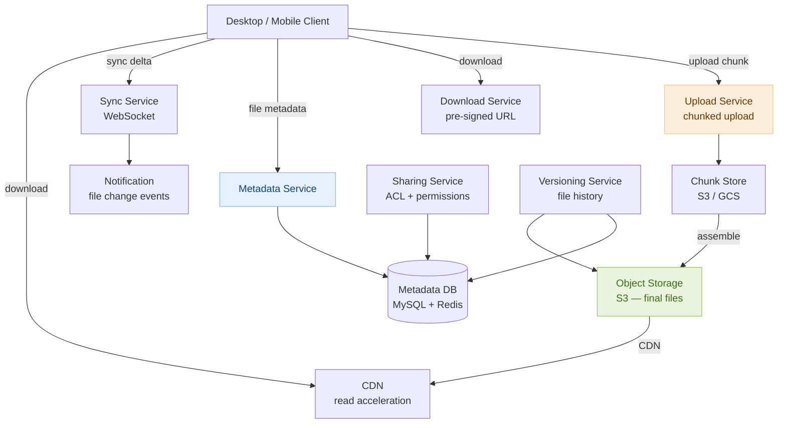

# Day 28 — Dijkstra's Algorithm & Design Google Drive

> **30-Day Interview Prep Tracker** | Shobhit Kumar  
> **Date:** ___________  
> **Status:** ⬜ DSA Done | ⬜ System Design Done  
> **Difficulty:** Hard | **Topic:** Shortest Path / Weighted Graphs

---

## Part 1: DSA — Dijkstra's Algorithm & Shortest Path

### Problem Set

Three problems spanning classic Dijkstra to constraint-aware shortest paths:

| # | Problem | Pattern | Key twist |
|---|---------|---------|-----------|
| **#743** | Network Delay Time | Classic Dijkstra | Time for signal to reach all nodes |
| **#787** | Cheapest Flights Within K Stops | Bellman-Ford / Modified Dijkstra | Edge count constraint |
| **#1631** | Path with Minimum Effort | Dijkstra on effort | Minimize max edge weight on path |

---

### Problem 1: Network Delay Time (LeetCode #743)

**Statement:** Given a network of `n` nodes and directed weighted edges, a signal is sent from node `k`. Return the time for all nodes to receive the signal, or `-1` if some are unreachable.

```
n=4, edges=[[2,1,1],[2,3,1],[3,4,1]], k=2  →  2
(signal reaches 1 at t=1, 3 at t=1, 4 at t=2 — answer is max)
```

**Core insight:** Find the shortest path from `k` to every node using Dijkstra. The answer is the maximum of all shortest distances (the last node to be reached). If any node remains at infinity, return -1.

```
Dijkstra guarantees: when a node is popped from the min-heap, its distance is final.
Approach:
  1. Build adjacency list from edges.
  2. Min-heap: (distance, node), seeded with (0, k).
  3. While heap not empty: pop (dist, node). If already visited, skip.
     Mark visited. For each neighbor: if dist + weight < neighbor_dist → push to heap.
  4. Answer: max(dist.values()) if all n nodes reached, else -1.
```

```java
class Solution {
    public int networkDelayTime(int[][] times, int n, int k) {
        List<int[]>[] adj = new List[n + 1];
        for (int i = 1; i <= n; i++) adj[i] = new ArrayList<>();
        for (int[] t : times) adj[t[0]].add(new int[]{t[1], t[2]});

        int[] dist = new int[n + 1];
        Arrays.fill(dist, Integer.MAX_VALUE);
        dist[k] = 0;

        PriorityQueue<int[]> heap = new PriorityQueue<>((a, b) -> a[0] - b[0]);
        heap.offer(new int[]{0, k});

        while (!heap.isEmpty()) {
            int[] cur = heap.poll();
            int d = cur[0], node = cur[1];
            if (d > dist[node]) continue;  // stale entry

            for (int[] edge : adj[node]) {
                int next = edge[0], weight = edge[1];
                if (dist[node] + weight < dist[next]) {
                    dist[next] = dist[node] + weight;
                    heap.offer(new int[]{dist[next], next});
                }
            }
        }

        int maxDist = 0;
        for (int i = 1; i <= n; i++) {
            if (dist[i] == Integer.MAX_VALUE) return -1;
            maxDist = Math.max(maxDist, dist[i]);
        }
        return maxDist;
    }
}
```

```python
import heapq

class Solution:
    def networkDelayTime(self, times: list[list[int]], n: int, k: int) -> int:
        adj = [[] for _ in range(n + 1)]
        for u, v, w in times:
            adj[u].append((v, w))

        dist = [float('inf')] * (n + 1)
        dist[k] = 0
        heap = [(0, k)]

        while heap:
            d, node = heapq.heappop(heap)
            if d > dist[node]:
                continue  # stale entry
            for nxt, w in adj[node]:
                if dist[node] + w < dist[nxt]:
                    dist[nxt] = dist[node] + w
                    heapq.heappush(heap, (dist[nxt], nxt))

        max_dist = max(dist[1:])
        return max_dist if max_dist < float('inf') else -1
```

---

### Problem 2: Cheapest Flights Within K Stops (LeetCode #787)

**Statement:** Find the cheapest price from `src` to `dst` using at most `k` stops (k+1 edges). Return -1 if no such route exists.

```
n=3, flights=[[0,1,100],[1,2,100],[0,2,500]], src=0, dst=2, k=1
→ 200  (0→1→2 uses 1 stop, costs 100+100=200)
```

**Core insight:** Standard Dijkstra ignores the stop constraint — it may find a cheaper path with more stops. Use Bellman-Ford with exactly `k+1` relaxation rounds, OR modify Dijkstra to track (cost, node, stops_remaining) and stop when stops run out.

```
Modified Dijkstra: state = (cost, node, stops_used)
  Only skip a state if we've seen this (node, stops_used) with a lower cost.
  When stops_used > k, don't expand further.
```

```java
class Solution {
    public int findCheapestPrice(int n, int[][] flights, int src, int dst, int k) {
        int[] prices = new int[n];
        Arrays.fill(prices, Integer.MAX_VALUE);
        prices[src] = 0;

        // Bellman-Ford: relax all edges k+1 times
        for (int i = 0; i <= k; i++) {
            int[] temp = Arrays.copyOf(prices, n);
            for (int[] f : flights) {
                int from = f[0], to = f[1], price = f[2];
                if (prices[from] != Integer.MAX_VALUE &&
                    prices[from] + price < temp[to]) {
                    temp[to] = prices[from] + price;
                }
            }
            prices = temp;
        }
        return prices[dst] == Integer.MAX_VALUE ? -1 : prices[dst];
    }
}
```

```python
class Solution:
    def findCheapestPrice(self, n: int, flights: list[list[int]], src: int, dst: int, k: int) -> int:
        prices = [float('inf')] * n
        prices[src] = 0

        for _ in range(k + 1):  # k stops = k+1 edges
            temp = prices[:]
            for u, v, w in flights:
                if prices[u] != float('inf') and prices[u] + w < temp[v]:
                    temp[v] = prices[u] + w
            prices = temp

        return prices[dst] if prices[dst] < float('inf') else -1
```

> **Why copy `prices` to `temp`?** Each Bellman-Ford round must use distances from the *previous* round only. Without the copy, a single round might use updates from the same round, violating the "exactly i edges" constraint.

---

### Problem 3: Path with Minimum Effort (LeetCode #1631)

**Statement:** Given a matrix of heights, find a path from top-left to bottom-right that minimizes the maximum absolute height difference between consecutive cells.

```
heights = [[1,2,2],[3,8,2],[5,3,5]]  →  2
(path 1→3→5→3→5 has max diff = 2)
```

**Core insight:** Dijkstra variant where "distance" to a cell = maximum edge weight (height difference) on the path so far. Greedy: always expand the cell reachable with the minimum effort.

```
State: (max_effort_so_far, row, col)
Transition: for each neighbor, effort = max(current_effort, |heights[r][c] - heights[nr][nc]|)
If this effort < recorded[nr][nc] → push to heap.
```

```java
class Solution {
    int[][] DIRS = {{0,1},{0,-1},{1,0},{-1,0}};

    public int minimumEffortPath(int[][] heights) {
        int m = heights.length, n = heights[0].length;
        int[][] effort = new int[m][n];
        for (int[] row : effort) Arrays.fill(row, Integer.MAX_VALUE);
        effort[0][0] = 0;

        PriorityQueue<int[]> heap = new PriorityQueue<>((a, b) -> a[0] - b[0]);
        heap.offer(new int[]{0, 0, 0});  // effort, row, col

        while (!heap.isEmpty()) {
            int[] cur = heap.poll();
            int eff = cur[0], r = cur[1], c = cur[2];
            if (r == m - 1 && c == n - 1) return eff;
            if (eff > effort[r][c]) continue;

            for (int[] d : DIRS) {
                int nr = r + d[0], nc = c + d[1];
                if (nr < 0 || nr >= m || nc < 0 || nc >= n) continue;
                int newEff = Math.max(eff, Math.abs(heights[r][c] - heights[nr][nc]));
                if (newEff < effort[nr][nc]) {
                    effort[nr][nc] = newEff;
                    heap.offer(new int[]{newEff, nr, nc});
                }
            }
        }
        return 0;
    }
}
```

```python
import heapq

class Solution:
    def minimumEffortPath(self, heights: list[list[int]]) -> int:
        m, n = len(heights), len(heights[0])
        effort = [[float('inf')] * n for _ in range(m)]
        effort[0][0] = 0
        heap = [(0, 0, 0)]  # (effort, row, col)

        while heap:
            eff, r, c = heapq.heappop(heap)
            if r == m - 1 and c == n - 1:
                return eff
            if eff > effort[r][c]:
                continue
            for dr, dc in [(0,1),(0,-1),(1,0),(-1,0)]:
                nr, nc = r + dr, c + dc
                if 0 <= nr < m and 0 <= nc < n:
                    new_eff = max(eff, abs(heights[r][c] - heights[nr][nc]))
                    if new_eff < effort[nr][nc]:
                        effort[nr][nc] = new_eff
                        heapq.heappush(heap, (new_eff, nr, nc))
        return 0
```

---

### Complexity Analysis

| Problem | Time | Space |
|---------|------|-------|
| #743 Network Delay | O((V+E) log V) | O(V+E) |
| #787 Cheapest Flights | O(k × E) Bellman-Ford | O(V+E) |
| #1631 Min Effort | O(m×n × log(m×n)) | O(m×n) |

---

### Dijkstra vs Bellman-Ford

```
Dijkstra:
  Works on graphs with NON-NEGATIVE edge weights.
  Greedy: once a node is finalized (popped from heap), its shortest path is known.
  Time: O((V+E) log V) with a min-heap.
  Fails with negative edges (a later edge might offer a shorter path to a finalized node).

Bellman-Ford:
  Works with NEGATIVE edge weights (but not negative cycles).
  Relaxes ALL edges V-1 times.
  Time: O(V×E) — slower but more general.
  Detects negative cycles: if distance still decreases after V-1 rounds, cycle exists.
  Useful for: k-stop constraints (run exactly k rounds), negative weights.

Modified Dijkstra (this problem set's twist):
  Change the "distance" definition:
    Standard: sum of edge weights → use +
    Min effort: max of edge weights → use max
    Any monotone combination → Dijkstra still works (greedy property holds).
  Key invariant: the "distance" function must be monotone along the path
    (adding a step never decreases the cost). This is why Dijkstra's greedy works.
```

---

### Related Problems

- **LeetCode #1514** — Path with Maximum Probability (Dijkstra with product of probabilities)
- **LeetCode #778** — Swim in Rising Water (Binary search + BFS, or Dijkstra)
- **LeetCode #1334** — Find the City with the Smallest Number of Neighbors (Floyd-Warshall)
- **LeetCode #847** — Shortest Path Visiting All Nodes (BFS + bitmask — all-pairs shortest path)

> **Pattern:** Any "find optimal path from source to destination in a weighted graph" problem is a Dijkstra candidate. The key question is: what does "distance" mean in this specific problem? Sum → Dijkstra. Max edge → Dijkstra with max. Number of hops constrained → Bellman-Ford. Negative weights → Bellman-Ford or SPFA.

---

## Part 2: System Design — Google Drive (Cloud File Storage)

### Requirements Clarification

#### Functional Requirements
- Upload files of any type and size (up to 50GB per file)
- Download files by file ID
- Sync files across devices automatically when updated
- Share files/folders with other users (view or edit permissions)
- File versioning: keep last 30 versions; allow rollback

#### Non-Functional Requirements
- Scale: 500M users; 1B files stored; 100M upload/download operations/day
- File storage: 1B files × avg 1MB = 1PB total — requires distributed object storage
- Upload latency: large file upload should be resumable (no restart on disconnect)
- Availability: 99.99% for file access; 99.9% for sync (eventual consistency acceptable)
- Durability: 99.999999999% (11 nines) — files must not be lost

---

### High-Level Architecture



---

### Chunked Upload (Resumable Uploads)

```
Problem: uploading a 10GB file over a flaky connection.
  Without chunking: any disconnection restarts the 10GB upload.
  With chunking: only re-upload the failed chunk.

Chunk size: 5MB per chunk (balance between overhead and granularity).
  10GB file → 2,048 chunks.

Upload protocol:
  1. Client calls POST /upload/init → server returns upload_id, chunk_size.
  2. Client splits file into chunks, computes SHA-256 hash of each chunk.
  3. For each chunk: PUT /upload/{upload_id}/chunk/{chunk_num}
       Body: raw chunk bytes
       Header: Content-MD5: <chunk_hash>
     Server stores chunk in temporary storage (S3 multipart upload).
     Server records: upload_id → {chunk_num: received, hash: sha256}.
  4. On disconnect: client calls GET /upload/{upload_id}/status
       Server returns which chunks are received → client resumes from first missing.
  5. After all chunks received: POST /upload/{upload_id}/complete
     Server assembles chunks → final file in S3.
     Server writes metadata record to DB.

Deduplication (content-aware storage):
  Compute SHA-256 of the full file before uploading.
  Check: SELECT file_id FROM blobs WHERE sha256 = ?
  If exists → link metadata to existing blob (no upload needed).
  Google Drive calls this "zero-byte upload" for duplicates.
  Storage savings: 30-40% on typical enterprise drives.
```

---

### Metadata Service & Database Schema

```sql
-- Core tables
CREATE TABLE files (
    file_id       BIGINT       PRIMARY KEY,
    owner_id      BIGINT       NOT NULL,
    parent_folder BIGINT,
    name          VARCHAR(255) NOT NULL,
    mime_type     VARCHAR(100),
    size_bytes    BIGINT,
    blob_sha256   CHAR(64),    -- pointer to object storage
    created_at    TIMESTAMPTZ  NOT NULL DEFAULT NOW(),
    updated_at    TIMESTAMPTZ  NOT NULL DEFAULT NOW(),
    is_deleted    BOOLEAN      DEFAULT FALSE,
    version       INT          DEFAULT 1
);

CREATE TABLE file_versions (
    version_id    BIGINT       PRIMARY KEY,
    file_id       BIGINT       REFERENCES files(file_id),
    version_num   INT          NOT NULL,
    blob_sha256   CHAR(64),
    size_bytes    BIGINT,
    created_at    TIMESTAMPTZ  NOT NULL,
    created_by    BIGINT
);

CREATE TABLE permissions (
    file_id       BIGINT,
    user_id       BIGINT,
    role          VARCHAR(10),  -- 'viewer', 'editor', 'owner'
    PRIMARY KEY (file_id, user_id)
);

-- Indices
CREATE INDEX idx_files_owner ON files(owner_id, parent_folder);
CREATE INDEX idx_files_sha256 ON files(blob_sha256);  -- deduplication lookup
```

---

### File Sync Protocol

```
Goal: when File A is edited on Device 1, Device 2 should see the update within seconds.

Change detection:
  Desktop client: OS file system watchers (inotify on Linux, FSEvents on macOS,
    ReadDirectoryChangesW on Windows) detect file modifications without polling.
  Mobile: poll on app foreground, push notification wakes app for background sync.

Sync flow:
  1. File modified on Device 1 → client computes block-level diff (delta sync).
     Only changed 5MB blocks are re-uploaded (not the entire file).
  2. Client uploads changed blocks → Metadata Service updates file record + version.
  3. Metadata Service publishes change event to Kafka: { file_id, version, owner_id }
  4. Sync Service (WebSocket server) receives Kafka event →
     pushes "file_changed" to all devices connected for that user.
  5. Device 2 receives push → downloads only the changed blocks → applies delta.

Delta sync benefit:
  Edit 1 line in a 100MB document → upload ~5MB (one chunk) instead of 100MB.
  Delta sync reduces sync bandwidth by 90%+ for typical edits.

Conflict resolution:
  Two devices edit the same file while offline.
  On sync: last-write-wins (simple) or both versions preserved as conflict copies
    (Google Drive creates "filename (1).docx" and "filename.docx").
  For collaborative editing: use CRDTs or Operational Transforms (OT) — complex,
    requires real-time server coordination (Google Docs approach).
```

---

### Sharing & Permissions

```
Permission model:
  owner → full control (read, write, share, delete)
  editor → read + write (can edit but not delete or manage shares)
  viewer → read-only

Sharing a file:
  POST /files/{file_id}/share { "email": "friend@example.com", "role": "viewer" }
  → Insert into permissions table.
  → Send email notification with link: drive.google.com/file/d/{file_id}/view

Inherited permissions (folders):
  Sharing a folder shares all children recursively.
  Storing one permission row per file × 1M files in folder = 1M rows.
  Better: store permission on folder; children inherit at read time.
  Use a closure table or materialized path to efficiently query "does user X
    have access to file Y via any ancestor folder?"

Public link sharing:
  Generate a random token: share_token = base62(random_128_bits)
  Store: share_links(token, file_id, role, expires_at)
  Access: drive.google.com/share/{token} → lookup token → serve file.
  Revoke: DELETE share_links WHERE token = ?
```

---

### Storage: Object Storage + CDN

```
Object storage (S3 / GCS):
  Store blobs by SHA-256 hash: s3://drive-blobs/{sha256[:2]}/{sha256}.
    First 2 chars as prefix → 256 "buckets" → avoids S3 hotspot on single prefix.
  Durability: S3 Standard = 99.999999999% (11 nines) via multi-AZ replication.
  Cost: ~$0.023/GB/month. 1PB = $23,000/month.

Downloads via pre-signed URL:
  Download Service generates a pre-signed S3 URL valid for 15 minutes:
    GET /files/{file_id}/download
    → 302 redirect to https://s3.amazonaws.com/drive-blobs/{sha256}?X-Amz-Signature=...
  Client downloads directly from S3 (bypasses Drive servers — saves bandwidth cost).
  Pre-signed URL: server doesn't need to proxy the bytes → massive scalability win.

CDN for frequently accessed files:
  Route downloads through CloudFront/Fastly for popular public files.
  Private files: generate CDN-signed URLs with user-specific tokens.
  Cache-Control: max-age=3600 for versioned files (SHA256-addressed → immutable).
```

---

### Interview Discussion Points

1. **How do you handle a 50GB file upload without timeouts?** → Chunked (multipart) upload: split into 5MB chunks, upload each independently. Server records received chunks. On disconnect, client queries which chunks are missing and resumes. S3 Multipart Upload natively supports this — no custom assembly needed.
2. **How does delta sync work?** → Client divides the file into fixed-size blocks (5MB). After an edit, it computes SHA-256 of each block. Blocks whose hash changed are re-uploaded. The server records the new block list. Other devices download only changed blocks. Rsync algorithm is the classic approach; block-level hashing is the practical implementation.
3. **How do you scale metadata reads to 100M operations/day?** → Cache hot metadata in Redis (file → owner, size, version). MySQL handles cold reads and all writes. For listing a large folder (10K files), paginate with cursor-based pagination and cache the first page. Shard metadata DB by owner_id — each user's files are co-located on one shard for efficient folder listing.
4. **How do you implement versioning without duplicating storage?** → Store only the diff between versions (block-level delta). Each version record points to the set of blocks that make up that version. Unchanged blocks are shared between versions — no duplication. Deduplication via SHA-256 further reduces storage: two identical versions share the same blob.
5. **How would you design file search (find "budget.xlsx" in 1B files)?** → Index file names in Elasticsearch on create/rename. Query: GET /search?q=budget&user_id=u123 → Elasticsearch returns matching file_ids. Metadata Service fetches details. For content search (search within documents), extract text at upload time, index in Elasticsearch. Scope results to files the user has access to (permission check before returning results).

---

## Daily Checklist

- [ ] Solved Network Delay Time (#743) — traced Dijkstra step-by-step
- [ ] Solved Cheapest Flights Within K Stops (#787) — understood why Bellman-Ford needs a temp array
- [ ] Solved Path with Minimum Effort (#1631) — explained why Dijkstra works with max instead of sum
- [ ] Differentiated when to use Dijkstra vs Bellman-Ford
- [ ] Drew Google Drive architecture from memory (chunked upload → S3 → metadata DB → sync)
- [ ] Can explain resumable uploads (chunk + SHA256 + resume protocol)
- [ ] Know delta sync and why it reduces bandwidth by 90%
- [ ] Understand pre-signed S3 URL pattern for downloads

---

## My Notes

```
Time taken for DSA: _____ minutes
Time taken for System Design: _____ minutes

What went well:


What to improve:


Key insight I want to remember:


```

---

## Resources

- [LeetCode #743 — Network Delay Time](https://leetcode.com/problems/network-delay-time/)
- [LeetCode #787 — Cheapest Flights Within K Stops](https://leetcode.com/problems/cheapest-flights-within-k-stops/)
- [LeetCode #1631 — Path with Minimum Effort](https://leetcode.com/problems/path-with-minimum-effort/)
- [Dijkstra's Algorithm — NeetCode](https://www.youtube.com/watch?v=XEb7_z5dG3c)
- [System Design: Google Drive — ByteByteGo](https://bytebytego.com/courses/system-design-interview/design-google-drive)
- [AWS S3 Multipart Upload](https://docs.aws.amazon.com/AmazonS3/latest/userguide/mpuoverview.html)

---

> **Tip of the Day:** In Dijkstra, stale heap entries are unavoidable when using lazy deletion. When you pop `(dist, node)`, always check if `dist > recorded_dist[node]` — if so, skip it. This is cheaper than updating the heap (which requires a decrease-key operation). The "skip stale" pattern is the standard Python/Java Dijkstra idiom.

**Previous:** [Day 27 — Topological Sort + Design a Ride-sharing Service](../DAY-27/day-27-topological-sort-ride-sharing.md)  
**Next:** [Day 29 — Union-Find + Design a Web Crawler](../DAY-29/day-29-union-find-web-crawler.md)
