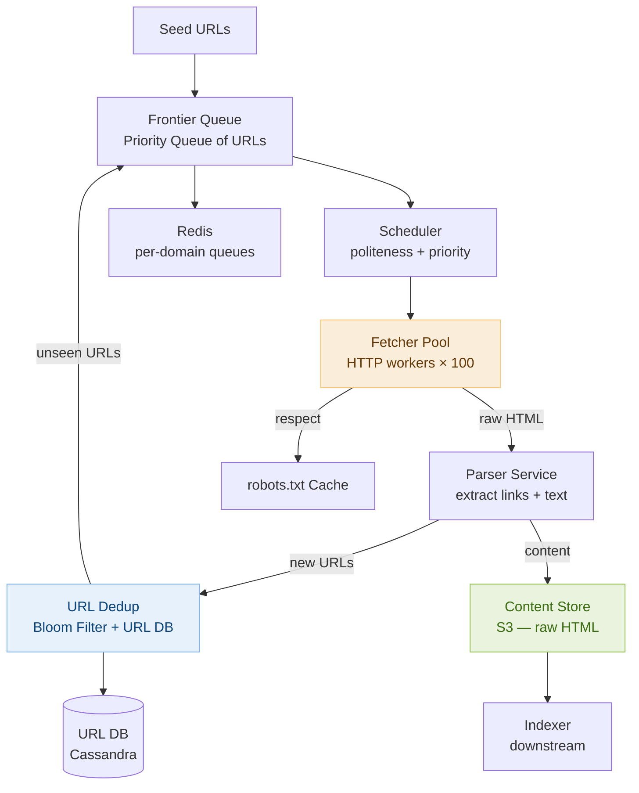

# Day 29 — Union-Find & Design a Web Crawler

> **30-Day Interview Prep Tracker** | Shobhit Kumar  
> **Date:** ___________  
> **Status:** ⬜ DSA Done | ⬜ System Design Done  
> **Difficulty:** Medium–Hard | **Topic:** Union-Find (Disjoint Set Union)

---

## Part 1: DSA — Union-Find (Disjoint Set Union)

### Problem Set

Three problems that demonstrate the power of Union-Find for connectivity problems:

| # | Problem | Pattern | Key insight |
|---|---------|---------|-------------|
| **#684** | Redundant Connection | Cycle detection in undirected graph | An edge creating a cycle connects two already-connected nodes |
| **#721** | Accounts Merge | Group by shared attribute | Union accounts sharing an email |
| **#1971** | Find if Path Exists in Graph | Connectivity check | `find(src) == find(dst)` |

---

### Union-Find Data Structure (Build Once, Use Everywhere)

```java
class UnionFind {
    int[] parent, rank;

    UnionFind(int n) {
        parent = new int[n];
        rank   = new int[n];
        for (int i = 0; i < n; i++) parent[i] = i;
    }

    int find(int x) {
        if (parent[x] != x)
            parent[x] = find(parent[x]);  // path compression
        return parent[x];
    }

    boolean union(int x, int y) {
        int px = find(x), py = find(y);
        if (px == py) return false;  // already connected → cycle
        if (rank[px] < rank[py]) { int tmp = px; px = py; py = tmp; }
        parent[py] = px;
        if (rank[px] == rank[py]) rank[px]++;
        return true;
    }

    boolean connected(int x, int y) { return find(x) == find(y); }
}
```

```python
class UnionFind:
    def __init__(self, n: int):
        self.parent = list(range(n))
        self.rank   = [0] * n

    def find(self, x: int) -> int:
        if self.parent[x] != x:
            self.parent[x] = self.find(self.parent[x])  # path compression
        return self.parent[x]

    def union(self, x: int, y: int) -> bool:
        px, py = self.find(x), self.find(y)
        if px == py: return False  # cycle
        if self.rank[px] < self.rank[py]: px, py = py, px
        self.parent[py] = px
        if self.rank[px] == self.rank[py]: self.rank[px] += 1
        return True

    def connected(self, x: int, y: int) -> bool:
        return self.find(x) == self.find(y)
```

> **Path compression + union by rank:** Each `find` and `union` runs in amortized O(α(n)) — essentially O(1). α is the inverse Ackermann function; for any practical n, α(n) ≤ 5.

---

### Problem 1: Redundant Connection (LeetCode #684)

**Statement:** Given an undirected graph built by adding edges one-by-one, find the last edge that creates a cycle.

```
edges = [[1,2],[1,3],[2,3]]  →  [2,3]
edges = [[1,2],[2,3],[3,4],[1,4],[1,5]]  →  [1,4]
```

**Core insight:** Process edges in order. Use `union(u, v)`. If `find(u) == find(v)` before the union (already connected), this edge creates a cycle — it's the answer.

```java
class Solution {
    public int[] findRedundantConnection(int[][] edges) {
        int n = edges.length;
        UnionFind uf = new UnionFind(n + 1);
        for (int[] edge : edges) {
            if (!uf.union(edge[0], edge[1]))
                return edge;  // union returned false → already connected → cycle
        }
        return new int[]{};
    }
}
```

```python
class Solution:
    def findRedundantConnection(self, edges: list[list[int]]) -> list[int]:
        uf = UnionFind(len(edges) + 1)
        for u, v in edges:
            if not uf.union(u, v):
                return [u, v]
        return []
```

---

### Problem 2: Accounts Merge (LeetCode #721)

**Statement:** Given a list of accounts (each = `[name, email1, email2, ...]`), merge accounts that share at least one email. Return merged accounts with emails sorted.

```
accounts = [["John","a@x.com","b@x.com"],
            ["John","b@x.com","c@x.com"],
            ["Mary","d@x.com"]]
→ [["John","a@x.com","b@x.com","c@x.com"], ["Mary","d@x.com"]]
```

**Core insight:** Each email is a node. If two emails appear in the same account, union them. After processing all accounts, group emails by root → that's one merged account.

```java
class Solution {
    public List<List<String>> accountsMerge(List<List<String>> accounts) {
        Map<String, String> parent = new HashMap<>();  // email → root email
        Map<String, String> owner  = new HashMap<>();  // email → name

        // Initialize: each email is its own root
        for (List<String> account : accounts) {
            String name = account.get(0);
            for (int i = 1; i < account.size(); i++) {
                parent.put(account.get(i), account.get(i));
                owner.put(account.get(i), name);
            }
        }

        // Union: connect all emails in the same account
        for (List<String> account : accounts) {
            String first = account.get(1);
            for (int i = 2; i < account.size(); i++) {
                union(parent, first, account.get(i));
            }
        }

        // Group emails by root
        Map<String, TreeSet<String>> groups = new HashMap<>();
        for (String email : parent.keySet()) {
            String root = find(parent, email);
            groups.computeIfAbsent(root, k -> new TreeSet<>()).add(email);
        }

        List<List<String>> result = new ArrayList<>();
        for (Map.Entry<String, TreeSet<String>> entry : groups.entrySet()) {
            List<String> merged = new ArrayList<>();
            merged.add(owner.get(entry.getKey()));
            merged.addAll(entry.getValue());
            result.add(merged);
        }
        return result;
    }

    String find(Map<String, String> parent, String x) {
        if (!parent.get(x).equals(x))
            parent.put(x, find(parent, parent.get(x)));
        return parent.get(x);
    }

    void union(Map<String, String> parent, String x, String y) {
        String px = find(parent, x), py = find(parent, y);
        if (!px.equals(py)) parent.put(px, py);
    }
}
```

```python
class Solution:
    def accountsMerge(self, accounts: list[list[str]]) -> list[list[str]]:
        parent, owner = {}, {}
        for account in accounts:
            for email in account[1:]:
                parent.setdefault(email, email)
                owner[email] = account[0]

        def find(x):
            if parent[x] != x:
                parent[x] = find(parent[x])
            return parent[x]

        def union(x, y):
            parent[find(x)] = find(y)

        for account in accounts:
            for email in account[2:]:
                union(account[1], email)

        from collections import defaultdict
        groups = defaultdict(list)
        for email in parent:
            groups[find(email)].append(email)

        return [[owner[root]] + sorted(emails) for root, emails in groups.items()]
```

---

### Problem 3: Find if Path Exists in Graph (LeetCode #1971)

**Statement:** Given `n` nodes and a list of undirected edges, return `true` if a path exists from `source` to `destination`.

```
n=3, edges=[[0,1],[1,2],[2,0]], source=0, destination=2  →  true
n=6, edges=[[0,1],[0,2],[3,5],[5,4],[4,3]], source=0, destination=5  →  false
```

**Core insight:** Union all edges, then check if `find(source) == find(destination)`.

```java
class Solution {
    public boolean validPath(int n, int[][] edges, int source, int destination) {
        UnionFind uf = new UnionFind(n);
        for (int[] e : edges) uf.union(e[0], e[1]);
        return uf.connected(source, destination);
    }
}
```

```python
class Solution:
    def validPath(self, n: int, edges: list[list[int]], source: int, destination: int) -> bool:
        uf = UnionFind(n)
        for u, v in edges:
            uf.union(u, v)
        return uf.connected(source, destination)
```

---

### Complexity Analysis

| Problem | Time | Space |
|---------|------|-------|
| #684 Redundant Connection | O(E × α(V)) ≈ O(E) | O(V) |
| #721 Accounts Merge | O(N × L × α(N×L)) | O(N × L) |
| #1971 Path Exists | O(E × α(V)) | O(V) |

---

### When to Use Union-Find vs BFS/DFS

```
Union-Find wins when:
  - You're repeatedly asking "are X and Y connected?" (O(α(n)) per query after O(E) build)
  - You're detecting cycles in undirected graphs
  - You're merging/grouping elements by shared properties (accounts merge)
  - The graph is built incrementally (edges added one at a time)

BFS/DFS wins when:
  - You need the actual path, not just connectivity
  - You need level-by-level processing (BFS = shortest path in unweighted graph)
  - Graph is directed (Union-Find is inherently undirected)
  - You need DFS-specific information (topological order, back edges, discovery times)

Key insight: Union-Find is a specialized data structure for the single question:
  "Are these two elements in the same connected component?"
  For that one question, it's the fastest answer. For anything richer, use BFS/DFS.
```

---

### Related Problems

- **LeetCode #200** — Number of Islands (DFS preferred, UF also works)
- **LeetCode #323** — Number of Connected Components in an Undirected Graph
- **LeetCode #990** — Satisfiability of Equality Equations (UF on variable equality)
- **LeetCode #1319** — Number of Operations to Make Network Connected

> **Pattern:** See "connected components," "merge groups," "detect cycle in undirected graph" → immediately think Union-Find. The core loop is always: for each edge (u, v), `union(u, v)`. Then query connectivity with `find`.

---

## Part 2: System Design — Web Crawler

### Requirements Clarification

#### Functional Requirements
- Start from a set of seed URLs; recursively discover and download web pages
- Extract all hyperlinks from downloaded pages and add to the crawl queue
- Respect `robots.txt` (don't crawl disallowed paths)
- Re-crawl pages periodically based on estimated change frequency
- Store raw HTML and extracted content for downstream indexing

#### Non-Functional Requirements
- Scale: crawl 1B pages in 30 days ≈ 385 pages/sec; peak 1000 pages/sec
- Politeness: at most 1 request/second to any given domain (avoid overloading servers)
- Deduplication: don't download the same URL twice (or same content from different URLs)
- Extensibility: pluggable parsers for different content types (HTML, PDF, images)
- Availability: crawler is a batch system — occasional downtime is acceptable

---

### High-Level Architecture



---

### URL Frontier: Priority + Politeness

```
The frontier is the queue of URLs to crawl. Two competing goals:
  Priority: crawl important pages first (high PageRank, news sites, recently changed).
  Politeness: don't send more than 1 request/second to any domain.

Two-tier queue design:

Tier 1 — Priority Queue (domain-agnostic):
  Scores URLs by importance:
    freshness (time since last crawl), importance (estimated PageRank), type (news vs. static)
  Pop URLs in priority order and route to Tier 2.

Tier 2 — Per-domain FIFO queues:
  One queue per domain (bbc.com, nytimes.com, etc.)
  Scheduler pops from each domain queue at most once per domain_crawl_delay.
  domain_crawl_delay: max(1s, crawl-delay from robots.txt).

  Implementation: Redis sorted sets per domain.
    ZADD domain:bbc.com <timestamp> <url>  → add with score = next_allowed_crawl_time
    ZRANGEBYSCORE domain:bbc.com 0 <now> LIMIT 1 → next URL ready to crawl

Selector (picks which domain to crawl next):
  Round-robin across all domains whose next_allowed_crawl_time <= now.
  If a domain's queue is empty → skip.
  If all domains are in crawl-delay → sleep briefly (1s) and retry.
```

---

### URL Deduplication

```
Problem: the web has ~50B pages; many URLs are seen multiple times (navigation, ads, etc.).
  Storing all seen URLs in a hash set: 50B × 50 bytes/URL = 2.5TB — too large for RAM.

Solution: two-layer deduplication.

Layer 1 — Bloom Filter (in-memory, probabilistic):
  1B URLs × 10 bits/URL = 10GB — fits in RAM on a few machines.
  False positive rate: ~1% (occasionally skips a valid new URL — acceptable).
  False negatives: NEVER (if Bloom says "seen," it was definitely seen).
  Check: if bloom.mightContain(url) → skip.
  Add:   bloom.add(url).

Layer 2 — URL Database (persistent, exact):
  For URLs that pass Bloom filter check (potential new URLs):
    INSERT INTO crawled_urls (url_hash, url, last_crawled) ON CONFLICT DO NOTHING
    If 0 rows inserted: URL was already in DB (Bloom false positive) → skip.
    If 1 row inserted: genuinely new URL → add to frontier.

  Cassandra chosen for URL DB:
    10B rows × 100 bytes = 1TB — Cassandra scales horizontally.
    Write-heavy workload (billions of URL inserts during crawl).
    Partition key: url_hash → even distribution across nodes.

Content-based deduplication:
  Two different URLs may serve identical content (canonical URL, www vs. non-www).
  SHA-256 of downloaded page → check against content_fingerprints table.
  Skip indexing (but still record URL as crawled).
```

---

### Fetcher: Politeness & robots.txt

```
robots.txt compliance:
  Before crawling any URL on domain X:
    1. Fetch: GET https://X/robots.txt
    2. Parse: find rules for our User-Agent ("Googlebot" or custom agent).
    3. Cache in Redis with TTL = 24 hours (robots.txt rarely changes).
    4. On each URL fetch: check if the path is disallowed.

  robots.txt example:
    User-agent: *
    Disallow: /admin/
    Crawl-delay: 5        ← respect this delay between requests

HTTP fetching considerations:
  Connection pooling: reuse TCP connections per domain (HTTP/2 multiplexing).
  Timeout: 10s connect, 30s total — drop slow servers.
  Redirects: follow up to 5 hops; record canonical URL.
  Trap detection: infinite redirect loops, dynamically generated URLs
    (?page=1 → ?page=2 → ?page=3 ...) → limit URL depth or path pattern matching.

Distributed fetchers:
  100 fetcher workers, each handling 10 concurrent HTTP requests.
  1000 concurrent requests × avg 1s/page = 1000 pages/sec.
  Each fetcher registers with Scheduler; Scheduler pushes URLs per politeness rules.
  Fetcher → push raw HTML to Kafka → Parser consumes from Kafka (decoupled).
```

---

### Parser & Link Extraction

```
Parser consumes raw HTML from Kafka:

1. Parse HTML with a robust parser (jsoup for Java; html5lib for Python).
   Malformed HTML is extremely common on the real web — use a lenient parser.

2. Extract:
   - All <a href="..."> links → normalize → add to frontier.
   - Page title, meta description → store in metadata.
   - Main text content (strip tags) → send to indexer.
   - Last-Modified / ETag headers → use for conditional re-crawl.

URL normalization (critical for deduplication):
   Normalize before any dedup check:
   - Lowercase scheme + host: HTTP://BBB.COM → http://bbb.com
   - Remove default port: http://bbb.com:80/ → http://bbb.com/
   - Remove fragment: http://bbb.com/page#section → http://bbb.com/page
   - Sort query params: ?b=2&a=1 → ?a=1&b=2
   - Remove tracking params: ?utm_source=google → strip utm_* params
   - Resolve relative URLs: /about → https://bbb.com/about

Re-crawl scheduling:
   Don't re-crawl static pages too frequently.
   Estimate change frequency from historical data:
     last_5_crawls_changed / last_5_crawls_total = change_rate
   Schedule next crawl: now + (1 / change_rate) capped at 1 day–30 days.
   News pages: re-crawl every hour.
   Corporate "About" pages: re-crawl every 30 days.
```

---

### Handling Scale & Failures

```
Distributed crawl coordination:
  URL frontier partitioned by domain hash across N scheduler nodes.
  Each fetcher connects to its assigned scheduler shard.
  Kafka partitioned by domain → fetchers within a partition respect politeness.

Failure recovery:
  Fetcher crash: Kafka consumer group rebalancing re-assigns partitions.
    URLs in-flight are re-queued after Kafka's visibility timeout expires.
  Scheduler crash: URL DB + Redis queues are persistent — restart from last checkpoint.
  Content Store full: horizontal expansion — add S3 buckets; S3 is effectively unlimited.

DNS caching:
  100 fetchers × 1000 URLs/sec would hammer DNS servers.
  Cache DNS resolution in-process: TTL = min(DNS TTL, 5 min).
  Use a local DNS resolver (unbound) per datacenter.

Crawler trap avoidance:
  Max URL depth: discard URLs with path depth > 10.
  Max URLs per domain: soft cap of 1M URLs per domain (prevent one site monopolizing crawl).
  URL pattern filter: skip URLs matching obvious trap patterns
    (calendars with infinite date navigation: /cal/2026/01/01/...).
  Spider trap detection: if a domain generates > 10K new URLs per page → blocklist.
```

---

### Interview Discussion Points

1. **How do you avoid crawling the same URL twice across distributed fetchers?** → Bloom filter in shared memory (Redis) for O(1) probabilistic check. For certainty, INSERT INTO url_db ON CONFLICT DO NOTHING — the unique constraint is the distributed lock. Only 1 fetcher successfully inserts; others get 0 rows affected and skip.
2. **How does the politeness constraint affect throughput?** → With 1 req/sec per domain and 1B target URLs, if all URLs are on 1000 domains → max 1000 req/sec → 31B pages/month. In practice, the web has millions of domains → politeness is rarely the bottleneck. The real bottleneck is network bandwidth and parser throughput.
3. **How would you handle JavaScript-rendered pages (SPAs)?** → A standard HTTP fetcher only sees the initial HTML — no JavaScript execution. For SPAs, use headless Chrome (Puppeteer/Playwright): render the page in a real browser, wait for JS to execute, then extract the DOM. This is 10-50x more expensive per page. Use a separate SPA-fetcher pool for known SPA domains.
4. **How do you prioritize which pages to crawl first?** → Seed initial priority from known high-value domains (news, Wikipedia). After crawl, use in-link count (pages with many inbound links are important — proxy for PageRank). Recency: prefer pages with recent Last-Modified headers. Type: prefer HTML pages over binary files for text indexing.
5. **How would you detect and handle crawler traps?** → Track URLs-discovered-per-URL-crawled per domain. If a single crawled page spawns 10K+ new URLs, it's likely a trap. Blocklist the domain's URL pattern. Also cap maximum crawl depth (path segments from seed), and detect calendar-like URL patterns using regex.

---

## Daily Checklist

- [ ] Implemented Union-Find with path compression + union by rank from scratch
- [ ] Solved Redundant Connection (#684) — understood why `union` returning false = cycle
- [ ] Solved Accounts Merge (#721) — traced the union and grouping steps
- [ ] Solved Find if Path Exists (#1971) — the simplest Union-Find application
- [ ] Drew web crawler architecture from memory (frontier → scheduler → fetcher → parser)
- [ ] Can explain two-tier URL frontier (priority queue + per-domain queues)
- [ ] Know Bloom filter role in URL deduplication (pros: speed; cons: false positives)
- [ ] Understand robots.txt compliance and crawl-delay

---

## My Notes

```
Time taken for DSA: _____ minutes
Time taken for System Design: _____ minutes

What went well:


What to improve:


Key insight I want to remember:


```

---

## Resources

- [LeetCode #684 — Redundant Connection](https://leetcode.com/problems/redundant-connection/)
- [LeetCode #721 — Accounts Merge](https://leetcode.com/problems/accounts-merge/)
- [LeetCode #1971 — Find if Path Exists in Graph](https://leetcode.com/problems/find-if-path-exists-in-graph/)
- [Union-Find Explained — NeetCode](https://www.youtube.com/watch?v=ayW5B2W9hkk)
- [System Design: Web Crawler — ByteByteGo](https://bytebytego.com/courses/system-design-interview/design-a-web-crawler)
- [Bloom Filters by Example](https://llimllib.github.io/bloomfilter-tutorial/)

---

> **Tip of the Day:** Always implement Union-Find with both path compression AND union by rank. Path compression alone: O(log n) amortized. Union by rank alone: O(log n). Both together: O(α(n)) ≈ O(1). In an interview, write both optimizations — it signals you know the full algorithm, not just the basic idea.

**Previous:** [Day 28 — Dijkstra's Algorithm + Design Google Drive](../DAY-28/day-28-dijkstra-google-drive.md)  
**Next:** [Day 30 — Mock Interview Review + Design WhatsApp](../DAY-30/day-30-mock-interview-whatsapp.md)
