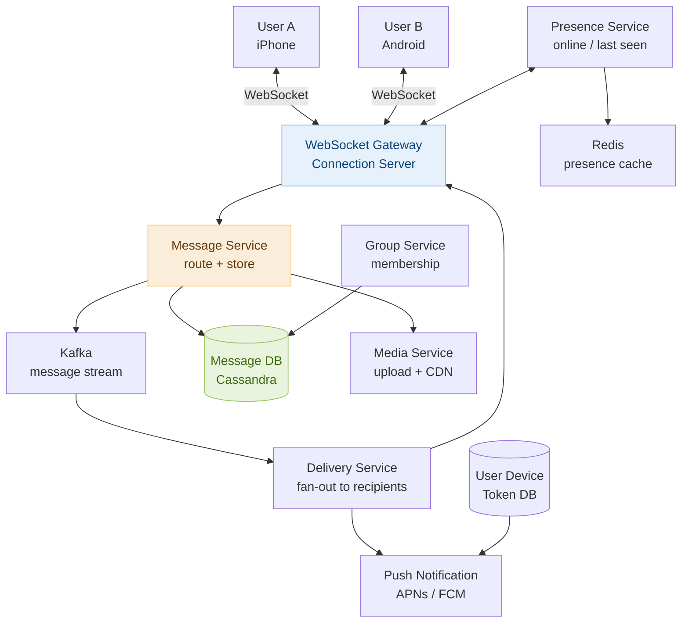

# Day 30 — Mock Interview Review & Design WhatsApp

> **30-Day Interview Prep Tracker** | Shobhit Kumar  
> **Date:** ___________  
> **Status:** ⬜ DSA Done | ⬜ System Design Done  
> **Difficulty:** Hard | **Topic:** Final Review + Mock Interview

---

## Part 1: DSA — Top 10 Must-Know Problems (Final Review)

### 30-Day DSA Recap: One Problem Per Pattern

This is your final consolidation day. Below are 10 problems — one per major pattern — that appear most frequently in FAANG interviews. Solve each from memory, then verify.

| # | Problem | Pattern | Why it matters |
|---|---------|---------|---------------|
| **#1** | Two Sum | HashMap / Two Pointers | Most asked; teaches O(n) lookup |
| **#146** | LRU Cache | LinkedHashMap / Doubly-Linked + HashMap | Design + DS combo |
| **#56** | Merge Intervals | Sorting + Greedy | Calendar, scheduling |
| **#102** | Binary Tree Level Order | BFS on tree | Traversal foundation |
| **#238** | Product of Array Except Self | Prefix product | No division trick |
| **#76** | Minimum Window Substring | Sliding window | Classic hard window |
| **#33** | Search in Rotated Array | Binary search | Rotation invariant |
| **#200** | Number of Islands | DFS / BFS grid | Connected components |
| **#322** | Coin Change | DP (unbounded knapsack) | Classic DP |
| **#23** | Merge K Sorted Lists | Heap (multi-way merge) | Heap mastery |

---

### Quick-Reference Solutions (Patterns, Not Full Code)

#### #1 Two Sum

```
Approach: single pass HashMap.
  For each num: check if (target - num) is in map.
  If yes → return [map[target-num], i].
  Else → map[num] = i.
Time: O(n). Space: O(n).
```

#### #146 LRU Cache

```
Data structure: HashMap<key, Node> + Doubly Linked List.
  HashMap: O(1) key lookup.
  DLL: O(1) move-to-front (get) and remove-tail (evict).

get(key):  if key not in map → -1.
           else → move node to head → return value.
put(key):  if key in map → update value → move to head.
           else → create node → add to head → add to map.
                  if size > capacity → remove tail node → remove from map.

Java: LinkedHashMap with accessOrder=true gives this for free.
```

#### #56 Merge Intervals

```
Sort by start time.
Iterate: if current.start <= last.end → merge (last.end = max(last.end, current.end)).
         else → add current to result.
```

#### #238 Product of Array Except Self

```
Two passes, O(1) extra space (output array doesn't count).
  Pass 1 (left to right): result[i] = product of all elements to the left of i.
  Pass 2 (right to left): multiply result[i] by product of all elements to the right.
No division. No zeros problem.
```

#### #322 Coin Change

```
dp[i] = minimum coins to make amount i.
dp[0] = 0. dp[i] = min(dp[i - coin] + 1) for each coin where i - coin >= 0.
Initialize dp[1..amount] = infinity.
Answer: dp[amount] if not infinity else -1.
```

---

### The 5 Most Common Interview Mistakes (Fix These Now)

```
Mistake 1: Not clarifying the problem.
  → Before coding, ask: "Can input be empty? Negative numbers? Are there duplicates?"
  → State your assumptions. Interviewers reward this.

Mistake 2: Jumping to code before thinking.
  → Say your approach out loud first.
  → Draw an example. Trace through it.
  → Only then write code.

Mistake 3: Brute force then stuck.
  → Start with brute force briefly ("naive O(n²) would be...").
  → Immediately identify the bottleneck ("the inner loop is redundant because...").
  → Optimize from there.

Mistake 4: Forgetting edge cases.
  → Before submitting, always check: empty input, single element, all same elements,
    negative numbers, integer overflow (use long in Java when multiplying).

Mistake 5: Silent coding.
  → Think out loud while coding.
  → "I'm using a min-heap here because I need the k smallest efficiently."
  → Silence = uncertainty in the interviewer's mind.
```

---

### Mock Interview Problem (Solve Without Notes — 30 min)

> **Instructions:** Set a timer. Solve completely before checking the solution. Speak your thoughts aloud.

**Problem:** Given a list of meeting time intervals `[start, end]`, find the minimum number of conference rooms required.

```
Input: [[0,30],[5,10],[15,20]]  →  2
Input: [[7,10],[2,4]]           →  1
```

**Hint:** Think about what information you need at each moment in time.

---

**Solution (read after attempting):**

```
Insight: at any point, the number of rooms needed = number of overlapping meetings.
Two meetings overlap if one starts before the other ends.

Approach: min-heap of end times.
  Sort meetings by start time.
  Use a min-heap to track when each allocated room is freed (by end time).

  For each meeting [start, end]:
    if heap.peek() <= start → a room is free → pop (reuse room) → push end.
    else → all rooms busy → allocate new room → push end.

  Answer: heap.size() at end = total rooms allocated.

Java:
  Arrays.sort(intervals, (a, b) -> a[0] - b[0]);
  PriorityQueue<Integer> heap = new PriorityQueue<>();
  for (int[] interval : intervals) {
    if (!heap.isEmpty() && heap.peek() <= interval[0])
      heap.poll();
    heap.offer(interval[1]);
  }
  return heap.size();

Time: O(n log n). Space: O(n).

Alternative: two sorted arrays (start times + end times), two pointers.
  rooms = 0, maxRooms = 0, i = 0, j = 0
  while i < n:
    if starts[i] < ends[j]: rooms++; maxRooms = max; i++
    else: rooms--; j++
  return maxRooms
```

---

### 30-Day Pattern Cheat Sheet

```
Problem type → First data structure to try:

"Find in sorted array"          → Binary Search
"Nearest / K closest"          → Heap (min or max)
"Sliding window / subarray"    → Two pointers / HashMap
"Tree traversal"               → DFS (recursion) or BFS (queue)
"Shortest path, unweighted"    → BFS
"Shortest path, weighted"      → Dijkstra (min-heap)
"All possible / generate"      → Backtracking
"Overlapping subproblems"      → DP (memoize or tabulate)
"Prefix / query ranges"        → Prefix sum or Segment tree
"Grouping / connectivity"      → Union-Find or BFS/DFS components
"String prefix / autocomplete" → Trie
"Ordering with dependencies"   → Topological Sort (Kahn's BFS)
"Count frequency"              → HashMap / Bucket sort
"Merge sorted streams"         → Min-heap (k-way merge)
```

---

## Part 2: System Design — WhatsApp (Messaging System)

### Requirements Clarification

#### Functional Requirements
- One-on-one messaging (text, images, video, documents)
- Group messaging (up to 1024 members)
- Message delivery status: sent ✓, delivered ✓✓, read ✓✓ (blue ticks)
- Online/last-seen status
- End-to-end encryption (E2E)
- Message history: users can scroll back through chat history

#### Non-Functional Requirements
- Scale: 2B users; 100B messages/day ≈ 1.15M messages/sec
- Latency: message delivered within 500ms on same continent (p99)
- Availability: 99.99% — messaging must work even during partial outages
- Ordering: messages within a conversation must be delivered in order
- Durability: messages stored for minimum 30 days; media for 90 days

---

### High-Level Architecture



---

### Message Flow: Sending a Message

```
User A sends "Hey!" to User B:

1. A's app sends via WebSocket:
   { message_id: "uuid-123", from: A, to: B, content: "Hey!", timestamp: t1,
     type: "text", client_sequence: 42 }

2. WebSocket Gateway receives → forwards to Message Service.
   Gateway is stateful: maps user_id → connection_id (WebSocket session).

3. Message Service:
   a. Validate (auth, rate limit, content length).
   b. Generate server_timestamp, assign server_sequence_id (monotonic per conversation).
   c. Write to Cassandra: (conversation_id, sequence_id, message_id, from, content, ts).
   d. Publish to Kafka: topic = "messages", key = conversation_id.
   e. Return ACK to A: { message_id: "uuid-123", status: "sent", sequence_id: 101 }
      → A shows single gray tick ✓

4. Kafka consumer (Delivery Service):
   For B: is B online? → check Presence Service (Redis).
   B is online:
     Delivery Service → WebSocket Gateway → push to B's open connection.
     B's app receives → returns delivery receipt to Delivery Service:
       { message_id: "uuid-123", delivered_at: t2 }
     Delivery Service updates message status → notify A → double gray ticks ✓✓

   B is offline:
     Store "pending delivery" → send push notification via FCM/APNs.
     When B comes online → deliver queued messages in order → B sends batch receipt.

5. B reads the message:
   B's app sends read receipt: { message_id: "uuid-123", read_at: t3 }
   → A sees blue double ticks ✓✓ (blue)
```

---

### WebSocket Connection Management

```
Why WebSocket (not HTTP polling)?
  Push-based: server pushes messages immediately without client polling.
  Persistent: one TCP connection reused for all messages in the session.
  Low overhead: no HTTP headers on each message frame (< 10 bytes per frame vs. ~500 bytes).

Connection management at scale:
  2B users; 20% online simultaneously = 400M concurrent WebSocket connections.
  Each connection server (gateway) handles 50K connections.
  400M / 50K = 8,000 gateway servers.

Routing messages to the right gateway:
  User connects to gateway G → G registers: user_id → G's address in Redis.
  When Delivery Service wants to push to User B:
    1. Lookup Redis: user_id:B → gateway_addr:G3.
    2. Forward message to G3 via internal gRPC.
    3. G3 pushes via WebSocket to B's session.

Reconnection:
  Mobile apps frequently disconnect (background, network switch).
  On reconnect: client sends last received sequence_id.
  Server sends all messages since that sequence_id → no gaps.
  This is the "message sync" mechanism.
```

---

### Message Storage: Cassandra Schema

```
Why Cassandra?
  Write-heavy: 1.15M messages/sec → needs distributed write throughput.
  Time-series access: load messages in order within a conversation.
  Horizontal scaling: add nodes without downtime.
  Tunable consistency: ONE for writes (fast), QUORUM for reads (strong).

Schema:
  CREATE TABLE messages (
    conversation_id  UUID,
    sequence_id      BIGINT,        -- monotonically increasing per conversation
    message_id       UUID,
    sender_id        BIGINT,
    content          BLOB,          -- encrypted ciphertext for E2E
    message_type     TEXT,          -- 'text', 'image', 'video', 'document'
    media_url        TEXT,          -- null for text messages
    sent_at          TIMESTAMPTZ,
    status           TEXT,          -- 'sent', 'delivered', 'read'
    PRIMARY KEY ((conversation_id), sequence_id)
  ) WITH CLUSTERING ORDER BY (sequence_id DESC);

Partition key: conversation_id → all messages in a conversation on same node (fast range scan).
Clustering key: sequence_id DESC → newest messages first (default scroll position).

Pagination:
  Load last 50 messages: SELECT ... WHERE conversation_id=? LIMIT 50.
  Scroll up (load more): SELECT ... WHERE conversation_id=? AND sequence_id < last_seen LIMIT 50.
```

---

### Group Messaging

```
Group with 1024 members: delivering 1 message requires 1024 individual deliveries.
100B messages/day × avg 10 members/group = 1T delivery events/day → 11.5M/sec.

Fan-out strategies:

Strategy 1 — Fan-out on Write (push model):
  When message sent to group: Delivery Service enqueues 1 delivery task per member.
  Each task delivers to one member (online push or offline queue).
  Problem: 1024-member group × 1M groups × 1 message = 1B tasks instantly.
  Used for: small groups (< 50 members) — acceptable throughput.

Strategy 2 — Fan-out on Read (pull model):
  Store message once in group's message log.
  When a member opens the group chat: fetch messages since last_seen_sequence_id.
  No fan-out at write time; each member pulls their own.
  Used for: large groups (> 50 members) — write once, read many.
  WhatsApp uses this for large groups.

Hybrid (WhatsApp's actual approach):
  Members who are online when message arrives: push immediately (fan-out on write).
  Members who are offline: pull on next open (fan-out on read).
  This optimizes for the common case (online members see instant delivery) while
  keeping write amplification manageable.
```

---

### End-to-End Encryption

```
WhatsApp uses Signal Protocol (open source).

Key concepts:
  Each device generates a public/private key pair.
    Public key: uploaded to WhatsApp Key Server.
    Private key: NEVER leaves the device. WhatsApp servers never see it.

Sending a message from A to B:
  A's app fetches B's public key from Key Server.
  A encrypts message with B's public key (Curve25519 Diffie-Hellman key exchange).
  Encrypted ciphertext sent to WhatsApp servers → stored in Cassandra.
  B's device downloads ciphertext → decrypts with B's private key.
  WhatsApp servers see only ciphertext — cannot read content.

Forward secrecy (Double Ratchet algorithm):
  New encryption key derived for every message.
  Compromising one key doesn't expose past or future messages.
  Each message is encrypted with a unique ephemeral key.

Implication for system design:
  Message content stored as opaque BLOB — cannot be searched server-side.
  Media: client encrypts file → uploads to media server → sends decryption key in message.
  Media server stores encrypted bytes — cannot view content.

Key Server trust:
  If WhatsApp's Key Server was compromised, an attacker could substitute keys.
  Mitigation: "Security Number" verification — users can compare out-of-band to detect MITM.
```

---

### Presence (Online / Last Seen)

```
Online status:
  When user opens app → WebSocket connected → Presence Service records:
    SETEX presence:user_id "online" 60   (TTL = 60 seconds)
  Heartbeat: client pings every 30s → resets TTL.
  When app backgrounds → WebSocket disconnects → TTL expires → status = offline.

Last seen:
  On disconnect: UPDATE users SET last_seen = NOW() WHERE user_id = ?
  Store in Redis (fast read) + sync to Cassandra periodically.

Privacy controls:
  "Everyone" / "My Contacts" / "Nobody" — filter presence visibility in API layer.
  If user set "Nobody" → Presence Service returns null regardless of actual status.

Presence at scale:
  400M online users → 400M heartbeats/30s = 13M heartbeats/sec.
  Redis cluster with 20 nodes: each handles 650K heartbeat writes/sec → feasible.
  Presence reads: lazy — only fetch presence when UI needs to display it.
```

---

### Media Upload & Delivery

```
Flow for sending an image:

1. Client encrypts image with a random symmetric key (AES-256).
2. Client uploads encrypted image to Media Service:
   POST /media/upload → server stores in S3 → returns media_url.
3. Client sends message:
   { type: "image", media_url: "s3://...", media_key: "<AES key>", ... }
   (media_key is encrypted with recipient's public key — E2E encrypted in message payload)
4. Recipient receives message → extracts media_url + media_key.
5. Recipient downloads from media_url (CDN-accelerated) → decrypts with media_key.

Media deduplication:
  Compute SHA-256 of encrypted image.
  If already in S3 → reuse URL → no upload needed (common for forwarded memes).

Media CDN:
  Downloads served from CDN (CloudFront) based on user's region.
  Media is immutable once uploaded (hash-addressed) → max-age=1year cache headers.

Retention:
  Media stored for 90 days. After download, WhatsApp deletes from server.
  (end-to-end: once recipient has it, server copy unnecessary)
  Undownloaded media: retained for 90 days then deleted.
```

---

### Interview Discussion Points

1. **How do you guarantee message ordering in a 1-on-1 chat?** → Assign a monotonically increasing `sequence_id` per conversation at the Message Service (using a distributed sequence generator — e.g., Twitter Snowflake IDs, or Cassandra counter per conversation). Clients render messages in sequence_id order. Out-of-order delivery from the network is re-sorted client-side using sequence_id.
2. **How do you handle the case where User B is offline when A sends a message?** → Delivery Service detects B is offline (Redis presence miss). Stores a pending delivery record. Sends push notification (FCM/APNs) to wake B's app. When B reconnects, their WebSocket connection sends `last_sequence_id` → server delivers all missed messages. Pending delivery records are cleaned up after delivery.
3. **Why Cassandra over MySQL for messages?** → 1.15M writes/sec exceeds what a single MySQL primary can handle. Cassandra scales writes horizontally by adding nodes. The data model (messages per conversation, time-ordered) maps naturally to Cassandra's partition key + clustering key. Cassandra also handles partial node failures gracefully with tunable consistency.
4. **How does E2E encryption impact WhatsApp's ability to moderate content?** → WhatsApp cannot read encrypted messages. Moderation relies on: (a) metadata (frequency, recipient patterns — e.g., mass forwarding to many groups), (b) hash matching of known-bad media before encryption on the client, (c) user reports (reporter shares decrypted content with WhatsApp). This is a fundamental privacy vs. safety trade-off.
5. **How would you scale to 1 billion users with WhatsApp's 50-engineer team?** → Heavy use of managed services: AWS for infra, Cassandra for storage, Kafka for messaging. Language choice: Erlang/Elixir for connection servers (battle-tested for millions of concurrent connections per node). Minimize services — each team owns one service end-to-end. Simplicity in architecture is the force multiplier for a small team.

---

## 30-Day Journey: What You've Covered

### DSA Topics Mastered

| Days | Topic | Key Problems |
|------|-------|-------------|
| 1–4 | Arrays, Strings, HashMaps | Two Sum, Valid Anagram, Group Anagrams |
| 5–8 | Sliding Window, Two Pointers | Max Window, 3Sum, Container With Water |
| 9–12 | Linked Lists, Stacks, Queues | Reverse LL, Valid Parentheses, LRU Cache |
| 13–14 | Intervals, Greedy | Merge Intervals, Meeting Rooms |
| 15–16 | DP Fundamentals | Coin Change, Fibonacci variants |
| 17–18 | Trees (DFS/BFS) | Invert Tree, Level Order, Diameter |
| 19–20 | Advanced Trees, Sliding Window | Serialize Tree, Min Window Substring |
| 21 | Binary Search Variants | Rotated Array, First/Last Position |
| 22 | Graphs (BFS/DFS) | Islands, Clone Graph, Rotting Oranges |
| 23 | Dynamic Programming | House Robber, Jump Game, LIS |
| 24 | Heaps / Priority Queues | Kth Largest, Merge K Lists, Median Stream |
| 25 | Tries | Implement Trie, Word Search II |
| 26 | Backtracking | Letter Combinations, Subsets, Word Search |
| 27 | Topological Sort | Course Schedule, Min Height Trees |
| 28 | Dijkstra's Algorithm | Network Delay, Cheapest Flights, Min Effort |
| 29 | Union-Find | Redundant Connection, Accounts Merge |
| 30 | Final Review | Meeting Rooms II, LRU Cache, All patterns |

### System Designs Mastered

| Day | Design |
|-----|--------|
| 1–10 | Rate Limiter, API Gateway, Task Scheduler basics |
| 21 | Content Delivery Network (CDN) |
| 22 | Social Media News Feed |
| 23 | URL Shortener (TinyURL) |
| 24 | Distributed Cache (Redis) |
| 25 | Search Autocomplete (Typeahead) |
| 26 | Notification System |
| 27 | Ride-sharing (Uber) |
| 28 | Google Drive (Cloud Storage) |
| 29 | Web Crawler |
| 30 | WhatsApp (Messaging) |

---

## Final Mock System Design (30 min, no notes)

> Design a Twitter-like social network. Support: tweet posting, following users, and a home timeline showing the latest 20 tweets from followed users.

**Key discussion areas to cover:**
1. Data model: users, tweets, follows tables
2. Home timeline: fan-out on write vs. fan-out on read (celebrity problem)
3. Storage: PostgreSQL for relational data, Redis for timeline cache
4. Scale: 300M users, 500M tweets/day
5. Consistency: eventual OK for timeline; strong for tweet counts

---

## Daily Checklist — Day 30

- [ ] Solved Meeting Rooms II from memory (min-heap of end times)
- [ ] Reviewed and can state the time/space complexity for all 10 pattern problems
- [ ] Completed the final mock system design (WhatsApp or Twitter) out loud
- [ ] Reviewed personal "Key insight I want to remember" from Days 21–29
- [ ] Tested yourself: pick 3 random days from the 30, explain both DSA + system design cold
- [ ] Confidence check: can you walk an interviewer through any of the 10 system designs?

---

## My Notes

```
Time taken for DSA Review: _____ minutes
Time taken for System Design: _____ minutes

Top 3 DSA patterns I'm strongest in:
1.
2.
3.

Top 3 DSA patterns I need more practice:
1.
2.
3.

System designs I'm most confident in:


System designs I need to review:


Final reflection — what clicked over 30 days:


```

---

## Resources

- [NeetCode 150 — Full Roadmap](https://neetcode.io/roadmap)
- [ByteByteGo — System Design Interview](https://bytebytego.com)
- [System Design Primer — GitHub](https://github.com/donnemartin/system-design-primer)
- [WhatsApp Engineering Blog](https://engineering.fb.com/category/messaging/)
- [Signal Protocol Specification](https://signal.org/docs/)
- [Designing Data-Intensive Applications — Martin Kleppmann](https://dataintensive.net/)

---

> **Final Tip:** Interviews test how you think, not just what you know. Use the framework every time: clarify requirements → estimate scale → draw architecture → deep-dive one component → discuss trade-offs → identify bottlenecks. A candidate who communicates clearly and acknowledges trade-offs honestly will beat one who knows more but explains less. You've done the work. Trust the process.

**Previous:** [Day 29 — Union-Find + Design a Web Crawler](../DAY-29/day-29-union-find-web-crawler.md)  
**Start Over:** [Day 1 — Arrays & Two Pointers + Rate Limiter](../DAY-01/)

---

*Congratulations on completing the 30-Day Interview Prep Challenge! You've covered every major DSA pattern and 10 essential system design problems. Go get that offer.* 🎯
